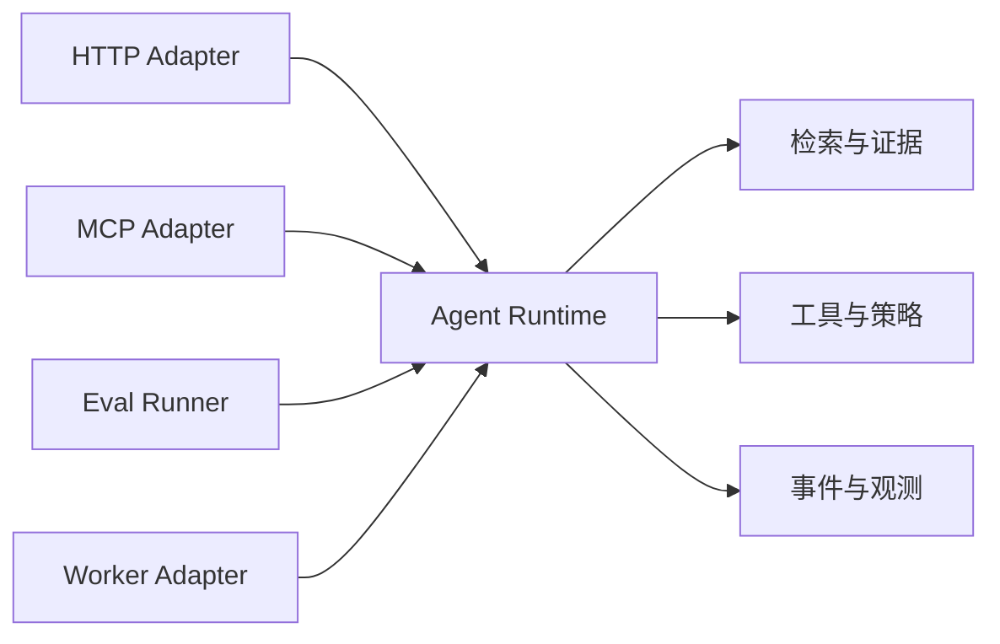

# 模块化能力平台

同一套知识问答先提供 HTTP 接口，后来增加 Eval 和只读 MCP。如果三个入口分别实现检索、权限和回答逻辑，修复一个越权问题时很容易漏掉另两个入口。

本篇把重复逻辑收进共享 Runtime，让 HTTP、Worker、Eval 和 MCP 只做协议适配。模块化平台的目标是复用稳定能力与规则，不是建立一个任何模块都能调用的巨大公共包。

## 平台和业务模块怎样分工

业务模块拥有自己的状态、数据和用例；平台模块提供数据库、对象存储、模型网关、遥测等可治理能力。共享 Runtime 组合领域用例，但不把协议对象传进核心。

## 步骤一：先找真正重复的规则

把三个入口的调用链画出来，标出认证适配、权限解析、检索、工具契约、生成、验证和事件。协议解析可以不同，安全与业务语义必须相同。先抽取用例服务，再提炼小 Port，不从“建平台”口号开始。

平台 API 使用稳定命令、结果和错误。不要暴露 ORM Session、厂商 SDK Response 或任意配置对象，否则消费者会绕过边界。

## 步骤二：能力注册包含治理信息

一个 Tool 或模块除了名字和函数，还要声明输入 Schema、输出 Schema、所需权限、是否只读、超时、幂等语义和版本。Runtime 在调用前检查策略与预算，适配器不凭入口身份跳过规则。

动态发现不代表动态信任。新能力经过注册、测试和权限审核后才可用；插件不能默认访问主进程全部环境变量、文件和网络。

## 步骤三：配置与生命周期集中装配

组合根读取配置、创建连接池和客户端、注册模块并校验依赖。业务代码通过构造函数获得明确依赖，不用全局 Service Locator。启动、readiness 和关闭顺序也由组合根管理。

模块故障要有隔离边界。非关键分析模块失败时可以降级，认证或权限模块失败时应关闭受保护能力。平台不能用一个总开关把所有错误统一变成“稍后重试”。

## 步骤四：用契约测试保护消费者

每个适配器运行同一组 Runtime 契约：相同身份和问题得到相同范围、错误码与证据。Eval 调用真实 Runtime，而不是复制一套“评测专用简化逻辑”。MCP 只读工具也使用相同权限与检索服务。

| 故意变化 | 要验证的结果 |
| --- | --- |
| 更换模型适配器 | Runtime 命令不变 |
| HTTP 新增字段 | MCP 与 Eval 不受影响 |
| 撤销用户范围 | 所有入口立即一致拒绝 |
| Tool Schema 升级 | 旧调用得到明确兼容结果 |
| 非关键模块超时 | 按声明降级，不拖垮全局 |
| Eval 运行 | 与真实请求使用相同版本和策略 |

## 何时不要建平台

只有一个调用方、没有重复规则、变化尚不清楚时，提前平台化容易冻结错误抽象。先用模块化单体和明确边界验证，再在两个真实消费者出现时提炼共享能力。平台团队的产物还包括文档、示例、SLO、迁移和支持责任，不只是一个 npm 或 Python 包。

下一篇处理跨模块仍会反复出现的故障：重试、去重、回放和降级。它们名字相近，却分别解决不同的不确定性。

## 参考资料

- [Team Topologies](https://teamtopologies.com/)
- [Hexagonal Architecture](https://alistair.cockburn.us/hexagonal-architecture/)
- [Semantic Versioning](https://semver.org/)
- [OpenAPI Specification](https://spec.openapis.org/oas/latest.html)
