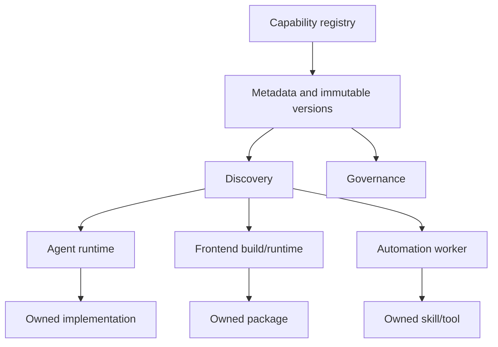
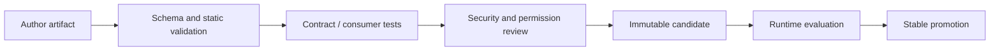
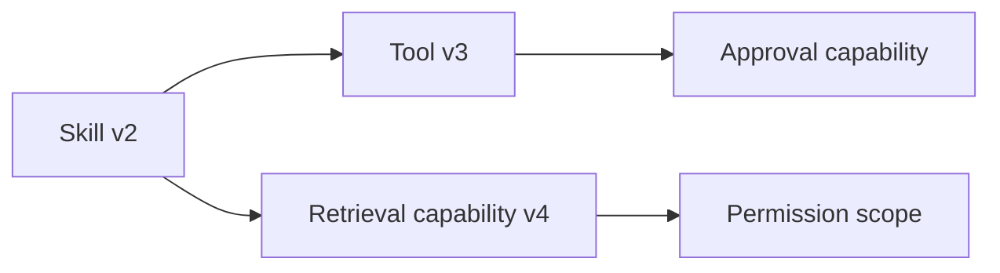

# 模块化能力平台

工具、Agent、Skill、Prompt、规则、UI 组件和数据连接器实现不同，却共享平台化需求：注册、发现、版本、权限、文档、消费验证、发布、弃用和撤回。平台的价值不是做一个“资产卡片列表”，而是把隐式复制变成有契约、有所有者、可组合且可治理的能力。

## 平台不拥有所有实现

平台目录保存资产元数据、版本和实现引用，执行仍由所属运行时负责。把所有 Tool 代码、组件源码和 Skill 文本复制进管理平台，会产生第二事实源，修复和权限无法同步。



Registry 是控制面，执行器是数据面。控制面故障时，已锁定版本的运行实例应按安全策略继续或拒绝，不应每次调用都必须读取中央列表。权限撤回等紧急控制需要独立快速通道。

## 统一的是生命周期，不是所有字段

每类资产有共同 Envelope 和类型特有 Spec：

```ts
type CapabilityEnvelope<TSpec> = Readonly<{
  capabilityId: string
  kind: 'tool' | 'skill' | 'agent' | 'component' | 'rule' | 'connector'
  version: string
  owner: string
  state: 'draft' | 'candidate' | 'stable' | 'deprecated' | 'withdrawn'
  risk: 'low' | 'moderate' | 'high'
  compatibility: { runtime: string; protocol: string }
  permissions: readonly string[]
  dependencies: readonly CapabilityReference[]
  artifact: { uri: string; digest: string; provenance?: string }
  documentation: { summary: string; contractRef: string }
  spec: TSpec
}>
```

Tool Spec 描述输入输出 Schema、副作用与 timeout；组件描述 exports、peer dependency、样式和可访问性；Skill 描述触发条件、步骤、所需工具与验收。不能为了统一把所有内容塞进 `config: any`。

版本不可变，更新创建新版本。元数据中不放 Secret、私有源码和真实业务示例；实现引用使用受控 Artifact/服务身份。

## 注册是一条供应链

注册流程验证 Schema、所有权、Artifact Digest、来源证明、许可证、安全扫描、契约测试和文档，再创建 candidate。不是拥有写 Registry 权限就能注册高风险工具。



高风险能力（写数据、网络、文件、部署）需要明确审批和最小权限。Prompt/Skill 中引用其他能力时，平台解析依赖图并锁定版本；不能运行时按名称随意取 latest。

## 发现先确定性过滤，再相关性排序

发现管线：kind/runtime/protocol 兼容、环境、状态、权限和风险策略先过滤；随后关键词/语义排序。若先向量召回全 Registry 再做权限，越权元数据已进入候选/日志，且合法结果不足。

```ts
type DiscoveryRequest = Readonly<{
  subject: SecurityContext
  runtime: string
  requestedCapabilities: readonly string[]
  riskBudget: 'read-only' | 'controlled-write'
  query: string
}>
```

返回结果包含为何匹配、版本、权限需求、成本/timeout、依赖和状态。模型 Tool Discovery 需要小而准确的描述，不能把整篇文档塞进上下文。描述变更也版本化并进入 Eval，因为它会改变模型选择。

## 能力组合是有类型的依赖图

组合不等于任意嵌套。资产声明 Required/Provided Capability、协议、资源和权限。解析器构建 DAG，检测循环、版本冲突和风险升级。

例如 Skill 间接调用高风险 Tool，最终执行仍检查 Tool 权限，包装层不能提升授权。组件包依赖 peer version，消费应用解析冲突；Agent 子图使用状态 Schema 与 Reducer 合并，不能以共享 Map 随意通信。



依赖锁保存精确版本/Digest。允许 version range 时，解析结果也进入 Release Manifest，确保本次运行可复现。

## 权限与可信上下文

调用输入分为模型/用户参数和宿主注入的可信上下文。tenantId、subjectId、allowed scopes、approval token 不能由模型 Schema 自由填写；运行时在调度边界注入并在 Tool 内再次验证。

资产元数据声明所需 action、资源范围、副作用类别和是否需人工确认。授权是每次调用决策，不是“注册时审核过就永久可信”。权限撤销后，缓存 Discovery 通过 policy version 失效。

浏览器组件/扩展能力也按最小权限：Manifest host permission、content script 页面访问和后台网络能力独立声明，用户按需授权。

## 独立消费者验证真实公共契约

仓库内测试可能被路径别名、hoist、未声明依赖、全局 CSS 和源码导入掩盖。为每类可安装资产建立最小消费者：

- 从 Registry/包文件安装发布制品，不引用源码；
- 按公共文档导入/注册；
- 运行类型检查、生产构建和基本运行；
- 断言包 exports、样式、资源、peer dependencies；
- Tool/Skill 用独立 runtime 执行 Schema、错误和权限用例。

```ts
it('works from the packed artifact in an isolated consumer', async () => {
  const archive = await packCandidate()
  const consumer = await createIsolatedConsumer()
  await consumer.install(archive)
  await consumer.typecheck()
  await consumer.buildProduction()
  await consumer.runContractSuite()
})
```

这比“本仓库 build 成功”更接近使用者现实。

## 文档和示例也是版本资产

文档与制品同版本，代码示例由契约测试编译。弃用 API 在文档标记替代和截止时间，不把 latest 文档展示给锁定旧版本用户。示例使用中性数据，不包含组织、内部 URL、字段、Secret 或源码。

Capability Card 显示适用场景、边界、失败/重试、权限和验证，不写营销式“万能”。Agent 能力尤其要说明不能做什么和证据要求。

## 发布、弃用、撤回

状态语义：

| 状态 | 新消费 | 已锁定运行 | 说明 |
| --- | --- | --- | --- |
| draft | owner 测试 | 否 | 可变开发 |
| candidate | 受控 cohort | 可选 | 完整制品待验证 |
| stable | 是 | 是 | 支持版本 |
| deprecated | 警告/限制 | 是 | 有迁移窗口 |
| withdrawn | 否 | 按安全策略 | 漏洞/严重缺陷 |

撤回不能静默删除历史元数据，否则依赖图无法解释；标记原因与安全公告。严重漏洞可阻止执行并触发影响分析，普通弃用只阻止新消费、给现有消费者迁移时间。

发布 Manifest 绑定 Artifact、文档、契约、依赖解析、评测和审批。不能覆盖已发布版本或移动 Digest。

## 运行时隔离与资源预算

Tool/连接器执行使用独立进程/容器/沙箱，限制文件、网络、CPU、内存、timeout 和并发。仅有接口 Schema 不等于安全。高风险调用先验证 approval nonce、幂等键和目标范围。

Agent/Skill 执行记录 capability version、输入摘要、可信上下文、结果/错误码、成本和事件；不记录完整敏感 payload。组件运行时使用 CSP、iframe/Shadow DOM 或样式边界按需要隔离，但权衡可访问性和集成成本。

## 平台 API 与缓存

Registry 写入强校验、版本不可变；Discovery 是读投影，可缓存/索引。缓存键包含 subject policy、environment、runtime、query 和 registry release。索引是可重建投影，Registry 数据库是元数据事实。

控制面发布新的 Registry Release，运行时固定一次计划/会话使用的 Release。紧急 withdrawn 列表作为覆盖层优先生效。控制面不可用时，低风险已锁定能力可按短期缓存继续；高风险/新发现 fail closed。

## 平台指标不是资产数量

关注：发现到成功执行/安装转化、首次成功耗时、失败分类、独立消费者通过率、版本分布、弃用仍被引用、权限拒绝、撤回影响范围、运行错误/成本。资产总数容易鼓励重复和低质量。

重复能力按契约和用途合并，保留 owner；低使用可能是发现差、文档差或无价值，需要区分。平台团队对 paved road 的成功率负责，不替所有资产 owner 负责实现质量。

## 验证矩阵

| 场景 | 必须结果 |
| --- | --- |
| Artifact Digest 不符 | 注册阻断 |
| 未声明依赖 | 独立消费者失败 |
| 无权限能力语义相关 | 过滤前不可进入候选 |
| Skill 间接高风险 Tool | 仍需 Tool 授权/审批 |
| 依赖循环/版本冲突 | 组合阶段明确失败 |
| 新旧 runtime | 兼容矩阵有确定结果 |
| withdrawn 版本 | 新发现不可用，影响可查询 |
| Registry 暂时不可用 | 按风险使用固定缓存或拒绝 |
| 文档示例漂移 | 编译/契约测试失败 |
| 敏感元数据 | 注册/隐私扫描阻断 |

## 常见误区

- Registry 复制所有实现，形成第二事实源。
- 所有资产字段塞进 `config: any`，无法治理。
- 按名称解析 latest，运行不可复现。
- 语义召回后才权限过滤。
- 包装 Tool 的 Skill 被认为自动继承更高权限。
- 只做仓库内测试，没有打包制品独立消费者。
- 文档与制品版本分离，示例从不编译。
- 弃用直接删除，无法分析现有依赖。
- 平台 KPI 是资产总数，而不是成功消费与质量。
- 控制面每次调用强依赖，故障扩大到所有运行流量。

## 参考资料

- [Team Topologies: Platform as a Product](https://teamtopologies.com/key-concepts-content/platform-as-a-product)：平台团队、消费体验和认知负担。
- [OCI Image Specification](https://github.com/opencontainers/image-spec)：不可变制品、Digest 和分发元数据。
- [SLSA](https://slsa.dev/spec/v1.1/)：能力制品的构建来源与供应链证明。
- [MCP Architecture](https://modelcontextprotocol.io/docs/learn/architecture)：可发现能力、Host/Client/Server 与权限边界。
- [Semantic Versioning](https://semver.org/)：公共契约的兼容发布与弃用语义。
