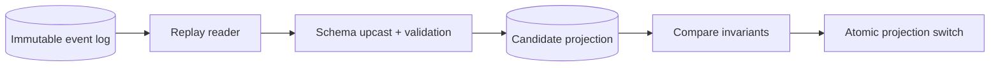
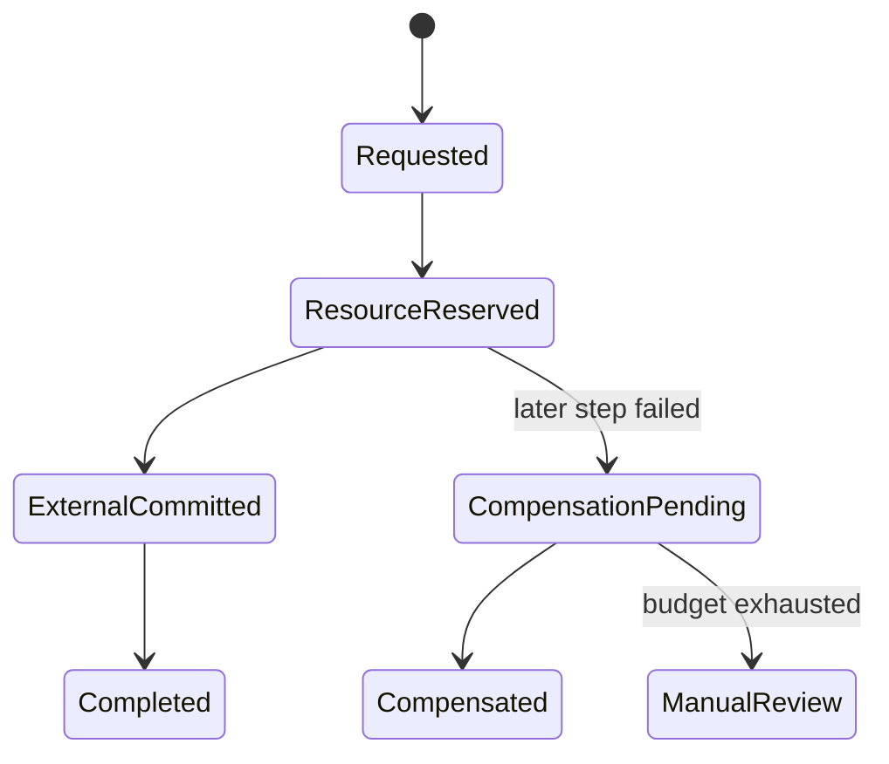
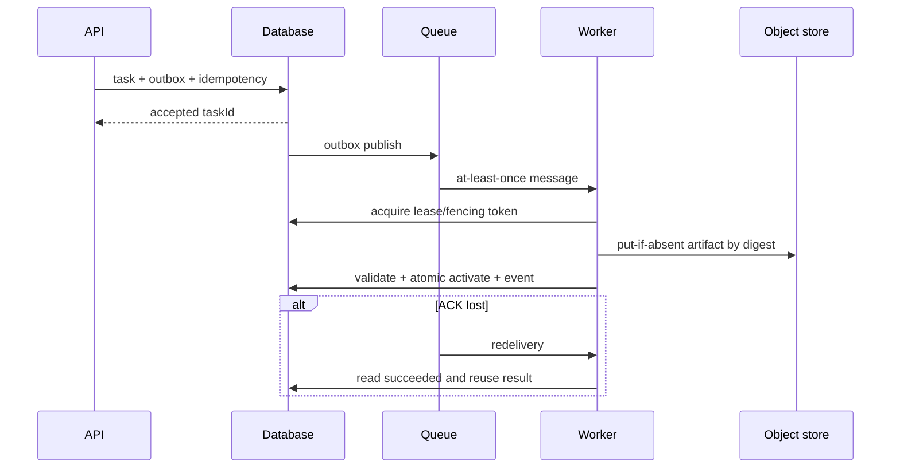

# 重试、去重、回放与降级

可靠性模式不能孤立使用：重试制造重复，重复需要幂等；超时让副作用结果不确定，需要查询/对账；事件回放再次触发消费者，需要版本和去重；降级改变质量，需要显式标记；补偿无法真正撤销所有外部影响。把这些模式当独立“最佳实践”叠加，往往会放大故障。

## 先写失败分类和不变量

| 类别 | 示例 | 处理 |
| --- | --- | --- |
| 暂时故障 | 连接重置、429、短暂 503 | 预算内退避重试 |
| 永久输入 | 格式错误、超限、未知协议 | 立即终止 |
| 安全拒绝 | 未认证、越权、撤权 | fail closed，不换来源 |
| 并发冲突 | 版本落后、唯一约束 | 重新读状态/返回冲突 |
| 取消 | 用户/父任务终止 | 协作停止，不算自动重试 |
| 不确定副作用 | 调用 timeout 但远端可能成功 | 用幂等键查询/对账 |
| 代码缺陷 | 不变量/Panic/未知异常 | 失败告警，修复代码 |

先列不可牺牲不变量：租户隔离、金额/额度、唯一终态、删除、当前版本指针。降级和重试都不能绕过它们。

## Timeout 是不确定性边界

Timeout 只说明调用方停止等待，不证明服务端未执行。对写操作，timeout 后直接换新 ID 重试可能产生重复。客户端传稳定幂等键，服务端保存请求摘要和结果；或提供状态查询。

Deadline 是端到端绝对预算，包含排队、重试和提交。每层不应重新给完整 timeout。预留收尾时间，剩余预算不足时不启动昂贵阶段。

## 幂等与去重不同

去重在入口识别相同意图，复用已有任务/结果；幂等让同一操作重复执行仍保持相同业务效果。去重记录可能过期、缓存可能丢，所以副作用本身仍尽量幂等。

```ts
type IdempotencyRecord = Readonly<{
  scope: string
  key: string
  requestDigest: string
  state: 'processing' | 'succeeded' | 'failed'
  resultRef: string | null
  expiresAt: string
}>
```

相同 key + 不同 requestDigest 返回 409，而不是复用。key 的 scope 包含 tenant、operation 和业务对象。数据库唯一约束保证并发；进程内 Map 不能跨实例/重启。

## 重试预算与放大

指数退避 + full jitter：

```ts
function fullJitter(attempt: number, baseMs = 200, capMs = 20_000): number {
  const maximum = Math.min(capMs, baseMs * 2 ** Math.max(0, attempt - 1))
  return Math.floor(Math.random() * maximum)
}
```

限制次数、总 deadline、累计成本和并发。调用链每层重试三次会指数放大；指定唯一责任层，底层只处理局部明确可恢复问题。尊重 Retry-After 但限制最大值。

重试携带同一 operation/taskId、新 attemptId。指标记录 amplification ratio。服务已过载时盲重试是攻击自己。

## 限流、隔舱、熔断与负载卸载

| 模式 | 控制 |
| --- | --- |
| 限流 | 入口到达速率/配额 |
| 并发限制 | 在途资源数量 |
| 隔舱 | 不同负载的资源故障域 |
| 熔断 | 下游持续失败时快速停止调用 |
| 负载卸载 | 超容量拒绝低优先级工作 |

它们不能相互替代。熔断器状态按下游/操作和实例本地/共享语义设计；共享全局熔断可能被单区域故障误伤，纯本地又状态不一致。Half-open 放有限探针，成功率/延迟达标才关闭。

历史库如 Hystrix、Ribbon 只能作为演进背景；现代实现依据当前平台（Envoy/service mesh、Resilience4j、应用 limiter）选择，核心仍是状态和预算，不是库名。

## 缓存降级的边界

依赖失败时返回缓存只在允许陈旧、权限仍有效、缓存值有版本和最大 stale 时安全。权限、余额、删除状态不能用任意旧缓存继续。响应标记 stale/degraded，指标告警。

stale-if-error 与 stale-while-revalidate 适合部分公开/非关键读，必须防缓存击穿。没有缓存不能返回虚构默认值假装成功；明确 unavailable/partial。

## 事件回放是受控迁移

事件有 eventId、stream sequence、schemaVersion、aggregateVersion。消费者保存 checkpoint，但更新投影和 checkpoint 应原子或幂等。回放前定义：来源、起止 offset、目标消费者、目标投影命名空间、副作用模式、速率和停止条件。



优先旁路重建新投影，验证后切换，不直接清空当前表在主链路重放。通知/支付等不可重放副作用在 replay mode 禁止或查询幂等账本。未知旧 Schema 明确隔离，不能忽略字段。

## 事件去重和顺序

全局顺序昂贵且通常不需要，只要求同 aggregate/partition 顺序。消费者用 aggregate version 拒绝旧事件、等待/补齐缺口。eventId 去重防重复投递，但事件处理逻辑仍幂等。

去重记录保留期覆盖日志重放窗口。若清理过早，历史回放可能重复副作用；因此投影重建和外部副作用消费者用不同策略。

## 降级设计为明确产品状态

先列功能等级：核心事实与安全必须；可选重排、推荐、通知、富媒体可降级。每个降级定义触发、输出差异、用户表达、恢复和指标。

例：Reranker timeout -> 使用版本化 RRF 排序，引用/ACL仍验证；模型高成本不可用 -> 更小模型回答低风险问题，关键任务拒绝；通知失败 -> 主事务成功，Outbox 重试。不能降级跳过权限、证据、扣费一致性或数据删除。

长期频繁降级说明容量/依赖问题，不能静默变主路径。Dashboard 显示 degradation ratio 和版本。

## Saga 与补偿

跨系统流程拆本地事务，每步记录状态和幂等键。Orchestration 显式决定下一步/补偿，Choreography 通过事件但需防流程不可见。补偿也可能失败，必须重试、人工介入和对账。



补偿不是时间倒流：邮件只能更正，已经下载的数据无法收回，外部计费退款有独立状态。设计前标注可逆、可补偿、不可逆步骤，把不可逆步骤尽量后移并需确认。

## Outbox、Inbox 和对账

数据库事实与消息发布用 Outbox；消费者可用 Inbox/eventId 唯一约束记录处理。Outbox 可能重复投递，Inbox 不跨外部系统保证 exactly-once。

对关键外部副作用建立对账：本地 operationId 与远端 reference，定期比较 pending/unknown。调用 timeout 后先按 idempotency key 查询远端，不立即再创建。对账结果驱动状态机和人工队列。

## 恢复优先于自动重启

进程重启能清除瞬态内存错误，也可能形成 crash loop、重复任务和依赖风暴。liveness 只处理真正卡死；readiness 摘流；持久任务用 lease/fencing 接管。恢复器有限批次扫描、限速并记录原因。

故障发生时先保护核心：停止新低优先级、限制重试、保持已知数据版本、让不可证明安全的写失败关闭。可用性不等于所有请求都返回 200。

## 组合示例：异步生成并发布制品



这里组合：入口去重、Outbox、防重复消费、确定对象键、租约、原子激活、重投读取终态。任何单个模式都无法覆盖整链路。

## 验证：故障矩阵与不变量

| 注入 | 证明 |
| --- | --- |
| 429/503 | 有界退避，无重试风暴 |
| 响应丢失但远端成功 | 查询/幂等避免重复 |
| Outbox 发布后进程退出 | 重投但业务结果一次 |
| Consumer ACK 前退出 | 去重/幂等 |
| 事件乱序/重复 | 版本与 checkpoint 正确 |
| 回放旧 Schema | upcast 或隔离 |
| Reranker/缓存故障 | 降级标记且不绕 ACL |
| 补偿持续失败 | 进入人工状态，不假成功 |
| 全部实例重启 | lease 恢复，不重复副作用 |
| 重试层叠 mutation | 监控发现 amplification |

```ts
it('does not retry a permanent authorization failure', async () => {
  const dependency = fakeDependency.rejecting(new PermissionDenied())
  await expect(policy.execute(() => dependency.call())).rejects.toBeInstanceOf(PermissionDenied)
  expect(dependency.attempts).toBe(1)
})
```

用 property-based 测试随机超时、重复、乱序和取消，断言唯一终态、版本单调、权限不降级。运行态 Chaos 有明确范围、停止条件和回滚，先隔离候选再小流量。

## 常见误区

- Timeout 被理解为服务端一定没执行。
- 去重缓存存在就声称副作用 exactly-once。
- 所有异常自动重试，调用链层层放大。
- 熔断、限流和隔舱被当作同一功能。
- 使用过时库名代替当前可靠性设计。
- 回放直接清空当前投影并触发真实通知。
- 降级返回旧权限/余额或跳过证据验证。
- 补偿被当作简单反向函数且一定成功。
- 进程异常只靠重启，不设计持久恢复。
- 降级长期运行却没有指标和退出条件。

## 参考资料

- [Google SRE: Handling Overload](https://sre.google/sre-book/handling-overload/)：负载卸载、Admission Control 与容量保护。
- [AWS Exponential Backoff and Jitter](https://aws.amazon.com/builders-library/timeouts-retries-and-backoff-with-jitter/)：超时、重试、退避与抖动的工程推导。
- [Transactional Outbox](https://microservices.io/patterns/data/transactional-outbox.html)：数据库事实与事件投递。
- [Saga Pattern](https://microservices.io/patterns/data/saga.html)：跨服务事务、补偿与失败状态。
- [RabbitMQ Reliability Guide](https://www.rabbitmq.com/docs/reliability)：连接失败、确认、重投与恢复的保证范围。
