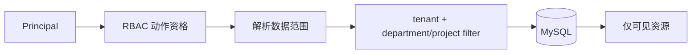

# ACL、多租户与数据范围隔离

用户拥有 `project.read`，却不代表能读取所有项目。RBAC 判断动作资格，ACL 和数据范围继续判断“对哪一个资源”。多租户系统最危险的错误往往不是没有登录，而是 SQL 忘了带 tenant_id。

## ACL 把主体、资源和权限连起来

ACL 记录某用户或组对某资源的 read/update/share 权限，适合文档分享、项目协作这类资源级例外。RBAC 先给基础资格，ACL 再处理个别资源授权；两者可以组合。

ACL 不能只在应用读出资源后过滤，因为分页总数、排序和关联数据已经可能泄露。授权范围要进入数据库查询，让数据库只返回当前主体可见行。

这条查询同时限定租户和 ACL。`:user_id` 来自认证 Principal，不接受客户端传入的“代查用户”。

```sql
SELECT p.id, p.name, p.version
FROM projects p
WHERE p.tenant_id = :tenant_id
  AND (
    p.owner_id = :user_id
    OR EXISTS (
      SELECT 1
      FROM project_acl a
      WHERE a.tenant_id = p.tenant_id
        AND a.project_id = p.id
        AND a.subject_type = 'user'
        AND a.subject_id = :user_id
        AND a.permission = 'project.read'
    )
  )
ORDER BY p.created_at DESC, p.id DESC
LIMIT :limit;
```

索引需匹配 `project_acl(tenant_id, subject_type, subject_id, permission, project_id)` 等访问模式。真实模型若支持组授权，可先展开有效组或使用单独关联。
## 租户隔离要进入主键之外的所有访问路径

UUID 难猜不等于授权。详情、更新、删除、关联查询、文件对象和任务状态都用 `(tenant_id, id)` 条件。跨租户与不存在返回相同 404；审计仍区分真实原因。

数据库唯一索引也以 tenant_id 为前缀，保证租户内唯一。缓存键、对象存储 key、消息 payload 和幂等键都携带租户范围，否则其他层仍会碰撞或泄露。

| 层 | 范围字段 | 漏掉后的表现 |
| --- | --- | --- |
| SQL | `WHERE tenant_id=? AND id=?` | IDOR/跨租户读写 |
| Redis | `tenant:{id}:project:{id}` | 缓存串租户 |
| MinIO | `tenant-id/...` + 服务端鉴权 | 对象 key 被猜中 |
| RabbitMQ | 消息体 tenant_id + Worker 校验 | 后台任务写错范围 |
| 审计 | actor_tenant 与 resource_tenant | 无法证明越权被拒绝 |
## 部门数据范围是查询规则，不是角色名

常见数据范围包括本人、本部门、部门树、指定项目和全租户。把 `department_manager` 直接等同于“所有部门”会在组织变化时失控。应把范围解析成确定的 subject/department/project 集合，再构造查询。

部门树可用闭包表、物化路径或递归 CTE。选择取决于读写比例和数据库能力；无论哪种方式，组织变更后都要失效权限缓存，并测试移动部门对历史资源的影响。



授权不是查完数据后在数组中过滤。范围条件参与 SQL、分页和聚合，返回数量才与用户实际可见资源一致。
## 共享与撤销需要明确传播时间

新增 ACL 后何时生效、撤销后旧页面还能看到多久，要由缓存 TTL 和事件失效策略决定。高敏感资源撤销应同步更新数据库并主动失效缓存；下载预签名 URL 还存在已签发有效期窗口。

共享操作写审计，并防止低权限用户把资源分享给更大范围。资源所有者删除或离开租户时，ACL 的级联/转移策略要提前定义。
## 租户隔离的边界与撤销机制

**为什么跨租户统一返回 404 而不是 403？**

403 会确认目标 ID 存在。统一 404 减少枚举信息，同时内部日志记录 authorization_denied、请求主体和目标租户，供安全审计。

**数据库行级安全是否能替代应用授权？**

支持时可增加纵深防御，但应用仍要决定业务动作、错误语义和非数据库资源。MySQL 没有 PostgreSQL 同类内置 RLS，通常依赖查询约束、视图或分库策略。

**多租户是否应该每租户一个数据库？**

物理隔离更强，但迁移、连接和运维成本更高。共享表适合大量中小租户，关键是每条路径强制 tenant_id；高合规或大客户可采用独库/独实例的混合模式。

**预签名下载 URL 为什么也要考虑撤销？**

URL 在有效期内可绕过应用直接访问对象存储。敏感文件使用短 TTL、服务端再次授权或可撤销代理下载；ACL 撤销并不会自动使已签 URL 失效。
