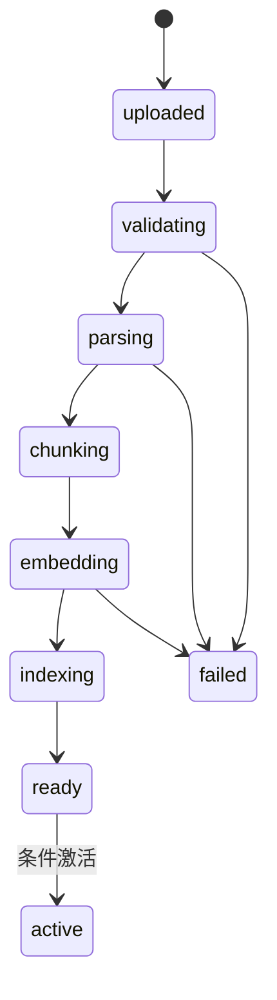

# AI 应用平台扩展：知识库、解析任务与聊天运行

AI 应用平台扩展是把文件知识库导入和聊天运行接到已有企业后台的一条业务链：对象存储保存原文件，Worker 完成解析/切片/Embedding，向量索引提供检索，ChatRun 保存证据和事件。它位于文件、任务、检索、SSE 和多租户权限的交界处，重点是版本、权限、失败和恢复的所有权。

文件上传返回 201 不等于知识库已经可检索。对象到达后还要校验、解析、切片、Embedding、写向量索引并激活版本；任一步都可能失败或被重试。AI 平台扩展用本地模拟适配器避免付费模型依赖。

## 知识库、文档、版本与运行分别保存事实

KnowledgeBase 定义租户内集合与权限；Document 表示逻辑文档；DocumentVersion 绑定 source object/checksum/parser config/index version；IngestionTask 保存 attempt/状态；ChatRun 保存输入、检索证据与事件终态。

新文档版本 ready 前不替换 active_version。旧版本解析晚到也只能完成自己的任务，条件激活同时匹配 expected current/version，避免搜索回退。删除知识库通过任务清理对象与向量，ACL 立即阻止新查询。



每一步记录输入版本、输出引用和 attempt。重试从可验证的最近成功检查点继续，不重复激活或覆盖新版本。

## 本地模拟适配器保留真实接口和失败方式

EmbeddingPort 接收文本批次并返回固定维度向量；ChatModelPort 接收消息/证据并流式产生 token/event。默认适配器用确定性 hash/Fixture 生成结果，支持配置 timeout、限流和中途失败，用于测试恢复。

模拟器不冒充模型质量。它证明任务、权限、Schema、流式协议、取消和替换能力；接入真实供应商时实现同一端口，增加 Token 预算、内容安全和供应商观测。

接口把供应商能力限制在应用端口中。测试适配器必须对相同输入稳定，便于三语言契约测试。

```ts
interface EmbeddingPort {
  embed(input: {
    texts: string[]
    model: string
    dimensions: number
    signal: AbortSignal
  }): Promise<number[][]>
}

interface ChatModelPort {
  stream(input: ChatInput): AsyncIterable<ChatEvent>
}
```

业务代码校验返回向量数量/维度与有限数值。模型字符串来自受控配置，不由普通用户任意选择昂贵供应商模型。

## 检索权限在候选生成之前执行

ChatRun 带 tenant、knowledge_base 与 Principal。检索查询同时限定 active document version 和 ACL；向量相似度只在可见集合中排序，不能先跨租户取 TopK 再过滤，因为会泄露和降低召回。

返回证据包含 document_id/version/chunk_id 与受控摘录；生成适配器只接收当前可见证据。日志不记录原始私有文档和完整 Prompt，Trace 保存大小、数量、模型版本与耗时。

| 链路 | 版本/权限条件 | 失败终态 |
| --- | --- | --- |
| 上传 | file owner + checksum | rejected/expired |
| 解析 | document_version + attempt | failed 可重试 |
| 索引 | embedding model + dimensions | index_failed |
| 激活 | 当前版本条件更新 | 旧任务不得覆盖 |
| 检索 | tenant + KB ACL + active version | 空证据/拒绝 |
| Chat | run_id + evidence IDs | failed/cancelled/completed |

## SSE 事件可恢复且不把半成品当答案

POST /chat-runs 返回 run_id，SSE 发送 accepted/retrieving/evidence/token/completed/failed。事件有单调 sequence，服务保存必要检查点；断线后客户端带 Last-Event-ID，服务重放保留事件或返回当前终态。

客户端取消设置 cancel_requested，生成适配器收到 signal；已写事件不删除。若流中断但模型仍继续，Worker 在提交 completed 前检查当前 attempt/取消状态，旧输出不能成为最终答案。

## AI 平台扩展必须回答

**为什么上传完成后不能立刻让文档可检索？**

字节尚未通过类型/安全校验，也没有完整索引。提前可见会返回半数据或恶意内容。只有版本所有步骤成功并条件激活后进入检索。

**Embedding 模型更换后旧向量怎么办？**

向量空间和维度可能不兼容。新建 index_version，后台重建并验证，再原子切 active index；查询不能混合不同模型向量。

**为什么权限必须在向量搜索内部过滤？**

先全局 TopK 会让不可见文档占候选，甚至通过分数/耗时泄露存在；过滤后剩余结果也可能召回不足。将 tenant/ACL metadata 条件交给索引查询。

**模拟模型能验证哪些内容？**

验证请求/响应契约、流式事件、取消、超时、任务重试、权限和成本字段；不能证明真实答案质量、召回或供应商性能。

**SSE token 是否需要全部持久化？**

不一定。可持久化关键事件和最终文本，短期保留 token 序列用于断线重放；按恢复要求、成本和隐私决定，不能无期限记录私有内容。

**解析任务重复后如何避免重复 chunk？**

chunk 主键/唯一键包含 document_version、parser_version 和稳定 chunk index/hash；写入先按 attempt staging，成功后激活版本，失败 staging 可清理。
