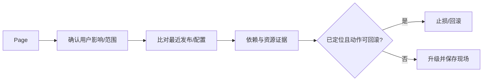

# 告警、SLO、错误预算与 Runbook

CPU 超过 80% 的告警每天响几十次，用户请求却正常；登录成功率下降到 92% 没有任何人收到通知。告警应围绕用户可感知 SLI 和可执行动作，SLO 定义一段窗口内可接受水平，错误预算把可靠性消耗连接到发布决策。

## SLI 是测量公式，SLO 是时间窗口目标

项目列表 SLI 可定义为“状态正确且小于 500 ms 的有效请求 / 全部有效请求”。明确排除健康检查和客户端取消，不能把所有 4xx 都算服务故障，也不能把服务器 429 一律排除。

SLO 例如 30 天 99.9%，意味着有 0.1% 不良事件预算。目标不是 100%，因为成本和发布速度需要权衡；认证、异步任务新鲜度和文件处理可拥有不同 SLO。

下面展示三个不同类型 SLI。公式必须由可查询指标实现，并用历史数据验证分母/排除条件。

```text
API availability = good HTTP requests / eligible HTTP requests
API latency      = requests <= 500ms / successful eligible requests
Task freshness   = tasks completed before 5m / accepted tasks

SLO window       = rolling 30 days
target           = 99.9%
```

异步接口返回 202 只证明接受任务，不能计为最终业务成功；任务新鲜度单独测量 queued 到终态的时间。

## Burn Rate 告诉你预算消耗速度

固定阈值如“5xx > 1%”可能对低流量噪声敏感，也无法表达不同 SLO。Burn Rate 把当前错误率与允许错误率相比：99.9% 允许 0.1%，当前 1% 就是 10 倍消耗。

多窗口告警组合短窗口高 Burn 与长窗口确认，既快速发现大事故，又减少瞬时毛刺。工单级低速消耗与呼叫级高速消耗分开。

| 信号 | 动作 | 为何可执行 |
| --- | --- | --- |
| 短+长窗口高 Burn | 立即呼叫并冻结发布 | 预算快速耗尽 |
| 持续低 Burn | 工作时间工单 | 慢性可靠性问题 |
| 队列 oldest age 超 SLO | 检查 Worker/下游/到达率 | 用户任务已延迟 |
| 观测数据缺失 | 检查采集链路 | 不能把无数据当健康 |
| 单实例 CPU 高 | 先诊断不必呼叫 | 尚未证明用户受影响 |

## Runbook 从第一条只读命令开始

告警附服务、环境、Dashboard、版本、开始时间与 Runbook。Runbook 第一段解释用户影响和安全边界，随后是只读证据：错误分布、P99、依赖、部署、队列、数据库。

每个处置写触发条件、命令、预期输出、风险、停止条件与回滚。重启/扩容不是默认第一步；若错误只在新版本，先停止扩大并切回旧流量更直接。



Runbook 不是根因分析报告。它优先帮助当班人员在权限范围内快速确认和止损，事后再更新诊断细节。

## 错误预算影响发布节奏但不自动替代判断

预算快速消耗时暂停高风险发布，把工程时间转向可靠性；预算充足不代表任何变更都安全，数据库破坏性迁移仍需独立门禁。

每月复查 SLI 是否代表用户、告警是否可行动、Runbook 是否成功。无动作告警删除或降级；漏报把对应信号加入，避免以“告警越多越安全”评价团队。

## SLO 与告警继续追问

### 内部依赖要不要有 SLO？

可有组件目标，但用户服务 SLO 才是最终导向。数据库指标用于诊断，不能因为数据库 CPU 正常就宣告登录可用。

### 低流量服务怎样避免百分比告警噪声？

结合最小事件数、较长窗口和合成检查。一次失败可能是 50%，但若关键低频任务本就不能失败，则用任务新鲜度/终态直接告警。

### SLO 达不到是否应该直接降低目标？

先确认目标是否反映用户需求和成本，再分析主要错误来源。若业务确实不需要原目标可调整，但不能为了报表好看而修改。

### 谁负责 Runbook？

拥有服务和告警的团队负责内容与演练，当班人员提供使用反馈。每条告警有 owner，基础设施团队提供共享组件步骤，但业务状态仍由服务 owner 判断。
