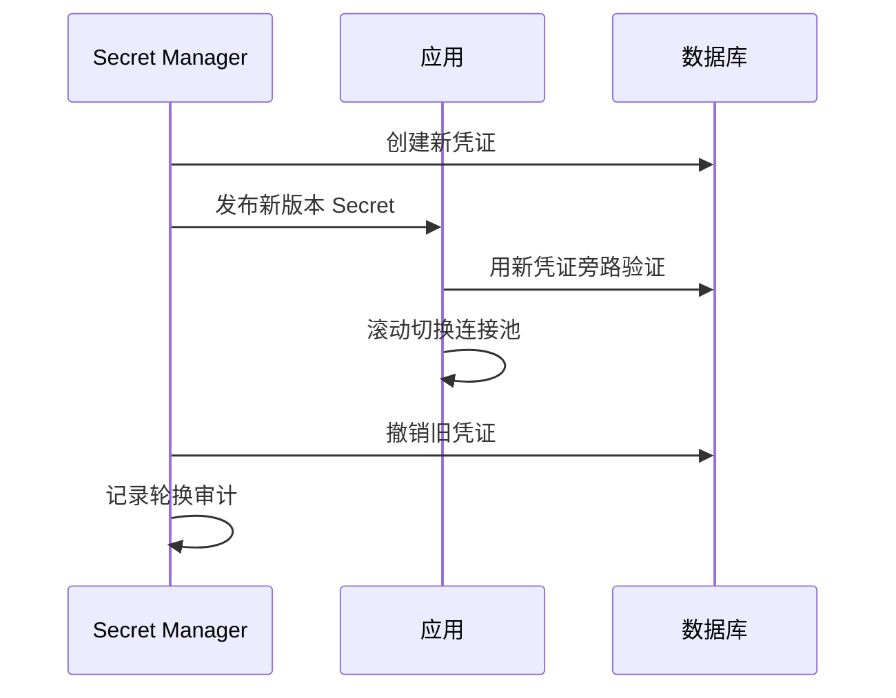

# API 安全、Secret 管理与审计日志

API 安全约束请求从身份、输入到业务副作用的整条路径，Secret 管理保存并轮换应用凭证，审计日志记录谁在何时对什么资源做了什么。三者横跨 API 网关、应用服务和运行环境，分别降低越权与注入、凭证泄露以及事后无法追责的风险。

接口只做了 JWT 校验，却允许用户提交任意 `tenant_id`、上传 HTML、用 URL 让服务器请求内网地址，并把 Authorization 打进日志。认证只是安全入口之一；输入、授权、输出、依赖、Secret 和审计都要有各自防线。

## 请求链路的威胁路径

从攻击者可控的 path、query、header、body、文件和 URL 开始，标出它们进入 SQL、模板、命令、对象存储和外部 HTTP 的位置。每个敏感 sink 使用结构化 API、白名单和最小权限。

参数绑定防 SQL 注入，但动态排序列和表名不能作为普通参数，需要枚举映射；HTML 输出要按上下文编码；服务器抓取 URL 要限制协议、解析后的 IP、重定向和响应大小，防止 SSRF。

| 入口到危险点 | 控制 | 不要依赖 |
| --- | --- | --- |
| 输入 -> SQL 值 | 参数绑定 | 字符串转义 |
| sort -> 列名 | 服务端枚举映射 | 直接拼接 query |
| 文本 -> HTML | 上下文编码/CSP | 只过滤 `<script>` |
| URL -> 服务端请求 | 协议/IP/重定向白名单 | 只检查字符串前缀 |
| 文件 -> 对象存储 | 类型检测、隔离、扫描 | 客户端 Content-Type |

## Secret 是可轮换的运行配置

数据库密码、JWT 私钥、对象存储密钥和第三方 Token 不进入 Git、镜像层、前端构建或日志。部署平台把 Secret 注入文件或环境；应用启动时校验存在性和格式，不输出值。

Secret 管理包含 owner、用途、可读主体、创建、轮换、撤销和审计。轮换数据库凭证要有重叠窗口：先让服务接受/使用新凭证，验证连接，再撤销旧凭证。只在仓库删除泄露值远远不够。



轮换失败时要知道哪些实例仍使用旧版本。Secret 版本和部署版本可以记录，Secret 值本身不能进入指标标签。

## 审计日志记录业务安全事实

应用日志帮助排错，审计日志回答谁在何时对什么资源尝试了什么动作、结果如何。登录、权限变更、导出、Secret 管理、高风险更新和拒绝都应有稳定事件类型。

审计记录 actor、tenant、action、resource type/id、before/after 摘要、requestId、结果和时间。密码、Token、Session ID、完整文件内容与不必要个人信息不进入审计。存储需要防篡改、访问分级和保留策略。

这是一条权限变更审计事件。字段值为匿名示例，不包含凭证或内部路径。

```json
{
  "event": "role.permissions.updated",
  "requestId": "req_01J...",
  "actorId": "usr_01J...",
  "tenantId": "ten_01J...",
  "resourceType": "role",
  "resourceId": "rol_01J...",
  "before": ["project.read"],
  "after": ["project.read", "project.update"],
  "result": "succeeded",
  "occurredAt": "2026-08-12T08:30:00.000Z"
}
```

before/after 只保存权限码这类必要摘要。大对象变更可保存字段差异或版本引用，并确保审计查询本身也受权限与审计。

## 错误响应与速率限制减少可利用信息

客户端获得稳定 code 和 requestId，不获得 SQL、堆栈、文件路径和上游密钥。认证失败消息统一，跨租户资源统一 404；内部日志保留分层原因。

限流不仅按 IP。登录按账号/IP，昂贵导出按用户/租户并发，公共 API 按 key 与全局容量。返回 429 和 Retry-After，但服务器仍要保护数据库连接、Worker 队列和对象存储配额。

## 安全控制的证据边界

**输入经过 Schema 校验后是否就安全？**

Schema 只证明形状。合法 URL 仍可能指向内网，合法字符串仍可能越权作为 tenant_id，合法文件仍可能包含恶意内容。还要做业务授权和 sink 相关控制。

**环境变量为什么也可能泄露 Secret？**

进程诊断、错误报告、容器 inspect 和子进程继承都可能暴露。支持时优先使用权限受控的临时文件或 Secret Provider，并确保日志和错误不会打印整个环境。

**审计日志能否与普通日志放一起？**

技术上可以集中采集，但权限、保留和不可篡改要求通常不同。至少使用独立索引/流、严格访问控制和写入失败处理，不能因普通日志采样丢掉审计。

**依赖漏洞扫描通过是否代表 API 安全？**

它只覆盖已知依赖漏洞。越权、业务重放、错误租户范围和不安全默认配置仍需代码审查、场景测试、Secret 扫描和运行监控。
