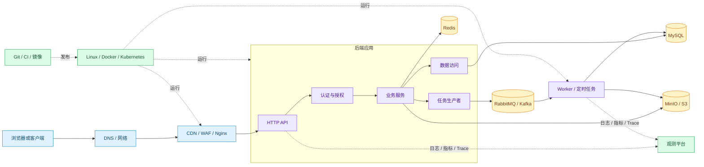
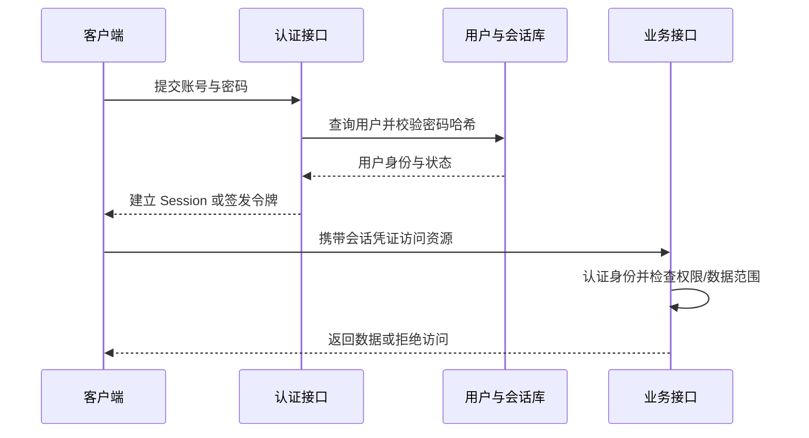

# 后端学习地图

一个用户登录系统、查询列表、上传文件，再提交一项耗时任务。页面上只有几次点击，后端至少要完成这些工作：

1. 接受来自网络的请求，解码 HTTP 报文；
2. 判断调用者是谁、能操作哪些数据；
3. 校验输入，执行规则，读写数据库；
4. 把适合稍后处理的工作交给队列和 Worker；
5. 把文件写入对象存储，把短期状态放入 Redis；
6. 返回稳定响应，并记录日志、指标和调用链；
7. 在进程退出、机器故障或版本发布时保护数据并恢复服务。

这些工作共同构成后端。

Node.js、Python 和 Go 是实现工具。MySQL、Redis、RabbitMQ、Docker 和 Kubernetes 是系统中的组件。先看清它们分别放在哪里，再学习每个组件解决的具体问题，后续遇到框架代码时才不会只记住 API 名称。

## 后端系统的完整地图

下面的图把一次在线请求、一项后台任务和一次发布放在同一张图里。实线表示业务请求或数据流，虚线表示观测与交付过程。



从左向右看，网络把客户端请求交给应用，应用读取或修改数据；需要较长时间的工作通过消息队列转给 Worker。图的下方是运行与交付：代码经过检查后构建成制品，再运行于 Linux、容器或 Kubernetes。观测系统不参与业务判断，但它记录每个阶段发生了什么。

图里没有一个组件能够独立完成所有工作。

MySQL 擅长保存有约束的长期事实，不负责发送邮件。Redis 读写很快，不应成为没有恢复方案的唯一订单库。消息队列能缓冲任务，却不能替业务代码保证幂等。Kubernetes 能维持副本数量，也不知道一次扣款是否正确。

## 请求怎样到达后端进程

用户输入 URL 后，浏览器先解析地址，再通过 DNS 找到目标 IP。建立 TCP 连接和 TLS 会话后，浏览器才能发送 HTTP 请求。公网请求通常先到 CDN、负载均衡或 Nginx，再由代理转发给某个应用进程。

这条路径涉及四组基础知识：

| 知识 | 处理的问题 | 需要观察的证据 |
| --- | --- | --- |
| DNS | 域名应该解析到哪个地址 | A/AAAA 记录、TTL、解析器结果 |
| TCP、QUIC 与端口 | 两个进程怎样建立通信通道 | 连接状态、监听地址、往返时间 |
| TLS | 怎样协商加密并验证服务器身份 | 证书链、SNI、ALPN、握手错误 |
| HTTP 与代理 | 请求和响应怎样表达，流量怎样转发 | 方法、路径、Header、状态码、代理日志 |

如果页面打不开，只看应用日志不够。DNS 失败时请求尚未到服务器；端口没有监听时 HTTP 报文还没机会发送；Nginx 返回 502 时应用可能没有接到请求；浏览器收到 200 后仍可能因为脚本错误无法显示内容。网络篇会把输入 URL 到页面可交互的过程完整拆开。

Linux 是这条请求链的运行底座。文件权限决定进程能否读取配置，用户和用户组限制可访问资源，进程与线程承担计算，端口把网络连接交给具体进程，文件描述符限制同时打开的连接与文件。CPU、内存、磁盘和网络任一资源耗尽，都可能表现为接口变慢或服务退出。

## API 是后端对外提供的协议

后端收到字节后，需要把它解释成一个明确操作。HTTP API 通常包括方法、路径、查询参数、Header、请求体、状态码和响应体。例如：

```http
POST /api/projects HTTP/1.1
Host: api.example.test
Content-Type: application/json
Authorization: Bearer <access-token>

{"name":"采购系统改版"}
```

`POST` 表示创建语义，`/api/projects` 指向项目资源，JSON 是输入，Authorization 携带访问凭证。服务端不能直接相信这些字段。它先限制类型、长度和格式，再确认身份和数据范围，最后执行创建规则。成功可能返回 201；格式错误返回 400；未登录返回 401；没有权限返回 403；资源冲突返回 409。

REST 讨论资源、方法语义和无状态请求；OpenAPI 把路径、参数、Schema 与响应写成机器可读契约；分页限制一次返回的数据量；统一错误模型让调用方能根据稳定错误码处理失败。**API 契约是不同进程之间的约定，不是某个框架自动生成的 Controller 名称。**

应用内部还要分清职责：

- Controller 或 Handler 处理 HTTP 输入输出；
- Service 执行业务规则和事务编排；
- Repository 或 ORM 负责数据访问；
- Integration Adapter 对接支付、短信、对象存储等外部服务。

分层的目的，是让同一条业务规则可以被 HTTP 请求、后台任务和测试复用。把 SQL、权限和响应格式全写进一个路由函数，短期代码少，随后每次改动都会牵动所有逻辑。

## 数据库保存需要长期成立的事实

进程内变量会在进程退出后消失，多台应用实例也不共享内存。用户、部门、订单和权限需要在重启后仍然存在，并且在并发写入时维持约束，这就是数据库承担的工作。

MySQL 是关系数据库管理系统。它把数据组织为表，使用行保存记录、列描述属性，并用主键、唯一键、外键和检查约束阻止部分非法状态。SQL 用于创建结构和读写数据：

```sql
-- 主键标识一行，唯一约束防止同一邮箱重复注册。
CREATE TABLE users (
  id BIGINT UNSIGNED NOT NULL AUTO_INCREMENT,
  email VARCHAR(190) NOT NULL,
  display_name VARCHAR(80) NOT NULL,
  PRIMARY KEY (id),
  UNIQUE KEY uk_users_email (email)
);

INSERT INTO users (email, display_name)
VALUES ('reader@example.test', '小江');

SELECT id, email, display_name
FROM users
WHERE email = 'reader@example.test';
```

第一条语句定义数据可以长成什么样，第二条写入一行，第三条按条件读取。真实应用还需要 UPDATE、DELETE、参数绑定、索引、连接池、备份和恢复。

数据建模决定表与表怎样关联。部门可以有多个用户，订单包含多条明细，角色与权限通常是多对多关系。连表查询把关联记录组合成结果；索引减少需要扫描的数据页；`EXPLAIN` 展示优化器选择的访问路径；连接池复用有限数据库连接，避免每个请求反复握手或无限创建连接。

ORM 把对象操作转换为 SQL，但没有消除数据库机制。N+1 查询、错误索引、过大的事务和连接耗尽仍然发生。Schema 迁移记录结构变化，使开发、测试和生产使用可追踪的同一版本。

## 事务处理同时发生的数据修改

一次转账至少修改付款账户、收款账户和流水。只完成其中一部分，数据就不再可信。事务把相关 SQL 放进同一个提交边界：全部成功后 COMMIT，任一步失败则 ROLLBACK。

并发使问题更复杂。两个请求可能同时读取库存 1，然后都写入 0。ACID 描述原子性、一致性、隔离性和持久性；隔离级别决定并发事务能观察哪些状态；MVCC 通过记录版本和 Read View 支持一致性读取；行锁、间隙锁、乐观版本号用于协调冲突。

事务只覆盖同一个数据库能够提交和回滚的操作。支付平台、消息队列和邮件服务无法参加普通 MySQL 本地事务。跨系统操作要使用幂等键、Outbox、补偿动作或 Saga，把“可能重复”和“部分成功”变成可以识别、重试和恢复的状态。

## 认证和授权回答两个不同问题

认证回答“调用者是谁”，授权回答“这个调用者能做什么”。典型登录过程包括密码哈希、会话、Cookie 或 Token：



密码不能明文保存，应使用 Argon2id 等专用密码哈希算法。Session 把登录状态保存在服务端，Cookie 常用于保存 Session ID。JWT 可以携带经过签名的声明，但签名不等于加密，也没有自动撤销能力。短时 Access Token、可轮换 Refresh Token 和服务端会话记录一起使用，才能处理过期、退出、设备管理与凭证重放。

RBAC 根据角色授予权限，ACL 针对具体资源记录访问主体，多租户数据范围要求每次查询都限制 tenant_id。前端隐藏按钮只能改善界面，真正授权必须发生在服务端。Secret、审计日志、输入校验、限流、CSRF/XSS 防护和依赖安全共同组成 API 安全。

## Redis、消息队列和文件存储各管一类状态

MySQL 适合长期、有关系和事务约束的数据。其他组件解决不同访问模式。

| 组件 | 适合保存或传递什么 | 容易犯的错误 |
| --- | --- | --- |
| Redis | 缓存、短期 Session、计数器、限流状态、短租约 | 把缓存当唯一事实；无 TTL；大 Key 阻塞 |
| RabbitMQ | 需要确认、路由、重试和死信的业务任务 | 忽略重复投递；ACK 时机错误 |
| Kafka | 按分区保存、可重复消费的事件流 | 误以为全局有序；消费者位点管理错误 |
| S3 / MinIO | 图片、文档、压缩包等对象 | 把永久密钥交给客户端；数据库与对象状态失配 |

缓存旁路模式通常先查 Redis，未命中再查 MySQL 并回填。缓存与数据库是两次独立写入，所以必须接受短暂不一致，设计删除、过期、重建和穿透保护。Redis 分布式锁更准确地说是带过期时间的租约；持有者若停顿过久，锁可能过期，后续写入还需要 fencing token 或数据库条件保护。

消息队列把耗时工作移出在线请求。生产者写入任务，Broker 保存并投递，Worker 处理后 ACK。网络超时可能让生产者不知道消息是否写入，Worker 也可能在完成副作用后、ACK 前崩溃，因此消费者必须按“消息可能重复”设计。定时任务同样需要任务唯一键、租约和可恢复状态。

文件通常不直接塞进关系表。服务端可以签发短时预签名 URL，让客户端直接上传对象存储，再在数据库记录对象键、大小、哈希、所有者和扫描状态。上传完成、数据库登记和病毒扫描之间存在多个中间状态，后台对账任务负责清理孤立对象。

## 测试、性能和观测让系统可以被判断

“接口在本机返回 200”不能证明系统正确。后端测试按反馈速度和真实程度分层：

- 单元测试验证纯业务规则和错误分支；
- 集成测试连接隔离数据库、Redis 或消息代理，验证约束与协议；
- API/契约测试核对状态码、JSON Schema、认证和权限；
- 端到端测试从客户端操作到后端数据，覆盖少量关键路径；
- 安全测试检查越权、注入、凭证与上传边界；
- k6 等压测工具观察并发下的吞吐、延迟和错误率。

QPS 是每秒请求数，吞吐高不代表体验好。延迟要看分布，P99 表示约 99% 样本不超过该值；平均值可能掩盖少量极慢请求。性能排查沿真实耗时向下：等待连接池、慢 SQL、缓存未命中、外部服务、锁竞争、CPU Profiling、内存分配和垃圾回收。

日志记录离散事件，指标描述一段时间内的数量和分布，Trace 串起一次请求跨越的服务与数据库调用。三者通过 request_id 或 trace_id 关联。Prometheus 采集指标，Grafana 展示与告警，OpenTelemetry 统一生成和传输遥测数据，Loki 或 ELK 用于日志检索。

SLO 把“稳定”变成可计算目标，例如一段时间内成功率和延迟分位数。告警应指向用户影响或资源耗尽趋势，并连接可执行 Runbook；只在 CPU 短时升高时群发通知，会迅速让告警失去作用。

## Docker、CI/CD 和 Kubernetes 负责怎样运行代码

开发服务器能启动，不代表版本可以稳定发布。Linux 进程需要配置、权限、信号和资源限制。OCI 镜像把应用及运行依赖打成不可变制品；容器用 Namespace 隔离视图，用 cgroup 限制资源；Volume 保存需要跨容器生命周期存在的数据；网络让多个服务通过名称互相访问。

Dockerfile 描述镜像构建，Compose 描述一组本地服务。生产发布还要经过 Git 评审、自动测试、依赖锁定、镜像扫描、制品签名、数据库迁移、候选验证、滚动切流和回滚。**同一个版本应只构建一次，再把同一制品提升到不同环境。** 如果每个环境重新编译，就无法证明测试过的内容与生产运行内容相同。

Kubernetes 使用声明式对象维持期望状态。Deployment 管理无状态应用副本，Service 提供稳定访问入口，Ingress 或 Gateway 接入外部流量，ConfigMap 与 Secret 提供配置，探针决定何时重启或接流量，资源 request/limit 影响调度和运行，HPA 根据可用指标扩缩容。

Kubernetes 处理的是进程和流量，不会替应用完成数据库迁移、事务幂等或优雅停机。排障仍需沿 Pod 事件、容器日志、探针、Service Endpoint、网络策略和依赖状态逐层取证。

## Node.js、Python 和 Go 的共同知识与实现差异

三种语言都要处理相同后端问题：解析 HTTP、校验输入、执行业务规则、管理数据库事务、认证授权、缓存、异步任务、测试和优雅停机。差异主要来自运行时和生态默认值。

| 方向 | Node.js / NestJS | Python / FastAPI | Go / Gin |
| --- | --- | --- | --- |
| 并发基础 | 事件循环、Promise、Worker Thread | asyncio、线程池、进程池 | goroutine、channel、context |
| API 组织 | Decorator、Module、Guard、Provider | 类型注解、Dependency、Middleware | 显式 Handler、Middleware、组合 |
| 数据访问 | Prisma 或 TypeORM | SQLAlchemy 2、Alembic | database/sql、GORM、golang-migrate |
| 后台任务 | BullMQ、RabbitMQ 客户端 | Celery、RQ、Broker | 消费者进程、显式并发控制 |
| 测试与诊断 | Jest、Node Inspector | pytest、py-spy | testing、pprof、race detector |

共同基础先学一次，语言专题再看实现差异。只会调用某个 ORM 的 `create()`，遇到锁、索引或连接池问题时仍然无从判断；只背 SQL，也无法写出带超时、权限和稳定错误模型的 API。

## 后端知识的学习顺序

这套内容按知识依赖分为 19 组。表中的编号表示阅读顺序。

| 编号 | 主题 | 这一组具体处理什么 |
| --- | --- | --- |
| 1～2 | 后端地图与客户端/服务器 | 系统组成、B/S 与 C/S、进程职责、一次请求怎样跨进程 |
| 3～7 | URL、DNS、TCP、TLS、HTTP、Cookie、Nginx | 从地址栏到页面显示；加密、报文、缓存、会话和代理转发 |
| 8～9 | Linux | 文件、用户、权限、进程、端口、CPU、内存、磁盘与排障证据 |
| 10～14 | API 与应用运行时 | REST、校验、错误、分页、OpenAPI、分层和三语言并发模型 |
| 15～21 | MySQL | 数据库基础、建模、约束、CRUD、连表、索引、连接池和备份恢复 |

前五组建立“请求怎样到达进程、数据怎样保存”的基础，并把浏览器的一次请求和数据库的一条记录放进同一条因果链。

| 编号 | 主题 | 这一组具体处理什么 |
| --- | --- | --- |
| 22～23 | ORM 与迁移 | 对象映射、Unit of Work、N+1、Schema 版本和数据迁移 |
| 24～26 | 事务与分布式一致性 | ACID、隔离、MVCC、锁、死锁、幂等、Outbox 和 Saga |
| 27～31 | 认证、授权与安全 | 密码、Session、JWT、RBAC、ACL、多租户、Secret 和审计 |
| 32～34 | Redis | 数据结构、TTL、持久化、缓存一致性、限流和租约锁 |
| 35～38 | 消息与后台任务 | RabbitMQ、Kafka、选型、Worker、定时任务、重试和恢复 |
| 39～40 | 文件与对象存储 | 本地文件、S3/MinIO、安全上传下载、扫描和生命周期 |

中间几组处理“多个请求同时发生”和“一个请求跨越多个系统”时的状态。事务、会话、缓存和队列都围绕状态所有权展开，但它们的恢复方式不同，不能混为同一个存储。

| 编号 | 主题 | 这一组具体处理什么 |
| --- | --- | --- |
| 41～42 | Docker | OCI、镜像、容器、网络、卷、Dockerfile 和 Compose |
| 43～45 | Git 与 CI/CD | 协作评审、自动检查、制品供应链、迁移、发布和回滚 |
| 46～47 | Kubernetes | Pod、Deployment、Service、Ingress、探针、资源、HPA 和排障 |
| 48～50 | 测试与压测 | 测试金字塔、OpenAPI/Bruno、安全测试、k6、QPS 与 P99 |
| 51～53 | 性能与容量 | MySQL、缓存、异步、连接池、Profiling、容量和优雅停机 |
| 54～56 | 观测与环境治理 | 日志、指标、Trace、告警、SLO、企业工具和环境权限 |
| 57～65 | 三种后端实现 | NestJS、FastAPI、Gin 各自完成 MySQL、认证、缓存、消息和测试 |
| 66～68 | 综合系统 | 企业后台、电商订单库存和 AI 应用平台 |

前半段建立网络、数据和一致性基础，后半段处理系统怎样承受流量、故障与发布。三种语言项目放在共同机制之后，是为了让框架代码能对应到已经理解的数据库、认证和异步模型。

## 后端知识之间的依赖关系

**为什么学习 API 之前还要学习 DNS、TCP 和 Linux？**

API 框架只处理已经到达进程的请求。域名解析错误、证书过期、端口没有监听、文件权限不足或进程被系统杀死时，Controller 根本不会执行。理解下层路径后，看到超时、连接拒绝、502 和 500 才能判断故障属于网络、代理还是应用，而不是反复修改业务代码。

**学会一种框架以后，还需要理解 SQL 和事务吗？**

需要。ORM 最终仍生成 SQL，并占用数据库连接、使用索引、参与锁竞争和事务提交。唯一约束冲突、N+1 查询、丢失更新、死锁与连接耗尽都不会因为换成对象 API 而消失。框架提高开发效率，数据库机制决定数据在并发和故障下是否可信。

**Redis 和消息队列都很快，为什么不能替代 MySQL？**

速度不是唯一判断标准。MySQL 提供关系约束、事务、查询能力和成熟恢复机制；Redis 更适合内存中的短期状态；消息队列围绕投递、确认和消费组织数据。订单、权限等长期事实仍需要明确的持久化与恢复方案。具体系统可以选择别的数据库，但必须说明一致性、查询和恢复由谁负责。

**是否必须同时学习 Node.js、Python 和 Go？**

不需要一开始并行学习。先用一种语言把 HTTP、MySQL、认证、缓存、测试和部署走通，再用另外两种实现同一契约，重点观察并发、错误处理和生态差异。这样是在迁移已经理解的后端机制，不是同时记三套陌生语法。

**为什么部署和观测也属于后端知识？**

后端代码最终以进程形式运行。进程会耗尽连接、收到终止信号、遇到依赖超时，也会在发布时与新旧版本共存。不了解日志、指标、容器、迁移和回滚，就只能证明代码在开发机上运行，无法解释生产环境为何失败，也无法安全恢复服务。
