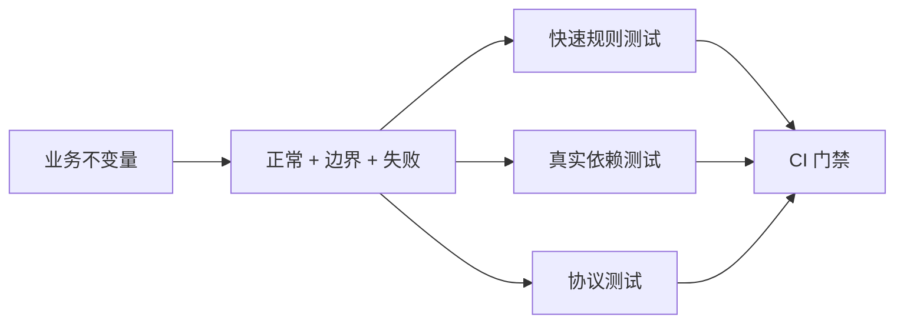

# 后端测试金字塔、Fixture 与隔离数据库

Service 单测把 Repository Mock 成“永远成功”，全部通过；真实 MySQL 中却因复合唯一约束和时区精度失败。测试层级不是按文件夹命名，而是根据要证明的风险选择最小真实边界：纯规则用单测，SQL/事务用集成，外部协议用契约，关键工作流用少量端到端。

## 测试金字塔按反馈速度和真实度分工

单元测试不启动网络和数据库，验证价格计算、权限决策、状态机等确定逻辑，运行快且失败定位清楚。集成测试连接隔离 MySQL/Redis/Broker，验证驱动、Schema、约束、事务和序列化。

契约测试从客户端可观察行为验证 HTTP/消息 Schema；端到端测试通过 React 或 API 走完整登录、CRUD、任务链。层级越高越慢且失败原因更多，因此只覆盖关键路径，不把所有字段组合都塞进 E2E。

| 风险 | 优先测试层 | 为何不能只 Mock |
| --- | --- | --- |
| 权限状态转换 | Service 单元 + 少量集成 | Mock 可隔离规则，但 SQL 仍要验证 |
| 唯一/外键/锁 | MySQL 集成 | 内存替身没有真实裁决 |
| OpenAPI 状态与 Schema | 契约/API | 函数返回值不等于 HTTP |
| Refresh Cookie | API/浏览器 | 浏览器发送规则无法由纯函数证明 |
| 下单到支付回调 | 集成 + 关键 E2E | 跨事务、消息与幂等 |
## Fixture 描述最小事实，不复制整套生产数据

每个测试创建自己需要的租户、用户和资源，使用稳定 Builder 表达默认值，测试只覆盖与断言相关的字段。随机 UUID 避免并行冲突，时间通过 Clock 注入固定，不能用 sleep 等待。

数据库 Fixture 从迁移创建空库，测试在事务中运行并 rollback，或每例清理独立 Schema。涉及 commit、锁和多连接的测试不能依赖单连接 rollback，应创建独立数据库并按 run_id 精确清理。

这个 Jest Service 测试固定冲突输入与当前版本。Repository 是窄接口替身，用于证明 Service 如何处理影响行数为 0。

```ts
it("does not overwrite a newer project version", async () => {
  const repo = new InMemoryProjectRepository([
    project({ id: "p1", tenantId: "t1", version: 3 }),
  ])
  const service = new ProjectService(repo)

  await expect(service.update({
    principal: principal({ tenantId: "t1" }),
    projectId: "p1",
    expectedVersion: 2,
    name: "old edit",
  })).rejects.toMatchObject({ code: "version_conflict" })
})
```

同一规则还需 MySQL 集成测试，执行真实 `UPDATE ... WHERE version=2` 并断言影响行数为 0。单测和集成不是重复：前者定位 Service 决策，后者证明 SQL 裁决。
## 测试数据必须体现失败边界

权限测试至少包含当前租户、其他租户和不存在资源；连接查询包含零/一/多关联；分页包含相同时间戳；消息包含重复 event_id、非法 Schema 和重试耗尽；上传包含伪造 Content-Type 和超限对象。

只写 Happy Path 会让覆盖率好看，却无法证明后端正确。覆盖率用于发现未执行代码，不表示断言质量；突变测试或故意破坏关键条件能检查测试是否真的会失败。



测试矩阵从不变量推导，而不是从 Controller 方法数量推导。每个失败应能指出是哪一层承诺被破坏。
## Flaky Test 是并发或隔离缺陷的证据

偶发失败常来自共享数据库、真实时间、未等待异步完成、端口冲突和测试顺序依赖。先保存 seed、时间、容器日志和测试数据 ID，再最小化复现；无限重跑会把故障变成绿色。

集成服务使用固定版本镜像和健康等待。测试结束关闭连接、Consumer 与 HTTP Server，删除带 run_id 的临时对象；不要执行全局 flush 或 prune 影响其他任务。
## 测试替身、日志与故障回归的边界

**Repository 应该全部 Mock 吗？**

Service 单测可以替换窄 Repository 接口，但查询、事务和约束必须用真实 MySQL 集成测试。否则最容易出错的数据层永远没有被执行。

**端到端测试为什么不越多越好？**

它启动组件多、慢且失败定位困难，组合数量迅速爆炸。把规则下沉到快速测试，E2E 只证明关键组件能连接和核心旅程能完成。

**测试是否应该验证日志？**

关键审计、安全拒绝和可观测字段可以验证结构与脱敏；不要断言整段易变文案。更重要的是响应与业务状态，而非内部实现日志顺序。

**生产故障如何进入测试体系？**

先提炼被破坏的不变量和最小输入，在最低可证明层加回归测试，再补必要的集成/契约。不要用真实用户数据或完整事故日志直接做 Fixture。
