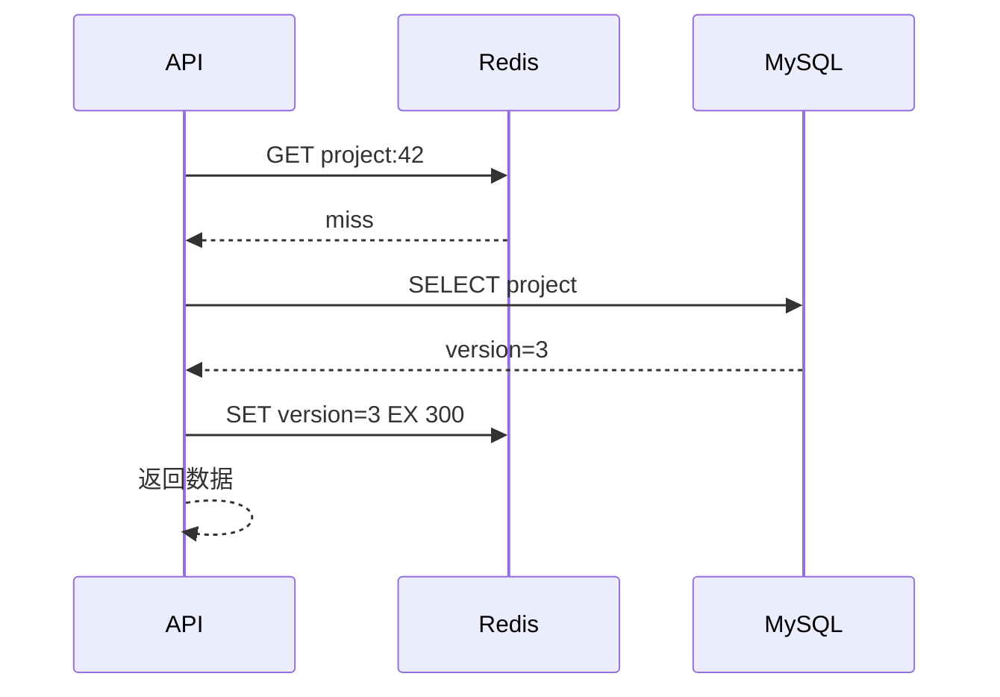

# Cache-aside、一致性与缓存击穿

用户把项目名改成 B，数据库已经是 B，页面刷新仍显示 A。读路径先命中 Redis 的旧值，说明数据库更新与缓存状态没有同步。Cache Aside 的核心不是“先查缓存”，而是定义读未命中、写后失效、并发交错和依赖故障时谁是真相。

## Cache Aside 让应用维护旁路缓存

读请求先 GET；未命中时读 MySQL，把结果写 Redis 并设置 TTL。写请求先提交 MySQL，再删除缓存。下次读取回源得到新值。MySQL 始终是业务事实源，Redis 丢失可重建。

写后选择删除而不是直接更新，原因是值可能由多表计算、并发写可能乱序，删除让下一次读取重新计算。但删除也可能失败，需要短 TTL、重试事件或 Outbox 补偿。



回填值应带业务版本。并发读写交错时，版本可用于拒绝把旧记录覆盖到新缓存。

## 先删缓存再写数据库会扩大旧值窗口

若写请求先删除缓存，再更新数据库；中间一个读请求 miss 后读到旧数据库值并回填，随后写请求提交，新数据库配旧缓存会持续到 TTL。

先提交数据库再删除缓存通常更容易控制：删除前的读最多看到尚未提交的旧事实；提交后删除使后续回源。但提交与删除仍不是原子操作，删除失败必须可观察和补偿。

下面展示写路径的顺序。删除失败不能回滚已经提交的数据库事务，因此记录失效事件供重试。

```ts
const updated = await db.transaction((tx) =>
  projects.updateIfVersion(tx, input)
)

try {
  await redis.del(projectCacheKey(updated.tenantId, updated.id))
} catch (error) {
  await invalidationOutbox.enqueue({
    tenantId: updated.tenantId,
    projectId: updated.id,
    version: updated.version,
  })
}
return updated
```

更严格的实现把失效事件与业务更新写在同一 MySQL 事务，由 Relay 执行删除。响应可以直接返回数据库新值，不再回读可能过期的缓存。

## 击穿、穿透和雪崩是三种不同负载形态

热点 key 到期，大量请求同时回源叫击穿；反复查询不存在 ID 穿过缓存叫穿透；大量 key 同时过期或 Redis 故障导致集中回源叫雪崩。三者的处理方式不同。

热点 miss 可用请求合并或短租约让一个请求回填，其他等待/返回可接受旧值；不存在资源可短时缓存 negative result，但权限失败不能混入共享负缓存；TTL 加随机抖动，并在 Redis 故障时限流保护 MySQL。

| 现象 | 关键证据 | 处理 |
| --- | --- | --- |
| 单个热点回源暴涨 | 同 key miss 与 DB QPS | singleflight/逻辑过期 |
| 大量不存在 ID | 404 key 基数 | 输入限制、短负缓存、Bloom filter |
| 同一分钟大量 miss | TTL 分布与 Redis 状态 | TTL 抖动、预热、回源限流 |
| 命中率高但仍旧 | 数据版本与失效失败 | 版本校验、Outbox 补偿 |

## 缓存故障时要选择降级，而不是无限回源

Redis 不可用后所有请求直接查 MySQL，可能把一次缓存事故变成数据库事故。应用对低价值列表限流、返回短期本地旧值或明确 503；关键写入继续以 MySQL 能力为准。

指标至少包含命中率、miss 回源数、回填耗时、失效失败、key 版本差、Redis 错误和数据库保护拒绝。只有命中率无法发现“高命中旧数据”。

## 缓存一致性的边界条件

**双删能否彻底解决并发旧值？**

延迟双删可缩短某些竞态窗口，但延迟时间难以覆盖所有请求和复制延迟，也会增加操作。版本化 value、失效事件与可接受 TTL 更容易建立明确保证。

**为什么不能缓存 403？**

授权结果依赖用户、角色和时间。若 key 未包含完整主体范围，会把一人的拒绝共享给他人；角色变更后也会过期。通常缓存资源数据，授权仍按当前 Principal 判断。

**缓存 TTL 应该设多长？**

由可接受陈旧窗口、访问热度、重建成本和失效可靠性决定。高变化数据 TTL 短，昂贵且稳定数据可长；没有统一的“5 分钟最佳值”。

**返回旧值算错误吗？**

取决于契约。商品描述短暂旧值可能可接受，余额和权限通常不可接受。把一致性等级写进用例设计，不能让缓存实现暗中决定。
