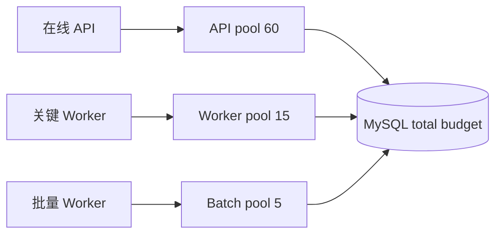

# 缓存、异步任务与连接池性能

缓存保存可复用的短期结果，异步任务把不必占用请求等待的工作交给队列和 Worker，连接池限制同时使用下游连接的数量。三者位于请求入口、任务执行器和数据库/外部服务之间，性能判断要看共享容量和新鲜度，而不只是单个组件的吞吐。

把 Worker 并发从 8 调到 80，队列长度短暂下降，MySQL 连接池随即耗尽，在线 API P99 暴涨。异步把工作移出请求，不会创造数据库、CPU 或外部配额；缓存、队列和池必须共享一张容量预算，并在下游饱和前施加背压。

## 吞吐取决于最慢且最稀缺的下游

Worker 每任务占一个数据库连接 200 ms，池给 Worker 20 个连接，理论数据库阶段上限约 100 task/s；还未计锁、重试和其他 SQL。把 Worker 并发提高到 200 只增加等待与内存。

用到达率 λ、服务率 μ 和 oldest age 观察队列。短期积压可以吸收峰值；λ 长期大于总 μ 时，队列必然增长，需要降入流、提高真实下游容量或改变工作量。

下面是容量估算，不是性能承诺。把数值替换成压测中任务各阶段的真实持有时间。

```text
到达率 λ = 120 tasks/s
单任务 DB 持有 = 0.20 s
仅 DB 所需并发 = λ × W = 24 connections
Worker DB 预算 = 20 connections

结论：不改变到达率/DB 时长，队列会持续增长
```

四舍五入和波动余量后需求更高。在线 API 还要保留独立连接，因此不能把 MySQL 所有连接分给 Worker。
## 缓存减少工作量，也可能制造同步回源

高命中率能减少数据库读取，但 key 同时过期、热 key 击穿或 Redis 故障会瞬间恢复原始负载。容量测试必须包含冷缓存和失效场景，并为回源设置并发上限。

本地缓存降低 Redis QPS，却使每副本拥有不同状态；扩容时冷实例产生回源峰值。按数据新鲜度、实例数和失效方式选择，不只追求命中率。

请求合并只适合相同权限范围、查询参数和数据版本，不能把不同租户的读取合并到同一个 Future。等待者有各自 deadline：一个客户端取消不应取消所有共享回源，全部等待者离开后才终止无价值查询。合并表还要限制大小并及时清理。

| 资源 | 饱和证据 | 背压动作 |
| --- | --- | --- |
| MySQL 池 | waiters/P99/active=max | 拒绝低优先级、限制 Worker |
| Redis | latency/errors/evictions | 本地短旧值、保护回源 |
| RabbitMQ | oldest age/unacked | 降低 producer/消费并发 |
| MinIO | 上传延迟/连接 | 限制并发与对象大小 |
| CPU | run queue/Profile | 任务队列/副本/算法优化 |
## 优先级和隔离防止后台任务拖垮在线请求

API 和 Worker 使用独立数据库池、队列与并发限额；关键任务和批量导出分 Queue，避免一个大客户占满所有 Consumer。限额按租户和全局组合，防止公平性变成无界资源。

重试是额外负载。依赖失败时指数退避、抖动和熔断，避免所有任务同时重试；DLQ/failed 留下终态，而不是无限占队列。



池数字只是结构示例。总和必须小于数据库业务预算，并给迁移与运维连接留余量。
## 性能调优先找等待，再改一个旋钮

队列积压时同时看到达、成功、重试、oldest age、Worker 在途、池等待和下游延迟。只看 ready 数量无法区分突发与永久落后。

每次只改变 Worker 并发、batch size、池或缓存策略之一，用相同负载对照。提高 batch 能减少往返，但增大单事务、锁和失败重做范围；存在明确折中。
## 背压、批处理与熔断的边界

**队列长度下降为什么不一定是好事？**

可能消息被错误 ACK/DLQ、Producer 停止或任务快速失败。结合到达率、成功终态和业务结果判断，不能只以 backlog 为目标。

**批处理越大吞吐越高吗？**

可摊薄往返，但占内存、事务和锁更久，单批失败重做更多。逐级测量吞吐、P99 和失败成本，选择拐点前规模。

**缓存命中率 99% 为什么数据库仍会高峰？**

1% miss 乘以巨大流量仍高，且 miss 可能集中在同一时刻或热点 key。看 miss QPS 和分布，不只看比例。

**熔断是否等于超时？**

超时限制单次等待；熔断在连续失败时暂时阻止新调用，让依赖恢复。两者与重试、并发上限一起设计，并保留半开探测。
