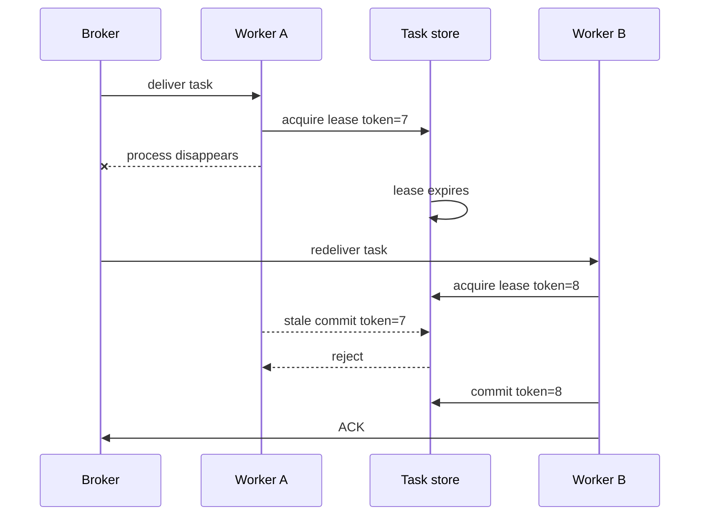

# Celery 异步任务工程

Celery 解决“把函数交给其他进程执行”，不替业务解决重复投递、进程崩溃、取消竞争、结果一致性和版本兼容。`@app.task` 是传输入口，不应成为业务逻辑的唯一容器。可靠任务需要数据库中的稳定记录、幂等阶段、明确重试分类和可恢复终态。

## Broker 消息只传稳定引用

任务参数使用 JSON 可表达的稳定标识与版本：`task_id`、`tenant_id`、`source_version`、协议版本。不要传 ORM 对象、Session、文件字节、长文本、Access Token 或任意 Python pickle。Worker 开始时从可信存储读取固定版本，并重新校验任务状态与权限范围。

```py
@celery_app.task(
    name="projection.build.v2",
    bind=True,
    acks_late=True,
    reject_on_worker_lost=True,
)
def build_projection(self, message: dict[str, object]) -> dict[str, object]:
    command = ProjectionMessageV2.model_validate(message)
    return run_async(execute_projection(command, celery_request_id=self.request.id))
```

任务名和参数 Schema 都是部署契约。滚动发布期间，旧消息可能被新 Worker 消费，新消息也可能落到旧 Worker。增加字段先设可兼容默认值；破坏性语义使用新任务名/版本，并在旧队列排空前保留兼容消费者。

## ACK 语义与可见性超时

提前 ACK 意味着 Worker 领取后崩溃可能丢工作；`acks_late=True` 让成功执行后才确认，降低丢失窗口，却会在“业务已提交、ACK 未到 Broker”时重投。因此 `acks_late` 的前提是任务幂等，不是 exactly-once 开关。

Redis/SQS 类 Broker 使用 visibility timeout 时，超时时间短于正常任务耗时会让同一任务并发出现；设置得过长又会延迟崩溃恢复。更可靠的做法是业务任务表维护租约和 fencing token，Broker 只负责唤醒执行者。



`task_reject_on_worker_lost` 会增加重投机会，但进程被 OOM、机器断电和 Broker 连接丢失的行为仍需按实际 Broker 测试。结果 Backend 也不应成为唯一业务结果来源；它可以用于 Celery 运维，用户状态保存在业务库。

## 队列按资源和延迟目标隔离

在线 Agent、文档解析、索引投影和离线评测的资源形态不同。混在默认队列中，几十分钟 OCR 会占住预取槽位，使秒级在线任务排队。

```py
celery_app.conf.update(
    task_default_queue="document-import",
    task_routes={
        "agent.execute.v1": {"queue": "agent-online"},
        "document.*": {"queue": "document-import"},
        "projection.*": {"queue": "knowledge-projection"},
        "evaluation.*": {"queue": "agent-eval"},
    },
    worker_prefetch_multiplier=1,
    task_track_started=True,
)
```

长任务通常低预取，短任务可按测量提高。Worker 并发不是 CPU 数的简单倍数：还受数据库连接池、外部模型配额、对象存储、内存和事件循环限制。CPU 密集任务使用 prefork/独立进程；I/O 并发也要有 semaphore，不能无限 `gather`。

队列隔离还意味着不同 autoscaling、超时和发布节奏。不要让一个 Worker 同时加载巨型模型资源又消费轻量通知。

## Task 只是适配器，业务执行器可独立测试

Celery Task 完成消息校验、关联上下文和错误到重试策略的映射；领域执行放普通 async/sync 服务中。这样测试用例不必启动 Broker，也能验证状态机。

```py
async def execute_projection(
    command: ProjectionMessageV2,
    *,
    celery_request_id: str,
) -> dict[str, object]:
    async with session_factory() as session:
        execution = await TaskRepository(session).acquire(
            task_id=command.task_id,
            source_version=command.source_version,
            worker_ref=celery_request_id,
        )
        if execution.is_terminal:
            return execution.public_result()

        runner = ProjectionRunner(session, execution)
        return await runner.run()
```

如果 Celery 使用 prefork，父进程创建的数据库连接、异步事件循环和网络客户端不能直接在子进程复用。使用 `worker_process_init` 在每个子进程初始化 loop-bound 资源，在 `worker_process_shutdown` 关闭连接池、HTTP client 和遥测导出器。否则会出现跨 event loop Future、继承无效 socket 或连接泄漏。

## 重试由异常分类驱动

只重试明确暂时性错误。代码错误、数据格式不支持、权限拒绝和超出资源限制应进入稳定失败。`autoretry_for=(Exception,)` 会将部署缺陷放大为持续流量，并阻塞其他任务。

```py
@celery_app.task(bind=True, max_retries=5)
def dispatch_projection(self, payload: dict[str, object]) -> dict[str, object]:
    try:
        return run_projection(payload)
    except RemoteRateLimited as exc:
        delay = bounded_retry_after(exc.retry_after, attempt=self.request.retries)
        raise self.retry(exc=exc, countdown=delay)
    except (RemoteUnavailable, DatabaseSerializationFailure) as exc:
        raise self.retry(
            exc=exc,
            countdown=full_jitter(self.request.retries),
        )
    except (InvalidSource, PermissionRevoked, UnsupportedFormat):
        mark_permanent_failure(payload)
        raise
```

重试同时受次数、绝对 deadline 和成本预算约束。Celery 的 `retry` 会发送新消息，并抛出特殊异常结束当前尝试；不要捕获后继续执行。重试前持久化错误分类和下一次计划时间，便于用户看到真实状态。

达到预算后写失败终态，再决定是否进入隔离队列或人工重放。人工重放使用原业务 taskId、新 attemptId，保留审计关系并重新检查消息版本与权限。

## 软超时、硬超时和取消

Soft time limit 在任务进程内抛出异常，给代码机会保存检查点并清理；Hard time limit 最终终止进程，可能无法运行 `finally`，只应作为资源保护最后手段。外部 HTTP、数据库、模型调用仍必须设置各自 timeout，并小于任务剩余 deadline。

Broker revoke 对未执行消息有效，对正在运行任务不可靠。`terminate=True` 会向 Worker 进程发送信号，可能打断未知临界区，还可能影响该进程随后领取的工作。业务取消采用数据库标记：

```py
async def run_pages(context: TaskContext, pages: list[Page]) -> None:
    for batch in batched(pages, 20):
        await context.assert_current_lease()
        if await context.cancel_requested():
            await context.mark_cancelled(checkpoint=context.last_checkpoint)
            return
        result = await parse_batch(batch, timeout=context.remaining_timeout())
        await context.save_checkpoint(result)
```

取消只能在安全边界生效。若对象已经上传或数据库事务已提交，就记录该阶段完成，再阻止后续阶段；需要删除时由独立补偿任务处理，不能谎称整段工作从未发生。

## 进度、事件和终态

进度不是每处理一行就 `update_state`。高频写 Result Backend 会制造负载，百分比也可能在动态发现工作后倒退。业务任务表保存当前阶段、已完成/估计总量、最近心跳和稳定检查点；进度写入节流并按版本 CAS。

| 字段 | 用途 |
| --- | --- |
| `state` | 可验证状态机 |
| `phase` | 用户可理解的当前阶段 |
| `completed_units/total_units` | 可选估算，不冒充精确值 |
| `attempt` | 当前执行尝试 |
| `lease_token/expires_at` | 接管与陈旧写保护 |
| `checkpoint` | 恢复所需最小稳定位置 |
| `error_code` | 可行动错误分类 |

终态与最后事件在同一数据库事务写入。SSE/WebSocket 只是消费事件；客户端离线不影响任务完成。Worker 不直接向某个进程内连接对象推送唯一结果。

## 定时任务和多实例

Celery Beat 应有唯一调度者，或使用能保证领导权的调度存储。每个 Web/Worker 副本各启动一份 Beat 会重复产生周期任务。即使调度层声称单例，周期任务本身仍使用时间窗口幂等键，例如 `(job_type, scheduled_window)`。

恢复扫描器查找租约过期且非终态的任务，原子转回 queued；不能只依赖 Celery Inspect，因为 Worker 与 Broker 状态不是业务事实。扫描批次使用 `SKIP LOCKED` 或租约，避免多个恢复器重复处理。

## 观测和告警

Celery Events 提供 Worker 与消息视角，业务表提供用户任务视角，两者通过 taskId/requestId 关联。结构化日志包含任务名、协议版本、attempt、队列和错误类别，不记录完整 payload。

关键指标：队列等待分位数、最老任务年龄、执行耗时、重试放大率、Worker 丢失、租约过期、终态分布、每类队列资源使用。只监控“队列长度”会漏掉少量超老任务、任务持续失败重投和 Worker 卡死。

告警应可行动：在线队列等待超预算与离线评测积压使用不同阈值；权限拒绝增加指向上游策略变化，而不是自动重试扩容。

## 验证：真实 Worker 故障矩阵

| 场景 | 预期 |
| --- | --- |
| 同一消息投递两次 | 只有一个有效租约和结果 |
| 业务提交后 ACK 前杀进程 | 重投读取终态，不重复副作用 |
| 长任务超过 visibility timeout | 不产生两个可提交执行者 |
| 下游持续 503 | 在 deadline 内退避，最终稳定失败 |
| 格式错误 | 不重试，返回明确错误码 |
| 执行中请求取消 | 下个安全检查点进入 cancelled |
| 旧 Worker 暂停后恢复 | 旧 lease token 的写入被拒绝 |
| 滚动发布存在旧消息 | 兼容消费或进入隔离，不错误解释 |
| prefork 子进程重启 | 连接池和事件循环重新初始化、正常关闭 |

```py
async def test_redelivery_after_commit_reuses_terminal_result() -> None:
    first = await execute_projection(message, celery_request_id="attempt-a")
    replay = await execute_projection(message, celery_request_id="attempt-b")

    assert replay == first
    assert await artifacts.count_for_task(message.task_id) == 1
    assert await outbox.count_terminal_events(message.task_id) == 1
```

集成测试使用隔离 Broker 与数据库，主动终止 Worker，而不是只调用 task 函数。发布前验证队列路由、并发、预取、超时和环境变量确实生效。

## 常见误区

- 把 `acks_late` 理解为 exactly-once。
- 消息传 ORM 对象、pickle、敏感正文或长期凭证。
- 所有异常自动重试，没有 deadline 和成本上限。
- 只用 revoke/terminate 实现业务取消。
- Result Backend 是唯一任务状态，清理后用户状态消失。
- 所有任务进入默认队列，重型工作阻塞在线请求。
- prefork 前创建连接池并在子进程直接复用。
- 每个实例都启动 Beat，周期任务成倍执行。

## 参考资料

- [Celery Tasks](https://docs.celeryq.dev/en/stable/userguide/tasks.html)：`acks_late`、重试、任务命名与幂等要求。
- [Celery Workers](https://docs.celeryq.dev/en/stable/userguide/workers.html)：prefetch、time limit、revoke、信号与进程生命周期。
- [RabbitMQ Consumer Acknowledgements](https://www.rabbitmq.com/docs/confirms)：ACK、重投与 Publisher Confirm 的保证范围。
- [PostgreSQL Explicit Locking](https://www.postgresql.org/docs/current/explicit-locking.html)：租约领取、并发状态更新与行锁语义。
