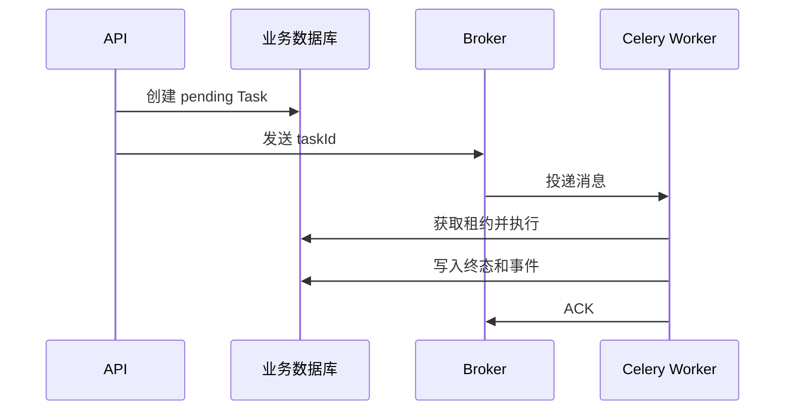

# Celery 异步任务工程

解析一个大文件可能需要几十秒。若 FastAPI 请求一直等待，连接会被占用，发布重启也容易中断工作。更合适的流程是：API 先创建 `pending` 任务，把任务 ID 发给 Celery，Worker 再读取任务并写入终态。

本篇让 Celery 负责“提醒哪个任务需要执行”，让业务数据库负责“任务现在是什么状态”。随后制造网络临时错误、Worker 崩溃和用户取消，观察 ACK、重投与任务状态怎样配合。

## Broker 不是业务数据库

Celery 消息只携带稳定引用和协议版本，例如 taskId、sourceVersion。文件字节、ORM 对象、Session、Access Token 和大段正文留在受保护存储中。Worker 收到消息后重新读取固定版本，并检查任务状态与权限。

任务名和参数 Schema 是滚动发布契约。新增字段先给兼容默认值；破坏性语义使用新任务名或版本，并在旧队列排空前保留兼容消费者。



## 步骤一：理解 ACK 和重复投递

提前 ACK 时，Worker 领取后崩溃可能丢失工作。`acks_late=True` 在任务完成后确认，可以降低丢失窗口，但若业务已经提交、ACK 尚未到达 Broker 时进程退出，消息会再次投递。因此 late ACK 的前提是幂等，不是 exactly-once 开关。

Redis 或 SQS 类 Broker 的 visibility timeout 若短于正常执行时间，同一消息可能同时出现；过长则拖慢崩溃恢复。业务任务表使用租约和 fencing token：新 Worker 接管后，旧 Worker 的 token 无法提交结果。

## 步骤二：Celery Task 只做适配

Task 函数校验消息、建立日志上下文，并把异常分类映射为重试。实际业务放在普通 Service 中，这样不启动 Broker 也能测试状态机。

下面是根据 Celery 重试行为重写的最小适配器。输入只有可验证消息；暂时性错误延后重试，格式或权限错误直接进入稳定失败。`self.retry()` 会结束当前尝试，后面的业务代码不会继续运行。

```py
@celery_app.task(
    bind=True,
    name="document.process.v1",
    acks_late=True,
    reject_on_worker_lost=True,
    max_retries=4,
)
def process_document(self, raw: dict[str, object]) -> dict[str, object]:
    message = TaskMessageV1.model_validate(raw)
    try:
        return run_async(document_service.execute(
            task_id=message.task_id,
            worker_ref=self.request.id,
        ))
    except RemoteRateLimited as exc:
        raise self.retry(
            exc=exc,
            countdown=bounded_delay(exc.retry_after, self.request.retries),
        )
    except (InvalidSource, PermissionRevoked) as exc:
        mark_permanent_failure(message.task_id, exc)
        raise
```

代码没有对 `Exception` 全量自动重试，因为编程错误、输入错误和权限拒绝不会随等待自动恢复。重试还要受绝对 Deadline 和成本预算限制；次数耗尽后写入可解释终态，而不是永久在队列循环。

## 步骤三：按资源类型拆队列

在线 Agent、OCR、索引构建和离线评测的延迟与资源不同。都放进默认队列时，一个重型 OCR 会占住预取槽，使秒级任务长期等待。按工作类型设置队列、Worker 并发、预取、超时和扩容策略。

Worker 并发受最紧下游约束：数据库连接池、对象存储、外部模型配额、CPU 或内存。CPU 密集任务使用 prefork 或独立进程；I/O 任务也要有并发上限。队列长度之外还要观察最老任务年龄与等待分位数。

prefork 模式下，父进程创建的数据库连接、事件循环和网络 Client 不应直接在子进程复用。每个 Worker 子进程独立初始化并在退出时关闭这些资源。

## 步骤四：取消与进度由业务状态机管理

Broker revoke 适合尚未运行的消息，对运行中的 Python 代码没有可靠业务语义。`terminate=True` 可能打断未知临界区。取消请求应先写数据库标记，Worker 在页批次或阶段边界检查，再进入 `cancelled`。

进度使用阶段、已完成单位、最近心跳和稳定检查点，不需要每处理一行就更新 Result Backend。高频写会放大存储压力，百分比也可能因动态发现工作而倒退。终态和最后事件在同一数据库事务提交，SSE 只是读取这些事件。

Celery Beat 需要唯一调度者；即使调度器只有一个，周期任务仍使用时间窗口幂等键。恢复扫描器查找租约过期且未终结的任务，原子转回 queued，不能只依赖 Celery Inspect 判断用户任务状态。

## 正常结果和失败结果

| 场景 | 预期 |
| --- | --- |
| 同一消息投递两次 | 一个有效租约，一份业务结果 |
| 提交后、ACK 前杀死 Worker | 重投读取终态，不重复制品 |
| 下游短暂 503 | 有界退避后再次尝试 |
| 下游持续失败 | 到 Deadline 后进入失败终态 |
| 文件格式不支持 | 不重试，返回明确错误 |
| 用户请求取消 | 下一个安全边界进入 cancelled |
| 旧 Worker 暂停后恢复 | 陈旧 token 的提交被拒绝 |
| 新旧消息在滚动发布中共存 | 兼容消费或明确隔离 |

集成测试使用隔离 Broker 与数据库，并真实终止 Worker，检查数据库行、制品数和事件序列。只直接调用 Task 函数无法证明 ACK、重投、prefork 和队列路由配置。指标至少包括等待时间、执行时间、重试原因、Worker 丢失、租约过期与终态分布。

## 当前限制

Celery 提供成熟的 Python 任务分发能力，但业务幂等、权限、取消和恢复仍由应用设计。选择 Redis、RabbitMQ 或其他 Broker 时，要按实际确认、可见性和持久化语义测试。下一组文章切换到 Go，继续观察同一分层和故障原则在静态类型与显式错误语言中的表达。

## 跟踪一个 Celery 任务的完整生命周期

API 先在数据库创建 `pending` 任务并提交，再把任务 ID 发送给 Celery。Worker 收到消息后取得执行租约，读取当前业务状态，开始处理并周期性刷新租约。完成时先提交业务结果，再 ACK 消息；若进程在 ACK 前退出，重复投递通过任务状态收敛。

| 机制 | 解决的问题 | 不负责什么 |
| --- | --- | --- |
| Broker | 保存和投递消息 | 业务最终状态 |
| ACK | 告诉 Broker 本次消息已处理 | 外部副作用幂等 |
| Retry | 对暂时性失败重新尝试 | 修复无效输入和权限错误 |
| Queue | 隔离不同资源任务 | 自动提供公平性与容量规划 |
| Worker lease | 限制当前执行所有者 | 代替用户取消和 Deadline |

把 OCR、索引和短通知放进不同队列，按 CPU、内存和外部配额设置并发。任务内部检查用户取消与绝对 Deadline，Celery 撤销信号只能作为辅助，不能证明底层操作立即停止。

测试时分别让依赖超时、Worker 突然退出和消息重复到达。检查 Attempt 记录、重试次数、业务终态和外部副作用；再执行停滞扫描，让租约过期任务恢复或结束。Celery 提供执行基础设施，可靠业务语义仍由持久任务模型定义。

## 参考资料

- [Celery Tasks](https://docs.celeryq.dev/en/stable/userguide/tasks.html)
- [Celery Workers](https://docs.celeryq.dev/en/stable/userguide/workers.html)
- [RabbitMQ Consumer Acknowledgements](https://www.rabbitmq.com/docs/confirms)
- [PostgreSQL Explicit Locking](https://www.postgresql.org/docs/current/explicit-locking.html)
