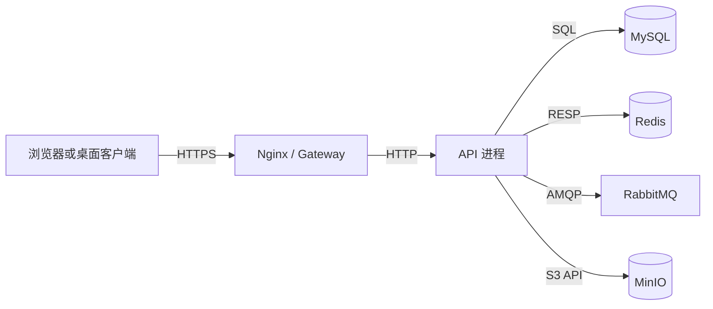

# 客户端与服务器：B/S、C/S、进程和职责边界

浏览器打开 `/projects` 时，浏览器进程、反向代理、应用进程和数据库并不是同一个“后端”。浏览器只知道 HTTP；数据库只执行连接上的 SQL；业务规则必须由中间的应用进程承担。先把职责画出来，后面遇到 401、慢 SQL 或端口错误，才知道证据该去哪一层找。

## 三个客户端模型对应三条状态边界

B/S 模型把 UI 放在浏览器，服务器负责协议、业务和数据。C/S 模型把一部分 UI 和协议封装进桌面或移动客户端，但**授权和关键业务约束仍必须在服务器重算**。所谓“前后端分离”不是把代码按目录拆开，而是让双方通过稳定的协议交换状态。

一次创建项目的最小边界是：客户端提交意图；服务器验证身份、租户和字段；数据库提交事实；服务器返回新事实。客户端可以缓存列表，却不能决定 `tenant_id` 或最终权限。

## 一条请求的所有者

把请求画成箭头时，给每个箭头写上协议和所有者：浏览器到 Nginx 是 HTTPS，Nginx 到 API 是 HTTP 或 Unix Socket，API 到 MySQL 是 MySQL 协议，API 到 Redis 是 RESP。协议不同，超时、重试和故障表现也不同。

图中的 API 进程拥有业务状态转换的解释权。Redis、RabbitMQ 和 MinIO 都是协作者，不能因为它们响应更快就替代 MySQL 中的业务事实。

## 状态放在哪里决定系统能否恢复

可以把状态分成三类：用户输入是短暂的请求数据；数据库记录是需要恢复的业务事实；缓存和队列是可重建或可重新投递的运行状态。进程内变量最容易丢失，适合连接池、短时缓存和指标，不适合保存订单是否支付。

| 状态 | 典型存放处 | 进程重启后的处理 |
| --- | --- | --- |
| 项目名称 | MySQL | 从数据库重新读取 |
| 项目列表缓存 | Redis | 失效后回源 |
| 任务待执行消息 | RabbitMQ | 按 ACK/重投继续 |
| 当前请求中的局部变量 | API 内存 | 请求结束或进程退出即消失 |

## 故障从哪里开始看

| 现象 | 先确认 | 处理顺序 |
| --- | --- | --- |
| 页面 200 但数据为空 | 先看浏览器响应，再查 API 日志和数据库查询；不要先改 React 渲染。 | 确认契约字段、权限范围、查询结果和序列化四层 |
| 同一个项目在两个客户端显示不同 | 记录请求时间、缓存键和数据库版本号。 | 先绕过缓存比对真相，再检查失效和客户端缓存 |
| 客户端是否可以直接连 MySQL | 不应这样做。数据库凭证和业务授权会暴露，迁移也会把所有客户端绑死。 | 客户端只调用 API，API 负责权限、事务和审计 |

处理顺序不是“先重启看看”。先保留 requestId、时间窗口和原始输出，再确认请求是否到达进程、是否进入业务、是否写入数据，最后才处理缓存、消息和部署层。这样做的原因是每一层都可能把上游错误重新包装，过早重启会丢掉最有价值的现场。

## 继续追问

### 为什么“前后端分离”不等于“前端只负责页面”？

前端仍然负责协议适配、加载状态、错误恢复和用户输入的可用性；但它不能成为授权的最终裁判。服务端必须在每次请求中重新计算租户、权限和资源版本，否则攻击者绕过页面就能直接改数据。

### 什么时候 C/S 比 B/S 更合适？

需要本地设备能力、离线数据或高频交互时，C/S 可以把更多能力放进客户端。代价是版本发布、凭证保护和多平台兼容更复杂。无论哪种模型，服务端仍要保留最终数据和权限边界。
