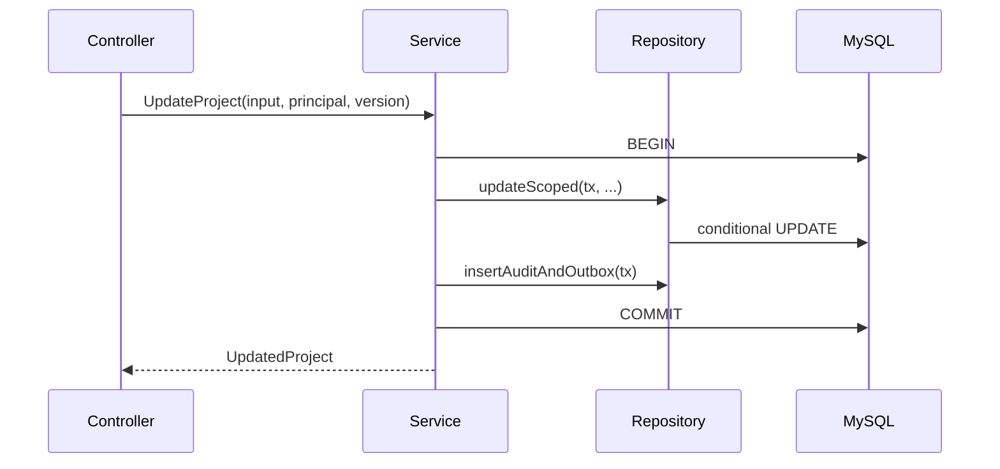

# Controller、Service、Repository 的边界与事务归属

一个 Controller 同时解析 HTTP、查询用户权限、拼 SQL、开启事务、发消息并把数据库异常直接返回。它能跑，但任何一个规则都只能通过完整 HTTP 测试验证，事务也容易在中途提交。分层的目的不是多建目录，而是让协议、业务状态和数据访问各有明确所有者。

## Controller 翻译协议，不决定业务事实

Controller 读取 path/query/body/header，把框架对象转换成用例输入；调用 Service 后，把领域结果映射为 HTTP 状态与响应。字段形状校验、认证 Principal 注入和 requestId 也发生在协议边界。

Controller 不信任客户端传入的 tenant_id、owner_id 或权限。它从认证上下文取得 Principal，并把资源 ID 与用户意图交给 Service。这样 CLI、消息消费者或测试调用同一用例时，不需要伪造 HTTP Request。

下面的 NestJS Controller 只做输入转换与输出委托。版本号来自 If-Match 解析结果，租户范围来自 Principal。

```ts
@Patch(":projectId")
async updateProject(
  @Param("projectId", new ParseUUIDPipe()) projectId: string,
  @Body() body: UpdateProjectDto,
  @Principal() principal: Principal,
  @ExpectedVersion() version: number,
) {
  return this.projects.update({ projectId, body, principal, version })
}
```

装饰器和 Pipe 属于 NestJS 协议适配。`projects.update` 不应接收 Response，也不应自行决定返回 409；它返回领域冲突，异常过滤器再统一映射。
## Service 拥有业务不变量和事务

Service 编排“读取当前项目、检查权限、按版本更新、写审计与 Outbox”这一完整状态转换。事务必须覆盖所有必须一起成功的数据库写入，由 Service 或 Unit of Work 开启。

外部 HTTP、邮件和消息等待不应夹在数据库事务中。消息通过 Outbox 留下待发布事实；必须先调用的外部服务要设计幂等和补偿，并明确结果未知时的状态。



Service 根据影响行数区分更新成功与冲突。Repository 不提交事务，因此审计失败时项目更新也会回滚。

事务对象的传播必须看得见。Service 创建 Unit of Work 后，参与用例的 Repository 都使用同一 transaction handle；若其中一个偷用全局连接，审计可能在业务回滚后仍然提交。集成测试应故意让第二次写入失败，检查第一条更新和 Outbox 一起消失。
## Repository 封装查询语义，不隐藏性能

Repository 把租户过滤、软删除和稳定排序写进可复用查询，接收显式事务句柄。方法名表达所需语义，例如 `findScoped`、`updateIfVersion`，而不是提供任意 `find(table, where)` 让上层绕过范围。

Repository 仍要让调用方知道是否返回一项、列表、游标或影响行数。把 ORM 实体和 lazy relation 泄漏到 Controller，会让序列化阶段意外访问数据库，也难以控制 N+1。

| 层 | 输入 | 输出/错误 |
| --- | --- | --- |
| Controller | HTTP + Principal | DTO 或 Problem |
| Service | 用例命令 + 身份范围 | 领域结果、冲突、拒绝 |
| Repository | 事务 + 查询条件 | 实体/DTO、影响行数、数据错误 |
| 数据库 | SQL + 参数 | 行、约束裁决、提交结果 |
## 错误从底层向上保留原因、收窄细节

数据库唯一约束在 Repository 被识别为 DuplicateName；Service 根据用例转成 ProjectNameConflict；HTTP 层输出 409 与稳定 code。日志保留 cause、约束名和 requestId，响应不暴露 SQL。

测试也按责任分层：Service 单测验证状态转换与事务调用，Repository 集成测试连接隔离 MySQL 验证 SQL、约束和租户范围，HTTP 契约测试验证状态码与 JSON。
## 分层职责的适用边界

**简单 CRUD 是否也需要三层？**

不必为每条读取制造空转抽象，但认证范围、错误结构和数据访问仍要有清楚位置。可以让薄 Service 很短；当事务和规则增长时，它提供稳定扩展点。

**Service 能否调用多个 Repository？**

可以，这正是它拥有用例事务的原因。所有 Repository 接收同一事务上下文；若属于不同数据库，则不能假装原子事务，需要 Outbox/Saga。

**Repository 是否应该返回 ORM Model？**

领域层需要行为且能控制加载时可返回实体；跨层序列化更适合明确 DTO。关键是不能让 lazy IO 和 ORM Session 生命周期泄漏到协议层。

**权限检查放 Guard 还是 Service？**

Guard 适合“是否已登录、是否拥有粗粒度权限”。依赖资源当前状态、租户和数据范围的授权必须在 Service/查询中再次执行，避免只靠路由元数据。
