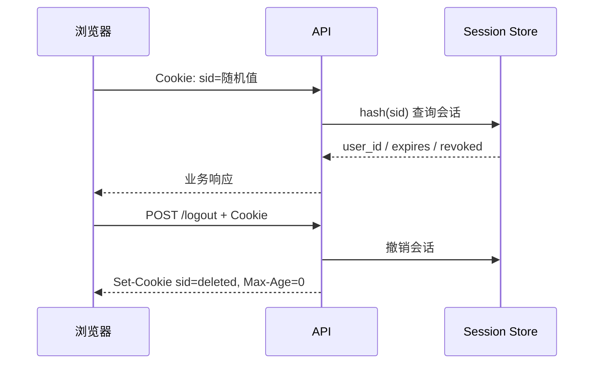

# Cookie、Session、Token 与浏览器状态

登录响应带了 `Set-Cookie`，下一次请求却没有 `Cookie`。这通常不是后端“忘记登录”，而是浏览器根据 Domain、Path、Secure、SameSite、过期时间和请求凭证模式判断该不该发送。Cookie 是浏览器管理的一条发送规则，不是 Session 或 Token 的同义词。

## Cookie 保存名称、值和发送条件

服务器通过 `Set-Cookie` 写入 Cookie。浏览器按目标主机、路径、协议、站点关系和有效期匹配，并在符合条件的请求中自动生成 `Cookie` 头。JavaScript 能否读取由 HttpOnly 决定；能否通过明文 HTTP 发送由 Secure 决定。

Domain 缺省时是 host-only，只发回设置它的主机；指定 Domain 后可覆盖相应子域。Path 只是发送范围，不是安全边界。两个同名 Cookie 可以因 Domain 或 Path 不同同时存在，排查时要查看完整属性。

| 属性 | 控制什么 | 容易误解 |
| --- | --- | --- |
| HttpOnly | 禁止脚本读取 Cookie | 不能阻止浏览器自动携带 |
| Secure | 只通过安全连接发送 | 不负责加密 Cookie 值 |
| SameSite | 限制跨站请求携带 | 同站不等于同源 |
| Domain/Path | 匹配发送目标 | Path 不能阻止其他路径覆盖同名值 |
| Max-Age/Expires | 持久化期限 | 服务端会话可能更早失效 |
## 同源、同站和 CORS 是三套判断

源由 scheme、host、port 组成；站点判断以可注册域和 scheme 为核心。`app.example.test` 与 `api.example.test` 跨源但通常同站，因此会触发 CORS，却不一定被 SameSite 当成跨站。

跨源 `fetch` 要携带 Cookie，客户端设置 `credentials: "include"`，服务器返回明确的 `Access-Control-Allow-Origin` 与 `Access-Control-Allow-Credentials: true`。允许凭证时不能把 Origin 写成 `*`。预检通过也不代表业务鉴权通过。

下面从前端发起刷新请求。观察目标是浏览器是否携带 HttpOnly Refresh Cookie，而不是尝试从 JavaScript 读取它。

```ts
const response = await fetch(
  "https://api.example.test/auth/refresh",
  {
    method: "POST",
    credentials: "include",
    headers: { "x-csrf-token": csrfToken }
  }
)

if (!response.ok) clearInMemoryAccessToken()
```

`credentials` 只允许浏览器按 Cookie 规则发送，不能绕过 SameSite、Secure 或 CORS。刷新失败后清理内存 Access Token，避免页面继续假装已登录。
## Session 与 Token 的状态所有者不同

Cookie 可以装随机 Session ID，服务端用它查询 Session；也可以装 Refresh Token。Bearer Access Token 常放在 Authorization 头，由应用显式设置。区别不在字符串长相，而在服务端保存什么状态、怎样撤销、谁负责发送。

Session ID 与 Refresh Token 都应是不可预测的随机值。数据库只保存哈希，日志不记录原值。退出时删除浏览器 Cookie，并在服务端撤销对应会话；只清 Cookie 会留下被窃取凭证仍可使用的窗口。



浏览器 Cookie 到期和服务端会话到期是两道门，任意一边失效都不能继续认证。
## CSRF 利用了“自动携带”

攻击页面不能读取 HttpOnly Cookie，却可能诱导浏览器向目标站发送带 Cookie 的写请求。SameSite 降低风险，但涉及跨站登录、旧浏览器或复杂域名时，还要使用 CSRF Token、Origin/Referer 校验和只允许 JSON 的接口。

XSS 与 CSRF 不应混为一谈。HttpOnly 减少 XSS 直接窃取 Cookie，无法阻止恶意脚本以当前用户身份调用同源 API；内容转义、CSP 和依赖治理仍然需要。

同名 Cookie 还可能因 Domain、Path 不同同时存在，服务器收到的 Cookie Header 却不携带这些属性。认证 Cookie 应固定 Host、Path 与名称，退出时用相同属性删除；否则开发者看到一个 Cookie 已清除，旧路径下的值仍可能继续发送。
## 浏览器会话状态的安全边界

**为什么 Cookie 已存在，开发环境请求仍不携带？**

依次检查请求主机和 Path、Secure 与实际协议、SameSite 的站点关系、是否过期、fetch credentials 和 CORS 响应。还要检查是否存在同名但作用域不同的 Cookie。

**Access Token 为什么适合放内存而不是 localStorage？**

localStorage 中的值可被同源脚本读取，XSS 能直接带走长期使用。内存 Token 刷新页面会丢失，因此应用启动时用 HttpOnly Refresh Cookie 换取短时 Access Token，并对并发 401 做单飞刷新。

**SameSite=Lax 能保护所有写接口吗？**

它能限制部分跨站请求携带，但不是完整 CSRF 方案。顶级导航、站点边界、兼容需求和错误使用 GET 修改状态都会留下风险。关键写操作仍应校验请求来源或 CSRF Token。

**跨标签页怎样同步退出？**

服务端撤销会话是最终保障。前端可用 BroadcastChannel 通知其他标签清理内存 Token 和查询缓存；标签错过通知后，下一次刷新或 API 401 也会回到未登录状态。
