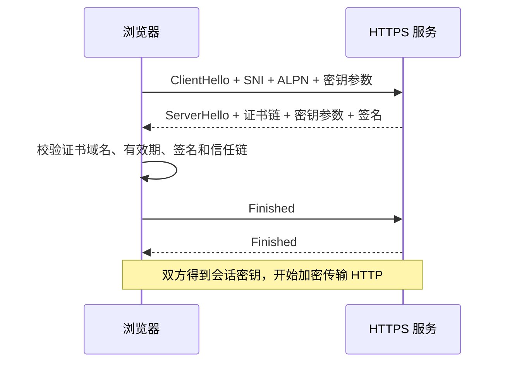

# 输入 URL 到页面显示：浏览器、网络与服务器的完整过程

在地址栏输入：

```text
https://www.example.test/products?category=book#reviews
```

按下回车后，浏览器不会立刻“向服务器要一个页面”。它先判断这是不是 URL，解析协议、主机、端口和路径；检查能否从现有页面、Service Worker 或 HTTP 缓存取得结果；需要联网时才解析域名、建立连接并发送请求。服务器返回的 HTML 还不是屏幕上的像素。浏览器要继续下载 CSS 和 JavaScript，构建 DOM 与 CSSOM，计算布局、绘制图层并合成画面。

一次导航可以分成四段：

```mermaid
flowchart LR
  A[输入 URL] --> B[解析与导航决策]
  B --> C{本地能否响应}
  C -->|Service Worker / 缓存| H[获得响应]
  C -->|需要网络| D[DNS 与路由]
  D --> E[TCP/QUIC 与 TLS]
  E --> F[HTTP 请求]
  F --> G[CDN / 代理 / 后端 / 数据库]
  G --> H
  H --> I[解码与解析 HTML]
  I --> J[加载 CSS / JS / 图片 / 字体]
  J --> K[DOM + CSSOM]
  K --> L[Style / Layout / Paint / Composite]
  L --> M[页面显示并可交互]

  classDef local fill:#e0f2fe,stroke:#0284c7,color:#0c4a6e
  classDef network fill:#ede9fe,stroke:#7c3aed,color:#4c1d95
  classDef server fill:#fef3c7,stroke:#d97706,color:#78350f
  classDef render fill:#dcfce7,stroke:#16a34a,color:#14532d
  class A,B,C local
  class D,E,F network
  class G server
  class H,I,J,K,L,M render
```



图中每个箭头都可能被跳过或复用。内存缓存命中时没有网络请求；已有 HTTP/2 连接可以省去新的 TCP 和 TLS 握手；页面没有 JavaScript 时也不需要执行脚本。开发者工具里某些阶段显示 0 ms，通常表示该阶段被复用或没有发生，不代表浏览器没有这些能力。

## 浏览器先解析 URL，再决定怎样导航

一个 URL 至少包含这些部分：

| 片段 | 示例 | 作用 |
| --- | --- | --- |
| Scheme | `https` | 选择协议和默认端口 |
| Host | `www.example.test` | 标识目标主机，后续参与 DNS、SNI 和 Host 路由 |
| Port | 省略，HTTPS 默认 443 | 选择目标进程监听的网络端口 |
| Path | `/products` | 表示服务器上的资源路径 |
| Query | `category=book` | 给服务器的查询参数，会进入 HTTP 请求 |
| Fragment | `reviews` | 只在客户端定位文档片段，通常不会发给服务器 |

浏览器先把输入规范化。如果输入不是明显 URL，地址栏可能把它交给搜索引擎；如果缺少协议，浏览器会按自身规则补全。URL 中的 Unicode 域名会转换为 DNS 可处理的 ASCII 形式，路径中的特殊字符会按 URL 规则编码。

Fragment `#reviews` 不会出现在下面的请求行中：

```http
GET /products?category=book HTTP/1.1
Host: www.example.test
Accept: text/html,application/xhtml+xml
Accept-Encoding: gzip, br
Cookie: session_id=<opaque-value>
```

请求行只包含 Path 和 Query。Host 另放在 Header 中，Cookie 是否发送由 Domain、Path、Secure、SameSite 和凭证策略共同决定。

正式联网前还有几项导航判断：

1. 当前文档内只改变 Fragment 时，浏览器可能直接滚动，不重新请求文档；
2. 前进、后退可能从 Back/Forward Cache 恢复整个页面及 JavaScript 堆；
3. 已安装并控制当前站点的 Service Worker 可以拦截导航请求，从 Cache Storage 返回响应；
4. HSTS 规则可以把 HTTP 导航升级为 HTTPS，避免先发送明文请求再等待 301；
5. 普通 HTTP 缓存可以直接使用新鲜响应，或携带验证器向服务器确认内容是否变化。

**Memory Cache、HTTP Cache、Cache Storage 和 Back/Forward Cache 是不同机制。** Cache Storage 由 Service Worker 代码显式读写；HTTP Cache 遵守响应缓存头；BFCache 保存的是可恢复页面状态，不是一份普通资源响应。
## DNS 把主机名解析成可连接地址

只有确定需要网络时，浏览器才需要目标 IP。它会先查看可用的本地结果，例如浏览器 DNS 缓存、操作系统缓存和 hosts 配置。没有命中时，请求交给配置的递归解析器，也可能通过 DoH 或 DoT 加密发送。

递归解析器若同样没有缓存，会沿 DNS 层级查询：

```text
浏览器 / 操作系统
        |
        v
递归解析器
        |
        +--> 根服务器：谁负责 .test（真实公网不会使用保留的 .test）
        +--> 顶级域服务器：谁负责 example.test
        +--> 权威服务器：www.example.test 的 A / AAAA 是什么
        |
        v
IPv4 A 记录 / IPv6 AAAA 记录 + TTL
```

真实域名还可能先返回 CNAME，递归解析器继续查询别名目标。CDN 常根据解析器位置、健康状态和流量策略返回不同地址，所以两地用户不一定得到同一个 IP。

可以分别观察系统解析结果和权威记录：

```bash
# 查看系统实际会采用的地址；不同系统的命令可能不同。
getent ahosts www.example.com

# 直接查看 DNS 记录、别名和 TTL。
dig www.example.com A
dig www.example.com AAAA
```

先运行 `getent`，记录本机实际采用的 IPv4/IPv6 地址；再运行 `dig`，观察 DNS 响应中的记录类型和 TTL。若 `getent` 没有输出，应用还没有进入 TCP 阶段；若地址存在但端口连接失败，继续检查路由和监听状态。不同系统可能没有 `getent`，这时使用系统提供的解析工具并保留原始输出。

`dig` 输出中的 `ANSWER SECTION` 给出记录值和剩余 TTL。TTL 控制缓存最多可以沿用多久，不保证所有缓存会在修改记录的同一秒更新。DNS 返回地址只说明“名字对应哪里”，不说明目标端口已开放，更不说明 HTTP 应用健康。

浏览器得到多个 IPv6/IPv4 地址时，可以交错尝试连接，避免某一协议路径故障造成长时间等待。因此“第一个 DNS 地址无法连接”也不一定意味着导航立即失败。
## 数据包先穿过本地网络和路由

知道目标 IP 后，操作系统根据路由表选择出口网卡和下一跳。如果目标不在本地子网，数据通常先发给默认网关。发送以太网帧前，主机需要通过 ARP（IPv4）或 Neighbor Discovery（IPv6）知道下一跳的链路层地址。

家用路由器常执行 NAT，把内网源地址和端口映射为公网地址和端口。之后数据包经过多个路由器转发，每一跳根据目标 IP 选择下一跳。IP 提供跨网络寻址和尽力而为的分组传输；它不保证数据一定到达、顺序不变或只到达一次。

下面的命令从两个角度观察路径：路由表说明本机选择哪个出口，traceroute 通过逐步增加 TTL 探测途中响应。

```bash
# 查看访问目标地址时系统选择的网关和网卡。
ip route get 203.0.113.10

# 观察可见的中间跳；星号也可能只是路由器不回应探测报文。
traceroute 203.0.113.10
```

`ip route get` 应输出选中的网卡、源地址和下一跳；`traceroute` 会按跳数列出可见路由器。先用前者确认本机从哪里发包，再用后者观察路径变化。中间跳不回答探测时仍可能转发业务流量，不能把星号直接当作故障结论。

中间某一跳显示 `*` 不能直接断言这里断网。很多路由器会转发业务流量，却限制或丢弃诊断报文。判断连通性要结合最终目标连接、双向抓包和服务日志。
## TCP、QUIC 和端口建立进程间通道

HTTPS 常运行在 TCP 上，HTTP/3 则运行在基于 UDP 的 QUIC 上。浏览器会通过缓存的协议能力、DNS HTTPS 记录或此前响应的 Alt-Svc 等信息选择可用协议，失败时还可能回退。因此现代浏览器导航不一定每次都出现 TCP 三次握手。

### TCP 三次握手建立连接状态

客户端为本次连接选择临时源端口，连接由源 IP、源端口、目标 IP、目标端口和协议共同标识。三次握手同步初始序列号并确认双方都能收发：

```text
客户端                                      服务器 :443
   | ---- SYN, seq=x --------------------------> |
   | <--- SYN-ACK, seq=y, ack=x+1 -------------- |
   | ---- ACK, ack=y+1 ------------------------> |
   |              连接已建立                     |
```

TCP 把应用字节拆成报文段，通过序列号重排，用 ACK 确认接收，对丢失数据重传，并根据接收窗口与拥塞控制调整发送速度。它提供一条有序字节流，不保留 HTTP 消息边界；HTTP/1.1、HTTP/2 自己定义怎样在字节流中分隔请求、Header、帧和 Body。

服务器只有在某个进程监听目标地址和端口时才能接受连接：

```bash
# 查看 443、8080 等端口由哪个进程监听，以及绑定在哪个地址。
ss -lntp | rg ':443|:8080'

# 只测试 TCP 能否建立，不代表 TLS 和 HTTP 一定正确。
nc -vz www.example.com 443
```

`ss` 的 LISTEN 行告诉你进程、端口和绑定地址；`nc` 的 succeeded/refused/timeout 只描述 TCP 建连结果。先在服务器确认监听，再从客户端执行 `nc`，两个结果不一致时优先检查防火墙、容器网络和地址族，而不是修改 HTTP 路由。

`Connection refused` 往往表示数据到达目标，但端口没有监听或设备主动拒绝。超时表示在等待窗口内没有收到可见响应，可能涉及路由、防火墙、安全组或目标主机。服务只绑定 `localhost:8080` 时，同一网络命名空间内可以连接，其他容器或机器无法通过主机地址访问。

### QUIC 把连接与加密握手放在一起

QUIC 使用 UDP 承载，在协议内部完成可靠传输、拥塞控制和 TLS 1.3 握手。HTTP/3 的不同 Stream 不受 TCP 层单一字节流的队头阻塞影响；一个 Stream 丢包时，其他 Stream 可以继续交付已经到达的数据。

QUIC 还使用 Connection ID 支持网络地址变化，例如移动设备从 Wi-Fi 切到蜂窝网络时迁移连接。它并没有消除丢包、拥塞和应用层等待，服务端和中间网络也必须允许对应 UDP 流量。
## TLS 验证身份并协商加密

TCP 连接成功只说明有一条字节通道。HTTPS 还要进行 TLS 握手。以 TLS 1.3 为例，简化过程如下：



图中的 ClientHello 携带目标主机名和协议能力，服务器返回证书与握手参数，浏览器先验证身份再接受加密会话。握手失败时，浏览器不会把后续 HTTP 交给应用；可以在 `curl -v` 中区分证书域名、信任链和协议版本错误。

SNI 告诉服务器客户端要访问哪个主机名，使同一 IP 可以托管多个证书；ALPN 协商 HTTP/1.1 或 HTTP/2 等上层协议。证书包含公钥、域名范围、有效期和签发信息，浏览器沿证书链验证到受信任根证书，并核对访问域名。

TLS 记录使用握手协商出的对称密钥加密。证书私钥用于证明服务器身份，不会直接拿来加密整个页面内容。会话恢复可以减少后续握手往返，但仍要满足有效期和安全策略。

可以把 DNS 指向指定 IP，同时保留正确 SNI 和 Host 做对照：

```bash
# 只替换解析结果，继续按域名完成证书验证和虚拟主机路由。
curl -v --resolve www.example.test:443:203.0.113.10 \
  https://www.example.test/products
```

命令成功时，输出会同时保留 URL 中的 SNI、Host 和证书校验，只把 DNS 解析结果替换为指定地址。连接失败要看是无法建连、证书校验失败还是上游返回 HTTP 错误；这条命令不能证明真实 DNS 记录已经更新。

直接访问 `https://IP/` 会同时改变证书域名、SNI 和 Host，无法只验证 DNS 差异。证书错误也不等于服务器离线；它说明浏览器不能把当前加密端点认证为 URL 中的主机。
## HTTP 发送请求，服务器逐层生成响应

连接可用后，浏览器把导航意图编码为 HTTP。HTTP/1.1 使用文本起始行和 Header；HTTP/2 把同一语义编码为二进制帧，并在一个连接上复用多个 Stream；HTTP/3 把 Stream 放在 QUIC 上。应用看到的仍是方法、URL、Header 和 Body。

一次文档请求可能包含这些字段：

```http
GET /products?category=book HTTP/1.1
Host: www.example.test
Accept: text/html,application/xhtml+xml
Accept-Encoding: gzip, br
If-None-Match: "page-v42"
Sec-Fetch-Mode: navigate
Sec-Fetch-Dest: document
```

`Accept` 表示可以接收的媒体类型，`Accept-Encoding` 表示支持的压缩，`If-None-Match` 携带缓存验证器。HTTP/2/3 不会原样在线路上传输这段文本，但语义保持一致。

公网请求到达源站前常经过多层：

```text
浏览器
  -> CDN 边缘缓存 / WAF
  -> 负载均衡
  -> Nginx / Ingress
  -> 应用进程
  -> Redis / MySQL / 外部服务
  <- 状态码 + Header + Body
```

CDN 可以直接返回缓存内容；WAF 根据规则拒绝可疑请求；负载均衡选择健康实例；Nginx 终止 TLS、匹配 Host/Path 并连接上游；应用执行认证、校验和业务逻辑；数据库或缓存提供状态。客户端连接到 Nginx、Nginx 连接应用是两条不同连接，任一条都可能超时。

应用返回的响应示例：

```http
HTTP/1.1 200 OK
Content-Type: text/html; charset=utf-8
Content-Encoding: br
Cache-Control: public, max-age=0, must-revalidate
ETag: "page-v42"
Vary: Accept-Encoding

<!doctype html><html>...</html>
```

响应行和 Header 先被代理或浏览器读取，Body 再按 Content-Encoding 解压并交给 HTML 解析器。看到 200 只能说明这一层返回了成功状态；如果 Content-Type 错误、压缩声明不匹配或 Body 被截断，页面仍可能无法显示。

状态码描述本次请求结果；Content-Type 决定怎样解释 Body；Content-Encoding 表示先解压；Cache-Control 和 ETag 控制后续复用；Vary 告诉缓存哪些请求 Header 会改变响应。Body 可以分块或按 Stream 到达，浏览器不必等完整 HTML 下载后才开始解析。
## HTTP 缓存决定是否使用旧响应

缓存发生在请求前和响应后。浏览器收到可缓存响应后，保存 Body 与缓存元数据。下次请求时先判断响应是否仍然新鲜：

| 情况 | 浏览器动作 | Network 中常见证据 |
| --- | --- | --- |
| `max-age` 内仍新鲜 | 直接使用缓存，不询问服务器 | memory cache / disk cache |
| 已过期且有 ETag | 发送 `If-None-Match` 验证 | 304，无新响应 Body |
| 已过期且有 Last-Modified | 发送 `If-Modified-Since` | 304 或新的 200 |
| `no-store` | 不保存此次响应 | 每次完整请求 |
| `no-cache` | 可以保存，但使用前必须验证 | 常出现条件请求 |

`304 Not Modified` 表示服务器确认缓存副本仍可用。浏览器把缓存 Body 与新的响应 Header 组合使用。它不是一个没有页面内容的错误响应。

HTML 常使用验证缓存，带内容哈希的 CSS/JS 可以使用长时间 `max-age, immutable`。这样新 HTML 引用新哈希资源，旧资源仍可安全缓存。若 HTML 也长时间不可变缓存，发布后可能继续引用已经删除的旧资源。

Service Worker 的 Cache Storage 位于另一层。其 Fetch Handler 可以自定义 cache-first、network-first 或 stale-while-revalidate。策略写错时，即使服务器已经发布新版本，用户仍可能收到旧 HTML；排查时要同时检查 Application 面板中的 Service Worker、Cache Storage 和普通 Network 缓存。
## HTML 到达后，浏览器边解析边发现资源

响应 Body 先按 Content-Encoding 解压，再按字符编码转成文本。HTML 解析器逐步读取 Token，创建元素和文本节点，构建 DOM。浏览器通常还有预加载扫描器，提前发现后面的 CSS、脚本、字体和图片并发起请求，减少完全串行等待。

考虑这段文档：

```html
<!doctype html>
<html lang="zh-CN">
  <head>
    <link rel="stylesheet" href="/assets/app.css">
    <script type="module" src="/assets/app.js"></script>
  </head>
  <body>
    <main id="app">正在加载...</main>
    
  </body>
</html>
```

解析到 `<link>` 时，浏览器请求并解析 CSS；解析到 Module Script 时，下载模块并继续解析其依赖图；解析到 `` 时请求图片。资源 URL 可能再次触发缓存、DNS 和连接步骤，但同源资源通常复用已有连接。

不同脚本属性会改变执行时机：

| 脚本 | 下载 | 执行与 HTML 解析的关系 |
| --- | --- | --- |
| 普通 `<script>` | 发现后下载 | 下载和执行会暂停 HTML 解析 |
| `defer` | 可并行下载 | DOM 解析完成后按文档顺序执行 |
| `async` | 可并行下载 | 下载完成就执行，顺序不保证 |
| `type="module"` | 下载模块依赖图 | 默认具有类似 defer 的时机，模块按依赖执行 |

CSS 通常不会阻止 HTML 解析器继续构建 DOM，但会阻塞渲染；某些脚本需要读取样式时，也要等待前面的样式表。CSS 文件被解析成 CSSOM，选择器和级联规则决定每个元素的计算样式。JavaScript 经过解析、编译和执行，可以继续修改 DOM、样式和事件监听器。

`DOMContentLoaded` 通常在 HTML 解析完成且 defer/module 脚本执行结束后触发。`load` 还要等待图片等依赖资源。两个事件都不保证页面已经顺滑可用：主线程可能仍在执行长任务，按钮也可能因为脚本异常没有绑定事件。
## 浏览器把 DOM 与样式转换成像素

浏览器有了 DOM 和 CSSOM 后，渲染流水线继续执行：

```text
DOM + CSSOM
   -> Style：计算每个元素最终样式
   -> Render Tree：保留参与渲染的节点
   -> Layout：计算盒子的尺寸和位置
   -> Paint：生成背景、文字、边框、阴影等绘制指令
   -> Raster：把绘制指令栅格化为像素瓦片
   -> Composite：合成图层并送到屏幕
```

`display: none` 的元素不进入渲染树；`visibility: hidden` 通常仍占据布局空间。Layout 依赖视口、字体、内容和盒模型。字体或图片尺寸晚到可能引起布局偏移。Paint 记录视觉绘制顺序，Raster 可以在多个线程处理，Composite 把独立图层按变换和透明度组合。

JavaScript 修改 DOM 或样式后，浏览器会根据变化重新计算部分流水线。修改宽高可能触发 Style、Layout 和 Paint；只改变合成层上的 `transform` 或 `opacity`，常可跳过 Layout 与 Paint，但是否提升为独立图层由浏览器决定。频繁读取布局信息后立即修改样式，可能迫使浏览器同步 Layout，形成 Layout Thrashing。

事件循环安排页面上的工作。网络回调、定时器和输入事件以任务形式进入队列；Promise 回调属于微任务，会在当前任务结束后、浏览器获得渲染机会前清空。一个长 JavaScript 任务长时间占据主线程时，HTML 已经下载、页面甚至已经绘制，点击仍可能没有响应。

**“服务器返回 200”“首屏出现内容”和“页面可交互”是三个不同时间点。** 后端关注响应是否正确，前端还要关注资源加载、主线程任务、布局和交互事件。
## 用 Network 和命令还原一次导航

浏览器 Network 面板的一条请求通常能看到这些时间字段：

| 字段 | 可能在等待什么 |
| --- | --- |
| Queueing | 浏览器调度、优先级、可用连接 |
| Stalled | 请求发送前的其他等待 |
| DNS Lookup | 主机名解析 |
| Initial Connection | TCP 或其他传输连接建立 |
| SSL | TLS 握手 |
| Request Sent | 请求 Header/Body 写出 |
| Waiting (TTFB) | 请求发完到收到首字节，包含网络、代理、应用和依赖耗时 |
| Content Download | 响应 Body 传输 |

TTFB 高不能直接归因于数据库。它包含上行网络、代理排队、应用处理、数据库、外部服务和下行首字节。要用 Server-Timing、反向代理 access log、应用 Trace 和数据库慢查询继续拆分。

命令行可以独立观察各层：

```bash
# 输出一次 HTTPS 请求各阶段时间。变量名由 curl 固定定义。
curl -sS -o /dev/null \
  -w 'dns=%{time_namelookup}\nconnect=%{time_connect}\ntls=%{time_appconnect}\nttfb=%{time_starttransfer}\ntotal=%{time_total}\n' \
  https://www.example.com/

# 查看响应状态、缓存头、内容类型和重定向。
curl -I https://www.example.com/
```

先记录 `curl -w` 的累计时间，再用 `curl -I` 核对状态码、Location、缓存和内容类型。若命令在 DNS、connect 或 TLS 阶段报错，后面的累计字段不会代表完整导航；若 TTFB 很高而 connect 很低，才有理由继续查代理排队、应用处理和数据库等待。

`time_namelookup` 是 DNS 完成时间，`time_connect` 包含到传输连接建立，`time_appconnect` 到 TLS 完成，`time_starttransfer` 到首字节，`time_total` 到请求结束。它们是从开始计算的累计时间，想得到单阶段耗时要做相减。第二次请求可能因 DNS、TLS 会话或代理缓存复用而明显不同，所以诊断记录要注明是否冷启动、是否禁用缓存和请求运行环境。

一份可交接的记录至少包括：时间、URL、网络环境、DNS 答案、协议版本、状态码、关键响应头、Network 时间线、代理 request_id、应用日志与是否可稳定复现。只写“页面打不开，清缓存后好了”无法帮助下一次排查。
## 按可见现象定位故障层

| 现象 | 已经证明什么 | 下一步 |
| --- | --- | --- |
| `DNS_PROBE_FINISHED_NXDOMAIN` | 当前解析链没有得到有效域名答案 | 查拼写、DNS 记录、解析器和缓存 |
| `Connection refused` | 地址可达但目标端口被拒绝的可能性高 | 查监听地址、防火墙、容器端口 |
| 连接超时 | 建连窗口内没有收到有效响应 | 查路由、安全组、防火墙和目标健康 |
| 证书域名错误 | 已连接 TLS 端点，但证书不匹配 URL | 查 SNI、证书 SAN、代理虚拟主机 |
| Nginx 502 | 代理没有得到有效上游响应 | 查 upstream、应用监听、协议和日志 |
| HTTP 500 | HTTP 已到应用或其错误处理层 | 用 request_id 查应用异常和依赖 |
| 200 但白屏 | 文档请求成功，渲染或资源仍可能失败 | 查 Console、CSS/JS 请求、DOM 和主线程 |
| 内容长期不更新 | 某一缓存层仍返回旧版本 | 查 CDN、HTTP Cache、Service Worker 和资源哈希 |
| 页面显示但点击卡顿 | 网络和首次绘制已完成，主线程可能被占用 | 查 Performance Long Task、脚本执行和重复渲染 |

CORS 错误发生在浏览器执行同源策略时。请求可能没有发出，也可能已经到达服务器并产生副作用，只是响应没有通过浏览器的跨源读取检查。不能看到 CORS 就自动重发写请求；先在 Network 和服务日志确认请求是否执行。
## 端到端请求链路的故障定位

**DNS 已经返回正确 IP，为什么页面仍可能打不开？**

DNS 只完成主机名到地址的映射。客户端还要有可用路由，目标端口需要监听，防火墙要允许流量，TLS 证书要匹配域名，代理要能连接应用，应用依赖也必须健康。排查时应把“解析成功”记录为一个已经通过的阶段，然后继续检查连接、握手和 HTTP，而不是把正确 IP 当作服务正常的结论。

**为什么刷新页面时看不到 DNS、TCP 和 TLS 时间？**

浏览器可能复用了本地 DNS 结果和已经建立的 HTTP/2 或 HTTP/3 连接，也可能直接使用缓存响应。Network 的 Connection ID、Remote Address、Size 和 Timing 可以帮助判断。若要做冷连接实验，需要关闭连接或使用隔离环境，并明确清理了哪一种缓存；单纯勾选 Disable cache 通常只针对 DevTools 打开时的 HTTP 缓存，不等于清空 DNS、Service Worker 和 TLS 会话。

**TCP 保证可靠传输，为什么 POST 仍可能重复执行？**

TCP 保证一条存活连接上的字节有序交付，但连接可能在服务端提交事务后、客户端收到响应前断开。客户端只知道“没有拿到结果”，不知道服务端是否已经执行。重新建立连接再发一次 POST 可能产生第二次副作用，所以创建订单、支付回调等接口仍要使用幂等键或可查询业务状态。

**收到 304 时，服务器为什么没有返回页面 Body？**

客户端已经带着旧缓存副本和 ETag 发起验证。服务器判断资源未变化后返回 304，表示继续使用本地 Body，并更新允许更新的缓存元数据。最终页面内容来自本地缓存，不需要再传一遍。若本地副本损坏或缓存实现错误，应清除对应缓存重新获取，不能把 304 当成空响应渲染。

**HTML 很小，为什么页面仍要几秒才可交互？**

HTML 只是资源图入口。CSS、字体、图片、JavaScript 模块及 API 请求可能继续下载；脚本解析、编译和执行占用主线程；框架还要创建节点、绑定事件或 Hydration。查看 Performance 时间线中的 Long Task、主线程脚本和 Layout/Paint，再结合 Network 资源依赖，才能判断等待发生在下载还是执行阶段。

**为什么服务器日志显示 200，用户看到的仍是旧页面？**

200 可能来自 API 或 HTML 请求，而旧内容可能由 CDN、浏览器 HTTP Cache、Service Worker Cache Storage 或前端内存状态提供。先确认用户实际请求的 URL、响应 Age/ETag、资源哈希和 Service Worker 版本。发布系统还要保留旧哈希资源一段时间，避免旧 HTML 引用的文件已经被删除。

**`DOMContentLoaded` 和 `load` 哪一个代表页面可用？**

都不完全代表。DOMContentLoaded 说明 HTML 已解析且 defer/module 脚本已执行；load 通常等待图片等依赖资源。脚本仍可能在事件后安排长任务，按钮也可能缺少监听器。可用性要结合关键元素是否渲染、事件是否绑定、主线程是否可响应以及业务数据状态判断，性能测量则使用与用户体验对应的 LCP、INP 等指标。
