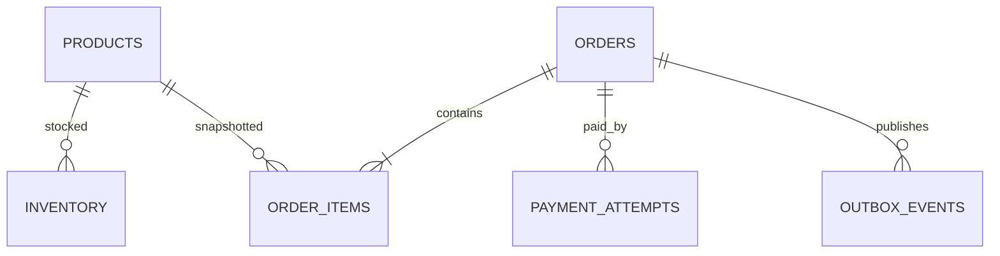

# 电商扩展：商品、库存、订单与支付回调

两个请求同时购买最后一件商品，双方都先读到 `available=1`，再各自写成 0，系统卖出两件。电商扩展把企业后台的租户、认证、审计、任务和观测继续用于商品、库存、订单与模拟支付，重点是数据库不变量与重复回调。

## 商品、库存、订单和支付保存不同事实

Product 保存可售描述和当前展示价，Inventory 保存仓库维度 available/reserved/version，Order 保存购买时的价格快照和状态，PaymentAttempt 保存渠道请求与回调。订单不能实时引用商品价，否则改价会改变历史金额。

所有资源带 tenant_id。订单行保存 product_id 与名称/单价快照；金额用 DECIMAL/最小货币单位和明确币种。支付模拟适配器仍使用外部支付 ID 与幂等键，不在教程中接真实扣款。



库存是可变资源，订单项是提交时快照。支付回调只改变允许的订单/支付状态，不直接相信客户端展示状态。

## 下单事务用条件更新守住库存

服务先规范化商品行并按稳定顺序锁/更新库存，避免批量订单锁顺序相反。条件 UPDATE 只有 available 足够时扣减并增加 reserved，影响 0 表示不足或冲突。

同一事务创建订单、订单项、库存预留、幂等记录和 Outbox。任何一项失败全部回滚；事务外不调用支付。

这条原子更新把“检查并扣减”放在数据库一次裁决中。多商品按 product_id 排序执行，并在任一失败时回滚整单。

```sql
UPDATE inventory
SET available = available - :quantity,
    reserved = reserved + :quantity,
    version = version + 1
WHERE tenant_id = :tenant_id
  AND warehouse_id = :warehouse_id
  AND product_id = :product_id
  AND available >= :quantity;
```

检查 affected_rows=1。不能先 SELECT 再无条件 UPDATE；两个事务会穿透检查。超时后用 Idempotency-Key 查询原订单，不重复创建。

## 支付回调按外部事件 ID 幂等处理

创建支付 attempt 后，模拟适配器返回 provider_payment_id。回调验证签名/时间戳，Inbox 对 provider_event_id 唯一；读取 PaymentAttempt 与订单当前状态，只有 pending 能转 succeeded/paid。

重复 success 回调返回已处理；success 与 failed 乱序时按状态机拒绝倒退；未知支付结果由查询任务对账。回调响应快，邮件/履约通过 Outbox 异步。

| 当前状态 + 事件 | 新状态 | 动作 |
| --- | --- | --- |
| pending + payment.succeeded | paid | 确认 reserved，写 Outbox |
| paid + 同 event 重放 | paid | 幂等返回 |
| paid + payment.failed | paid | 记录乱序，不倒退 |
| pending + 超时未知 | pending | 调度查询渠道 |
| cancelled + late success | manual_review/refund | 不能静默改 paid |

## 补偿、对账和测试覆盖未知结果

订单取消释放 reserved 使用条件状态转换和唯一补偿事件；支付已成功后的取消走退款状态机，不是简单 rollback。定时对账比较本地 PaymentAttempt 与模拟渠道记录，差异进入人工队列。

并发测试同时下单最后库存，断言只一单成功；支付测试重复/乱序/签名失败；Outbox Relay 崩溃后重放；k6 分开读列表和写下单，不使用真实支付。

## 订单一致性与并发验证

**为什么不能只用 Redis 扣库存？**

Redis 能高速原子扣减，但订单事务、持久恢复和数据库对账仍要设计，Redis/DB 双写会有一致性窗口。先用 MySQL 条件更新建立正确基线，规模需要时再引入库存预扣与对账。

**库存锁应该锁商品还是库存行？**

库存通常按仓库+商品行管理，锁最小事实范围。锁商品会让不同仓库互相阻塞；多行按稳定顺序处理减少死锁。

**订单金额为什么服务端重算？**

客户端价格可篡改或过期。服务端读取当前可售商品/优惠，生成订单项金额快照并校验总额；客户端金额只用于展示。

**支付回调返回 200 是否代表订单已 paid？**

回调 200 可表示事件已幂等接收，也可能进入人工状态。订单最终状态从数据库查询，不能用渠道 HTTP 响应替代。

**超时后前端应如何处理创建订单？**

复用同一 Idempotency-Key 查询/重试，服务端返回原 order_id。生成新 key 会被视为新意图，可能再占库存。

**怎样验证没有超卖？**

使用两个以上独立数据库连接并发执行，统计成功数量和最终 available/reserved/order 状态；单线程单测无法证明锁/条件更新。

## 机制复核：电商扩展：商品、库存、订单与支付回调
这篇文章讨论的机制需要放回一次完整请求中验证。先记录输入约束、状态变化、外部依赖和失败结果，再确认成功路径是否留下可追踪的事实。配置、缓存、队列或数据库只承担各自职责，不能用一层的日志推断另一层已经完成。

迁移到实际项目时，优先补一条正常用例、一条重复或并发用例和一条依赖不可用用例。每条用例写明观察指标、错误分类、回滚动作与数据清理范围，测试替身的通过不能代替真实协议和权限验证。

当性能、可靠性和安全目标冲突时，先明确服务对象和可接受损失，再选择超时、容量、重试和降级策略。没有测量依据的阈值只作为待验证假设，发布后用同一公式复验。
