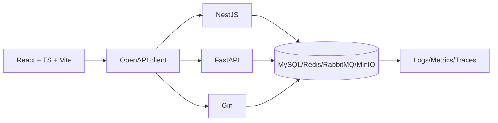

# 企业后台综合项目：租户、权限、文件、审计与任务

同一个 React 管理端把 API Origin 从 NestJS 切到 FastAPI 或 Gin 后，登录、分页、权限、文件和任务进度应保持相同。综合项目不是把文章里的工具全部启动，而是用一份 OpenAPI、一套 MySQL 不变量和同一测试集合约束三套实现。

## 先固定企业后台的资源与边界

核心资源包含租户、部门、用户、角色、权限、项目、文件、审计和任务。React 只通过 OpenAPI Client 调 API；三个后端不互相调用，也不各自拥有不同 Schema。MySQL 是业务事实，Redis 缓存/限流/进度，RabbitMQ 执行任务，MinIO 保存对象。

平台管理员与租户管理员分离。所有业务表带 tenant_id，跨租户详情统一 404；部门范围参与 SQL；角色变更失效权限缓存；文件和任务通过 ID 查询授权。



运行时一次只选择一个 API Origin。三套服务可以分别启动验证，但不能同时处理同一唯一 Scheduler/Queue 而不隔离消费者。

## 一条项目更新贯穿认证、事务、缓存和审计

React 内存 Access Token 调 PATCH，携带 If-Match；后端验证 Principal 和 project.update，SQL 同时限定 tenant/id/version。事务更新项目、审计与 Outbox，提交后失效 Redis；响应返回新 version。

影响行数为 0 时再在同租户判断 not_found 与 version_conflict，不能无条件覆盖。缓存删除失败由 Outbox 补偿，React 收到 409 后重新取数据并提示合并。

这是三套服务共同支持的请求/响应语义。ID 为示例，响应结构不依赖框架。

```http
PATCH /projects/018f... HTTP/1.1
Authorization: Bearer <short-lived-access-token>
If-Match: "3"
Content-Type: application/json

{"name":"Backend Handbook"}

HTTP/1.1 200 OK
ETag: "4"
Content-Type: application/json

{"id":"018f...","name":"Backend Handbook","version":4}
```

日志不得记录 Token。测试还发送 version=2 断言 409，使用其他租户 Token 断言 404，并检查数据库只有一次更新和一条审计。

## 文件任务形成可恢复的异步链

React 创建 file 得到预签名 URL，直传 MinIO 后 complete；API HEAD 校验并创建 task/Outbox，Worker 扫描解析，MySQL 保存终态，Redis/SSE 提供进度。刷新页面从 GET task 恢复，不依赖内存事件。

任务重复投递用 task_id/attempt，派生对象 key 版本化；取消为协作状态。SSE 断线不会取消任务，Last-Event-ID 只帮助恢复展示。

| 链路 | 成功证据 | 故障恢复 |
| --- | --- | --- |
| 登录/刷新 | 会话轮换已提交 | 重放撤销 family |
| 项目写入 | version 增加 + 审计 | 幂等/冲突重读 |
| 上传 | HEAD checksum + file=uploaded | pending 清理/complete 重试 |
| 任务 | attempt 条件终态 | 租约回收/重投 |
| 缓存 | 版本/失效事件 | 回源和 Outbox 重试 |
| SSE | 单调事件 + 可查终态 | 重连读取快照 |

## 交付用契约、Schema 与运行证据三重比较

CI 对 React 和三后端运行静态、单元与 build；共享 MySQL 迁移在空库/升级路径执行；Bruno 依次访问三服务；标准化 information_schema 比较表、列、索引和约束。

Compose 启动隔离依赖，Kubernetes overlay 提供候选；k6 只做小基线和指标采集。发布记录镜像 digest、迁移、配置、SLO 和回滚点，不声称本机数字代表生产容量。

## 综合后台必须回答的问题

### 为什么三套后端不各用最顺手的分页格式？

React 与外部消费者依赖公共协议。框架差异由适配层处理，业务语义保持一致；否则三套实现无法用同一客户端和测试。

### 共享 Schema 是否意味着三个 ORM 都能自动迁移？

不意味着。共享 SQL/基准迁移是事实，各 ORM Model 与它对齐。多套自动迁移会产生顺序和命名分叉。

### 如何证明跨租户没有泄露？

Fixture 创建两个租户和同类资源，用另一租户 Token 访问详情、列表关联、文件、任务与更新，断言统一 404、无副作用且审计记录拒绝。

### React 切换 API 时 Session Cookie 会冲突吗？

本地服务使用独立端口/Host 与 Cookie 配置，测试环境清理 Cookie Jar。正式一次只指向一个后端入口，共用规范的 Cookie 名、Path、SameSite 与刷新语义。

### 为什么审计要与业务更新同事务？

否则业务已变而审计缺失，或审计声称成功但业务回滚。数据库内审计同事务，外部日志/消息通过 Outbox 传播。

### 项目完成的判据是什么？

不是页面能打开，而是三服务通过同一契约/安全/迁移测试，React 完成登录 CRUD 上传任务，依赖故障可恢复，候选发布与回滚 Runbook 可执行。
