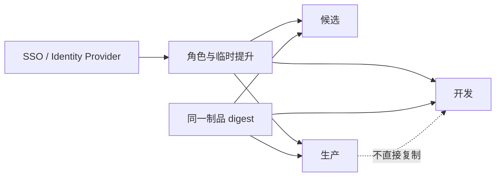

# 企业工具、环境配置与权限治理

企业工具治理是为代码托管、CI、运行平台、观测和工单系统明确 Owner、权限、变更与退出流程；环境治理则固定各环境的配置来源和晋级规则。它们处在团队协作与生产运行之间，用来减少无人负责、权限残留和配置漂移，采购工具只是起点。

团队购买了 Git、CI、Kubernetes、Grafana、Secret Manager 和工单系统，候选环境仍没人维护，告警无人接收，离职账号没有回收。企业工具的价值来自责任、权限、变更、备份和退出流程，不来自工具名本身。

## 按状态类型分配系统与 Owner

源码与评审在 Git 平台，制品在 Registry，配置与 Secret 分离，业务事实在 MySQL，对象在 MinIO/S3，缓存/队列是运行状态，日志指标 Trace 在观测平台。每类都有技术 owner 和业务 owner。

工具清单记录用途、环境、数据等级、管理员、普通角色、SSO/SCIM、备份、升级、告警、成本和退出方案。没有 owner 的工具出现故障时只能全员猜测。

| 系统 | 保存的事实 | 治理重点 |
| --- | --- | --- |
| Git/Review | 源码、评审、变更历史 | 保护分支、最小 Token |
| CI/Registry | 测试证据、不可变制品 | 签名、保留、发布权限 |
| MySQL/MinIO | 业务数据/对象 | 备份、恢复、加密、访问 |
| Redis/RabbitMQ/Kafka | 缓存、任务、事件流 | 容量、保留、重放 |
| Kubernetes | 期望运行状态 | RBAC、配额、升级、策略 |
| Loki/Prometheus/Tempo/Grafana | 观测信号 | 脱敏、基数、保留、告警 |

## 环境边界由身份、网络和数据共同形成

开发、集成、候选和生产使用独立身份与数据服务。生产写权限只授予发布与当班角色，日常开发账号默认不可访问；紧急权限短时提升、记录理由并自动到期。

候选尽量复制拓扑与配置语义，不复制未脱敏生产数据。网络策略、数据库账号、Bucket 前缀和加密密钥分别隔离，不能只靠变量 `ENV=prod` 防误操作。



身份生命周期与 HR/组织流程连接：入职授予最小角色，转岗复核，离职撤销账号、Token、SSH/数据库会话和所有权。

## 变更管理记录风险，不制造形式审批

普通低风险变更通过代码评审、自动门禁和渐进发布；数据库破坏性迁移、权限策略和高风险配置需要额外 owner 审查。紧急变更允许缩短流程，但仍要留 commit、制品、操作者、验证和回滚。

GitOps 或配置仓库让期望状态可审查，但 Secret 值不进入 Git。实际状态漂移由控制器/扫描检测；未经授权的手工修改要么回滚，要么补录为代码并审查。

下面是工具责任记录的字段，不要求所有组织使用同一表格，但每项必须有人能回答。

```text
系统：Production MySQL
技术 Owner：Platform Database
业务 Owner：Backend Domain
管理员获取：短时提升 + 工单
备份：每日基线 + binlog，季度恢复演练
监控：连接/锁/复制/备份新鲜度
升级：候选恢复与兼容测试后滚动
退出：标准 SQL 导出、对象/审计归档
Runbook：连接耗尽、误删、主库故障
```

不公开真实账号、主机和内部路径。责任矩阵存在组织内部受控文档，公开教程只说明管理字段。

## 成本、保留和退出方案防止工具反向绑架系统

日志/Trace 高基数、对象历史版本和镜像保留都持续产生成本。按数据价值设置采样、生命周期和审计保留，预算告警不能以删除关键恢复证据为代价。

选型时确认开放格式、导出 API、密钥所有权和迁移路径。每年至少复查未使用工具、孤儿管理员、过期 Token、无人告警和从未演练的备份。

## 治理规则的权限与退出机制

**小团队也需要这么多治理吗？**

不需要一次买齐工具，但必须知道源码、Secret、数据、制品和告警由谁负责。可从一页责任表、SSO、备份恢复和最小发布门禁开始，随风险增长。

**生产只读权限是否完全无风险？**

仍可能泄露个人数据、全表查询拖慢数据库或导出敏感信息。只读账号也要行列范围、查询审计、超时和临时授权。

**为什么必须有退出方案？**

供应商价格、合规、停服或能力变化时，没有导出格式和迁移测试会被锁定。退出方案明确数据怎么取、身份怎么迁、停机多久和历史审计怎么保留。

**谁可以修改告警阈值？**

服务 owner 提议并用 SLO/历史数据验证，观测平台维护规则能力，变更经代码评审。事故中临时静音有到期和理由，不能永久关闭噪声后忘记。
