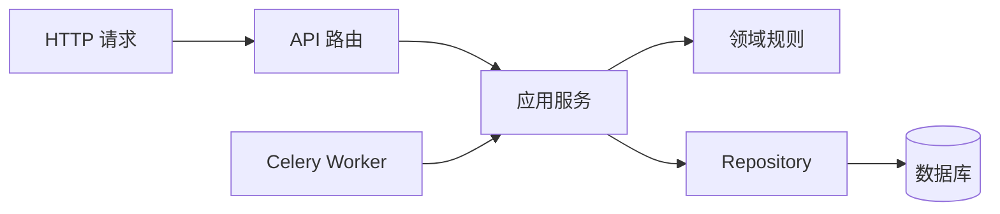

# FastAPI 分层架构

第一次写 FastAPI 接口时，很容易在路由函数里完成参数校验、SQL 查询、权限判断、外部调用和错误处理。功能少时很直观；当同一个用例还要被 Celery Worker 调用，或者数据库失败需要回滚时，这个路由就很难测试和复用。

本篇实现一个“提交文档处理任务”的最小接口。它接收来源 ID，返回 `202 + taskId`。我们逐步把 HTTP、业务流程和数据访问分开，并解释每一层解决的具体问题。

## 分层不是多建几个目录

分层的目标是让变化方向清楚：HTTP 协议变化不改业务规则，数据库替换不让路由重写，Worker 也能调用同一个用例。最小结构包含四层：

| 层 | 负责什么 | 不应该知道什么 |
| --- | --- | --- |
| API | 请求、响应、认证依赖、状态码 | SQL 和完整业务流程 |
| Application Service | 用例顺序、权限、事务、幂等 | FastAPI Request |
| Domain | 状态和不变量 | Pydantic 与 SQLAlchemy |
| Repository | 查询、锁、持久化映射 | HTTP 状态码 |



## 步骤一：让路由只适配 HTTP

请求模型负责字段类型、长度和格式。认证依赖从已验证凭证构造可信身份；不能让客户端在 JSON 中传 `tenantId` 后直接相信。路由把 Pydantic 模型转换成命令，调用服务，再将结果转换成公开响应。

下面是根据 FastAPI 依赖与响应模型行为重写的最小示例。输入是来源 ID 和幂等键，输出是任务 ID。代码故意没有 ORM 查询，因为 HTTP 层不负责决定事务如何完成。

```py
class SubmitBody(BaseModel):
    source_id: str = Field(min_length=1, max_length=128)


class AcceptedResponse(BaseModel):
    task_id: str
    state: Literal["queued"]


@router.post("/documents/process", status_code=202)
async def submit(
    body: SubmitBody,
    idempotency_key: Annotated[str, Header(alias="Idempotency-Key")],
    actor: Annotated[AuthContext, Depends(current_actor)],
    service: Annotated[SubmissionService, Depends(submission_service)],
) -> AcceptedResponse:
    result = await service.execute(
        SubmitCommand(body.source_id, idempotency_key, actor)
    )
    return AcceptedResponse(task_id=result.task_id, state="queued")
```

Pydantic 只判断“输入长什么样”。“来源是否属于当前租户”依赖数据库和身份，应由服务与 Repository 判断。响应模型也应与 ORM 分开，避免新增内部字段后意外暴露存储键、路径或策略信息。

## 步骤二：应用服务完成一个用例

应用服务按固定顺序执行：检查动作权限，查询幂等记录，在可见范围内锁定来源，创建任务，保存事件，然后提交。Repository 不自行 `commit`，否则一个用例里的多次写入无法作为整体回滚。

事务只包围数据库一致性操作。对象存储、OCR、模型调用等慢外部 I/O 不应放在长事务中。API 提交任务事实后返回 202，后台进程再处理耗时工作。客户端在提交后断开，不会撤销已经接受的任务。

依赖注入负责组装 Session、Repository 和 Service，领域对象本身不依赖 `Depends`。这样 Worker 和单测能直接创建 Service，不需要伪造 HTTP 请求。

## 步骤三：管理 AsyncSession 生命周期

每个请求或任务拥有独立 `AsyncSession`，不能在并发协程之间共享。Session 是工作单元，不是全局数据库客户端。事务边界由完整用例决定；请求退出且尚未提交时自动回滚。

`async def` 也不保证内部工作不会阻塞。只有异步数据库和 HTTP I/O 会主动让出事件循环。PDF 解析、OCR、压缩和大型 JSON 计算属于同步或 CPU 工作，应放入受限线程池、独立进程或任务 Worker，并设置时间与内存预算。

流式响应尤其不要长期持有请求事务。先用短查询完成授权并生成流票据，结束 Session，再从独立事件存储按游标发送。客户端断开只清理连接，不把后台任务改成失败。

## 步骤四：统一错误语义

领域和应用层抛出稳定错误，例如 `SourceNotFound`、`PermissionDenied`、`IdempotencyConflict`。API 的统一 Handler 将它们映射为 404、403、409 等协议结果。未知异常返回请求关联 ID 和通用消息，详细堆栈只保留在服务端日志。

| 失败位置 | 公共结果 | 数据结果 |
| --- | --- | --- |
| Pydantic 字段不合法 | 422 | 不开启业务写入 |
| 身份无动作权限 | 403 | 不查询越权正文 |
| 来源不在可见范围 | 404 | 不创建任务 |
| 幂等键复用且参数不同 | 409 | 保留原任务 |
| 插入事件失败 | 5xx | 整个事务回滚 |
| 外部解析失败 | 任务进入失败状态 | API 已接受事实不消失 |

取消请求时应让 Python 的取消语义传播，完成必要资源清理后继续抛出，而不是用宽泛异常吞掉。日志记录 requestId、错误码和主体摘要，不记录 Token、上传正文和完整模型输入。

## 怎样验证分层确实有用

领域测试验证状态不变量，不启动 FastAPI；服务测试验证权限、幂等和调用顺序；Repository 集成测试连接隔离数据库，验证 SQL、锁和回滚；API 测试只关注请求契约、状态码和响应 DTO。各层测试证明的风险不同，不能互相替代。

运行态还要验证多进程：每个 Worker 的连接池总量、Lifespan 资源初始化、readiness、终止信号和请求排空。定时器与恢复扫描器不应在每个 Web Worker 的 startup 中各启动一份。

## 当前限制与下一步

小接口不需要为了形式创建十层抽象。只有当一个边界能隔离协议、业务或数据变化时才值得存在。本篇的任务只保存了来源引用，下一篇会处理来源文件，逐步加入解析、条件 OCR、结构切片和候选发布。

## 参考资料

- [FastAPI Dependencies](https://fastapi.tiangolo.com/tutorial/dependencies/)
- [FastAPI Bigger Applications](https://fastapi.tiangolo.com/tutorial/bigger-applications/)
- [SQLAlchemy AsyncIO](https://docs.sqlalchemy.org/en/20/orm/extensions/asyncio.html)
- [Pydantic Models](https://docs.pydantic.dev/latest/concepts/models/)
