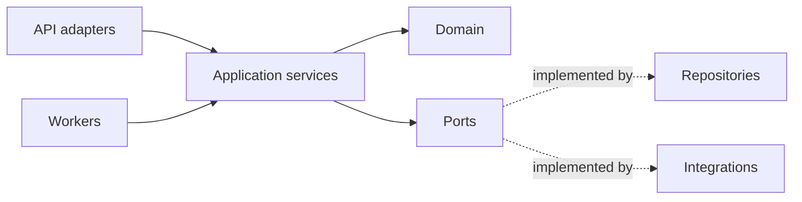

# FastAPI 分层架构

FastAPI 让类型声明、参数校验、依赖注入和 OpenAPI 很容易，但也容易形成“一个路由函数完成所有工作”：解析请求、查询数据库、调用模型、提交事务、流式输出并捕获全部异常。功能少时它很直接，系统增长后却难以复用规则、控制资源生命周期和定位失败边界。

分层不是为了套模板，而是把不同变化速度的东西分开：HTTP 协议会变，业务状态机有自己的约束，数据库和外部模型各自失败，异步任务又不经过 HTTP。目标是让同一个应用用例能被 API、Worker 和测试调用，同时仍然只有一处决定权限、事务和状态转换。

## 从一个完整用例反推边界

以“提交文档处理任务”为例，入口需要完成：

1. 验证请求 Schema、认证主体和租户范围；
2. 根据幂等键创建或复用任务；
3. 固定源版本，写任务与 Outbox；
4. 提交后返回 `202 + taskId`；
5. Worker 读取固定版本，解析并生成不可变候选；
6. 质量门禁通过后原子激活，失败则保留可诊断终态；
7. SSE 只展示持久事件，不持有原请求事务。

这些步骤跨 HTTP、数据库、Broker 和后台进程。把它们全写在路由中，队列入口必然复制或绕过规则。

## 六类代码边界



| 层 | 负责 | 不负责 |
| --- | --- | --- |
| `api` | HTTP、认证依赖、请求响应、错误映射 | 事务、ORM 查询、模型编排 |
| `services` | 用例、权限、事务边界、幂等和状态机协作 | FastAPI Request/Response |
| `domain` | 实体、值对象、不变量、领域错误 | Pydantic Web DTO、SQLAlchemy |
| `repositories` | 持久化查询、锁、映射 | HTTP、外部 API、业务流程 |
| `integrations` | 模型、对象存储、消息和第三方协议 | 重新解释业务状态 |
| `workers` | 消息协议、进程生命周期、调用应用服务 | 复制应用规则 |

Pydantic 请求模型、领域对象、SQLAlchemy Row 分开演进。它们可以共享少量值对象，但不能把 ORM Model 直接作为公开响应：新增内部字段可能意外进入 API，懒加载也可能在序列化阶段触发未知 I/O。

```text
server/app/
  api/
    routes/documents.py
    dependencies.py
    errors.py
  services/
    document_submission.py
  domain/
    tasks.py
    documents.py
  repositories/
    tasks.py
  integrations/
    storage.py
    model_gateway.py
  ingestion/
    parsers/
  worker.py
```

## API 适配器保持薄而明确

路由把 HTTP 输入转成应用命令，调用服务，再转成响应。认证依赖构造可信 `AuthContext`；不能让客户端 JSON 自己传 tenantId/userId 后被业务相信。

```py
class SubmitDocumentBody(BaseModel):
    source_id: str = Field(min_length=1, max_length=128)
    source_version: str = Field(min_length=1, max_length=128)
    options: ProcessingOptions = Field(default_factory=ProcessingOptions)


class AcceptedTaskResponse(BaseModel):
    task_id: str
    state: Literal["queued"]
    status_url: str


@router.post("/documents/process", status_code=status.HTTP_202_ACCEPTED)
async def submit_document(
    body: SubmitDocumentBody,
    idempotency_key: Annotated[str, Header(alias="Idempotency-Key")],
    auth: Annotated[AuthContext, Depends(current_auth_context)],
    service: Annotated[DocumentSubmissionService, Depends(document_submission_service)],
) -> AcceptedTaskResponse:
    command = SubmitDocument(
        source_id=body.source_id,
        source_version=body.source_version,
        options=body.options.to_domain(),
        idempotency_key=idempotency_key,
        actor=auth,
    )
    result = await service.execute(command)
    return AcceptedTaskResponse(
        task_id=result.task_id,
        state="queued",
        status_url=f"/tasks/{result.task_id}",
    )
```

`Depends` 是 API 组合工具，不应出现在领域类中。否则领域服务只能由 FastAPI 创建，Worker 和单测被迫模拟请求依赖。

## Pydantic 校验与业务不变量分工

Pydantic 负责结构、格式和有限的字段关系，例如字符串长度、枚举与互斥参数。业务不变量依赖当前数据库状态、权限或时间，应由应用/领域层判断。把“记录必须属于当前租户”写成 Pydantic validator，既拿不到可信上下文，又会混淆 422 与 403/404。

输入校验后仍不能直接把 `model_dump()` 传给 ORM update。显式白名单映射能防止 mass assignment：

```py
updates = DocumentPatch(
    title=body.title,
    labels=tuple(body.labels),
)
await service.patch(document_id, updates, actor=auth)
```

响应模型按公共契约创建，不返回内部路径、错误堆栈、存储键和策略字段。OpenAPI 是接口契约的一部分，CI 中固定 Schema 或做兼容差异检查。

## Session 生命周期和事务

每个请求/任务创建独立 AsyncSession，不能跨并发协程共享。应用服务决定事务：任务记录、幂等记录和 Outbox 同时提交；外部对象存储或模型调用放在事务外。

```py
async def get_session() -> AsyncIterator[AsyncSession]:
    async with session_factory() as session:
        yield session


async def document_submission_service(
    session: Annotated[AsyncSession, Depends(get_session)],
) -> DocumentSubmissionService:
    return DocumentSubmissionService(session)
```

```py
class DocumentSubmissionService:
    def __init__(self, session: AsyncSession) -> None:
        self.session = session
        self.tasks = TaskRepository(session)
        self.outbox = OutboxRepository(session)

    async def execute(self, command: SubmitDocument) -> AcceptedTask:
        command.actor.require("document:process")
        key = command.canonical_idempotency_key()

        async with self.session.begin():
            replay = await self.tasks.find_by_idempotency(
                tenant_id=command.actor.tenant_id,
                key=key,
            )
            if replay:
                return AcceptedTask.from_record(replay)

            source = await self.tasks.lock_visible_source(
                tenant_id=command.actor.tenant_id,
                source_id=command.source_id,
                expected_version=command.source_version,
                allowed_scopes=command.actor.scope_ids,
            )
            if source is None:
                raise SourceNotFound()

            task = ProcessingTask.create(command, source)
            await self.tasks.add(task)
            await self.outbox.append(task.pull_events())
            return AcceptedTask.from_domain(task)
```

Repository 不自行 commit。请求取消时，上下文退出会回滚未提交事务。提交完成后客户端断开不应回滚已经接受的业务任务；API 的网络状态与数据库事实分开。

## 异步并不等于非阻塞

`async def` 只有在内部 I/O 库也异步且主动让出事件循环时才有益。PDF 解析、OCR、压缩、图像处理和大型 JSON 计算是 CPU/同步工作，直接放进异步路由会阻塞同进程所有请求。

处理选择：

- 毫秒级、受控同步函数可用 Starlette thread pool，但限制并发；
- CPU 密集或不可信文件解析放任务 Worker/独立进程，设置内存和时间上限；
- 长流程返回 202，通过状态 API/SSE 查询，不让 HTTP 请求持续数分钟；
- 外部 async 调用设置连接、读取和总 deadline，并限制并发。

```py
async with asyncio.timeout(request_budget.remaining_seconds()):
    async with model_limit:
        response = await model_client.generate(payload)
```

无限 `asyncio.gather` 会压满连接池和远端配额。并发数量按数据库、HTTP pool、模型 RPM/TPM 和内存中最紧资源设置。

## 流式响应不持有业务事务

流式输出常见反模式：路由打开 Session、查询任务、进入 `StreamingResponse` 生成器，直到客户端关闭才释放请求依赖。慢客户端会长期占用连接和事务。

正确做法是短查询验证身份与 stream 归属，结束数据库事务，然后生成器从独立事件存储按游标读取。每次重连重新授权。

```py
@router.get("/tasks/{task_id}/events")
async def task_events(
    task_id: str,
    after: int = 0,
    auth: AuthContext = Depends(current_auth_context),
    access: StreamAccessService = Depends(stream_access_service),
) -> StreamingResponse:
    ticket = await access.authorize(task_id=task_id, after=after, actor=auth)

    async def stream() -> AsyncIterator[str]:
        async for event in event_store.read(ticket, after=after):
            yield encode_sse(event)

    return StreamingResponse(stream(), media_type="text/event-stream")
```

事件先持久化再推送，连接关闭不是任务终态。生成器捕获取消只做资源清理，不把业务任务标记失败。

## 外部集成通过端口隔离

第三方 SDK 错误、重试策略和返回模型不应进入应用核心。定义最小端口，并在适配器中实现 timeout、幂等、日志脱敏和错误转换：

```py
class ObjectStore(Protocol):
    async def put_if_absent(
        self,
        *,
        key: str,
        content: AsyncIterator[bytes],
        digest: str,
        deadline: datetime,
    ) -> StoredObject: ...
```

应用层只认识 `RemoteUnavailable`、`IntegrityMismatch` 等稳定错误。适配器记录厂商 request ID 供诊断，但响应不把内部 endpoint、Bucket 或签名 URL 原样公开。

启动时通过 Lifespan 创建共享、线程/事件循环安全的 HTTP Client 和连接池，关闭时释放：

```py
@asynccontextmanager
async def lifespan(app: FastAPI) -> AsyncIterator[None]:
    app.state.http = httpx.AsyncClient(
        timeout=httpx.Timeout(connect=3, read=20, write=20, pool=2),
        limits=httpx.Limits(max_connections=100, max_keepalive_connections=20),
    )
    try:
        yield
    finally:
        await app.state.http.aclose()
        await close_database()
```

不要在模块导入时启动 Scheduler、创建 loop-bound Client 或发网络请求。多进程部署会重复执行导入与启动。

## 认证、授权与数据范围

认证依赖验证签名、issuer、audience、过期和会话状态，构造 `AuthContext`。应用服务检查 action；Repository 的查询接口要求 tenant 和 scope 条件。三者不能只做其一。

```py
@dataclass(frozen=True)
class AuthContext:
    subject_id: str
    tenant_id: str
    permissions: frozenset[str]
    scope_ids: tuple[str, ...]
    policy_version: str

    def require(self, permission: str) -> None:
        if permission not in self.permissions:
            raise PermissionDenied(permission)
```

列表、搜索、下载和 Worker 重放都使用相同范围端口。后台任务不能因为“来自可信队列”就跳过范围；消息可能过期，执行期间权限也可能撤销。对安全撤权，当前权限优先于历史复现便利。

## 错误映射、取消与日志

领域/应用错误在统一 Handler 映射为稳定协议。未知异常返回关联 ID 和通用消息，服务端保留 cause。验证错误白名单输出字段路径，不回显完整敏感输入。

```py
@app.exception_handler(ApplicationError)
async def application_error_handler(
    request: Request,
    error: ApplicationError,
) -> JSONResponse:
    mapped = error_catalog.map(error)
    request.state.logger.bind(error_code=mapped.code).log(
        mapped.log_level,
        "request rejected",
    )
    return JSONResponse(
        status_code=mapped.status,
        content={
            "code": mapped.code,
            "message": mapped.public_message,
            "requestId": request.state.request_id,
        },
    )
```

不要使用 `except BaseException`；在 Python 版本与库行为允许时，确保 `CancelledError` 能传播，清理后重新抛出。未知错误不能统一转换为 200。日志用 middleware 建立 requestId/traceId，认证后加入主体摘要，不记录 Cookie、Token、上传正文和模型完整输入。

## 健康检查与多进程角色

liveness 只判断进程是否卡死；readiness 判断能否接新流量。非关键下游波动不应触发所有实例重启。启动预热需要上限，readiness 通过前不接流量。

Uvicorn/Gunicorn 多 Worker 会复制内存、连接池和启动任务。数据库最大连接数按进程总数计算；Scheduler、Celery Beat 和恢复扫描器作为独立角色部署并有单例/租约保护，不能在每个 Web Worker 的 startup 启动。

收到终止信号后先变为 not-ready、停止接收新请求，给在途请求有限排空时间，再关闭事件流、HTTP client、数据库和遥测。长任务不运行在 Web 进程，避免发布直接杀死业务工作。

## 测试按边界证明不同风险

| 测试 | 证明 | 不应替代 |
| --- | --- | --- |
| 领域单元 | 状态转换和不变量 | SQL 事务 |
| 服务单元 | 权限、幂等、协作顺序 | 真实约束和锁 |
| Repository 集成 | SQL、租户过滤、并发、回滚 | HTTP 契约 |
| API 契约 | 422/401/409/错误体/OpenAPI | Worker 故障恢复 |
| 运行态 | Lifespan、排空、SSE、Broker | 全部细粒度分支 |

```py
async def test_submit_is_idempotent_and_transactional(client, database) -> None:
    headers = {"Idempotency-Key": "request-1", **auth_headers("tenant-a")}
    first = await client.post("/documents/process", json=valid_body(), headers=headers)
    replay = await client.post("/documents/process", json=valid_body(), headers=headers)

    assert first.status_code == 202
    assert replay.json()["task_id"] == first.json()["task_id"]
    assert await database.task_count("tenant-a", "request-1") == 1
    assert await database.outbox_count(first.json()["task_id"]) == 1
```

验证矩阵还包括：不同租户相同 public ID、并发重复提交、Outbox 插入失败回滚、客户端在提交前/后断开、模型 timeout、流式慢客户端、进程 SIGTERM 排空、OpenAPI 破坏性变更。数据库用隔离实例/Schema，不能误连生产。

## 性能与可观测性

Trace 分解路由、连接池等待、SQL、外部 HTTP、队列发布，不把所有延迟归因于 FastAPI。指标包含请求分位数、状态码、事件循环延迟、连接池 checkout、事务时长、外部依赖、在途请求与拒绝数。

Pydantic 序列化、依赖层级和 middleware 都有成本，但应通过 Profile 决定优化。比起删除类型校验，更常见瓶颈是 N+1 SQL、长事务、无限并发或同步工作阻塞事件循环。

## 架构审查清单

- 路由是否只做协议映射，应用规则能否被 Worker 直接复用？
- 请求 DTO、领域对象和 ORM 是否独立，敏感字段会不会意外响应？
- 每个并发协程是否有独立 Session，事务由完整用例决定？
- 模型/存储调用是否在数据库长事务之外并带 deadline？
- CPU/同步解析是否离开 Web 事件循环并受资源限制？
- 流式响应是否已经结束请求事务，事件是否可重放？
- 租户与权限范围是否下推到所有 Repository 查询？
- 未知异常、取消和客户端断开是否有正确语义？
- 多进程连接池、Scheduler 和关闭流程是否经过运行态验证？
- 测试是否分别证明业务、SQL、协议和进程生命周期？

## 源码与规范

- [FastAPI Dependencies](https://fastapi.tiangolo.com/tutorial/dependencies/)：请求依赖、组合与可替换边界。
- [FastAPI Bigger Applications](https://fastapi.tiangolo.com/tutorial/bigger-applications/)：Router 与模块组织的官方方式。
- [SQLAlchemy AsyncIO](https://docs.sqlalchemy.org/en/20/orm/extensions/asyncio.html)：AsyncSession 生命周期、并发限制与事务语义。
- [Pydantic Models](https://docs.pydantic.dev/latest/concepts/models/)：输入模型、严格校验和序列化边界。
- [OWASP API Security Top 10](https://owasp.org/API-Security/)：对象级授权、资源消耗和输入边界。
