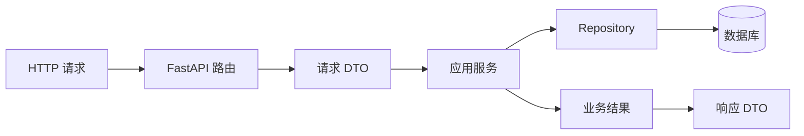

# FastAPI 分层架构：从请求到事务

很多 FastAPI 项目一开始只有一个路由函数：读取请求、查询数据库、判断权限、写入任务，然后返回 JSON。它能很快跑起来，但当同一任务还要从 Celery Worker 或管理脚本发起时，HTTP 细节和业务规则就会被复制到多个地方。

本篇不从“目录应该怎么分”开始，而是跟踪一个具体用例：用户提交一份文档处理任务。读完后，你应当知道一次请求经过哪些对象，哪一层负责什么，数据库什么时候提交，以及为什么错误不能直接把 SQLAlchemy 异常原样返回给客户端。

## 先准备四个词

- **路由（route）**：HTTP 方法和 URL 到 Python 函数的映射，例如 `POST /tasks`。
- **DTO**：数据传输对象，描述接口收到和返回的数据形状。它不是数据库表。
- **应用服务**：完成一个业务用例的协调者，例如“创建任务”。它不应该知道 HTTP 状态码。
- **Repository**：数据访问的抽象。应用服务请求“按 ID 查询”和“保存”，Repository 决定如何写 SQL。

把一次请求画出来：



这不是为了增加类的数量。每个边界都对应一种变化：路由会随 HTTP 协议变化，应用服务会随业务规则变化，Repository 会随数据库或查询方式变化。

## 本篇要完成的结果

我们假设系统已经有一个来源记录，用户要提交它进行异步处理：

| 输入 | 预期结果 | 数据变化 |
| --- | --- | --- |
| 用户有权限，来源存在 | `202 Accepted` | 创建一条 `queued` 任务 |
| 来源不存在 | `404` | 不创建任务 |
| 用户无权访问来源 | `403` | 不泄露来源正文 |
| 同一幂等键重复提交 | 返回第一次任务 | 不创建第二条 |
| 数据库写入失败 | `5xx` | 当前事务回滚 |

`202` 表示“请求已被接受，工作稍后完成”，不是“文档处理已经成功”。这一区分会影响前端轮询、任务状态和失败重试。

## 第一步：先定义请求和响应

路由收到的是不可信的 JSON。Pydantic 模型先验证字段形状，不能替代权限检查：`source_id` 格式正确，不代表这个用户可以读取它。

```python
from typing import Literal
from pydantic import BaseModel, Field


class CreateTaskBody(BaseModel):
    source_id: str = Field(min_length=1, max_length=128)


class AcceptedTask(BaseModel):
    task_id: str
    state: Literal["queued"]
```

`Field` 处理长度约束，`Literal` 让响应只能返回当前约定的状态。输入 DTO 只描述接口契约，不能把数据库 ORM 对象直接当响应返回，否则以后新增内部字段时可能意外暴露存储路径、租户标识或调度信息。

## 第二步：路由只做 HTTP 适配

路由需要从请求中提取 Body、Header 和认证上下文，然后把它们组合成一个应用命令。下面省略认证实现，只保留边界：

```python
@router.post("/tasks", status_code=202)
async def create_task(
    body: CreateTaskBody,
    idempotency_key: Annotated[str, Header(alias="Idempotency-Key")],
    actor: Annotated[Actor, Depends(current_actor)],
    service: Annotated[CreateTask, Depends(create_task_service)],
) -> AcceptedTask:
    result = await service.execute(
        CreateTaskCommand(
            source_id=body.source_id,
            actor_id=actor.id,
            tenant_id=actor.tenant_id,
            idempotency_key=idempotency_key,
        )
    )
    return AcceptedTask(task_id=result.task_id, state="queued")
```

从上到下读这段函数：FastAPI 先验证 Body；`Header` 读取幂等键；`Depends` 组装当前用户和应用服务；路由把 HTTP 输入转换成命令；最后把业务结果转换成公共 DTO。这里没有 SQL、`commit()` 或 `HTTPException`，所以 Worker 可以直接调用 `service.execute()`，不用伪造一个 HTTP 请求。

## 第三步：应用服务完成一个用例

应用服务拥有一次“创建任务”的完整顺序：检查输入范围、查询来源、判断权限、处理幂等、写入任务。它返回可判断的业务结果，而不是在内部决定 404 或 403。

```python
class CreateTask:
    def __init__(self, sources: SourceRepository, tasks: TaskRepository):
        self.sources = sources
        self.tasks = tasks

    async def execute(self, command: CreateTaskCommand) -> CreateTaskResult:
        previous = await self.tasks.by_key(command.tenant_id, command.idempotency_key)
        if previous:
            if previous.source_id != command.source_id:
                return CreateTaskResult.conflict()
            return CreateTaskResult.queued(previous.id)

        source = await self.sources.visible_to(command.source_id, command.tenant_id)
        if source is None:
            return CreateTaskResult.missing()

        task = await self.tasks.insert_queued(command, source)
        return CreateTaskResult.queued(task.id)
```

幂等查询放在创建之前：网络超时后客户端重试，第二次请求可以复用第一条任务。若同一个键带了不同的 `source_id`，返回冲突比悄悄复用更安全。`visible_to` 把租户范围放进查询条件；只先查出对象、再在 Python 里过滤，容易在缓存或其他入口漏掉隔离条件。

真实应用还需要让“检查幂等记录”和“插入任务”在并发下安全。通常会用数据库唯一约束兜底，并把 Repository 的写入放在同一个事务里；上面的片段只用于解释用例顺序。

## 第四步：管理 AsyncSession 和事务

`AsyncSession` 是一次数据库工作单元，不是全局连接。请求或 Worker 开始时创建，事务完成后释放。Repository 不应各自 `commit()`，否则一个用例的多次写入无法整体回滚。

```python
async def session_scope() -> AsyncIterator[AsyncSession]:
    async with session_factory() as session:
        async with session.begin():
            yield session


async def create_task_service(
    session: Annotated[AsyncSession, Depends(session_scope)],
) -> CreateTask:
    return CreateTask(SourceRepository(session), TaskRepository(session))
```

`session_factory()` 创建独立 Session；`session.begin()` 建立事务上下文；函数正常退出时提交，抛出异常时回滚。事务只覆盖数据库一致性操作，PDF 解析、OCR、模型调用和对象存储上传不应长时间占住数据库事务。提交任务事实后，再由 Worker 处理慢工作。

## 第五步：把领域错误映射成 HTTP 结果

应用服务返回 `missing`、`forbidden`、`conflict` 等稳定结果，路由或统一异常处理器再决定 HTTP 协议表现：

| 应用结果 | HTTP | 客户端含义 |
| --- | --- | --- |
| `missing` | 404 | 当前范围内没有这个来源 |
| `forbidden` | 403 | 身份存在，但没有动作权限 |
| `conflict` | 409 | 幂等键参数冲突或状态不允许 |
| `queued` | 202 | 任务已接受，等待后台处理 |
| 未知数据库异常 | 500 | 服务端错误，返回 request id |

不要把 SQLAlchemy 的完整错误、堆栈或连接信息直接返回。客户端需要稳定错误码，排查信息放在带 `request_id` 的服务端日志中。认证失败、来源不存在和无权限是否需要隐藏资源存在性，要根据系统威胁模型明确选择，而不是让异常类型偶然决定。

## 怎样验证这条链

单元测试用内存 Repository 验证应用服务的分支；集成测试连接隔离数据库验证唯一约束、事务和查询范围；API 测试验证请求模型和状态码。三类测试证明的是不同风险。

```text
POST /tasks
Idempotency-Key: request-001
{"source_id":"source-001"}

HTTP/1.1 202 Accepted
{"task_id":"task-001","state":"queued"}
```

重复发送完全相同的请求，应返回同一个 `task_id`。把 `source_id` 改成另一个值，应得到 `409`，并确认数据库仍只有第一条任务。让 `insert_queued` 抛出异常，再查询任务表，应该看不到半条记录。

## 初学者练习

1. 把 `source_id` 的最大长度改小，观察 FastAPI 返回的 422 结构。
2. 给 Repository 增加一次保存计数，验证无权限和重复请求不会重复写入。
3. 写一个最小 Worker，直接调用 `CreateTask.execute()`，确认它不需要导入 FastAPI 的 `Request` 或 `Depends`。
4. 在数据库唯一约束冲突时记录 request id，并区分“重复同参数”和“同键不同参数”。

## 当前边界与下一步

本篇只完成“创建任务事实”的请求链，没有展开认证 Token 生命周期、队列投递、任务租约和事件流。它们会改变可靠性和恢复语义，应在明确的下一篇中分别处理。分层也不是目录越多越好：如果一个小工具永远只有单一入口和单一存储，额外抽象可能增加阅读成本。

## 参考资料

- [FastAPI Dependencies](https://fastapi.tiangolo.com/tutorial/dependencies/)
- [FastAPI Bigger Applications](https://fastapi.tiangolo.com/tutorial/bigger-applications/)
- [Pydantic Models](https://docs.pydantic.dev/latest/concepts/models/)
- [SQLAlchemy AsyncIO](https://docs.sqlalchemy.org/en/20/orm/extensions/asyncio.html)
