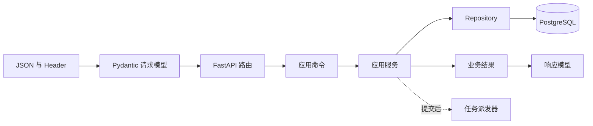
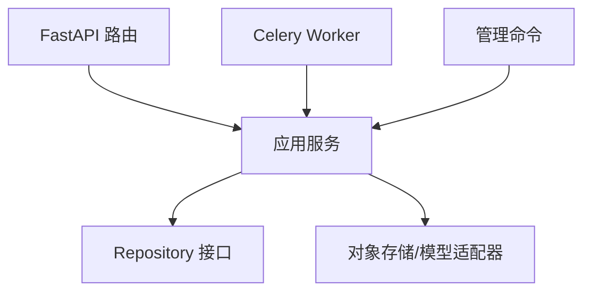

# FastAPI 分层架构：从请求、事务到后台任务

我们要实现一个 `POST /processing-jobs` 接口。用户提交一份已经上传的文档，服务创建一条异步处理任务并返回 `202 Accepted`；Worker 稍后读取任务，完成解析、切片和索引。

如果把参数校验、权限、SQL、队列派发和 HTTP 错误都写在路由里，这个接口短期能运行，等管理脚本也要创建任务、Worker 需要更新状态时，业务规则就会被复制。分层不是为了多建几个文件，而是让一条用例可以脱离 HTTP 被复用，并让数据库事务拥有明确边界。

本篇会把这条请求完整走一遍。读完后，你应该能画出每一层的输入与输出，知道 `AsyncSession` 在哪里创建和提交，并能为“正常创建、重复请求、无权限、数据库失败、派发失败”设计测试。

## 先看接口最终行为

客户端发送：

```http
POST /processing-jobs HTTP/1.1
Authorization: Bearer <access-token>
Idempotency-Key: demo-request-001
Content-Type: application/json

{"documentId":"doc-demo"}
```

请求被接受后返回：

```http
HTTP/1.1 202 Accepted
Content-Type: application/json

{"jobId":"job-demo","state":"queued"}
```

`202` 只表示服务已经接受任务，不表示文档处理成功。客户端之后需要查询状态或订阅事件。接口还要满足以下约束：

| 场景 | HTTP 结果 | 数据库结果 |
| --- | --- | --- |
| 文档存在且用户可访问 | `202` | 新建 `queued` 任务 |
| 同一用户重复同一个幂等键 | `202`，返回首次任务 | 不新增第二条 |
| 文档不存在 | `404` | 不创建任务 |
| 文档存在但不可访问 | `403` 或统一不可见语义 | 不泄露文档内容 |
| 数据库写入失败 | `5xx` | 当前事务回滚 |
| 提交后队列派发失败 | 明确失败或可恢复状态 | 避免永久停在假 `queued` |

先把行为写清楚，后面才知道每一层为什么存在。

## 一条请求经过哪些对象



第一次阅读时先记住四个词：

- **请求/响应模型**：描述 HTTP 数据形状，由 Pydantic 校验。
- **应用命令**：把完成用例需要的数据放在一个与 HTTP 无关的对象里。
- **应用服务**：协调“创建处理任务”这一个用例的执行顺序。
- **Repository**：封装面向业务意图的数据访问，例如“查找可见文档”“保存任务”。

ORM Model 描述数据库映射，DTO 描述协议，领域对象表达业务状态。它们有时字段相似，职责并不相同。直接把 ORM 对象作为响应，容易把租户、内部路径或调度字段意外暴露出去。

## 目录应该跟职责一起出现

先准备最小目录，不需要开局建十几层：

```text
app/
├── api/
│   ├── dependencies.py
│   └── processing_jobs.py
├── application/
│   └── create_processing_job.py
├── domain/
│   └── processing_job.py
├── repositories/
│   └── processing_jobs.py
├── infrastructure/
│   └── dispatcher.py
├── db.py
└── main.py
```

`api` 只认识 HTTP 与认证上下文；`application` 完成用例；`domain` 保存状态和可判断错误；`repositories` 负责持久化；`infrastructure` 适配消息队列等外部系统。小项目可以合并目录，但依赖方向仍要清楚。

## 第一步：让 Pydantic 只负责协议形状

请求体与响应体先写成两个模型：

```python
from typing import Literal

from pydantic import BaseModel, Field


class CreateProcessingJobBody(BaseModel):
    document_id: str = Field(alias="documentId", min_length=1, max_length=128)


class AcceptedProcessingJob(BaseModel):
    job_id: str = Field(alias="jobId")
    state: Literal["queued"]

    model_config = {"populate_by_name": True}
```

`CreateProcessingJobBody` 的输入是不可信 JSON。`Field` 负责字段别名和长度，避免空值或异常大的标识进入用例。它不检查文档是否存在，也不判断用户权限，因为这些需要数据库和当前身份。

`AcceptedProcessingJob` 限定成功响应状态只能是 `queued`。`populate_by_name` 允许 Python 内部使用 snake_case，输出仍保持公开协议的 camelCase。这里没有返回 ORM 对象。

### 校验失败发生在哪里

如果 `documentId` 缺失，FastAPI 在调用路由前返回验证错误。它属于协议错误，不需要应用服务参与。若字段格式正确但文档不存在，那是用例执行后的业务结果，两者不要混成同一个异常。

## 第二步：把 HTTP 数据转换成应用命令

应用层不应依赖 `Request`、`Header` 或 `HTTPException`。我们定义一个普通数据类：

```python
from dataclasses import dataclass


@dataclass(frozen=True, slots=True)
class CreateProcessingJobCommand:
    document_id: str
    actor_id: str
    tenant_id: str
    idempotency_key: str
```

这个命令表达完成用例所需的最小输入。`actor_id` 与 `tenant_id` 来自已经验证的认证上下文，不接受客户端在 JSON 中自报的身份。`frozen=True` 避免执行过程中被意外修改。

路由的工作是组装命令和翻译结果：

```python
@router.post("/processing-jobs", status_code=202)
async def create_processing_job(
    body: CreateProcessingJobBody,
    idempotency_key: Annotated[str, Header(alias="Idempotency-Key")],
    actor: Annotated[Actor, Depends(current_actor)],
    service: Annotated[CreateProcessingJob, Depends(job_service)],
) -> AcceptedProcessingJob:
    result = await service.execute(
        CreateProcessingJobCommand(
            document_id=body.document_id,
            actor_id=actor.id,
            tenant_id=actor.tenant_id,
            idempotency_key=idempotency_key,
        )
    )
    return AcceptedProcessingJob(job_id=result.job_id, state="queued")
```

FastAPI 先解析 Body 和 Header，再通过 `Depends` 提供认证用户与应用服务。路由没有 SQL，也不知道队列名称。输入是 HTTP 对象，输出是响应模型；中间只做协议到应用命令的转换。

这段代码还没处理业务异常。稍后会在统一错误映射中完成，避免每个路由复制 `try/except`。

## 第三步：应用服务拥有执行顺序

先定义几个明确的领域结果和错误：

```python
class DocumentNotFound(Exception):
    pass


class DocumentForbidden(Exception):
    pass


@dataclass(frozen=True, slots=True)
class CreatedJob:
    job_id: str
    replayed: bool
```

应用服务不返回 HTTP 状态码。`DocumentNotFound` 表达业务对象不存在，`DocumentForbidden` 表达访问被拒绝；API、CLI 和 Worker 可以用不同方式呈现同一个错误。

用例执行顺序如下：

```python
class CreateProcessingJob:
    def __init__(self, unit_of_work: UnitOfWork, dispatcher: JobDispatcher) -> None:
        self.uow = unit_of_work
        self.dispatcher = dispatcher

    async def execute(self, command: CreateProcessingJobCommand) -> CreatedJob:
        async with self.uow:
            existing = await self.uow.jobs.find_by_idempotency(
                tenant_id=command.tenant_id,
                actor_id=command.actor_id,
                key=command.idempotency_key,
            )
            if existing:
                return CreatedJob(job_id=existing.id, replayed=True)

            document = await self.uow.documents.find_visible(
                document_id=command.document_id,
                tenant_id=command.tenant_id,
                actor_id=command.actor_id,
            )
            if document is None:
                raise DocumentNotFound(command.document_id)

            job = ProcessingJob.queue(
                document_id=document.id,
                actor_id=command.actor_id,
                idempotency_key=command.idempotency_key,
            )
            await self.uow.jobs.add(job)
            await self.uow.commit()

        await self.dispatcher.enqueue(job.id)
        return CreatedJob(job_id=job.id, replayed=False)
```

按照调用顺序拆解：

1. `async with self.uow` 创建本次用例的事务范围。
2. 幂等查询使用租户、用户和幂等键共同限定作用域；不同用户不会误拿同一任务。
3. `find_visible` 把身份范围落实到查询，而不是先全局读取再在 Python 中过滤。
4. `ProcessingJob.queue` 创建合法的 `queued` 状态对象。
5. Repository 保存任务，`commit` 让业务事实持久化。
6. 事务退出后才调用队列，避免等待外部 Broker 时长期占用数据库连接和锁。

输入是应用命令，输出是 `CreatedJob`。这里最值得讨论的是“提交后派发”的失败窗口。

## 提交成功、派发失败怎么办

数据库与消息 Broker 通常不在同一个本地事务中。上面的代码可能发生：任务已经提交，`enqueue` 因网络错误失败。如果什么都不记录，任务会永远停在 `queued`。

常见选择有三种：

| 方案 | 做法 | 适用条件 |
| --- | --- | --- |
| 提交后派发并标记失败 | 捕获派发异常，把任务改为 `dispatch_failed`，由扫描器补发 | 系统已有停滞任务扫描 |
| Transactional Outbox | 任务和待发送事件写入同一数据库事务，独立 Relay 投递 | 对可靠投递要求高，接受更多组件 |
| Broker 先发再提交 | 一般不推荐；Worker 可能先读取尚未提交的数据 | 只有协议提供特别协调时考虑 |

本文示例采用第一种，并明确它不是 Outbox：

```python
try:
    await dispatcher.enqueue(job.id)
except Exception as exc:
    await jobs.mark_dispatch_failed(job.id, reason=type(exc).__name__)
    raise JobDispatchUnavailable(job.id) from exc
```

派发失败后，数据库中保留可观察状态；API 可以返回可重试的服务错误，后台扫描器按任务身份补发。重试仍复用同一 `job_id`，Worker 也要按“消息可能重复”设计处理逻辑。

如果项目实际使用 Outbox，文章应展示真实表、Relay 和投递确认测试；尚未实现时，不应把 Outbox 写成现状。

## Repository 应该封装什么

Repository 不是给 SQLAlchemy 再包一层同名 CRUD。它应提供应用服务需要的业务查询：

```python
class ProcessingJobRepository(Protocol):
    async def find_by_idempotency(
        self, *, tenant_id: str, actor_id: str, key: str
    ) -> ProcessingJob | None: ...

    async def add(self, job: ProcessingJob) -> None: ...

    async def claim(self, job_id: str, owner: str) -> ProcessingJob | None: ...
```

`find_by_idempotency` 表达重复请求判断；`add` 保存新任务；`claim` 由 Worker 原子领取执行权。应用服务不需要知道这些动作使用 `SELECT ... FOR UPDATE`、唯一索引还是 ORM 查询。

接口也不应过度抽象成 `find(filter: dict)`。那会把数据库查询语言伪装成字典泄漏回应用层，既缺少类型，也无法表达权限和锁语义。

数据库实现必须有唯一约束兜底。只做“先查再插”会在两个并发请求中同时查不到，随后创建两条记录。应用层处理冲突，是为了把数据库的唯一约束结果翻译成幂等重放。

## `AsyncSession` 和事务应该由谁管理

一个请求使用一个 `AsyncSession` 是常见做法，但 Session 不是全局单例，也不应跨并发任务共享。

```python
class SqlAlchemyUnitOfWork:
    def __init__(self, session_factory: async_sessionmaker[AsyncSession]) -> None:
        self.session_factory = session_factory

    async def __aenter__(self) -> "SqlAlchemyUnitOfWork":
        self.session = self.session_factory()
        self.transaction = await self.session.begin()
        self.jobs = SqlAlchemyProcessingJobRepository(self.session)
        self.documents = SqlAlchemyDocumentRepository(self.session)
        return self

    async def commit(self) -> None:
        await self.transaction.commit()

    async def __aexit__(self, exc_type, exc, traceback) -> None:
        if exc_type is not None and self.transaction.is_active:
            await self.transaction.rollback()
        await self.session.close()
```

进入 UoW 时创建 Session 和事务，并把使用同一 Session 的 Repository 装配好。`commit` 明确提交；异常退出时回滚；最后无论成功失败都关闭 Session。

生产代码还要处理“调用方忘记 commit”的策略，例如默认回滚，并通过测试固定行为。不同 SQLAlchemy 版本的事务 API 细节应按当前官方文档实现，这段教学示例不宜直接复制为项目框架。

### 为什么 OCR 和模型调用不放进事务

数据库事务应覆盖需要原子成立的数据库修改。PDF 解析、对象存储、OCR、模型调用和队列网络延迟不可控。如果持有连接和行锁等待几十秒，连接池会耗尽，事务回滚也无法撤销已经发送的外部请求。

正确做法通常是先提交任务事实，由 Worker 在独立执行阶段处理慢工作，并通过幂等状态转换保存进度。

## 统一把业务错误映射成 HTTP

应用服务只抛可判断错误。API 层集中映射：

```python
@app.exception_handler(DocumentNotFound)
async def document_not_found(_, exc: DocumentNotFound):
    return JSONResponse(
        status_code=404,
        content={"code": "document_not_found", "message": "文档不存在"},
    )


@app.exception_handler(JobDispatchUnavailable)
async def dispatch_unavailable(_, exc: JobDispatchUnavailable):
    return JSONResponse(
        status_code=503,
        content={
            "code": "job_dispatch_unavailable",
            "message": "任务暂时无法启动，请稍后重试",
        },
    )
```

输入是领域或应用异常，输出是稳定的状态码和错误 `code`。客户端基于 `code` 判断行为，不依赖会变化的中文文案。响应不返回数据库错误、堆栈或内部队列名称。

有些系统为了避免泄露资源存在性，会把“不可见”统一成 404；另一些管理系统需要明确 403。选择取决于威胁模型和产品协议，但应全局一致并有测试。

## 同一个用例怎样被 Worker 复用

HTTP 创建任务后，Worker 不应该反过来调用本服务的 HTTP 接口更新状态。Worker 与 API 可以共享应用层接口，只替换入口适配器：



Worker 收到的消息只包含稳定任务 ID。它创建自己的 Session/UoW，原子领取任务，读取任务当前状态，然后执行处理用例。重复消息发现任务已完成时直接返回，发现其他 Worker 持有有效 Lease 时不重复执行。

这就是分层的实际收益：协议入口不同，但业务规则和状态转换只有一份。

## 怎样测试整条请求链

不同测试层解决不同问题：

### 应用服务单元测试

使用内存 Fake Repository 和 Fake Dispatcher，验证：

- 可见文档创建一次任务。
- 同一幂等键返回原任务。
- 文档不存在时不保存、不派发。
- 提交发生在派发之前。
- 派发失败会进入明确处理路径。

这层测试不需要启动 FastAPI 或 PostgreSQL，失败时容易定位执行顺序。

### Repository 集成测试

连接隔离数据库，验证：

- 唯一约束能阻止并发重复任务。
- 权限条件实际出现在查询中。
- 事务异常后没有部分数据。
- `claim` 在两个并发 Worker 中只有一个成功。

SQLite 无法替代 PostgreSQL 的锁、JSON、向量和并发语义。依赖这些能力的测试要使用对应数据库。

### API 契约测试

通过 ASGI 测试客户端发送真实 JSON 和 Header，确认：

- 字段别名和验证错误。
- 认证依赖生效。
- 领域错误映射为稳定 HTTP 协议。
- 响应不泄露内部字段。
- OpenAPI 中请求和响应 Schema 正确。

### Worker 集成测试

模拟重复投递、执行中断和暂时性依赖错误。检查数据库状态和副作用次数，不只断言函数是否抛异常。

## 初学者可以怎样练习

先实现内存版本，不连接数据库和队列：

1. 用字典保存文档和任务。
2. 完成 Pydantic 模型、路由和应用服务。
3. 重复发送同一个 `Idempotency-Key`，确认 `jobId` 相同。
4. 再将 Repository 替换为 SQLAlchemy 实现，应用服务代码保持不变。
5. 最后接入真正队列，故意关闭 Broker，观察派发失败状态。

如果替换 Repository 时必须重写路由和用例，说明数据库细节已经穿透边界；如果 Worker 只能通过 HTTP 复用逻辑，说明应用服务还没有独立出来。

## 带到项目里的分层检查表

- 路由是否只处理 HTTP、认证上下文和 DTO 转换？
- 应用服务能否脱离 FastAPI 被测试和复用？
- Repository 方法是否表达业务意图和权限范围？
- 数据库唯一约束是否兜住并发幂等？
- Session 是否按请求或任务创建，未跨并发共享？
- 事务中是否混入模型、OCR、对象存储或 Broker 等长网络调用？
- 提交成功但派发失败时是否存在可观察、可恢复状态？
- 业务异常是否映射为稳定错误码，而非暴露 ORM 异常？
- Worker 是否从稳定 ID 读取当前事实并接受重复投递？
- 测试是否分别覆盖用例顺序、数据库语义、HTTP 契约和 Worker 副作用？

分层完成的标志不是目录变漂亮，而是同一个创建任务用例能从 HTTP、Worker 或管理命令进入，规则不复制，事务与外部副作用边界可以被测试证明。
