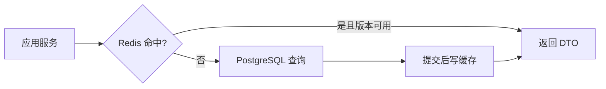

# SQLAlchemy、PostgreSQL、事务与 Redis

FastAPI 读取 Document 时先查 Redis，未命中再查 PostgreSQL。更新接口提交数据库后，如果缓存仍保留旧版本，下一次请求会返回旧状态。更隐蔽的问题是：事务回滚了，代码却已经把未提交对象写进缓存。

本章用异步 SQLAlchemy 实现一条读取和更新链，重点不是 ORM 语法大全，而是 Session 生命周期、事务所有权、并发检查和缓存失效顺序。

## AsyncSession、连接和事务不是同一个对象

`AsyncSession` 是 ORM 工作单元，跟踪对象、执行 SQL 和控制事务；它需要时从 Engine 的连接池借连接；事务定义一组原子提交或回滚的数据库操作。

Web 请求通常每请求创建一个 Session，通过依赖注入交给应用服务，请求结束关闭。不要把同一个 Session 保存在全局或跨并发 Task 共享；Session 不是并发安全容器。

```python
async def get_session() -> AsyncIterator[AsyncSession]:
    async with session_factory() as session:
        yield session
```

FastAPI 解析依赖时调用 `get_session`，进入 `async with` 创建当前请求的 Session，路由或应用服务使用它，函数退出时关闭并归还连接。这个依赖的输入是 Session 工厂，输出是仅属于当前请求的 `AsyncSession`；离开 `async with` 后连接会归还连接池。它只负责资源生命周期，事务何时提交由完整用例决定，不应该每个 Repository 方法各自 commit。连接池耗尽时，等待会在这里暴露，日志应记录等待时间和 request ID。

## Repository 不拥有事务

Repository 接收 Session，封装查询和映射：

```python
class DocumentRepository:
    def __init__(self, session: AsyncSession) -> None:
        self.session = session

    async def get_visible(self, document_id: str, tenant_id: str) -> Document | None:
        statement = select(DocumentRow).where(
            DocumentRow.public_id == document_id,
            DocumentRow.tenant_id == tenant_id,
        )
        row = (await self.session.execute(statement)).scalar_one_or_none()
        return map_document(row) if row else None
```

调用顺序是应用服务传入公开 ID 和可信租户范围，Repository 生成带两项过滤的 SQL，执行后映射为领域对象或 `None`。`get_visible` 的输入是公开文档标识和可信租户范围，输出只有领域对象或 `None`。查询同时带上租户范围，不先全局查实体；Repository 返回领域对象或明确投影，不把 ORM Row 泄漏到 API。没有结果时由上层决定 404 或隐藏资源，数据库错误则保留为依赖故障。

## 应用服务控制完整事务

发布文档需要检查状态、更新版本和写事件，应在同一事务：

```python
async def publish_document(command: PublishDocument, uow: UnitOfWork) -> Document:
    async with uow:
        document = await uow.documents.get_for_update(
            command.document_id,
            command.tenant_id,
        )
        if document is None:
            raise DocumentNotFound()

        document.publish(expected_version=command.expected_version)
        await uow.documents.save(document)
        await uow.events.append(document.pull_events())
        await uow.commit()
        return document
```

`get_for_update` 是否真的需要行锁取决于竞争模型；也可以使用 `version` 乐观更新并检查 row count。关键是领域规则和更新发生在同一用例边界。

模型调用、OCR 和外部 HTTP 不放在事务中。先保存 pending 任务并提交，再由 Worker 执行耗时工作。

## `expire_on_commit` 和对象访问

SQLAlchemy 默认可能在 commit 后使属性过期，之后访问会触发重新加载；异步环境中隐式 I/O 容易产生错误。常见做法是配置 `expire_on_commit=False`，并在事务内显式加载需要字段。

无论配置如何，API DTO 都应从明确结果映射，不依赖序列化器在 Session 关闭后懒加载关系。使用 `selectinload` 等加载策略时用 SQL 日志验证查询数量，避免 N+1。

## Cache-Aside 读取



缓存 Key 包含租户、公共 ID、Schema 版本和权限策略版本。缓存值是可序列化 DTO，带 `dataVersion`，不保存 ORM 对象。

读取数据库不需要显式提交，但写缓存发生在数据库读取成功后。依赖错误不能负缓存成“不存在”；404 负缓存要使用短 TTL 并包含权限维度。

## 更新与缓存失效

更新流程：数据库事务提交成功，再删除缓存。若删除失败，记录待重试失效事件并依赖短 TTL 或版本键收敛。

不要在 commit 前更新 Redis：事务回滚后缓存中存在从未提交的数据。也不要在 ORM `after_flush` 钩子直接调用网络，flush 不等于 commit。

可以使用 Outbox 记录 `document.changed(version=8)`，消费者按版本删除或更新缓存。事件至少一次投递，所以缓存操作幂等；旧版本事件不能覆盖新缓存。

## 并发更新的两种方式

### 悲观锁

`SELECT ... FOR UPDATE` 锁住行，适合短事务且冲突概率高。所有代码保持一致锁顺序，避免死锁。

### 乐观版本

```sql
UPDATE document
SET status = $1, version = version + 1
WHERE public_id = $2 AND tenant_id = $3 AND version = $4;
```

执行后读取 `rowcount`：1 行表示预期版本匹配并提交了更新，0 行表示版本冲突或不可见。应用返回 409 并让客户端刷新，不把最后写入静默覆盖前一个修改。若事务随后回滚，Redis 仍不能提前写入新版本，因此缓存操作只能放在提交后事件中。

SQLAlchemy 可以映射版本列，但仍需测试批量更新和自定义 SQL 是否遵守版本语义。

## Redis 和数据库故障怎样降级

- Redis 读失败：受限回源数据库，并通过并发槽保护；
- Redis 写/删失败：主请求可按业务成功，但记录失效重试与 Metric；
- 数据库失败：不能返回无版本保证的旧缓存用于权限/关键状态；
- 连接池耗尽：尽快返回可识别错误，观察等待时间；
- 事务冲突：只有整个用例无外部副作用时有限重试。

高风险读是否允许旧缓存，要按业务明确，不使用统一“缓存可用就返回”。

## 测试一条完整链

1. 缓存未命中，数据库返回 v1 并写缓存；
2. 第二次读取命中 v1；
3. 更新事务提交 v2，缓存被删除；
4. 下一次回源得到 v2；
5. 更新事务回滚，缓存仍为 v1；
6. 删除缓存失败，Outbox/重试最终失效；
7. 两个 expectedVersion=v1 并发更新，只有一个成功；
8. 跨租户 ID 在数据库查询前被过滤。

数据库集成测试连接隔离实例；Redis 测试使用独立 DB/Key 前缀并清理本用例数据。

## 本章检查表

- AsyncSession 每请求/任务创建，不跨并发共享；
- 应用服务拥有事务，Repository 不 commit；
- 查询下推租户和权限；
- DTO 不触发隐式懒加载；
- 外部调用不占用事务；
- 并发更新检查锁或版本；
- 缓存写入/失效发生在 commit 后；
- 缓存包含数据与策略版本；
- Redis 故障有数据库保护；
- 事务、缓存和并发都有集成测试。

下一章处理 Python 并发与 Celery：哪些任务留在事件循环，哪些必须进入独立 Worker，以及取消和恢复怎样贯穿。
