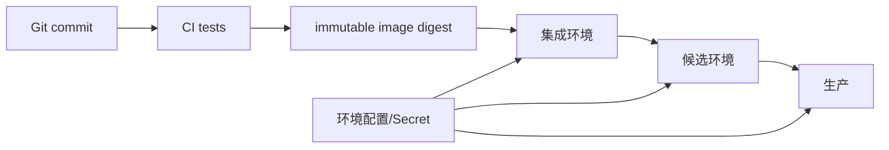

# Git 分支、Review 与环境工作流

Git 分支隔离一组待合并变更，Review 检查代码与证据，环境工作流把同一提交和制品逐步提升到测试、候选和生产。它们连接个人开发、团队协作与发布系统，用来控制契约冲突、变更责任和可追溯性；Git 本身不会维护数据库迁移或环境一致性。

功能分支在开发环境工作，合并后候选环境却缺少一条迁移；另一个分支修改了同一 OpenAPI 字段，React 生成客户端与 API 已经分叉。Git 只保存变更历史，企业协作还要约定分支寿命、评审证据、环境晋级和谁能修改契约。

## 主干保持可发布，分支保持短寿命

功能分支从最新主干创建，小步提交并尽快合并。分支存活越久，Schema、契约与依赖冲突越难发现。主干受保护，合并必须通过评审与自动门禁，不能直接在共享分支修到“能跑”。

Commit 表达一个可解释变更，消息说明为什么。生成代码、迁移和测试与功能同一 PR 提交；临时日志、数据库转储、截图和本地 Secret 不进入 Git。

| 变更类型 | PR 必须包含 | 重点评审 |
| --- | --- | --- |
| OpenAPI | 规范 diff、生成客户端、契约测试 | 兼容性与错误语义 |
| MySQL Schema | 新迁移、升级/回退策略、数据校验 | 锁、旧版本兼容 |
| 认证授权 | 拒绝路径测试、审计 | 越权与缓存失效 |
| 依赖升级 | 锁文件、构建、漏洞/许可证结果 | 行为与供应链 |
| 部署配置 | 候选验证和回滚 | Secret、资源与探针 |

## Code Review 先查不变量和失败路径

评审者先确认需求、数据所有者和关键不变量，再读协议、Service、SQL 和测试。格式交给 Lint；人工精力放在租户范围、事务边界、未知结果、并发和回滚。

PR 描述附复现命令和实际输出，但不贴敏感日志。大型变更拆成兼容步骤：先加新字段/暗路径，再切流量，最后清理旧路径；每个 PR 保持可发布。

这是一份后端 PR 描述的最小证据结构，不是要求每个 PR 写成固定长模板。

```text
变更：项目更新增加 If-Match 乐观版本
不变量：跨租户仍返回 404；冲突不覆盖新数据
数据变化：新增 version，先回填再设 NOT NULL
验证：单元/集成/契约命令及结果
候选观察：409 比例、更新成功率、慢查询
回滚：应用可继续读取旧结构；不删除 version
```

评审者可沿不变量直接检查代码和测试。若回滚依赖手工恢复被删除数据，说明迁移顺序需要重设。

## 环境使用同一制品，只改变运行配置

本地、集成、候选和生产有不同数据与权限，但部署同一个已签名镜像 digest。候选验证完成的制品晋级生产，不重新 build；否则无法证明生产二进制经过测试。

每个环境有独立数据库、Redis、Broker、Bucket 和 Secret。开发账号不能访问生产；生产数据不直接复制到开发，必要样本经脱敏和最小化。



箭头表示制品晋级，不表示数据复制。每次部署记录 commit、digest、迁移版本和操作者。

## 紧急修复仍走可追踪路径

线上故障先止损和回滚。修复从当前生产对应 commit 建短分支，补回归测试，经候选或旁路验证后发布，再把修复合回主干。不能只在服务器改文件，否则下一次部署会丢失且无人知道差异。

分支规则、审批人、环境权限和例外流程由仓库设置与身份系统执行。口头约定没有门禁时，最紧急的时刻最容易被绕过。

## 分支协作与环境隔离的边界

**为什么长功能分支风险高？**

主干契约、Schema 和依赖持续变化，最终一次性整合难以定位回归。用 Feature Flag 和兼容迁移把功能拆成可合并的小增量。

**Squash 会不会丢失有用历史？**

它让主干每个 PR 一条清晰记录，但会压平分支内部探索。团队可按变更性质选择；关键是最终 commit 能关联 PR、测试和制品，而不是坚持一种形式。

**为什么不能共用一套测试数据库？**

并行分支会互相改 Schema 和数据，测试结果不可重复，还可能误删他人数据。每个 CI Job 创建独立数据库/Schema，结束后精确清理。

**Feature Flag 是否可以永久保留旧代码？**

Flag 用于渐进发布和回滚窗口，稳定后应删除旧分支和 Flag。长期双路径增加测试组合与安全面，需要 owner 和到期日期。

## 机制复核：Git 分支、Review 与环境工作流
这篇文章讨论的机制需要放回一次完整请求中验证。先记录输入约束、状态变化、外部依赖和失败结果，再确认成功路径是否留下可追踪的事实。配置、缓存、队列或数据库只承担各自职责，不能用一层的日志推断另一层已经完成。

迁移到实际项目时，优先补一条正常用例、一条重复或并发用例和一条依赖不可用用例。每条用例写明观察指标、错误分类、回滚动作与数据清理范围，测试替身的通过不能代替真实协议和权限验证。

当性能、可靠性和安全目标冲突时，先明确服务对象和可接受损失，再选择超时、容量、重试和降级策略。没有测量依据的阈值只作为待验证假设，发布后用同一公式复验。
