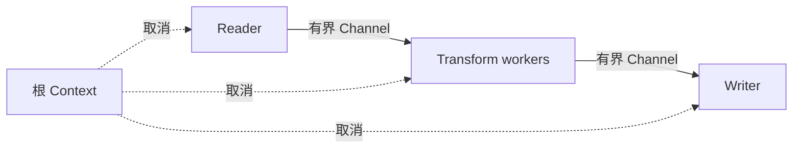

# Goroutine、Context、取消与背压

要处理一千个文件，最直接的写法是每个文件启动一个 goroutine。任务很快发出，却可能同时占满数据库连接、内存和外部 API 配额。若下游提前失败，上游还可能永远阻塞在发送操作上。

本篇把这批文件改造成有界流水线：读取、转换、写入三个阶段之间使用有限 Channel；根 Context 取消时所有阶段退出；下游变慢时，背压自然传回上游。

## 先理解三个概念

goroutine 是并发执行单元；Channel 在 goroutine 间传递值；Context 形成取消与 Deadline 树。它们并不会自动决定并发上限、错误策略或谁负责关闭 Channel，这些都需要应用明确设计。



## 步骤一：让 Context 贯穿阻塞操作

Context 由请求、任务或进程信号入口创建，向下传递，不保存到长期 struct。数据库、HTTP、Channel 发送和循环都要能观察 `ctx.Done()`。`Canceled` 与 `DeadlineExceeded` 是不同诊断结果，不应统一包装为内部错误。

子调用的超时小于父级剩余预算，并为返回和提交预留时间。CPU 长循环若从不检查 Context，取消仍无法及时生效。

## 步骤二：固定 Worker 数量

下面是根据 Go Channel 关闭规则重写的最小转换阶段。输入 Channel 由上游关闭；这一阶段是输出 Channel 的唯一拥有者，等所有发送者退出后关闭输出。每次接收和发送都同时监听取消。

```go
func transform(
	ctx context.Context,
	in <-chan Item,
	workers int,
) <-chan Result {
	out := make(chan Result, workers*2)
	var wg sync.WaitGroup
	wg.Add(workers)

	for i := 0; i < workers; i++ {
		go func() {
			defer wg.Done()
			for item := range in {
				result := convert(item)
				select {
				case out <- result:
				case <-ctx.Done(): return
				}
			}
		}()
	}
	go func() { wg.Wait(); close(out) }()
	return out
}
```

固定 Worker 数限制在途转换数量，Channel 容量只吸收短暂抖动。生产实现还要把转换错误传给 `errgroup` 或结果对象，并按业务选择 fail-fast 或部分成功。

## 步骤三：让背压可见

当 Writer 变慢，输出 Channel 逐渐填满，Transform 会阻塞，Reader 随后也停止继续读取。这就是背压：下游容量限制向上游传播。把 Buffer 调得很大只能推迟问题并增加内存；到达率长期高于完成率时，需要限流、扩容、降级或拒绝新工作。

并发上限应服从最紧资源，并为健康检查和提交保留余量。外部 API 还同时存在 RPS 与成本限制，需要并发信号量、速率限制和 Deadline 共同约束。

并行会打乱完成顺序。需要保持输入顺序时，让结果带 index，由单个聚合器在有界缓冲中重排。一个分支失败后是取消全组还是保留部分结果，也要体现在公共协议里。

## 步骤四：关闭和共享状态

通常由唯一发送方关闭 Channel；接收方不知道是否还有发送者，因此不负责关闭。不要用 `recover` 掩盖 `send on closed channel`，那代表所有权设计有误。

优先让单个 goroutine 拥有可变状态。简单计数用 atomic，复合不变量用 Mutex；锁内不执行网络 I/O。Timer 和 Ticker 随 Context 停止，避免后台循环与 goroutine 泄漏。

服务退出时，根 Context 接收 SIGTERM：readiness 先关闭，停止接收新工作，取消后台循环，排空 HTTP 与任务，最后关闭数据库和遥测。排空有 Deadline，未完成任务依靠持久租约恢复。

## 正常结果和失败结果

| 场景 | 预期 |
| --- | --- |
| 一千个输入 | 同时转换数不超过 workers |
| Writer 变慢 | 上游阻塞，内存保持预算内 |
| 下游提前失败 | 根 Context 取消，上游退出 |
| 父 Deadline 到达 | 数据库、HTTP 和循环停止 |
| 需要输入顺序 | 聚合器按 index 输出 |
| SIGTERM | 停止接单，在途工作有限排空 |

验证运行 `go test -race ./...`、`go vet ./...`，并注入慢数据库、无人消费的 Channel、重复取消和长时间压测。goroutine 数测试存在运行时噪声，可结合 pprof 与泄漏检查库观察是否持续增长。Race Detector 只发现数据竞争，不证明检查与写入的业务原子性。

## 下一步

并发正确后，还要知道时间花在哪里、缓存是否返回旧值。下一篇把一次 GORM 查询、Redis cache-aside 和 OpenTelemetry Trace 串起来，专门处理数据一致性与可诊断性。

## 参考资料

- [Go context](https://pkg.go.dev/context)
- [Go Blog: Pipelines and cancellation](https://go.dev/blog/pipelines)
- [x/sync errgroup](https://pkg.go.dev/golang.org/x/sync/errgroup)
- [Go Race Detector](https://go.dev/doc/articles/race_detector)
