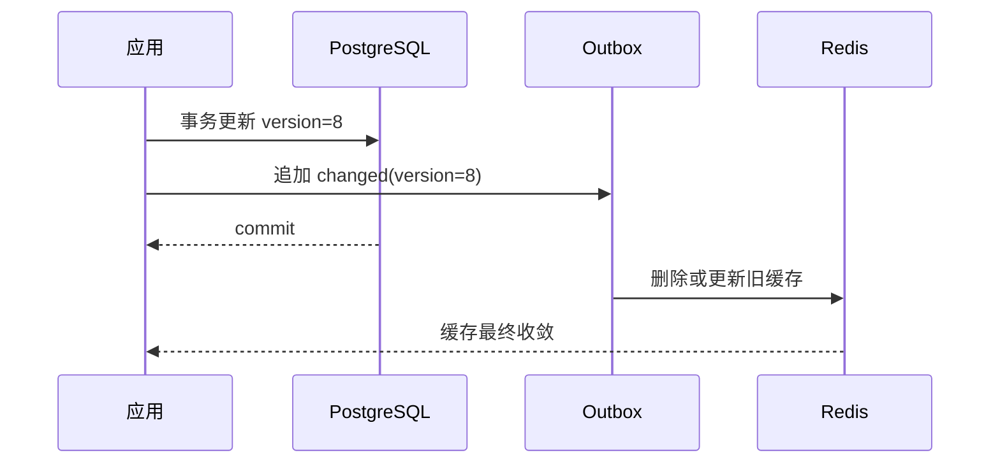

# GORM、Redis 与 OpenTelemetry

第一次读取文档时缓存未命中，服务查询 PostgreSQL 并写入 Redis。随后文档状态从 draft 更新为 published；如果缓存没有失效，第二次读取仍返回 draft。缓存提高了速度，却引入了可接受陈旧窗口和新的失败路径。

本篇先修复这条 cache-aside 链路，再加入 OpenTelemetry。目标是能回答：请求命中了缓存还是数据库，返回的是哪个资源版本，时间花在连接池还是 SQL，以及 Redis 故障时是否正确降级。

## 数据库是事实源，缓存是可重建副本

GORM Model 是持久化映射，不直接作为 API DTO。Repository 查询携带 tenant 与 scope，关键更新使用明确 `Where + Updates` 并检查 `RowsAffected`。数据库唯一约束和版本条件负责最终并发保护。

数据库事务中同时更新业务行和 Outbox。提交后的消费者再处理缓存。Redis 不属于数据库事务，事务回滚时不能指望 Redis 自动恢复；缓存丢失也应始终能从数据库重建。

## 步骤一：用版本保护缓存一致性

cache-aside 的读取顺序是缓存 miss、查库、写缓存。并发更新时，一个较慢的旧读可能在新数据提交后才写回 Redis。缓存值因此包含资源版本和策略版本，失效消费者只允许不旧于当前版本的事件覆盖或删除。

缓存键包含环境、租户、资源类型、公共 ID 和 Schema/权限版本摘要，不包含 Token、邮箱或正文。TTL 按业务可接受陈旧窗口设置并加抖动；负缓存只代表“当前权限和版本下不存在”，依赖故障不能缓存成不存在。

热点 miss 可以用 `singleflight` 合并单实例回源。跨实例锁增加租约与 fencing 复杂度，很多读场景允许少量重复回源，比错误分布式锁更稳妥。

## 步骤二：写入时检查行数和事务结果

关键更新不要依赖 GORM `Save` 的全字段行为。带 `tenant_id`、公开 ID 和 expectedVersion 做条件更新，影响行数为 0 时返回版本冲突。事务回调只有返回 error 才会回滚，不能捕获后返回 nil。

网络调用和 Redis 写入离开长事务。提交后缓存暂时不可用时，业务事实仍然成功，失效事件稍后重放。API 不应把已提交数据库操作改口为失败，诱导客户端重复副作用。

## 步骤三：用 Trace 区分等待位置

OpenTelemetry 串联 HTTP/gRPC、GORM/SQL、Redis、外部 HTTP 和异步消息。Span 记录低基数操作名、结果与公共错误码；不记录用户正文、SQL 参数、完整 Redis key 或租户 ID。异步消费者从消息上下文建立 parent 或 link，同时用稳定 eventId 关联业务事件。

自动 Instrumentation 需要检查是否泄露参数、重复创建 Span，以及连接池等待是否被忽略。SQL Span 很快而请求仍慢，可能是大量时间花在 `sql.DB` 的连接 checkout。数据库池指标、Redis 命中与超时、Outbox 滞后需要与 Trace 一起看。

| 信号 | 最适合回答 |
| --- | --- |
| 日志 | 一次离散错误的 cause 和上下文 |
| 指标 | 延迟趋势、容量、错误率与告警 |
| Trace | 单次请求跨组件的路径与耗时 |
| 业务事件 | 用户任务与状态的可靠事实 |

Trace 可能采样，不能作为唯一业务记录。Prometheus 标签使用有限枚举，避免将 tenantId、documentId 变成高基数标签。遥测导出有队列和重试上限，后端故障不能反过来阻塞主请求。

## 正常结果和失败结果

| 场景 | 预期 |
| --- | --- |
| 首次读取 | cache miss，查库并写当前版本 |
| 第二次读取 | cache hit，版本与策略匹配 |
| 数据库更新 version=8 | 事务提交并产生失效事件 |
| version=7 失效晚到 | 不删除或覆盖更新缓存 |
| Redis 不可用 | 回源数据库，业务保持可用或明确降级 |
| SQL 慢 | Trace 与查询指标指出执行耗时 |
| 连接池耗尽 | DBStats 显示 WaitDuration 增长 |
| 遥测后端不可用 | 主请求不无限等待 |

集成测试使用隔离 PostgreSQL 与 Redis，覆盖事务回滚、乱序失效、跨租户相同 ID 和并发 cache miss。OTel 使用内存导出器，断言 Span 名称、状态和允许属性，同时确认敏感值不存在。

## 到这里形成的 Go 服务主线

四篇文章已经串起 Gin 协议边界、Protobuf 契约、Context 并发与数据观测。它们共享同一原则：业务事实放在可验证状态中，网络和缓存故障有明确边界，错误能被上层判断。下一栏目进入运维，先从容器如何运行这些进程讲起。

## 复现一次缓存旧数据

先读取记录 V1 并写入 Redis，再通过数据库更新为 V2，但故意让缓存删除失败。下一次读取命中 V1，这时 Trace 应同时显示数据库版本、缓存版本和失效错误，帮助判断是缓存一致性问题而非 ORM 查询错误。

| 阶段 | Span 属性示例 | 不应记录 |
| --- | --- | --- |
| GORM 查询 | 操作类型、表类别、耗时、结果数 | 完整 SQL 参数与个人数据 |
| Redis 读取 | key 类别、hit/miss、版本 | 原始 Token 或敏感正文 |
| 缓存失效 | 目标版本、错误码、重试状态 | 内部连接密钥 |
| HTTP 结果 | 路由、状态、trace ID | 认证头 |

常见策略是数据库提交后删除缓存，读取 miss 时回填；高并发下还要考虑回填竞争、旧请求晚写和删除失败。可以在缓存值中携带数据版本，写入前比较版本，或者通过事件与补偿扫描收敛。具体策略取决于能容忍多久旧数据。

用 OpenTelemetry 把 HTTP、GORM 和 Redis Span 串起来，指标观察命中率、数据库延迟和失效错误，日志记录可行动错误。随后做三次实验：正常更新、缓存删除失败、Redis 不可用。确认 Redis 故障时的降级不会绕过权限，也不会把缓存当唯一业务事实。

## 参考资料

- [GORM Transactions](https://gorm.io/docs/transactions.html)
- [database/sql DB Stats](https://pkg.go.dev/database/sql#DBStats)
- [OpenTelemetry Go](https://opentelemetry.io/docs/languages/go/)
- [W3C Trace Context](https://www.w3.org/TR/trace-context/)
