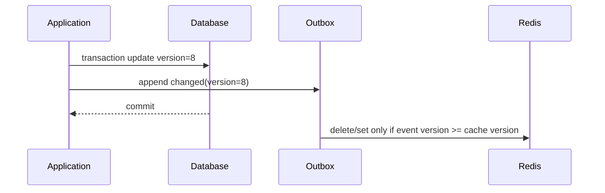

# GORM、Redis 与 OpenTelemetry

ORM、缓存和 Trace 经常分别“接上了”，但系统仍难诊断：GORM 自动保存关联导致意外写入，事务中更新 Redis 造成脏缓存，Trace 只有 HTTP Span 看不到连接池等待，日志又记录了完整 SQL 参数。关键是明确数据库是事实来源、缓存是一份可丢失投影、观测数据是受控诊断证据。

## GORM 不替代数据边界

GORM Model 是持久化结构，不应直接作为 API DTO 和领域对象。Repository 接受 tenant/scope 条件，显式 Select/Omit 更新字段，避免 `Save` 把零值和关联整体覆盖。

```go
type documentRow struct {
	ID        int64
	PublicID  string
	TenantID  string
	ScopeID   string
	State     string
	Version   int64
	UpdatedAt time.Time
}

func (r *DocumentRepository) FindVisible(
	ctx context.Context,
	tenantID, documentID string,
	scopeIDs []string,
) (Document, error) {
	var row documentRow
	err := r.db.WithContext(ctx).
		Where("tenant_id = ? AND public_id = ? AND scope_id IN ?", tenantID, documentID, scopeIDs).
		First(&row).Error
	if errors.Is(err, gorm.ErrRecordNotFound) { return Document{}, ErrNotFound }
	if err != nil { return Document{}, fmt.Errorf("find visible document: %w", err) }
	return mapDocument(row), nil
}
```

空 scope 列表直接拒绝/返回无结果，避免 ORM 生成意外 SQL。所有操作使用 `WithContext` 传播取消和 Trace。

## 更新、乐观锁与行数

```go
result := tx.WithContext(ctx).Model(&documentRow{}).
	Where("tenant_id = ? AND public_id = ? AND version = ?", tenantID, id, expected).
	Updates(map[string]any{
		"state": "published",
		"version": gorm.Expr("version + 1"),
		"updated_at": now,
	})
if result.Error != nil { return result.Error }
if result.RowsAffected != 1 { return ErrVersionConflict }
```

`Save` 在没有匹配时可能执行创建/全字段更新，具体行为依版本而异；关键写入使用明确 `Model + Where + Updates` 并检查 RowsAffected。唯一约束仍在数据库，不能只先查。

预加载关联防 N+1，但不要无上限加载整棵对象图。复杂列表用投影 Select/Joins，查看生成 SQL 与 `EXPLAIN ANALYZE`，不要以 ORM 调用数量猜性能。

## 事务回调和外部副作用

```go
err := db.WithContext(ctx).Transaction(func(tx *gorm.DB) error {
	repository := NewDocumentRepository(tx)
	outbox := NewOutboxRepository(tx)
	document, err := repository.LockCurrent(ctx, command)
	if err != nil { return err }
	if err := document.Publish(command.ExpectedVersion); err != nil { return err }
	if err := repository.Save(ctx, document); err != nil { return err }
	return outbox.Append(ctx, document.PullEvents())
})
```

回调返回 error 才回滚；不能吞错后返回 nil。网络和 Redis 更新不要放事务中期待数据库回滚它们。事务写数据库事实和 Outbox，提交后消费者更新缓存/索引。

嵌套 Transaction 可能用 Savepoint，不能回滚外部副作用。长事务避免模型调用和慢 I/O，监控事务耗时与锁等待。

## Redis 缓存模型先定义一致性

Cache-aside 常见流程：读缓存 miss -> 查库 -> 写缓存；写数据库提交 -> 删除缓存。问题是并发读可能在写提交前读旧值，并在提交后把旧值写回缓存。解决思路不是承诺强一致，而是用版本化值、事件失效和短 TTL 限制窗口。



缓存值包含资源版本和策略版本：

```go
type CacheEnvelope[T any] struct {
	SchemaVersion int    `json:"schemaVersion"`
	ResourceVersion int64 `json:"resourceVersion"`
	PolicyVersion string `json:"policyVersion"`
	Value T `json:"value"`
}
```

消费者用 Lua 或事务保证只有不旧于当前缓存的事件能覆盖/删除，防止乱序事件把新缓存换旧。缓存丢失必须可从数据库重建。

## Key 设计、TTL 和雪崩

Key 带环境、租户、资源类型、公共 ID、Schema/权限版本摘要；不要含完整 Token、邮箱或敏感文本。禁止只用全局 ID 跨租户缓存。

TTL 按可接受陈旧窗口设置并加入抖动，避免同一时刻大面积过期。热点 miss 用 `singleflight` 合并同进程请求，跨实例可短锁，但锁超时、持有者崩溃和 fencing 都要考虑；很多场景允许重复回源比实现错误分布式锁更安全。

负缓存只缓存明确“在当前权限/版本下不存在”，TTL 更短，并包含策略版本。依赖故障不能缓存成不存在。

大 Value 会阻塞 Redis 单线程网络/命令处理并增加带宽。限制序列化后大小，列表缓存 ID/投影而不是整个对象图，禁止无界 `KEYS`，批量使用 SCAN/受控 pipeline。

## Redis 不是数据库事务的延伸

先写 Redis 再提交数据库会暴露未提交值；提交后同步写 Redis 失败会让 API 看似失败但数据库已成功，客户端重试可能重复副作用。数据库提交是成功事实，缓存通过 Outbox 异步收敛；必要时提交后 best-effort 删除，但不能替代可靠失效。

分布式锁不自动保护数据库不变量。最终唯一性、版本与状态约束仍落数据库；锁可降低争用。锁值使用唯一 owner token，释放 Lua 比较 token，租期不足时用 fencing token 防旧持有者继续写。

## OpenTelemetry 关联而不泄露

Trace 需要覆盖 HTTP/gRPC、GORM/SQL、Redis、外部 HTTP 和队列。传播 W3C Trace Context；异步任务在消息 header 传上下文，并建立 producer/consumer Span link/parent 关系。

```go
ctx, span := tracer.Start(ctx, "document.publish",
	trace.WithAttributes(
		attribute.String("app.operation", "document.publish"),
		attribute.String("app.tenant_bucket", hashBucket(tenantID)),
	),
)
defer span.End()

if err := service.Execute(ctx, command); err != nil {
	span.RecordError(err)
	span.SetStatus(codes.Error, publicErrorCode(err))
	return err
}
```

不要把 userId、文档标题、SQL 参数、Redis key 全量放属性。高基数字段增加后端成本，敏感值造成泄露。Trace 保存稳定错误码、操作名、数据库 system/operation、受控表名和耗时；完整 cause 在受权限日志中仍需脱敏。

## GORM 与 Redis Instrumentation 的边界

自动 Instrumentation 能创建 SQL/Redis Span，但要检查：是否记录 statement 与参数、是否重复创建嵌套 Span、连接池等待是否可见、错误是否正确分类。生产默认对 SQL 做参数化/指纹化，不记录 bind 值。

数据库连接池指标来自 `sql.DB.Stats()`：OpenConnections、InUse、Idle、WaitCount、WaitDuration、MaxIdleClosed 等。GORM 查询 Span 快不代表请求快，可能大量时间在 pool checkout 前等待。

Redis 指标区分命令延迟、连接池等待、超时、miss/hit、Value 大小和失效事件滞后。hit rate 高不一定好，缓存了错误或过旧值反而危险。

## 日志、指标和 Trace 分工

| 信号 | 适合 | 不适合 |
| --- | --- | --- |
| 日志 | 离散事件、错误 cause、审计摘要 | 高频每次成功全量正文 |
| 指标 | 趋势、SLO、容量、告警 | 单请求细节 |
| Trace | 跨组件路径、关键耗时、错误链 | 业务事实唯一存储 |

日志加入 traceId/requestId/taskId，但不依赖 Trace 一定采样。业务 Outbox/状态事件必须可靠保存。指标标签只用有限枚举（operation、result、error_code），不把 tenantId/documentId 作为 Prometheus label。

## 观测采样与成本

Head sampling 在请求开始决定，可能漏掉后续慢/错请求；Tail sampling 可按错误/延迟保留但需要 Collector 缓冲。组合策略：基础低比例 + 错误/高延迟提高保留；安全审计走独立不可采样事件管道。

设置导出队列和失败策略，遥测后端不可用不能阻塞主业务。Collector、Exporter 有内存和重试上限；停机时有限时间 flush。观测成本作为预算，禁止添加未经评估的高基数字段。

## 诊断流程示例

“发布接口 P95 变慢”不直接归因数据库。按关联信号检查：

1. HTTP Span 分解应用与下游；
2. `sql.DB` WaitDuration 是否增加；
3. SQL 指纹 P95 与 rows scanned 是否变化；
4. Redis miss、timeout 是否导致回源放大；
5. Outbox backlog 是否让缓存长时间未失效；
6. GORM 发布版本是否改变预加载/更新 SQL；
7. 数据库锁等待和执行计划是否变化。

同一个 traceId 串起请求、事务、Outbox eventId 和异步消费者，但不要把 traceId 当幂等键。

## 验证：一致性、故障和可观测断言

| 场景 | 必须证明 |
| --- | --- |
| 数据库事务回滚 | 无缓存新值、无已发布 Outbox |
| 提交后 Redis 不可用 | API 事实成功，失效事件最终重放 |
| 失效事件乱序 | 旧版本不能覆盖新缓存 |
| 缓存 miss 并发 | 回源受控，结果版本一致 |
| 不同租户同 public ID | Key 和 SQL 均隔离 |
| SQL 慢/池耗尽 | Span 与 pool 指标能区分 |
| Trace 未采样 | 业务状态和错误日志仍可诊断 |
| 遥测后端故障 | 主请求不被无限阻塞 |

```go
func TestOldInvalidationCannotDeleteNewerCache(t *testing.T) {
	cache.Set(t.Context(), key, CacheEnvelope[DocumentView]{ResourceVersion: 9, Value: view9})
	err := invalidator.Apply(t.Context(), ChangedEvent{ResourceVersion: 8, CacheKey: key})
	require.NoError(t, err)

	got := cache.Get(t.Context(), key)
	require.Equal(t, int64(9), got.ResourceVersion)
}
```

Repository 集成测试使用真实 PostgreSQL/Redis 隔离环境；通过 Testcontainers 或专用 Compose 固定版本。OTel 测试使用 in-memory exporter，断言 Span 名、状态和允许属性，同时断言敏感值不存在。

## 常见误区

- GORM Model 直接成为 API/领域对象。
- 使用 `Save`/自动关联保存造成意外全字段写入。
- 事务中写 Redis，认为会随数据库回滚。
- Cache key 缺租户、资源和策略版本。
- 提交后同步更新缓存失败就把业务响应改成失败。
- 分布式锁替代数据库唯一约束和版本条件。
- 自动 Instrumentation 记录 SQL 参数、完整 Redis key 和用户正文。
- Prometheus label 使用 tenantId/documentId 造成高基数。
- Trace 是唯一错误证据，未采样请求无法诊断。
- 遥测 Exporter 无限重试，反过来拖垮主服务。

## 参考资料

- [GORM Transactions](https://gorm.io/docs/transactions.html)：事务回调、嵌套事务与 SavePoint 行为。
- [database/sql DB Stats](https://pkg.go.dev/database/sql#DBStats)：连接池容量和等待的运行指标。
- [Redis Client-side caching](https://redis.io/docs/latest/develop/clients/client-side-caching/)：缓存失效与一致性机制。
- [OpenTelemetry Go](https://opentelemetry.io/docs/languages/go/)：Trace、Metric、Context 传播与 SDK 使用。
- [W3C Trace Context](https://www.w3.org/TR/trace-context/)：跨服务传播追踪标识的格式。
