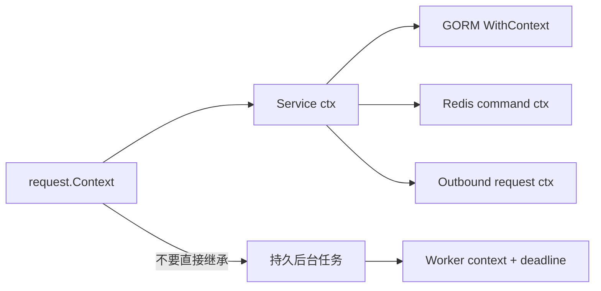

# Go 与 Gin：Context、并发和请求生命周期

Gin Handler 启动 goroutine 后立即返回，goroutine 继续使用 `*gin.Context`，请求结束后还在重试并写响应。goroutine 很轻，但它必须有所有者、Context 和并发上限；Gin Context 只属于当前请求，不能传给后台任务。

## 每个请求在独立 goroutine 中执行 Handler 链

net/http 接受连接并为请求运行 goroutine，Gin 依次执行 Middleware 与 Handler。阻塞 socket 不会阻塞所有请求，但会占用 goroutine 和下游连接；无界请求仍可耗尽内存/文件描述符。

Gin Middleware 注入 requestId/Principal、记录响应；Handler 绑定和校验输入、调用 Service、统一写 Problem。业务层不接收 `*gin.Context`，只接收标准 `context.Context` 与显式 Principal。

Handler 从 HTTP Context 派生 2 秒 deadline，Service 与 Repository 必须继续把 ctx 传给 GORM/Redis/HTTP。

```go
func (h *Handler) GetProject(c *gin.Context) {
    ctx, cancel := context.WithTimeout(c.Request.Context(), 2*time.Second)
    defer cancel()

    project, err := h.projects.Get(
        ctx,
        PrincipalFrom(c),
        c.Param("projectId"),
    )
    WriteResult(c, project, err)
}
```

不要把 cancel defer 去掉，也不要把 ctx 存到 struct。请求结束后 ctx.Done 关闭，下游调用应返回 context canceled/deadline exceeded 并停止无价值工作。

Handler 读取 Body 也受资源边界约束。先用 `http.MaxBytesReader` 或 Gin 等价处理限制体积，再绑定 JSON；响应 Header 尚未写出时才能选择正确状态码。调用 `c.JSON` 后继续写会产生重复 Header 或拼接 Body，Middleware 应检查 `c.IsAborted()`，认证失败后 `AbortWithStatusJSON` 并立即结束当前处理分支。
## Context 传取消、deadline 和请求范围值

Context 作为第一个参数沿调用链传递，不放可选业务参数。Value 只保存 requestId/trace 等请求范围元数据，使用私有 key 类型；tenant_id/Principal 更适合显式参数，避免权限条件隐形。

后台任务不能直接继承客户端 Context，因为请求一结束就取消。可靠任务先持久化，由 Worker 使用自己带 deadline 的 Context；短 goroutine 也要复制必要值并由 errgroup/WaitGroup 所有。



取消传播到支持 Context 的客户端；不支持的旧 SDK 需要包装 timeout 或更换，否则 Handler 返回后底层操作仍占资源。

Context 只是取消信号，驱动仍要主动监听；压测需验证取消后连接和 goroutine 确实下降。
## channel 和并发限制建立背压

goroutine 启动成本小，不代表可以每请求创建无上限并行任务。用 semaphore channel、worker pool 或 errgroup.SetLimit 限制下游并发；写 channel 要考虑接收者退出，否则 goroutine 永久阻塞。

只由发送者/所有者关闭 channel，避免重复 close；用 select 同时监听 ctx.Done。共享 map 需要 mutex/sync.Map 或单 goroutine 所有，`go test -race` 检查数据竞态。

`errgroup.WithContext` 适合同一请求里“任一失败则整体取消”的并行查询，但并行数仍需 `SetLimit`。如果两个查询共享一笔 SQL 事务，就不应并发复用同一事务连接。还要保留首个有意义错误：ctx 被同组任务取消产生的 `context canceled` 不应覆盖真正的下游失败。

| 故障 | 证据 | 修复 |
| --- | --- | --- |
| goroutine 持续增长 | pprof goroutine 创建栈 | 明确 owner/cancel/limit |
| 请求取消但 DB 继续 | Trace + Context 未传 | WithContext/QueryContext |
| channel send 卡死 | goroutine dump | buffer/select/关闭协议 |
| 共享 map panic/竞态 | race detector | 锁或单所有者 |
| CPU 热点 | CPU pprof | 算法/并行度/队列 |
## pprof 与优雅停机验证生命周期

pprof 端点只在受控管理网络开放，采集 CPU、heap、goroutine、mutex/block。Profile 与版本、负载、时间窗口绑定，不能把测试机结果当生产结论。

signal.NotifyContext 接收 SIGTERM，HTTP Server Shutdown 停新请求并等待；Worker cancel 后 drain，关闭数据库/Redis/RabbitMQ。所有 Wait 都有 deadline，超时记录未结束任务后退出。

`Server.Shutdown` 等待 Handler 返回，不会替你关闭应用创建的 goroutine，也不会自动停止 RabbitMQ Consumer。服务需要一个顶层 owner 记录 HTTP、Scheduler、Consumer 和 Telemetry 的启动与关闭顺序。测试在请求阻塞、SSE 长连接和后台消费三种状态下发信号，确认 readiness 先下线，SSE 收到结束或连接关闭，未完成消息可以重投。
## 请求并发的生命周期边界

**可以把 gin.Context Copy 后交给 goroutine 吗？**

Copy 允许只读部分请求信息，但后台工作仍应有明确生命周期，不能写原响应。可靠任务持久化参数，使用标准 Context 和 Worker。

**Context canceled 应返回 499 还是 500？**

客户端已断开时常在日志内部标记 canceled，网关可能使用 499；应用未必还能发送响应。内部 deadline 可映射 504/稳定错误，不能统一 500。

**goroutine 泄漏为什么 CPU 可能不高？**

泄漏 goroutine 可能阻塞在 channel/socket，几乎不耗 CPU，却占栈、引用对象和连接。看 goroutine 数与 dump，不只看 CPU。

**多核 Go 是否不需要 Worker？**

短 CPU 可由 goroutine 多核运行，但长任务仍会占 CPU、内存和请求 deadline。需要可靠重试/状态的工作进入持久 Worker，设置并发。
