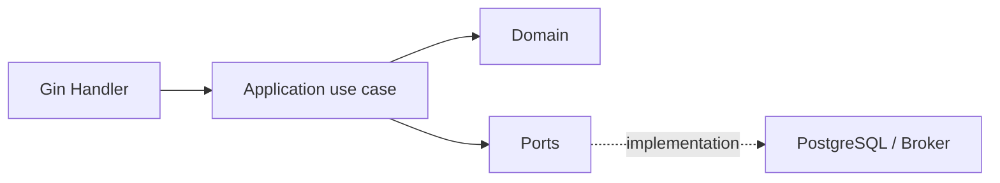

# Go 与 Gin 的服务分层和错误模型

Gin 能快速完成路由、参数绑定与响应，但 Handler 一旦同时拼 SQL、开事务、调用第三方并决定业务状态，HTTP 就成了系统唯一入口。后台任务、gRPC 和测试会复制同一套规则，错误也退化成随处出现的 `500` 或字符串比较。

Go 的优势是依赖和控制流显式。用少量接口、构造函数和稳定错误类别，就能建立清楚的协议、应用、领域与基础设施边界，不需要把每个函数包装成复杂框架。

## 按能力组织，再在内部表达层次

```text
internal/
  document/
    apihttp/
      handler.go
      dto.go
    application/
      publish.go
      ports.go
    domain/
      document.go
      errors.go
    postgres/
      repository.go
      unit_of_work.go
  platform/
    observability/
    database/
  bootstrap/
    app.go
```



Handler 只解析协议、取得可信身份、调用用例并映射响应；应用层决定权限、事务和协作；领域层维护状态不变量；适配器实现数据库、消息和外部 API。依赖只向内，领域包不导入 Gin、SQL Driver 或云 SDK。

接口由使用方定义，且只包含用例需要的能力。一个拥有 40 个方法的全局 Repository 接口会迫使测试实现无关方法，也让模块边界消失。

## 构造函数是组合根的契约

```go
type PublishService struct {
	uow   UnitOfWork
	clock Clock
}

func NewPublishService(uow UnitOfWork, clock Clock) (*PublishService, error) {
	if uow == nil || clock == nil {
		return nil, errors.New("publish service requires uow and clock")
	}
	return &PublishService{uow: uow, clock: clock}, nil
}
```

在 `main/bootstrap` 中读取并校验配置、建立连接池、构造适配器和服务、注册 Handler。业务代码不要通过全局变量或 Service Locator 获取数据库。测试可传入小型 fake，而生产生命周期仍集中管理。

接口的 nil 有 typed nil 陷阱：一个包含 `(*Concrete)(nil)` 的接口不等于 nil。避免把可能为 nil 的指针装入端口；构造阶段完成验证，运行阶段不依赖反射式 nil 检查。

## DTO、命令和领域对象分开

```go
type publishRequest struct {
	ExpectedVersion int64 `json:"expectedVersion" binding:"required,min=1"`
}

type PublishCommand struct {
	DocumentID      string
	ExpectedVersion int64
	IdempotencyKey  string
	Actor           SecurityContext
}

type PublishResult struct {
	DocumentID  string
	Version     int64
	PublishedAt time.Time
}
```

Gin binding 校验输入形状；租户归属、状态是否允许和版本是否冲突由应用/领域判断。不能把 `ShouldBindJSON` 的结构直接传给 SQL Update，否则会产生 mass assignment 和字段生命周期耦合。

领域对象提供行为：

```go
func (d *Document) Publish(now time.Time, expected int64) ([]DomainEvent, error) {
	if d.Version != expected {
		return nil, &ConflictError{Code: "DOCUMENT_VERSION_STALE"}
	}
	if d.State == StateArchived {
		return nil, &ConflictError{Code: "ARCHIVED_DOCUMENT"}
	}
	if d.State == StatePublished {
		return nil, nil
	}
	d.State = StatePublished
	d.Version++
	d.PublishedAt = &now
	return []DomainEvent{NewDocumentPublished(d)}, nil
}
```

重复调用如何处理是显式业务语义，而不是依赖 SQL 最后恰好写成相同值。

## Context 从入口贯穿，但不保存为字段

每个可能阻塞的调用第一个参数为 `context.Context`。Handler 使用 `c.Request.Context()`，Repository 调用 `QueryContext`，外部 HTTP 使用 `NewRequestWithContext`。deadline 和取消沿调用链传播。

不要把 Context 保存在 Service struct、放进领域实体或传 nil；不要用 Context 传可选业务参数。只放请求范围且跨边界必要的元数据，如 trace context；认证主体最好作为有类型的命令字段，避免任意 key 冲突。

客户端取消后可停止尚未提交的查询和外部调用。进入不可分割提交临界区时，应用明确决定回滚还是在独立短 Context 中完成一致性提交，不能默认“请求断了就让数据库处于半状态”。

## 应用服务和事务边界

```go
type TxScope struct {
	Documents DocumentRepository
	Outbox    OutboxRepository
	Requests  IdempotencyRepository
}

type UnitOfWork interface {
	WithinTransaction(ctx context.Context, fn func(TxScope) error) error
}

func (s *PublishService) Execute(ctx context.Context, cmd PublishCommand) (PublishResult, error) {
	if err := cmd.Actor.Require("document:publish"); err != nil {
		return PublishResult{}, err
	}

	var result PublishResult
	err := s.uow.WithinTransaction(ctx, func(tx TxScope) error {
		replay, ok, err := tx.Requests.Find(ctx, cmd.Actor.TenantID, cmd.IdempotencyKey)
		if err != nil { return err }
		if ok { result = replay; return nil }

		doc, err := tx.Documents.FindVisibleForUpdate(ctx, cmd.Actor.TenantID, cmd.DocumentID)
		if err != nil { return err }
		events, err := doc.Publish(s.clock.Now(), cmd.ExpectedVersion)
		if err != nil { return err }
		if err := tx.Documents.Save(ctx, doc); err != nil { return err }
		if err := tx.Outbox.Append(ctx, events); err != nil { return err }

		result = mapPublishResult(doc)
		return tx.Requests.Store(ctx, cmd.Actor.TenantID, cmd.IdempotencyKey, result)
	})
	return result, err
}
```

Repository 不自行 commit。数据库状态与 Outbox 同事务；网络调用移出长事务。事务回调不得泄漏 `*sql.Tx`、Repository 或 ORM 对象到外部。

## 错误类别、包装与判断

错误字符串给人看，不是机器协议。使用可判断的错误类型/哨兵和稳定 Code；用 `%w` 保留 cause，让 `errors.Is/As` 穿过包装链。

```go
type AppError struct {
	Kind    ErrorKind
	Code    string
	Message string
	Cause   error
}

func (e *AppError) Error() string { return e.Message }
func (e *AppError) Unwrap() error { return e.Cause }

func WrapUnavailable(operation string, err error) error {
	return &AppError{
		Kind: KindUnavailable,
		Code: "DEPENDENCY_UNAVAILABLE",
		Message: operation + " temporarily unavailable",
		Cause: err,
	}
}
```

不要通过 `strings.Contains(err.Error(), "duplicate")` 判断唯一约束；适配器检查驱动错误码/约束名，转换成 `ConflictError`。敏感 SQL、DSN、内部路径和第三方正文留在受控日志 cause，不进入公共消息。

| Kind | HTTP | 重试 | 日志 |
| --- | --- | --- | --- |
| Validation | 400/422 | 否 | 低级别聚合 |
| Unauthenticated | 401 | 重新认证 | 安全事件 |
| Forbidden/NotFound | 403/404 | 否 | 审计摘要 |
| Conflict | 409 | 读新版本后 | 结构化业务原因 |
| RateLimited | 429 | 尊重预算 | 指标 |
| Unavailable | 503/504 | 有限退避 | error + cause |
| Internal | 500 | 不盲目重试 | error + stack |

## Gin 只在边界映射错误

```go
func (h *Handler) Publish(c *gin.Context) {
	var body publishRequest
	if err := c.ShouldBindJSON(&body); err != nil {
		writeError(c, validationFromBinding(err))
		return
	}

	cmd := PublishCommand{
		DocumentID: c.Param("documentId"),
		ExpectedVersion: body.ExpectedVersion,
		IdempotencyKey: c.GetHeader("Idempotency-Key"),
		Actor: mustSecurityContext(c),
	}
	result, err := h.publisher.Execute(c.Request.Context(), cmd)
	if err != nil { writeError(c, err); return }
	c.JSON(http.StatusOK, mapResponse(result))
}
```

统一映射器用 `errors.As` 分类，并生成 requestId。未知错误不返回 `err.Error()`；日志记录一次，避免 Repository、Service、Handler 层层重复打印同一错误。Panic recovery 只用于进程保护，不能替代正常错误处理；恢复后返回 500 并记录 stack。

响应写出后再发生错误无法改状态码。流式接口在首字节前完成可失败校验，后续错误用事件协议终态表达。

## 数据范围进入查询

受保护 Repository 的参数包含 tenant 和可见 scope；不要先按全局 ID 查出对象再判断。列表、导出、搜索和队列入口必须复用同一范围模型。

```sql
SELECT public_id, state, version
FROM document_records
WHERE tenant_id = $1
  AND public_id = $2
  AND scope_id = ANY($3)
  AND deleted_at IS NULL
FOR UPDATE;
```

公开接口可把越权和不存在统一为 404，防止枚举；审计仍记录策略拒绝摘要。缓存键包含租户、权限版本和资源版本，不能只按 documentId 缓存。

## 资源、服务器和优雅关闭

`http.Server` 设置 ReadHeaderTimeout、ReadTimeout/WriteTimeout（流式接口单独设计）、IdleTimeout 和最大请求体。数据库池配置 MaxOpenConns、MaxIdleConns、ConnMaxLifetime，并按所有实例总量核算。

```go
func shutdown(ctx context.Context, server *http.Server, db *sql.DB, telemetry Shutdowner) error {
	readiness.MarkUnavailable()
	if err := server.Shutdown(ctx); err != nil { return fmt.Errorf("http shutdown: %w", err) }
	if err := telemetry.Shutdown(ctx); err != nil { return fmt.Errorf("telemetry shutdown: %w", err) }
	return db.Close()
}
```

收到 SIGTERM 后先 not-ready，停止接新请求并排空；后台消费者停止领取新任务，再等待在途工作到 deadline。不能直接 `os.Exit` 跳过 defer，也不能让每个 Web 副本都启动单例 Scheduler。

## 验证：错误与并发必须落到真实边界

```go
func TestPublishMapsStaleVersionToConflict(t *testing.T) {
	service := newServiceWithDocument(t, Document{Version: 4})
	recorder := httptest.NewRecorder()
	ctx, router := testRouter(service, recorder)

	request := httptest.NewRequest(http.MethodPost, "/documents/doc-1/publish", strings.NewReader(`{"expectedVersion":3}`))
	request.Header.Set("Content-Type", "application/json")
	router.ServeHTTP(recorder, request.WithContext(ctx))

	if recorder.Code != http.StatusConflict { t.Fatalf("status=%d", recorder.Code) }
	assertJSONCode(t, recorder.Body.Bytes(), "DOCUMENT_VERSION_STALE")
}
```

| 测试层 | 证明 |
| --- | --- |
| 领域单元 | 状态和版本不变量 |
| 应用单元 | 权限、幂等、事务协作 |
| PostgreSQL 集成 | 租户过滤、唯一约束、锁和回滚 |
| HTTP 契约 | binding、状态码、公共错误体 |
| Race/运行态 | goroutine 安全、取消、优雅关闭 |

运行 `go test -race ./...`，但 race detector 只能发现实际执行路径的数据竞争，不证明业务并发正确。并发版本更新、事务中断、Outbox 重放需要独立集成测试。

## 常见误区

- Handler 直接访问数据库与第三方，Worker 复制规则。
- 定义巨型接口，所有模块依赖同一 Repository。
- 用错误字符串判断类型，或把内部错误原样响应。
- 忽略 `%w`，导致 `errors.Is/As` 无法穿透。
- Context 存在 struct 中，或用它传任意业务参数。
- Repository 各自提交，破坏用例事务。
- 只在前端隐藏操作，不将租户范围下推 SQL。
- Panic recovery 被当作常规异常流。
- 没有服务器 timeout、连接池总量和排空流程。

## 参考资料

- [Effective Go](https://go.dev/doc/effective_go)：接口、错误和并发的语言级惯例。
- [Go 1.13 errors](https://go.dev/blog/go1.13-errors)：`%w`、`errors.Is` 与 `errors.As` 的语义。
- [Gin graceful shutdown](https://gin-gonic.com/en/docs/examples/graceful-restart-or-stop/)：HTTP Server 排空和关闭路径。
- [OWASP REST Security Cheat Sheet](https://cheatsheetseries.owasp.org/cheatsheets/REST_Security_Cheat_Sheet.html)：认证、授权、错误和资源限制。
- [Go 学习日记：Gin 与 Docker/CI 实践](https://juejin.cn/post/7398038441524707362)：我的 Go/Gin 入门项目；本文在此基础上补齐分层、错误和关闭边界。
