# Go 与 Gin 的服务分层和错误模型

我们先做一个 `GET /documents/:id`：记录存在且可见时返回 200，不存在或不在范围内返回 404，数据库暂时不可用返回 503。看似只有一次查询，却涉及 HTTP 参数、身份范围、数据访问和错误映射。

本篇先建立最小执行链，再利用 Go 的接口、构造函数和 `errors.Is/As` 分开职责。重点不是目录数量，而是让每种错误在跨层包装后仍有稳定语义。

## 一次请求经过哪些位置

Handler 解析 HTTP 并取得可信身份；应用 Service 组织用例；Repository 在数据库查询中带上 tenant 和 scope；领域对象维护状态规则。依赖由 `main` 或 bootstrap 显式构造，业务代码不从全局变量取得数据库。

```mermaid
flowchart LR
  H[Gin Handler] --> S[应用 Service]
  S --> D[领域对象]
  S --> R[Repository 接口]
  R --> P[(PostgreSQL)]
  S --> E[应用错误]
  E --> H
```



接口由使用方定义，只包含当前用例需要的方法。小接口既方便 fake，也能暴露模块的真实依赖。DTO、命令和数据库 Row 分开，避免 Gin binding 结构直接进入 SQL 更新。

## 步骤一：Context 和身份显式传递

Handler 使用 `c.Request.Context()`，所有可能阻塞的函数把 `context.Context` 放在第一个参数。数据库使用 `QueryContext`，外部请求使用带 Context 的 API。Context 负责取消、Deadline 和请求范围元数据，不保存到 Service 字段，也不充当任意业务参数袋。

认证中间件构造 `SecurityContext`，再作为有类型的命令字段传入。客户端自报的 `tenant-id` 不能覆盖可信身份。Repository 查询同时携带 tenant 和 scope，不先全局查出对象再判断归属。

## 步骤二：定义机器可判断的错误

错误文本给人阅读，代码则需要错误类别和稳定 Code。使用 `%w` 保留 cause，使 `errors.Is/As` 能穿过 Repository 与 Service 的包装。数据库适配器根据驱动错误码或约束名转换冲突，不用字符串包含判断。

下面是根据 Go 标准错误链重写的最小模型。输入是内部错误，输出仍保留 cause 的应用错误；公共响应只使用 Kind 与 Code，不暴露 SQL、连接串或堆栈。

```go
type AppError struct {
	Kind  ErrorKind
	Code  string
	Cause error
}

func (e *AppError) Error() string { return e.Code }
func (e *AppError) Unwrap() error { return e.Cause }

func Unavailable(err error) error {
	return &AppError{
		Kind: KindUnavailable,
		Code: "DEPENDENCY_UNAVAILABLE",
		Cause: err,
	}
}
```

调用方先把底层错误传给 `Unavailable`，它用 `Cause` 保留原始错误链；Handler 再用 `errors.As` 找到 `AppError`，根据 `Kind` 选择状态码，最后只把 `Code` 和 request ID 写入公共 JSON。输入错误为 400/422，未认证 401，权限或隐藏资源 403/404，版本冲突 409，临时依赖故障 503，未知错误 500。错误只在负责处理的位置记录一次，避免每层重复打印同一 cause。若没有匹配类型，必须落到 500 并记录内部堆栈，而不能把数据库字符串直接返回。

## 步骤三：事务由完整用例控制

Repository 不自行提交。应用 Service 在一个事务中读取可见记录、检查版本、更新状态并追加 Outbox 事件。网络调用离开长事务；事务回调不能把 `*sql.Tx` 或内部 Row 泄漏到外部。

领域方法负责“已归档文档不能发布”“预期版本必须匹配”等规则。重复发布是返回现有结果还是冲突，需要明确业务决定，不能依赖 SQL 最后碰巧写成相同值。

## 步骤四：让服务能停止

HTTP Server 设置读取头、空闲和请求体限制。收到 SIGTERM 后先把 readiness 改为不可接流量，再用带 Deadline 的 `Shutdown` 排空，随后关闭遥测与数据库。后台消费者也停止领取新任务，并等待在途工作到安全边界。

不要在 goroutine 内使用 `log.Fatal` 或 `os.Exit`，它们会跳过 defer 与资源清理。Panic recovery 只保护进程并返回 500，不能代替普通错误流程。

## 正常结果和失败结果

| 场景 | HTTP 结果 | 内部行为 |
| --- | --- | --- |
| 可见记录 | 200 | 返回公共 DTO |
| 不存在或隐藏 | 404 | SQL 未返回越权行 |
| JSON 不合法 | 400/422 | 不进入业务事务 |
| 版本过期 | 409 | 不覆盖新版本 |
| 数据库超时 | 503/504 | Context 取消查询 |
| 未知 panic | 500 | 记录 stack 与 requestId |

测试分层进行：领域测试状态规则，Service 测权限和事务协作，PostgreSQL 集成测试范围、锁和回滚，`httptest` 测状态码与公共错误体。`go test -race ./...` 能发现执行到的数据竞争，但无法单独证明业务并发正确。

## 下一步

HTTP JSON 由服务端和客户端在运行时约定字段，跨服务系统常使用 Protobuf 生成强类型契约。下一篇将从新增一个字段开始，观察 gRPC 契约怎样保持新旧版本兼容。

## 让错误跨层仍然可判断

以查询任务接口为例，Handler 解析路径参数和身份，UseCase 请求 Repository 读取任务。Repository 返回 `not found`、数据库连接错误或正常对象；UseCase 还可能返回“当前用户不可见”。这些结果使用可比较错误类型或 `errors.Is` 链，不依赖字符串内容。

| 错误 | HTTP 映射 | 日志内容 |
| --- | --- | --- |
| 参数无效 | 400 | 安全字段与验证原因 |
| 未认证 | 401 | 认证阶段，不记录凭证 |
| 无权限/不可见 | 按协议 403 或 404 | 主体和资源匿名标识 |
| 资源不存在 | 404 | 查询类型 |
| 版本冲突 | 409 | 期望与当前版本 |
| 未知依赖错误 | 500 | 内部错误链和 trace ID |

Handler 只把领域结果映射为协议，不把 SQL 错误原样返回。依赖通过构造函数装配，测试 UseCase 时传入假的 Repository；Gin 路由测试只关注状态、JSON 和认证上下文。

再增加一个 gRPC 或后台任务入口复用 UseCase。若 UseCase 依赖 `*gin.Context`，复用会被阻断；改为标准 `context.Context` 传递 Deadline 与取消，业务输入使用明确命令结构。分层完成的标志是入口可替换、错误语义稳定，而不是目录数量。
