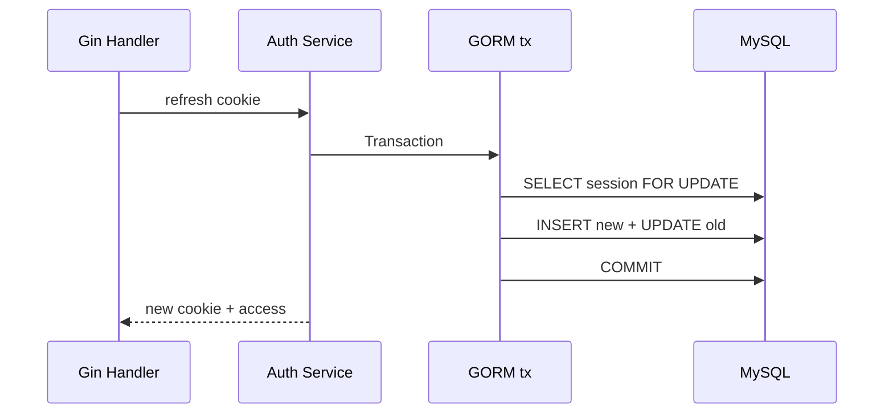

# GORM、MySQL 与 Go 认证授权

GORM 是 Go 的 ORM，负责把 Struct 和查询表达式转换为 SQL；MySQL 保存业务事实；认证与授权确定请求主体以及它能操作的资源。三者横跨数据访问和服务端安全边界，用来让每次查询同时带上事务、租户和权限条件。ORM 不会自动推断这些业务范围。

`db.First(&project, id)` 生成只按主键过滤的 SQL，知道 UUID 的用户便可能读到其他租户项目。GORM 帮助构造 SQL 和映射 Struct，不会推断租户、权限或乐观版本；这些条件必须进入每次查询和事务。

## Model Tag 映射列，但共享 Schema 由迁移拥有

Struct 定义字段类型、列名和关联，指针/Null 类型表达 NULL。UUID 二进制转换、UTC DATETIME(6)、复合索引与约束要与共享 schema.sql 一致。

生产不使用 AutoMigrate 作为唯一 Schema 管理，它不会表达复杂数据回填和兼容发布。golang-migrate 执行审查后的 SQL；空库、上一版本升级与三语言 information_schema 比较。

| Go 字段 | MySQL | 注意 |
| --- | --- | --- |
| ID uuid.UUID/[]byte | BINARY(16) | 统一 Scanner/Valuer |
| Version uint32 | INT UNSIGNED | 条件 UPDATE |
| CreatedAt time.Time | DATETIME(6) | 连接与序列化使用 UTC |
| DeletedAt *time.Time | 可空 DATETIME | 所有查询与唯一性语义 |
| TenantID | BINARY(16) + 索引前缀 | 每条资源查询 |
## Scope 复用查询条件，不隐藏 Principal

Repository 方法接收 Principal/tenantID，构造 `Where("tenant_id=? AND id=?")`。GORM Scope 可复用 active/department 范围，但不能依赖全局变量保存当前租户。

Preload 通常额外查询关联，Joins 可能扩大行数。开启参数化 SQL 日志/Trace 并检查查询数量；列表只选 DTO 字段，避免加载大关联和 N+1。

GORM 用 Struct 做 `Updates` 时默认跳过零值，这在把 `enabled` 改为 false、计数改为 0 时会悄悄不更新。白名单 `map[string]any` 或显式 `Select` 能表达“这个零值是用户提交的”，输入 DTO 则用指针区分缺失和零值。更新后必须检查 `RowsAffected`，不能因 Error=nil 就返回成功。

查询将 Context 与租户条件一起传给 GORM。ErrRecordNotFound 统一映射 NotFound，其他数据库错误保留 cause。

```go
func (r *ProjectRepository) FindScoped(
    ctx context.Context,
    tenantID, projectID uuid.UUID,
) (Project, error) {
    var project Project
    result := r.db.WithContext(ctx).
        Where("tenant_id = ? AND id = ?", tenantID, projectID).
        First(&project)
    if errors.Is(result.Error, gorm.ErrRecordNotFound) {
        return Project{}, ErrProjectNotFound
    }
    return project, result.Error
}
```

返回前不能再按 tenant 比较，因为错误行已经加载。集成测试创建两个租户，并断言跨租户与随机 ID 得到相同错误。
## 事务回调覆盖更新、审计与认证轮换

`db.Transaction` 回调返回 nil 才 commit，返回错误 rollback。回调中的所有 Repository 使用 tx，不可误用全局 db；外部 RabbitMQ/HTTP 不放事务，Outbox 同事务写入。

事务隔离和锁由 MySQL 决定，GORM 只生成语句。库存或 Refresh Session 使用 `FOR UPDATE` 时，查询条件必须命中合适索引并保持一致加锁顺序；否则范围扫描会扩大锁集合。死锁是并发裁决，整笔事务可在有限次数内从头重试，回调里若已发外部消息就无法安全重放，因此消息只能写 Outbox。

Refresh 轮换用 `clause.Locking{Strength:"UPDATE"}` 锁定哈希会话，检查 family/replaced/revoked，创建新行并替换。Argon2id 使用受维护库，参数与其他语言一致；密码验证并发受限。



Cookie 只有 commit 成功后才写响应。commit 结果未知时不签发第二个无关联会话，调用方重新刷新会触发数据库状态判断。
## Go 错误映射保留 errors.Is 链

Repository 包装底层错误用 `%w`，Service 返回领域 sentinel/typed error，HTTP 适配用 errors.Is/As 映射 status/code。不要比较错误字符串，也不要把 MySQL 错误写响应。

驱动返回的 duplicate key、deadlock、lock wait timeout 需要在基础设施层解析成稳定类型。duplicate key 还要按约束名区分用户名冲突、幂等键重复或其他数据问题；把所有 1062 都映射为同一个 409 会让客户端收到错误字段。日志保存 MySQL code、constraint、requestId，响应只给公开的领域 code。

测试运行 go test -race、go test ./...、go vet，MySQL 集成验证 Scope、锁、约束和迁移。连接池 MaxOpenConns 按副本总预算设置，Context timeout 传到每条查询。

GORM 底层仍是 `database/sql` 池，要同时观察 InUse、Idle、WaitCount 与 WaitDuration，不能只调 ORM 参数。
## GORM 数据访问与认证边界

**GORM Hook 适合写审计吗？**

通用 created_at 等可用 Hook，但审计需要 actor、用例、before/after 和事务语义，隐式 Hook 难获得完整上下文。通常由 Service 显式写审计。

**Save 为什么可能覆盖不该改的列？**

Save 常更新所有字段，零值语义也复杂。使用明确 Updates map/struct 和版本条件，只允许白名单字段；检查 RowsAffected。

**Prepared Statement 缓存是否总开启？**

它减少解析但占服务端/客户端资源，并与连接池相关。按驱动/GORM 配置和实际重复查询测量，不把它当 SQL 注入防线；参数绑定本身更基础。

**Go 密码哈希为什么不能每请求启动无限 goroutine？**

Argon2id 故意耗内存/CPU，无限并发可耗尽进程。登录限速并使用 semaphore/Worker 限制哈希并发，按目标硬件参数化。
