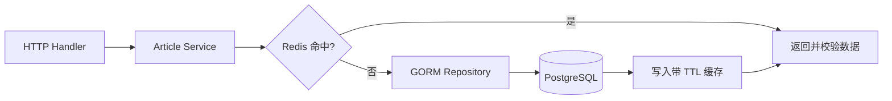

# GORM、PostgreSQL、Redis、Context 与并发

现在要实现一个“查询文章详情”接口。第一次请求从 PostgreSQL 读取，随后写入 Redis；缓存命中时直接返回。客户端中途断开，等待数据库和 Redis 的操作都要尽快停止。文章更新后，接口不能长期返回旧缓存。

这是一个很小的功能，却同时涉及五个后端基础：GORM 负责数据库访问，PostgreSQL 保存事实，Redis 保存可重建副本，Context 传递取消和截止时间，goroutine 只用于真正独立且有上限的并发。

本章会先完成单条读取，再加入缓存和事务，最后给批量读取增加有界并发。代码不会追求完整框架，而是把每个函数的输入、所有者和失败语义说清楚。

## 开始前：先分清四种对象

**`*gorm.DB`** 是并发安全的数据库句柄和会话构造器，通常在应用启动时创建并复用。它不是“一条固定连接”。

**SQL 连接池**由底层 `database/sql` 管理。`SetMaxOpenConns` 限制同时打开的连接，过小会排队，过大会把压力推给数据库。

**事务**把一组数据库操作放进同一个原子边界。读取缓存不属于 PostgreSQL 事务，网络调用也不应长时间占着事务连接。

**Context** 携带取消、Deadline 和请求范围值。它不保存业务可选参数，也不应该被放进结构体长期复用。

## 最终请求链



Handler 从 Gin 取得请求 Context，Service 决定缓存策略，Repository 只负责持久化查询。数据库是事实源；Redis 故障时，系统可以退回数据库，但不能把一个不确定的缓存值当成最终事实。

## 第一步：让 Context 进入每一个阻塞操作

Repository 接收 `context.Context`，并通过 `WithContext` 交给 GORM：

```go
type ArticleRepository struct {
	db *gorm.DB
}

func (r *ArticleRepository) FindByID(
	ctx context.Context,
	id int64,
) (Article, error) {
	var article Article
	err := r.db.WithContext(ctx).
		Where("id = ?", id).
		First(&article).Error
	return article, err
}
```

按调用顺序解释：Repository 保存的是可复用 `*gorm.DB`；`FindByID` 的输入是当前请求 Context 和文章 ID；`WithContext` 让连接等待和 SQL 执行都能观察取消；`Where` 使用绑定参数；`First` 把结果写入局部变量。输出是文章或可判断错误。

Service 不应该把 `gorm.ErrRecordNotFound` 原样泄漏给 Handler。Repository 或 Service 把它映射为领域层的 `ErrNotFound`，Handler 再稳定映射到 404。这样替换 ORM 时，HTTP 契约不会跟着改变。

客户端断开并不保证 PostgreSQL 立刻停止所有工作，但驱动会收到 Context 取消，应用也不会继续等待无用结果。每一层重新创建 `context.Background()` 会切断这条传播链。

## 第二步：先把数据库连接池设成可解释的容量

GORM 初始化后取得底层池：

```go
sqlDB, err := db.DB()
if err != nil {
	return err
}

sqlDB.SetMaxOpenConns(20)
sqlDB.SetMaxIdleConns(10)
sqlDB.SetConnMaxLifetime(30 * time.Minute)
sqlDB.SetConnMaxIdleTime(5 * time.Minute)
```

这四行不是通用推荐值。`20` 和 `10` 只是便于理解的示例，真实配置要结合实例数、数据库 `max_connections`、后台任务和运维保留连接计算。

- `MaxOpenConns` 限制使用中与空闲连接总数；达到上限后请求会等待。
- `MaxIdleConns` 保留可复用连接，减少频繁握手。
- `ConnMaxLifetime` 定期淘汰长寿连接，需考虑代理和数据库的连接寿命。
- `ConnMaxIdleTime` 清理长期不用的空闲连接。

观测 `sql.DB.Stats()` 中的 `InUse`、`Idle`、`WaitCount` 与 `WaitDuration`。接口变慢时，如果 SQL 本身很快但 `WaitDuration` 增长，问题可能在连接池排队。

## 第三步：实现可降级的 Cache-Aside

Cache-Aside 的读路径是：先读缓存，未命中再读数据库，最后把结果写回缓存。Redis 是性能优化，不是文章事实源。

```go
func (s *ArticleService) Get(ctx context.Context, id int64) (Article, error) {
	key := fmt.Sprintf("article:%d", id)
	if article, err := s.cache.GetArticle(ctx, key); err == nil {
		return article, nil
	}

	article, err := s.repo.FindByID(ctx, id)
	if err != nil {
		return Article{}, err
	}

	_ = s.cache.SetArticle(ctx, key, article, 5*time.Minute)
	return article, nil
}
```

函数输入是 Context 和 ID，输出是文章或业务错误。缓存命中直接返回；缓存未命中或 Redis 暂时失败时查数据库；数据库成功后再做尽力写缓存。示例故意忽略缓存写错误，因为一次读取不应因性能副本失败而变成 500，但该错误要进入日志和指标。

生产实现还要区分“缓存不存在”和“缓存连接失败”，验证反序列化后的版本与字段，并给不存在记录设置短时间负缓存，防止大量请求反复查询同一个缺失 ID。负缓存也必须有短 TTL，避免新建记录长期不可见。

## 第四步：更新数据时先提交事实，再处理缓存

一个常见错误是在数据库事务提交之前就删除缓存：删除完成后事务回滚，下一次读又把旧数据库值写回缓存。更清晰的顺序是：

1. 开启 PostgreSQL 事务。
2. 使用条件更新修改文章，检查影响行数。
3. 提交事务。
4. 删除或更新缓存。

缓存删除失败仍可能短暂读到旧值。降低风险有几种办法：使用较短 TTL；缓存值携带数据版本并拒绝旧版本覆盖；通过可靠事件异步失效；对强一致读取直接绕过缓存。选择取决于业务允许多长时间的陈旧数据。

不要把 PostgreSQL 和 Redis 想成一个跨系统事务。仅靠“同时调用两个客户端”不能得到原子提交；若变更事件不能丢，需要引入事务 Outbox，并明确它是新增设计，而不是 GORM 或 Redis 自动提供的能力。

## 第五步：事务边界由完整用例拥有

假设发布文章时既更新文章，又插入审计记录，这两个数据库动作要么一起成功，要么一起回滚。Service 拥有完整用例，因此由它开启事务并把事务句柄交给两个 Repository。

GORM 提供 `db.Transaction(func(tx *gorm.DB) error)`。回调返回错误会回滚，返回 nil 会提交。事务内不要调用不受控的 HTTP、模型或消息服务，否则慢依赖会长期占用连接和行锁。

对“读后写”的竞争，需要明确选择：

- 乐观并发：更新条件带 `version`，影响零行表示数据已被别人修改。
- 悲观锁：在事务内 `SELECT ... FOR UPDATE`，适合冲突频繁且临界区短的场景。
- 数据库唯一约束：保护邮箱、幂等键等真正的不变量，比应用先查后写可靠。

无论使用哪种方式，都要检查 `RowsAffected` 和提交错误。SQL 调用返回 nil 不代表业务条件一定命中。

## 第六步：批量读取需要有界并发

读取十个互不依赖的文章时，可以并发；读取一万个 ID 时不能创建一万个 goroutine。并发上限至少不能超过数据库连接池，还要给普通请求和健康检查留余量。

```go
group, ctx := errgroup.WithContext(ctx)
group.SetLimit(8)

for index, id := range ids {
	index, id := index, id
	group.Go(func() error {
		article, err := service.Get(ctx, id)
		if err != nil {
			return err
		}
		results[index] = article
		return nil
	})
}

if err := group.Wait(); err != nil {
	return nil, err
}
```

`errgroup.WithContext` 在首个错误后取消兄弟任务；`SetLimit(8)` 限制同时执行的函数；循环内重新绑定 `index` 和 `id`，让每个闭包拿到自己的值；不同 goroutine 写不同下标，不改变 slice 结构。输出顺序仍与输入一致。

示例采用 fail-fast：一条失败，整批返回错误。如果产品允许部分成功，应把每项结果设计为 `{value, error}`，而不是吞掉错误。并发语义要进入接口契约。

## 故意制造两个问题

### 问题一：取消没有传到 Redis

把缓存客户端改成使用 `context.Background()`，让 Redis 人为等待五秒，再让客户端断开。数据库请求可能已停止，缓存读取仍占用连接。修复方式是让 Handler 的 Context 原样传到 Service、Cache 和 Repository，并为整条请求设置 Deadline。

### 问题二：缓存删除失败

更新文章后暂停 Redis，再恢复并读取。你可能看到 TTL 到期前的旧值。这不是 PostgreSQL 事务失效，而是缓存一致性策略允许的窗口。记录数据版本、缩短 TTL，或引入可靠失效事件，然后按业务需要验证窗口。

## 怎样验证完整链路

| 测试 | 准备 | 通过标准 |
| --- | --- | --- |
| Repository 集成 | 隔离 PostgreSQL | 找不到映射稳定错误，取消能返回 |
| 缓存集成 | 隔离 Redis | 命中、未命中、坏数据和断连可区分 |
| 事务测试 | 第二次写入故意失败 | 两项数据库变化都回滚 |
| 并发更新 | 两个版本同时提交 | 只有一个条件更新成功 |
| 批量读取 | 记录同时执行数 | 峰值不超过设置的上限 |
| 泄漏检查 | 连续取消请求并看 pprof | goroutine 与连接数不持续增长 |

运行 `go test -race ./...` 检查数据竞争，再使用 `go test -run Integration ./...` 连接明确的隔离服务。Race Detector 不证明缓存一致性或事务正确，这些仍要用业务断言验证。

## 带回项目的实现清单

1. Handler 是否把请求 Context 传到所有 I/O？
2. GORM 连接池上限是否能从数据库总预算解释？
3. Repository 是否隐藏 ORM 错误并保留可判断语义？
4. 数据库是否是事实源，Redis 是否可以被安全重建？
5. 更新提交与缓存失效顺序是否明确？可接受多长陈旧窗口？
6. 事务中是否混入模型、HTTP 或消息等待？
7. goroutine 是否有所有者、并发上限和退出条件？
8. 测试是否真实覆盖 PostgreSQL、Redis、取消与竞争？

迁移练习：为文章列表增加“按作者批量加载详情”。先串行实现并测正确性，再引入 `errgroup.SetLimit`。记录连接池等待和总耗时，解释为什么并发从 8 调到 80 不一定更快。

## 参考资料

- [GORM: Context](https://gorm.io/docs/context.html)
- [GORM: Transactions](https://gorm.io/docs/transactions.html)
- [Go documentation: Managing connections](https://go.dev/doc/database/manage-connections)
- [Go documentation: Canceling database operations](https://go.dev/doc/database/cancel-operations)
- [go-redis guide](https://redis.io/docs/latest/develop/clients/go/)
- [x/sync errgroup](https://pkg.go.dev/golang.org/x/sync/errgroup)
