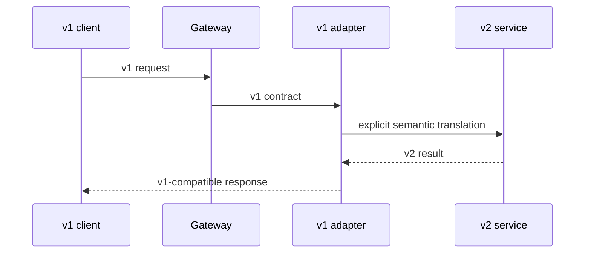

# gRPC 与 Protobuf 契约演进

Protobuf 提供紧凑编码和字段兼容机制，但“能解码”不等于“语义兼容”。改字段含义、把 optional 当 required、改变默认行为，仍会在新旧客户端和服务端共存时产生事故。gRPC 契约还包括状态码、deadline、幂等、流式顺序、认证元数据和发布节奏。

## 契约不只是 `.proto`

一次 RPC 的公共协议包含：

- 方法名与请求/响应消息；
- 字段编号、presence、单位、范围和默认语义；
- gRPC status code 与 error details；
- 是否幂等、能否重试、超时预算；
- metadata 中的认证和追踪约定；
- 流式消息顺序、终态和背压；
- 兼容窗口与废弃时间线。

这些内容应在 proto 注释、契约测试和变更说明中可发现，不能只靠调用双方口头约定。

## 字段编号是长期身份

```proto
syntax = "proto3";

package example.document.v1;

message PublishDocumentRequest {
  string document_id = 1;
  int64 expected_version = 2;
  string idempotency_key = 3;
  optional string reason = 4;
}

message PublishDocumentResponse {
  string document_id = 1;
  int64 version = 2;
  google.protobuf.Timestamp published_at = 3;
}
```

已发布字段不能更换编号，删除后编号和名称都 `reserved`，避免未来复用后旧数据被误解：

```proto
message DocumentView {
  reserved 5, 7 to 9;
  reserved "legacy_owner", "temporary_state";
  string document_id = 1;
  string state = 2;
}
```

同一个编号改变类型只有少数 wire-compatible 组合，也未必应用语义兼容。不要把 `int32` 时间秒直接改成毫秒，或把 string ID 改成任意含义的 bytes。新增字段通常安全，但服务端不能立即假设所有客户端都会发送它。

## Presence、默认值与枚举

proto3 标量在没有 `optional` 时，缺失和默认值可能不可区分。对 PATCH、配置覆盖和“0 是合法值”的字段使用 `optional`、wrapper 或 FieldMask，明确三态语义。

```proto
message UpdateRetentionRequest {
  string resource_id = 1;
  optional int32 retention_days = 2;
  google.protobuf.FieldMask update_mask = 3;
}
```

枚举第一个值用 `UNSPECIFIED = 0`，服务端拒绝或按明确默认处理。消费者必须容忍未来未知枚举值，不能用无 default 的 switch 后继续零值业务。

```proto
enum TaskState {
  TASK_STATE_UNSPECIFIED = 0;
  TASK_STATE_QUEUED = 1;
  TASK_STATE_RUNNING = 2;
  TASK_STATE_SUCCEEDED = 3;
  TASK_STATE_FAILED = 4;
}
```

改变枚举已有值名称虽不改 wire number，也会影响 JSON 映射、日志和生成代码。废弃旧值，增加新值并维护转换窗口。

## 包与服务版本策略

破坏性语义使用新 package/service 版本，如 `example.document.v2`，不要在同名 v1 方法上突然改变含义。并非每次新增字段都升 major；版本用于无法通过兼容扩展完成的变化。



兼容适配器显式转换语义，比在核心服务中散落“如果旧客户端”更可测试。设定 v1 停止新增能力、使用量观测、迁移文档、废弃日期和最终下线门禁。

## 状态码表达机器可处理语义

不要所有失败都返回 `Internal` 或把错误塞进成功响应。常见映射：

| 场景 | gRPC code | 客户端行为 |
| --- | --- | --- |
| 请求格式/值无效 | InvalidArgument | 修正请求，不重试 |
| 未认证 | Unauthenticated | 刷新凭证 |
| 权限不足 | PermissionDenied | 不换参数试探 |
| 可见范围内不存在 | NotFound | 业务缺失 |
| 版本/状态冲突 | Aborted / FailedPrecondition | 读取新状态或修正前置条件 |
| 配额 | ResourceExhausted | 按策略退避 |
| 临时依赖失败 | Unavailable | 幂等且有预算时重试 |
| deadline 到期 | DeadlineExceeded | 不确定结果需查询状态 |

`codes.Aborted` 常用于并发冲突可重试事务，`FailedPrecondition` 表示系统当前状态不允许；团队需统一。Error Details 使用 `google.rpc.ErrorInfo`、`BadRequest`、`RetryInfo` 等标准消息，公共 metadata 不含内部堆栈和敏感值。

```go
func statusFromError(err error) error {
	var conflict *VersionConflict
	if errors.As(err, &conflict) {
		st := status.New(codes.Aborted, "document version changed")
		withDetails, detailErr := st.WithDetails(&errdetails.ErrorInfo{
			Reason: "DOCUMENT_VERSION_STALE",
			Domain: "document.example",
		})
		if detailErr != nil { return st.Err() }
		return withDetails.Err()
	}
	return status.Error(codes.Internal, "internal error")
}
```

## Deadline 是端到端预算

gRPC 默认不自动设置 deadline。客户端为调用指定业务预算；服务端读取 Context 剩余时间，把更小 deadline 传给数据库和下游。每一层若重新给完整 5 秒，链路可能远超用户预算。

```go
func childContext(ctx context.Context, reserve time.Duration) (context.Context, context.CancelFunc, error) {
	deadline, ok := ctx.Deadline()
	if !ok { return nil, nil, errors.New("missing rpc deadline") }
	remaining := time.Until(deadline) - reserve
	if remaining <= 0 { return nil, nil, context.DeadlineExceeded }
	child, cancel := context.WithTimeout(ctx, remaining)
	return child, cancel, nil
}
```

Context 取消要传播，不被宽泛错误包装成 Internal。deadline 到达不证明服务端副作用未发生：客户端对非幂等写不能直接重试，应使用 idempotency key 或状态查询。

## 重试、服务配置与幂等

gRPC retry 只能对声明可重试状态、在 attempt 数与 deadline 内执行。透明重试和 Service Config 不会让业务写操作自动幂等。读请求通常可安全重试；创建/发布类命令携带业务幂等键，服务端用唯一约束保存结果。

避免层层重试：客户端、Gateway、服务和数据库都重试三次会指数放大。指定唯一责任层；服务内部只处理局部已知暂时故障，客户端负责 RPC 级预算。退避加抖动并尊重 `RetryInfo`。

## Metadata 与拦截器

认证凭证、trace context 和请求关联可通过 metadata 传递，但 metadata 大小有限且会经过代理/日志。不要传完整业务对象、内部路径或长期敏感数据。服务端从经过验证的身份令牌构造 SecurityContext，不能信任客户端自报 `tenant-id`。

Unary/Stream interceptor 适合认证、观测、panic recovery、限流和公共错误映射。业务资源授权仍在应用层，因为它需要 action 与对象范围。

```go
func unaryDeadlineInterceptor(defaultLimit, maxLimit time.Duration) grpc.UnaryServerInterceptor {
	return func(ctx context.Context, req any, info *grpc.UnaryServerInfo, handler grpc.UnaryHandler) (any, error) {
		ctx, cancel, err := enforceDeadline(ctx, defaultLimit, maxLimit)
		if err != nil { return nil, status.Error(codes.InvalidArgument, err.Error()) }
		defer cancel()
		return handler(ctx, req)
	}
}
```

Recovery interceptor 记录 stack 后返回 Internal，但不能把 panic 当可重试的正常异常。

## 流式 RPC：顺序、背压和部分完成

Server streaming、client streaming、bidirectional streaming 都需要应用协议。HTTP/2 流量控制提供传输背压，但应用还要限制消息大小、发送队列、并发流和每主体速率。

长流消息带 sequence、eventId 和 schema version。断线后是否可恢复由业务定义；gRPC 本身不会自动重放已确认的应用事件。可靠任务进度仍来自持久事件日志，客户端重连传最后游标或先获取快照。

服务端发送失败时不能假设客户端没收到上一条；客户端发送成功也不表示业务已提交。流末尾 status 表达通道终止，业务终态最好有明确消息/可查询状态。

## 大消息和上传

默认消息大小有限，调大上限会增加内存和 DoS 风险。大文件不应作为一个巨型 protobuf message 穿过多个服务。使用受控 chunk stream 或对象存储直传：每片有序号/摘要，服务端限制总大小与并发，最终合并验证整体摘要。

敏感文件的下载 URL 短期、单资源、受权限控制。文件标识和元数据进入 RPC，字节面与控制面分离通常更容易扩展。

## 生成代码、Buf 门禁和所有权

Proto 是源文件，生成代码不手改。固定 protoc、插件和 Go module 版本，使用可复现生成命令。CI 用 `buf lint` 与 breaking change 检查对比主分支/发布标签。

Breaking checker 能发现编号删除、类型变化等结构问题，发现不了“同字段单位从秒改毫秒”这类语义破坏，因此还需契约测试与 review checklist。Proto 目录有明确 owner，公共类型避免形成无人治理的大 `common.proto`。

## 发布顺序与兼容矩阵

安全扩展通常：先部署能读取新旧格式的服务端，再升级客户端发送新字段，观测旧客户端减少，最后才收缩旧路径。若服务调用链多层，按“reader before writer”传播。

| 客户端 | 服务端 | 必须结果 |
| --- | --- | --- |
| old | old | 基线正常 |
| old | new | 新字段缺失仍按旧语义工作 |
| new | old | 新字段被忽略时不能造成危险默认 |
| new | new | 新能力生效 |

若 new client -> old server 会导致不可接受行为，就需要能力协商、新方法或先阻止客户端启用，而不是依赖部署“应该很快”。

## 验证：协议、故障与滚动共存

```go
func TestUnknownFieldsSurviveProxyRoundTrip(t *testing.T) {
	original := newV2MessageWithFutureField(t)
	encoded, _ := proto.Marshal(original)

	var old examplev1.DocumentView
	if err := proto.Unmarshal(encoded, &old); err != nil { t.Fatal(err) }
	reencoded, _ := proto.Marshal(&old)

	var restored dynamicpb.Message
	decodeFutureDescriptor(t, reencoded, &restored)
	assertFutureFieldPreserved(t, &restored)
}
```

注意：代码若重建一个全新消息而不是修改/转发已解码消息，未知字段可能丢失，具体行为需按语言 runtime 测试，不能只靠 wire 理论。

验证矩阵：字段缺失/未知枚举、old/new 四组合、deadline 传播、客户端取消、重复幂等命令、服务端提交后响应丢失、流中途断开与游标恢复、代理消息大小、错误 details 脱敏。用 `grpcurl` 只能做人工探测，CI 需要自动契约测试。

## 常见误区

- 字段删除后复用相同编号。
- 结构可解码就认为语义兼容。
- 标量缺少 presence，却需要区分未传和零值。
- 所有错误都是 Internal，或错误塞在成功响应。
- 客户端不设 deadline，下游各自重新给完整超时。
- Service Config 开启重试后默认所有写操作安全。
- metadata 信任客户端 tenant，或记录完整凭证。
- 流式 RPC 只依赖连接，不保存事件序号和终态。
- Buf breaking check 通过就跳过语义 review。
- 同一时刻发布破坏性客户端和服务端，没有共存窗口。

## 参考资料

- [Protocol Buffers Programming Guide](https://protobuf.dev/programming-guides/proto3/)：字段编号、presence、枚举与兼容语义。
- [gRPC Deadlines](https://grpc.io/docs/guides/deadlines/)：截止时间传播和服务端取消。
- [gRPC Retry](https://grpc.io/docs/guides/retry/)：透明重试、Service Config 和重试承诺边界。
- [gRPC Flow Control](https://grpc.io/docs/guides/flow-control/)：流式 RPC 的发送与接收背压。
- [Buf Breaking Change Detection](https://buf.build/docs/breaking/)：Proto 静态兼容门禁及其覆盖范围。
