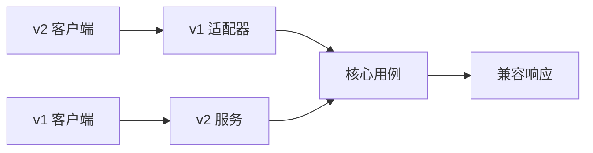

# gRPC 与 Protobuf 契约演进

服务第一版返回文档的 `id` 和 `title`，第二版想增加 `status`。新服务上线时仍有旧客户端，旧服务也可能短暂接到新客户端请求。只要字段编号和语义保持兼容，双方可以在滚动发布期间继续通信。

本篇从这次小改动开始，解释 Protobuf 为什么用字段编号作为长期身份，再进入默认值、错误状态、Deadline 和流式协议。`.proto` 能编译只是起点，跨版本测试才证明契约没有被破坏。

## 契约包含哪些内容

契约不止请求与响应字段，还包括字段单位和含义、缺失值、错误码、调用是否幂等、超时预算、Metadata、流式顺序和兼容窗口。这些内容应出现在 proto 注释、变更说明和测试中，而不是依靠调用双方口头记忆。



## 步骤一：字段编号一旦发布就保留

Protobuf 的二进制格式主要依靠编号识别字段。新增一个从未使用的编号通常兼容，旧客户端会忽略未知字段。删除字段后，应同时 `reserved` 编号和名称，防止未来复用后让旧数据产生新含义。

```proto
syntax = "proto3";
package example.document.v1;

message DocumentView {
  reserved 4;
  reserved "legacy_owner";

  string document_id = 1;
  string title = 2;
  optional string status = 3;
}
```

输入是旧有 1、2 号字段，输出新增 3 号可选字段。旧客户端仍读取 ID 和标题；新客户端可以判断 status 是否存在。修改字段编号、复用 4 号或把同一数字单位从秒变毫秒，都可能造成语义破坏。

## 步骤二：区分缺失和默认值

proto3 普通标量可能把缺失和零值表示得相同。PATCH、配置覆盖或“0 本身合法”的场景使用 `optional`、wrapper 或 `FieldMask`，明确“不修改”“设为 0”“清空”的差异。

枚举的 0 值使用 `UNSPECIFIED`，服务端选择拒绝或明确默认。消费者要容忍未来未知枚举值，不能用没有 default 的 switch 后继续零值业务。已有枚举名称变化还会影响 JSON 映射和生成代码，需要按契约变更处理。

无法通过新增字段兼容的语义变化，发布新的 package/service 版本，例如 v2，并使用显式适配器转换。适配器比在核心代码中散落“如果是旧客户端”更容易测试与下线。

## 步骤三：用状态码表达客户端动作

`InvalidArgument` 表示修正请求，`Unauthenticated` 表示重新认证，`PermissionDenied` 不应换参数试探，`NotFound` 表示当前可见范围不存在，`Aborted` 常用于并发冲突，`Unavailable` 只在幂等且有预算时重试。

Error Details 可以携带稳定原因、字段错误和受限重试提示，但不公开内部堆栈、SQL 或敏感 Metadata。不要把所有失败都变成 `Internal`，也不要在成功响应里塞一个字符串错误字段。

## 步骤四：Deadline 是整条链路的预算

gRPC 默认不会自动替业务设定 Deadline。客户端给出总预算，服务端读取剩余时间，再为数据库和下游划分更小的子预算。每一层重新获得完整五秒，会让整条链路远超用户等待时间。

Deadline 到达只说明客户端停止等待，不证明写操作没有发生。非幂等命令要携带业务幂等键，或者在超时后通过状态查询确认结果。重试责任也要集中，避免客户端、网关和服务各重试三次造成指数放大。

## 流式 RPC 还需要应用协议

HTTP/2 有传输层流量控制，但应用仍要定义消息大小、顺序、游标、终态和部分完成语义。服务端流中途失败时，客户端需要知道已经接收的序号和恢复方式。慢消费者拥有有界发送预算，超过预算后受控中止或要求重同步。

Metadata 适合认证和 Trace 上下文，不适合传完整业务对象。拦截器处理认证、观测、限流与公共错误映射；需要资源状态的授权仍在应用层完成。

## 正常结果和失败结果

| 变更或运行场景 | 预期 |
| --- | --- |
| 新增未使用编号的可选字段 | 旧客户端继续工作 |
| 删除字段并 reserved | 兼容门禁允许，未来不可复用 |
| 复用删除编号 | CI 契约检查失败 |
| 新增未知枚举值 | 旧客户端进入明确兜底 |
| Deadline 耗尽 | 返回 DeadlineExceeded，停止下游工作 |
| 非幂等写超时 | 查询状态，不盲目重试 |
| 流中断后恢复 | 按应用游标继续或重新取快照 |

验证需要保存上一发布版本的描述符或 proto，执行 breaking change 检查，并进行 old-client/new-server、new-client/old-adapter 的交叉测试。还要覆盖错误详情、Deadline 传播、最大消息和流式取消。

## 下一步

Deadline 依靠 Go Context 传播，而实际服务往往还会启动许多 goroutine。下一篇会搭一条有界并发流水线，观察取消和背压怎样阻止 goroutine 泄漏。

## 做一次新旧客户端兼容实验

先生成 V1 客户端和服务器，再在消息中新增一个可选字段并生成 V2。用 V1 客户端请求 V2 服务端，确认未知字段不会破坏解析；再用 V2 客户端请求 V1 服务端，确认缺失字段按定义处理。已经发布的字段编号永不复用，删除字段后使用 `reserved` 保留编号和名称。

| 变化 | 通常是否兼容 | 处理方式 |
| --- | --- | --- |
| 新增可选字段 | 通常可兼容 | 服务端定义缺失语义 |
| 改字段编号 | 不兼容 | 保留旧编号，新增字段 |
| 改字段含义 | 语法可能兼容，语义不兼容 | 新字段或新 RPC |
| 删除枚举值 | 可能破坏旧数据 | 保留并逐步停用 |
| 收紧 Deadline | 行为变化 | 灰度、观测和客户端说明 |

状态码告诉客户端下一步：参数错误不重试，`UNAVAILABLE` 可能有限重试，`DEADLINE_EXCEEDED` 表示整条预算耗尽。错误详情仍要版本化，不能把服务端堆栈传出。

流式 RPC 还要定义消息顺序、完成信号、背压和断线恢复。兼容性测试应放入 CI，使用已发布描述符或旧生成客户端，而不是只编译当前版本。契约能够解析只是第一层，业务默认值和状态变化也要核对。
