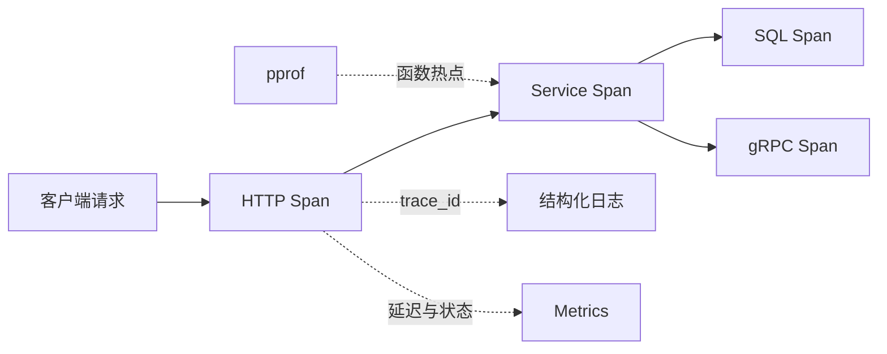

# OpenTelemetry、测试、性能分析与部署

一个 Go 接口的 P95 从 80ms 升到 600ms。HTTP 日志只有一行“请求成功”，CPU 看起来也不高。问题可能是数据库连接池等待、下游 gRPC 变慢、Redis 超时，或者某个新版本分配了大量内存。

本章不靠猜。我们会把同一个请求贯穿 Trace、Metric 和日志，再用测试、Benchmark 与 pprof 验证假设，最后把这些验证放进容器发布流程。目标是让“服务慢了”变成可定位的问题，也让优化结论可以复现。

## 先分清四类证据

**日志**记录离散事件，例如请求 ID、错误码和任务状态。它适合回答“发生了什么”，但不适合从海量日志中实时计算所有趋势。

**Metric**是按时间聚合的数值，例如请求量、延迟直方图和连接池等待。它适合回答“问题规模多大、何时开始”。

**Trace**把一次请求跨 HTTP、Service、SQL、Redis 与 gRPC 的多个 Span 串起来。它适合回答“这一条请求时间花在哪里”。

**Profile**按 CPU、内存、阻塞或锁统计程序内部热点。它适合回答“哪个函数消耗资源”，但不能替代业务链路上下文。



这四类证据需要能互相定位，但不能把用户输入、访问令牌或完整模型内容放进标签和日志。

## 第一步：在入口创建并传播 Trace

OpenTelemetry 使用 `Context` 传播当前 Span。HTTP 中间件从 W3C `traceparent` 读取上游上下文，创建服务端 Span；向 gRPC 或 HTTP 下游发请求时，再把同一个上下文注入出去。

```go
func (s *ArticleService) Get(ctx context.Context, id int64) (Article, error) {
	ctx, span := s.tracer.Start(ctx, "article.get")
	defer span.End()

	article, err := s.repo.FindByID(ctx, id)
	if err != nil {
		span.RecordError(err)
		span.SetStatus(codes.Error, "repository failed")
		return Article{}, err
	}
	return article, nil
}
```

函数接收上层 Context，`Start` 返回包含新 Span 的 Context，后续 Repository 必须使用这个新值；`defer span.End()` 保证所有返回路径结束 Span；失败时记录错误和稳定状态描述。输出仍是领域对象，不让观测 SDK 改变业务契约。

不要给每个小函数都建 Span。Span 应代表值得单独分析的边界：外部请求、SQL、缓存、队列、模型调用或关键业务阶段。太碎会增加成本，也让链路难以阅读。

属性值选择稳定、低基数的维度，例如 `http.request.method`、路由模板、RPC 服务名和业务结果类型。用户 ID、文章 ID、完整 URL 查询串通常是高基数数据，应放到受控日志或完全不采集。

## 第二步：用 Metric 先确认问题规模

接口观测至少包含请求数、错误数和延迟直方图。数据库还要观察连接池的 `InUse`、`WaitCount`、`WaitDuration`；Worker 观察队列年龄与终态；运行时观察 goroutine、堆和 GC。

延迟使用 Histogram，而不是只上报平均值。平均 100ms 可能掩盖大部分请求 20ms、少量请求 3s 的情况。直方图 Bucket 需要按业务 SLO 选择，让查询能判断请求落在 100ms、300ms、1s 等区间。

标签不要包含原始错误文本。把错误映射为有限集合，例如 `not_found`、`dependency_timeout`、`validation`、`internal`。否则每一条 SQL 或供应商错误都可能形成新的时间序列。

一个实用排查顺序是：

1. 用 Metric 确认哪些路由、版本和时间段异常。
2. 从异常时间段抽取代表性 Trace。
3. 通过 `trace_id` 查看同一次请求的结构化日志。
4. 如果耗时在进程内部且 Span 仍不够细，再抓 Profile。

## 第三步：让日志可以关联，但不泄露内容

日志字段应服务排障，而不是把对象序列化后全部打印。一次请求可记录：时间、级别、服务、环境、版本、路由模板、结果类型、耗时、`trace_id` 与 `span_id`。

敏感字段包括访问令牌、Cookie、Authorization、用户文档、提示词、工具原始结果和个人信息。它们不应进入普通日志。需要调试内容时，使用受控抽样、脱敏、短保留期和访问审计。

错误日志在最接近处理边界的位置记录一次即可。Repository、Service 和 Handler 每层都打印同一个错误，会造成三条重复告警；更好的做法是下层返回带语义的错误，上层在知道请求结果时统一记录。

## 第四步：测试分层决定你能相信什么

Go 服务通常需要四层验证：

| 层次 | 真实依赖 | 主要发现 |
| --- | --- | --- |
| 单元测试 | 假 Repository、假时钟 | 业务分支、错误映射、重试判断 |
| Repository 集成 | 隔离 PostgreSQL/Redis | SQL、事务、序列化、取消 |
| 协议/契约测试 | `httptest`、gRPC BufConn 或真实服务 | 状态码、Header、Protobuf 兼容 |
| 端到端测试 | 构建后的服务与依赖 | 路由、配置、迁移和启动行为 |

单元测试不证明 SQL 正确，端到端测试也不适合穷举所有业务边界。把关键规则放在快速测试中，用较少集成与端到端测试证明边界连接。

取消和超时是本课程的重点，应真实测试：创建一个会阻塞的假下游，设置短 Deadline，断言 Service 返回 `context.DeadlineExceeded`，并确认后台 goroutine 已退出。并发代码额外运行 `go test -race ./...`。

## 第五步：Benchmark 先固定输入和环境

Go Benchmark 用 `go test -bench` 重复执行函数，并报告每次操作耗时；配合 `-benchmem` 还能看到分配次数。它适合比较同一环境下两种实现，不适合直接宣称线上吞吐。

```bash
go test -run '^$' -bench BenchmarkDecode -benchmem -count 5 ./internal/codec
```

命令跳过普通测试，只运行指定 Benchmark，记录内存分配，并重复五轮。执行前固定 Go 版本、CPU、并行度、输入数据和依赖状态；有网络或数据库时，结果更容易受环境抖动影响。

比较优化前后时保留原始输出，并使用 `benchstat` 做统计比较。只看最快一轮容易得到偶然结论。编译器、CPU 频率和 GC 配置变化也要记录。

## 第六步：pprof 告诉你函数热点

开发或受控环境可以暴露 `net/http/pprof`，生产环境必须通过内网、鉴权或临时调试入口保护，不能直接公开到互联网。

常用 Profile：

- CPU：在采样窗口内哪些调用栈消耗 CPU。
- Heap：哪些对象仍占用内存，或哪里产生分配。
- Goroutine：当前 goroutine 在哪里等待，可发现泄漏与死锁线索。
- Block：Channel、锁等阻塞位置，需要启用相应采样。
- Mutex：锁竞争热点，需要设置采样比例。

抓取 30 秒 CPU Profile 的典型命令：

```bash
go tool pprof -http=:0 'http://service-debug/debug/pprof/profile?seconds=30'
```

这是受控调试地址的占位写法。`-http=:0` 让本机选择临时端口打开分析界面。抓取时记录流量、版本和输入，否则热点变化可能只是请求类型不同。

如果 Trace 显示数据库 Span 很慢，先看查询和连接池；如果 Service Span 慢但子 Span 都快，再用 CPU、Heap 或 Mutex Profile 检查进程内部。不要看到 CPU 火焰图就忽略外部等待。

## 第七步：健康检查不等于业务测试

健康接口至少区分：

- Liveness：进程是否仍能运行。失败可能触发重启，检查要轻。
- Readiness：实例是否可以接收新流量。停机排空时先变为失败。
- Startup：模型加载、迁移检查等慢启动过程是否完成，避免被过早重启。

Readiness 可以检查必要依赖，但要设置很短超时并避免形成额外负载。把所有外部服务串行深查会让健康接口本身成为故障放大器。

业务验证则使用一个低风险请求检查鉴权、数据库、缓存或 RPC 的真实路径。它属于候选验证和部署回归，不应由集群每秒调用。

## 第八步：把验证放进不可变制品交付

Go 二进制和容器镜像在 CI 中构建一次。制品记录源码提交、Go 版本、依赖摘要和镜像 Digest；候选环境和生产环境提升同一个 Digest，不在服务器重新编译。

发布顺序可以这样组织：

1. `go test ./...`、`go test -race ./...` 和静态检查通过。
2. 为关键包执行 Benchmark，只把明确阈值作为阻断条件。
3. 构建二进制和镜像，生成 SBOM 并扫描依赖。
4. 启动候选实例，验证 startup/readiness、迁移兼容和最小业务请求。
5. 小范围切流，比较错误、延迟和资源指标。
6. 异常时把流量切回仍在运行的旧实例。

容器中的 Go 进程需要接收 SIGTERM。收到信号后先关闭 readiness，调用 `http.Server.Shutdown(ctx)` 停止接收新请求并等待在途请求；排空使用明确 Deadline，最后 Flush Trace/Metric Provider。

## 一次完整排查演练

现在回到开头的 P95 上升：

1. Metric 显示只有文章详情路由变慢，错误率未上升。
2. Trace 显示 Service 自身很快，SQL Span 开始前有明显等待。
3. `sql.DB.Stats()` 的 `WaitCount` 和 `WaitDuration` 同时增长。
4. 查看 goroutine Profile，许多请求等待数据库连接；CPU Profile没有热点。
5. 对照发布记录发现新版本增加了并发批量查询，却没有限制 goroutine 数。
6. 在隔离环境复现相同输入，用有界 `errgroup` 修复并运行集成测试、Race Detector 与 Benchmark。

这个故事是教学演练，不是声称发生过的线上事故。它展示的是证据怎样逐步缩小范围：先判断是否普遍，再定位链路阶段，最后才进入函数和配置。

## 可以带回工作的发布与排障清单

1. Trace 是否从 HTTP 传播到 SQL、Redis、gRPC 和消息处理？
2. Metric 标签是否低基数，延迟是否使用合理 Histogram？
3. 日志是否能用 trace ID 关联，同时完成敏感信息过滤？
4. 单元、集成、契约和端到端测试各自保护了什么？
5. 性能实验是否固定版本、输入、环境并保留原始结果？
6. pprof 入口是否受保护，Profile 是否与异常流量同时采集？
7. liveness、readiness、startup 和业务探针是否职责分开？
8. 构建是否只发生一次，回滚时旧实例和旧制品是否仍可用？

迁移练习：给文章查询增加一个 gRPC 作者服务。传播 Trace Context，加入 RPC Deadline 和稳定错误映射，再让测试服务延迟返回。观察 Metric、Trace 和日志能否共同说明时间花在哪里。

## 参考资料

- [OpenTelemetry Go documentation](https://opentelemetry.io/docs/languages/go/)
- [Go documentation: Diagnostics](https://go.dev/doc/diagnostics)
- [Go package net/http/pprof](https://pkg.go.dev/net/http/pprof)
- [Go documentation: Testing packages](https://pkg.go.dev/testing)
- [Go documentation: Managing connections](https://go.dev/doc/database/manage-connections)
- [W3C Trace Context](https://www.w3.org/TR/trace-context/)
