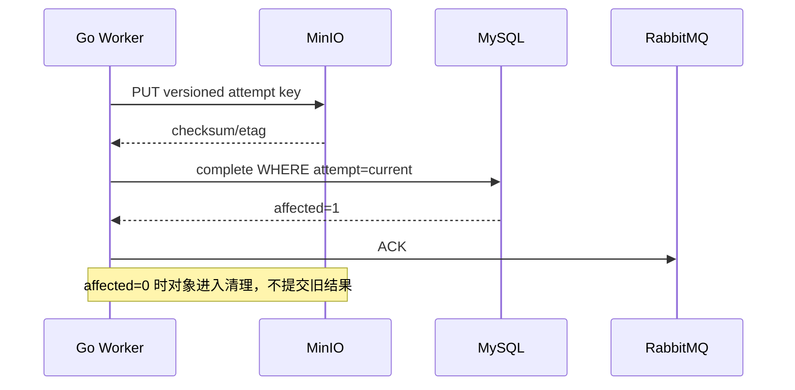

# Go 接入 Redis、RabbitMQ、MinIO 与测试

Go Worker 收到 SIGTERM 后停止 ACK，却没有取消 MinIO 上传；`WaitGroup.Wait` 一直不返回，编排器最终强杀。外部调用都要接收 Context，Consumer 要停止拉取、等待有限在途工作，再关闭 Channel、Redis、MinIO Transport 和数据库。

## 安装 Go 并准备本地依赖

Go 的官方二进制和安装说明在 [go.dev/dl](https://go.dev/dl/)；按系统和架构选择安装包后，重新打开终端确认版本。页面截图只用于定位下载区域，版本和校验值以当前官方页面为准。

<figure class="doc-shot">
  
  <figcaption>Go 官方下载页。优先选择与本机架构匹配的安装包，安装后用 `go version` 验证 PATH 和架构。</figcaption>
</figure>

```bash
go version
go env GOMODCACHE GOPATH
go mod download
```

`go version` 只验证编译器可用；`go mod download` 才会验证当前模块依赖能从配置的代理或缓存取得。Redis、RabbitMQ 和 MinIO 可以使用项目隔离的 Compose 服务，连接地址、凭证和端口必须从环境变量注入，不能写死在适配器里。

## 适配器接口由业务动作定义

Cache 暴露 GetProject/Invalidate，Publisher 暴露 PublishOutboxEvent，ObjectStore 暴露 Presign/Head/Put，不把 redis.Client/amqp.Channel/minio.Client 传遍 Service。实现统一 timeout、错误分类、Tracing 和前缀。

客户端通常并发安全但连接/Channel 语义不同：Redis/HTTP 可复用池，RabbitMQ Channel 失败后需要重建；不要每任务 dial 新连接。

RabbitMQ 自动重连不能只重新 Dial。连接恢复后，旧 Channel、Consumer Tag、Confirm 流都已失效；代码要重新声明 Exchange/Queue/Binding，建立 Confirm Channel，再开始 publish/consume。恢复过程使用单一 owner 和退避，其他 goroutine 通过状态等待，避免同时创建几十条连接。

| 适配器 | Context 取消效果 | 关闭关注 |
| --- | --- | --- |
| Redis | 命令/等待连接返回 | 关闭 Client/池 |
| RabbitMQ publish | SDK 可能需 select 包装 confirm | 停止发布、关 Channel/Connection |
| RabbitMQ consume | cancel consumer/关闭 delivery | 处理未 ACK |
| MinIO | HTTP request/上传取消 | 关闭 idle connections |
| MySQL | QueryContext/事务 | rollback + close pool |

## Consumer 用 errgroup 与 semaphore 管理在途任务

主循环读取 deliveries，先获取并发令牌再启动 goroutine；每个任务派生有界 Context。SIGTERM 取消主 Context，调用 basic.cancel/停止读取，不再领取新消息；已领取任务按业务决定完成或取消后 NACK。

ACK/NACK 对应的 Channel 操作要串行或遵循客户端并发保证。数据库事务提交后 ACK，重复 event_id 由 Inbox 唯一约束吸收。

关闭骨架把所有权放在 Run。真实实现还需处理 Channel 关闭、重连和 confirm，不在 goroutine 中丢弃 error。

```go
func (w *Worker) Run(ctx context.Context) error {
    group, workerCtx := errgroup.WithContext(ctx)
    group.SetLimit(w.maxConcurrent)
    for {
        select {
        case <-workerCtx.Done():
            w.consumer.Cancel()
            return group.Wait()
        case delivery, ok := <-w.deliveries:
            if !ok { return group.Wait() }
            d := delivery
            group.Go(func() error { return w.handle(workerCtx, d) })
        }
    }
}
```

若 handle 因一条业务坏消息返回 error 导致整个 group 取消，可能过度。实现应先分类：不可重试消息 DLQ 并返回 nil，基础设施致命错误才终止 Worker。

Delivery 的 ACK/NACK 必须只执行一次。把确认责任留在 Run/handle 的明确位置，不在多个 defer 和错误分支分别确认；发生 Channel close 时确认结果可能未知，消息会由 Broker 重新入队。消费者依赖 Inbox `event_id` 唯一约束承受这次重复，而不是尝试凭内存标记“刚才大概 ACK 了”。

## 对象写入与任务 attempt 一起版本化

MinIO key 包含 tenant/task/content version/attempt，上传时计算 checksum。MySQL 条件完成成功后，异步清理非当前 attempt 对象；不能先覆盖 canonical key 再判断所有权。

预签名接口由 API 查询授权生成，Go SDK 只接收内部 key。浏览器提供的 key、Bucket 和过期时间不直接传给 SDK；下载 Header/文件名由服务端记录构造。



顺序允许上传孤儿，不允许数据库指向未上传完成对象。孤儿可清理，破坏已提交引用更难恢复。

MinIO Go SDK 最终通过 HTTP Transport 工作。每次请求接受 Context，但连接建立、Response Header、空闲连接也需要 Transport/Client 超时与池上限。上传完成后核对预期大小和 checksum；S3 ETag 在分段上传时未必等于文件 MD5，不能把 ETag 当通用内容哈希。

## 测试同时看 goroutine、连接和业务结果

单元用接口 Fake；集成使用固定容器，运行 go test -race 与 goleak 类检查/pprof 前后对比，验证重复投递、SIGTERM drain、Redis timeout 和 MinIO 中断。

每测创建 run_id Queue/key/object 前缀，关闭 Consumer 后删除。CI 运行 gofmt check、go vet、go test、迁移与生产 build；二进制镜像用非 root 和只读文件系统启动。

故障测试不仅断开服务端口，还要记录恢复后的连接数、goroutine 数和业务状态。Redis 恢复时缓存允许丢失但 MySQL 不受影响；RabbitMQ 恢复后未确认消息重投；MinIO 超时后任务保持可重试而数据库不能指向半成品。三种依赖的降级语义不同，不能统一成一个“重连成功”断言。

## 外部依赖的并发与资源释放

**errgroup 任一任务失败就取消全部是否总正确？**

只适合同一请求内必须共同成功的子任务。独立消息不应因一个坏 payload 停止所有消费，先在 handle 中分类并终结该消息。

**Context 能否存进 Worker struct？**

不应长期保存请求 Context。Run 接收生命周期 Context，handle 派生子 Context；配置和客户端存 struct，Context 沿调用参数传递。

**关闭 Redis Client 会等待所有命令吗？**

具体库行为需验证，不能把 Close 当 drain。先取消新工作和等待在途 goroutine，最后关闭客户端；每条命令自身有 deadline。

**为什么 race test 通过仍可能泄漏？**

race detector 查数据竞态，不查 goroutine 永久等待或连接未关。结合 goroutine 数、pprof、超时停机和 open connection 指标。

## 机制复核：Go 接入 Redis、RabbitMQ、MinIO 与测试
这篇文章讨论的机制需要放回一次完整请求中验证。先记录输入约束、状态变化、外部依赖和失败结果，再确认成功路径是否留下可追踪的事实。配置、缓存、队列或数据库只承担各自职责，不能用一层的日志推断另一层已经完成。

迁移到实际项目时，优先补一条正常用例、一条重复或并发用例和一条依赖不可用用例。每条用例写明观察指标、错误分类、回滚动作与数据清理范围，测试替身的通过不能代替真实协议和权限验证。

当性能、可靠性和安全目标冲突时，先明确服务对象和可接受损失，再选择超时、容量、重试和降级策略。没有测量依据的阈值只作为待验证假设，发布后用同一公式复验。
