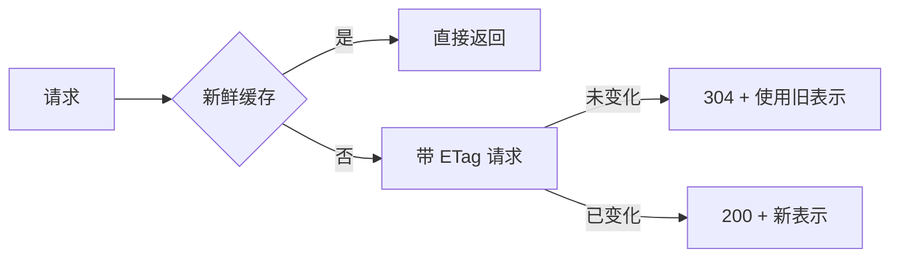

# HTTP 报文、状态码与缓存语义

同一个 `GET /projects` 可能第一次返回 `200`，第二次返回 `304`，第三次因为权限变化返回 `404`。状态码不是装饰，它描述了服务器对当前请求的判断；缓存头则决定浏览器能否不再请求服务器。

## 从报文读出服务器承诺

请求行、Header 和 Body 共同描述客户端意图。响应状态、Header 和 Body 描述结果及其缓存条件。`PUT` 通常要求同一资源重复执行得到同一最终状态；`POST` 创建资源，重试前必须有幂等键或明确不重试。

先保存两次完整报文，比较 ETag、Age、Via、Vary 和状态码。只看 JSON Body 会遗漏响应究竟来自浏览器缓存、CDN、代理还是应用。

```bash
curl -i https://api.example.test/projects
curl -i -H "If-None-Match: \"p42\"" https://api.example.test/projects
```

比较 ETag、Cache-Control 和状态码。304 没有业务 Body，客户端应使用已缓存表示；它不是“接口没有返回数据”。
## 条件请求避免无谓传输

服务端为表示生成 ETag 或 Last-Modified。客户端下次带验证器，服务端发现版本没有变化就返回 304；变化则返回新的 200。更新接口可带 `If-Match`，版本不符返回 412，避免后写覆盖先写。

| 请求 | 成功语义 | 常见失败 |
| --- | --- | --- |
| GET + If-None-Match | 304 或新表示 200 | 代理错误地丢掉 ETag |
| PUT + If-Match | 版本匹配后更新 | 412 说明客户端过期 |
| POST + Idempotency-Key | 同键返回同一结果 | 键过期导致重复创建 |
| DELETE | 资源已不存在也可幂等 | 把权限失败误报成不存在 |
## 缓存不是授权

HTTP 缓存键通常由 URL 和 Vary 组成。若响应随 Cookie、Authorization 或租户变化，就必须设置 `private`、`no-store` 或正确的 `Vary`。**跨租户资源统一返回 404 是授权策略，不能靠缓存头补救**。


## 状态码正确，资源状态仍可能不对

| 现象 | 先确认 | 处理顺序 |
| --- | --- | --- |
| 200 变成 304 后页面空白 | 检查客户端是否正确复用缓存 Body；304 本身不包含资源内容。 | 先确认缓存层，再看客户端解析逻辑 |
| POST 超时后能否直接重试 | 只有服务端支持幂等键并能查询原结果时才安全。否则请求可能已经成功。 | 先查询幂等键状态，再决定重试或人工对账 |
| 更新返回 412 | 说明 If-Match 版本落后，不是数据库宕机。 | 重新读取资源、合并用户修改，再带新版本提交 |

200 只表示服务器选择用成功响应回答这次请求，不证明数据库一定发生了预期变化。写接口还要核对响应中的资源版本、数据库影响行数和事务提交；读接口要核对 Age/Vary/ETag，确认结果没有来自错误的共享缓存。状态码给出协议判断，业务事实仍需用版本和持久化状态证明。
## 状态码、授权与缓存的语义边界

**为什么 404 有时比 403 更安全？**

对多租户资源，返回 403 会确认资源确实存在。统一 404 可以减少资源枚举，但审计日志仍应记录真实的授权拒绝原因，方便内部排查。

**Cache-Control: no-store 能解决所有缓存问题吗？**

它只约束遵守 HTTP 语义的缓存。Service Worker、客户端状态库和 CDN 仍有自己的缓存路径，认证响应还需要正确的凭证策略和失效逻辑。
## HTTP/1.1、HTTP/2 与 HTTP/3 改变传输，不改变资源语义

HTTP/2 把请求拆成帧并复用一条连接，Header 使用 HPACK 压缩；HTTP/3 把帧放在 QUIC Stream 上。它们改善连接利用和队头阻塞，却不改变 GET、POST、缓存验证和状态码的含义。应用看到一次 409，仍应按版本冲突处理，而不是根据底层协议重试。

代理和应用的超时也要区分。客户端收到 504，表示网关等待上游超时；上游可能仍在继续写数据库。写请求需要 requestId 或幂等键查询结果，不能因 504 就直接再发一次。

**200 和 204 怎样影响客户端解析？**

200 可以携带表示，204 明确没有响应 Body。客户端若对所有成功响应都执行 response.json()，204 会触发解析错误。请求客户端应先根据状态码和 Content-Type 决定是否解析。
