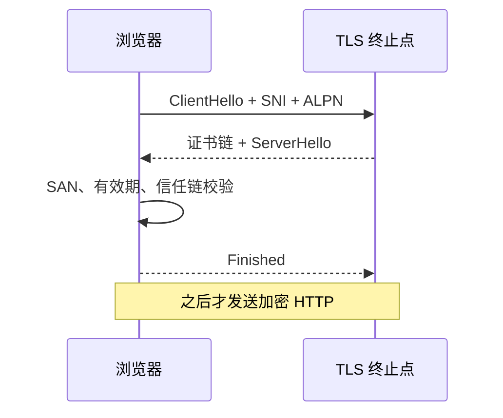

# HTTPS、TLS 与证书：浏览器怎样确认连到正确的服务

浏览器显示 `NET::ERR_CERT_DATE_INVALID` 时，请求通常还没有进入 HTTP。TLS 先验证“你连接的主机是谁”，再协商会话密钥。把证书错误当成 API 500 会让排查方向完全错误。

## 证书不是加密密码

证书把域名、公钥和签发者签名绑定起来。浏览器根据 URL 的主机名检查 SAN，沿信任链验证 CA 签名，再检查有效期和用途。通过验证后，双方用临时密钥协商会话密钥；**私钥只用于证明身份，不直接加密每个 HTTP 字节**。



## SNI 和 ALPN 影响路由

同一 IP 可以承载多个 HTTPS 站点。浏览器在 ClientHello 中带 SNI，代理据此选择证书；ALPN 协商 `h2` 或 `http/1.1`。如果证书正确但 ALPN 或代理路由错误，握手可能成功，后续 HTTP 仍会得到 421、502 或协议错误。

用同一个域名和 SNI 读取线上握手，避免只检查磁盘上的证书文件。磁盘文件正确，不代表代理已经 reload，也不代表 CDN 或另一台入口加载了它。

```bash
curl -vk --http2 https://example.com/health
openssl s_client -connect example.com:443 -servername example.com -alpn h2 </dev/null
```

先观察证书主题、SAN、有效期和 ALPN，再比较应用 access log。`curl -k` 只适合查看握手，不代表证书配置正确。

## 轮换要有重叠窗口

企业不会等旧证书过期才替换。先签发新证书，把完整链和私钥放进受控 Secret，再执行配置检查和热加载；旧证书保留到所有入口都确认新证书后再撤销。私钥泄露时顺序相反：先撤销并切换，再调查日志。

| 证据 | 说明 | 下一步 |
| --- | --- | --- |
| 域名不匹配 | SAN 不含访问主机 | 重新签发或修正入口域名 |
| 过期 | 当前时间超过 NotAfter | 检查自动续期和时钟 |
| 未知 CA | 客户端不信任链 | 补齐中间证书，不能随意关闭校验 |
| 握手后 502 | TLS 已成功 | 转查代理到应用的连接 |

## 握手失败要停在 TLS 层取证

| 现象 | 先确认 | 处理顺序 |
| --- | --- | --- |
| 证书正确但浏览器仍报错 | 分别检查访问域名、SNI、系统时间和中间证书；命令行可能使用了不同 CA 包。 | 先复现同一主机名，再看浏览器安全面板 |
| 只更新 Nginx 配置就够了吗 | 不够。新证书必须与私钥匹配，所有入口和 CDN 也要轮换。 | 用公钥指纹和外部握手逐入口核对 |
| TLS 1.3 握手失败 | 先区分客户端不支持、代理策略、证书链和时间问题。 | 保留 `openssl s_client` 输出后再收窄协议版本 |

握手失败时通常还没有 HTTP requestId，应用 access log 为空是正常证据。应记录访问主机、解析到的 IP、ClientHello 的 SNI/ALPN、服务端返回的完整证书链和校验时间。握手成功并出现 HTTP 状态后，排查才进入代理 upstream 与应用层。这个分界能避免为了证书错误重启业务进程。

## TLS 路由、轮换与代理终止

**TLS 加密后为什么还能按域名路由？**

SNI 在握手早期以明文出现在 ClientHello 中，代理先用它选择证书和连接目标。HTTP 路径和正文仍在 TLS 加密层内，代理若需要按路径路由必须终止 TLS。

**证书续期为什么要做成自动化？**

证书有效期有限，手工流程容易漏掉中间证书、权限和 reload。自动化仍要有失败告警和重叠窗口，否则自动续期失败会在到期日变成全站不可用。

## 会话恢复减少握手，但不会跳过身份边界

TLS 1.3 可以通过 session ticket 恢复已有会话，减少往返和部分密钥计算。ticket 由服务器加密签发，客户端下次握手带回；服务器仍要判断 ticket 是否有效、是否属于当前配置。恢复降低成本，却不会把过期证书自动修好。首次连接、ticket 轮换后或跨入口连接仍会走完整身份验证。

0-RTT 更需要谨慎。早期数据可能被网络重放，因此只适合本身可重放的读操作，不能把扣款、创建订单等副作用放进 0-RTT 请求。是否启用要由入口和应用共同约束。

**代理终止 TLS 后，应用怎样知道原始协议？**

代理应覆盖并传递受信任的 X-Forwarded-Proto 或标准 Forwarded。应用只能信任来自已知代理的头；若直接接受客户端伪造值，Secure Cookie、跳转和回调地址都可能被错误判断。

## 机制复核：HTTPS、TLS 与证书：浏览器怎样确认连到正确的服务
这篇文章讨论的机制需要放回一次完整请求中验证。先记录输入约束、状态变化、外部依赖和失败结果，再确认成功路径是否留下可追踪的事实。配置、缓存、队列或数据库只承担各自职责，不能用一层的日志推断另一层已经完成。

迁移到实际项目时，优先补一条正常用例、一条重复或并发用例和一条依赖不可用用例。每条用例写明观察指标、错误分类、回滚动作与数据清理范围，测试替身的通过不能代替真实协议和权限验证。

当性能、可靠性和安全目标冲突时，先明确服务对象和可接受损失，再选择超时、容量、重试和降级策略。没有测量依据的阈值只作为待验证假设，发布后用同一公式复验。
