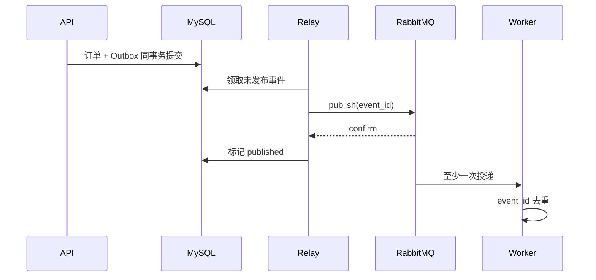

# 幂等、Outbox 与 Saga：跨数据库和消息的可靠变更

幂等把同一业务意图的重复请求绑定到一个结果，Outbox 把数据库事实和待发布事件放进同一提交，Saga 则用一组可重试的步骤与补偿动作协调多个系统。它们位于业务事务与消息/外部服务之间，分别处理重复执行、提交与发布的间隙，以及无法共享数据库事务的跨系统流程。

创建订单的请求在客户端等待 5 秒后超时。数据库其实已经提交，客户端重试又创建一张订单；随后消息发送失败，库存系统还不知道第一张订单存在。这两个问题分别需要幂等和数据库到消息系统的一致性设计。

## 幂等键把重复意图绑定到同一结果

客户端为一次业务意图生成 `Idempotency-Key`。服务端在租户和操作范围内保存 key、请求哈希、执行状态与响应摘要。第一次请求占用 key；相同 key 与相同请求返回原结果；相同 key 搭配不同 Body 返回冲突。

幂等记录与业务写入必须在同一数据库事务中提交，否则可能出现业务成功但幂等记录缺失。进行中的请求再次到达时，可以返回 409/202 并提示查询状态，而不是并发执行第二次。

表上需要 `(tenant_id, operation, idem_key)` 唯一约束。两个并发请求只有一个能插入 processing，另一个读取并比较 request_hash。

```sql
START TRANSACTION;

INSERT INTO idempotency_keys
  (tenant_id, operation, idem_key, request_hash, status)
VALUES
  (:tenant, 'order.create', :key, :hash, 'processing');

INSERT INTO orders (id, tenant_id, status, total_amount)
VALUES (:order_id, :tenant, 'pending', :total);

UPDATE idempotency_keys
SET status = 'completed', resource_id = :order_id,
    response_status = 201
WHERE tenant_id = :tenant AND idem_key = :key;

COMMIT;
```

不要把完整敏感响应永久存进幂等表。可保存资源 ID、状态码和重建响应所需的最小字段，并根据业务重试窗口设置保留期。
## Outbox 把业务事实和待发布事件一起提交

应用不能让 MySQL COMMIT 与 RabbitMQ publish 形成真正的单一事务。Outbox 在同一 MySQL 事务中写订单与事件；独立 Relay 扫描未发布事件，发送成功后标记。这样数据库提交成功就一定留下待发送事实。

Relay 可能在发布成功、标记前崩溃，因此消息仍可能重复。消费者必须按 event_id 去重，或让副作用本身使用唯一约束和条件更新。Outbox 解决“不丢”，不自动解决“不重”。



Relay 领取事件也要有租约或 `SKIP LOCKED`，避免多个实例重复高频扫描；重复发布仍被视为允许发生。
## Saga 把跨服务事务改成状态机与补偿

订单、库存、支付属于独立服务时，无法长时间持有一个数据库事务。Saga 把流程拆成可提交的本地事务：创建订单、预留库存、发起支付。某一步失败后执行语义补偿，例如释放库存、关闭订单。

补偿不是数据库 rollback。支付可能已经成功，退款是另一笔可失败的业务操作，需要自己的幂等键、状态和审计。Saga 必须定义每个步骤的成功证据、超时、重试、补偿与人工终态。

| 步骤 | 成功事实 | 失败/超时后的动作 |
| --- | --- | --- |
| 创建订单 | order=pending | 幂等返回原订单 |
| 预留库存 | reservation=held | 不足则关闭订单 |
| 支付 | payment=succeeded | 未知则查询支付状态 |
| 确认订单 | order=paid | Outbox 重放确认事件 |
| 补偿库存 | reservation=released | 有限重试后人工处理 |
## 未知结果是分布式系统的正常状态

超时只说明调用方没及时收到结果，不能证明对方失败。写操作需要可查询的业务 ID 或幂等键；调用方先查询，再决定重试。把所有超时直接映射成 failed，会造成重复扣款或错误补偿。

一致性流程的日志要包含 order_id、idempotency_key、event_id、saga_step 和 attempt。指标观察 processing 滞留、Outbox 年龄、重复事件、补偿失败，而不只看 HTTP 500。
## 一致性设计中的深入判断

**为什么消息队列开启 publisher confirm 仍需要 Outbox？**

confirm 只确认 Broker 接收了 publish。若数据库已提交、进程在调用 publish 前崩溃，根本没有消息可确认。Outbox 把“需要发布”先持久化到业务事务。

**幂等键由前端还是后端生成？**

代表用户一次提交意图时，前端可生成并在网络重试中复用；服务端内部任务也可生成业务键。关键是同一意图复用、不同意图不复用，并由服务端验证请求哈希和作用域。

**消费者去重表什么时候清理？**

保留期至少覆盖消息可能重投和人工重放的最大窗口。若业务副作用永久不能重复，可用业务唯一约束而不依赖短期去重表。清理策略必须与 Broker 保留、DLQ 和备份恢复协调。

**Saga 适合所有跨服务写操作吗？**

短小且能放在一个数据库事务的操作不要拆成 Saga。Saga 引入中间状态、补偿和运维成本，只有独立所有权、长流程或无法共享事务时才值得。
