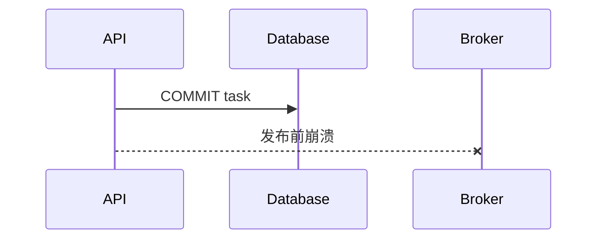
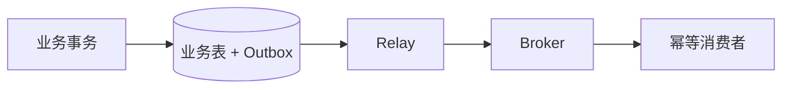
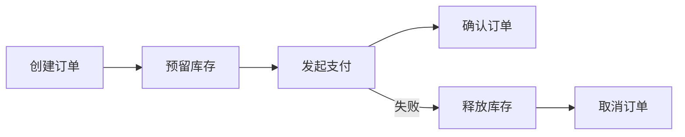

# 幂等、有限重试、死信队列、Outbox 与 Saga

客户端创建订单后连接超时。它不知道服务端有没有成功，重试可能生成第二张订单；不重试又可能丢掉操作。这类“结果未知”是分布式系统的常态。

幂等、重试、死信、Outbox 和 Saga 解决不同阶段的问题。本章沿“接收请求 → 提交数据库 → 发布消息 → 消费 → 跨服务动作”逐层选择，不把它们包装成一个万能方案。

## 幂等：同一业务意图只产生一次效果

客户端为一次创建操作生成 Idempotency Key。服务端的唯一范围通常包含主体、端点和 Key，并保存请求摘要。

```sql
CREATE TABLE idempotency_record (
  actor_id text NOT NULL,
  operation text NOT NULL,
  idempotency_key text NOT NULL,
  request_hash text NOT NULL,
  resource_id text,
  status text NOT NULL,
  PRIMARY KEY (actor_id, operation, idempotency_key)
);
```

第一次请求插入记录并执行业务；重复相同请求返回已有结果；相同 Key、不同 `request_hash` 返回冲突。

并发请求不能用“先 SELECT，没有再 INSERT”的无锁流程。依赖唯一约束或原子插入取得所有权。处理中状态还要有过期和恢复策略，避免进程崩溃后永远卡住。

幂等键不能由服务端每次重新随机生成，那样无法识别重试。也不宜把整个敏感 Body 原文存入记录，使用规范化哈希并保存必要审计信息。

## 重试先判断错误和副作用

适合有限重试：连接建立失败、429/503、明确未提交的事务冲突、只读查询超时。不能盲目重试：结果未知的写请求、付款、邮件、第三方无幂等接口。

退避加入随机抖动，避免大量客户端同时重试：

```text
delay = min(cap, base × 2^attempt) + random_jitter
```

同时受最大次数和总 Deadline 限制。服务端返回 `Retry-After` 时优先遵守。重试不是掩盖长期故障，达到阈值后进入失败状态和告警。

## 数据库提交后发布消息的窗口

简单流程：事务提交任务，再调用 Broker 发布。如果进程在两者之间崩溃，数据库已有任务但没有消息。



处理方式取决于系统要求。

### 提交后派发 + 恢复扫描

应用提交后发布，失败时把任务标记为派发失败；扫描器查找长时间 pending/未派发记录并补发。这种方案简单，窗口存在但可观察和恢复。

### Transactional Outbox

业务记录和 Outbox 事件在同一数据库事务提交。独立 Relay 读取未发布事件发到 Broker，并标记进度。



Outbox 消除了“业务提交但事件未记录”的窗口，但 Relay 到 Broker 仍可能重复发布，所以消费者继续幂等。还要处理 Outbox 清理、顺序、失败告警和 Relay 所有权。

不是每个项目都必须使用 Outbox。低风险、可扫描恢复的任务可以先用显式派发状态；跨服务事件丢失影响大时再引入。

## 死信队列保存无法自动完成的消息

达到最大重试、Schema 不兼容或业务对象永久缺失时，消息进入 DLQ。死信记录错误类别和版本，人工或修复程序决定重放、跳过或补数据。

DLQ 不应自动无限回原队列。重放是一项受控操作：先修复原因，选定消息范围，确认消费者幂等，限制速率并记录操作者。

## Saga 处理跨服务业务一致性

一次业务跨库存、支付和订单三个本地事务，无法用单个数据库事务覆盖。Saga 把流程拆成步骤，每步有成功状态和必要的补偿动作。



补偿不是数据库回滚。已经发送的通知无法“没发生”，退款也可能失败，所以补偿本身是可观察、可重试、有幂等和人工介入的业务动作。

Saga 有编排式和事件协作式。编排器显式保存步骤状态，便于理解；事件协作降低中心控制但链路更分散。初学者先从显式编排和状态表开始。

## 可靠性模式选择表

| 问题 | 主要模式 |
| --- | --- |
| 客户端重复提交 | Idempotency Key + 唯一约束 |
| 暂时性依赖失败 | 有上限的退避重试 |
| 数据库提交后消息丢失 | 派发状态扫描或 Outbox |
| Consumer 重复收到消息 | 消费幂等记录 + 同事务业务写入 |
| 自动处理不了的消息 | DLQ + 受控重放 |
| 跨服务步骤部分成功 | Saga + 补偿状态 |
| 结果未知的外部副作用 | 对账、幂等接口或人工处理，不能盲重试 |

## 一条完整任务链

1. API 按主体与幂等键创建任务；
2. 业务事务同时写任务和 Outbox；
3. Relay 至少一次发布 `task.created`；
4. Worker 用事件 ID 幂等消费；
5. 暂时错误有限重试；
6. 永久错误进入 DLQ；
7. 任务状态和 Attempt 保存在数据库；
8. 运维按事件年龄、失败类型和 DLQ 告警。

如果系统当前没有 Outbox，应在文章和架构说明中写成可选演进，不能把设计目标写成已实现。

## 测试故障窗口

- 两个相同幂等请求并发到达；
- 数据库提交后、发布前终止进程；
- Broker 接受消息但 Producer 未收到确认；
- Consumer 提交数据库后、ACK 前终止；
- 暂时错误恢复；
- 永久错误进入 DLQ；
- 补偿动作失败后继续可查询；
- 重放旧事件时新消费者仍兼容。

测试在隔离环境进行，使用可控故障点，而不是线上杀进程。

## 可靠性决策卡

```text
业务意图与幂等范围：
真相源：
结果未知的窗口：
可安全重试的错误：
最大次数与 Deadline：
发布一致性：扫描 / Outbox / 其他
消费幂等：
DLQ 处理人和重放流程：
跨服务步骤与补偿：
人工介入条件：
```

决策卡先确定真相源和“结果未知”的窗口，再决定重试、Outbox、DLQ 或补偿；它的输出不是组件清单，而是每个故障窗口由谁发现、谁恢复、怎样证明没有重复副作用。下一章把后端基础收束到实时服务、背压、测试和观测，然后进入 NestJS 项目线。
