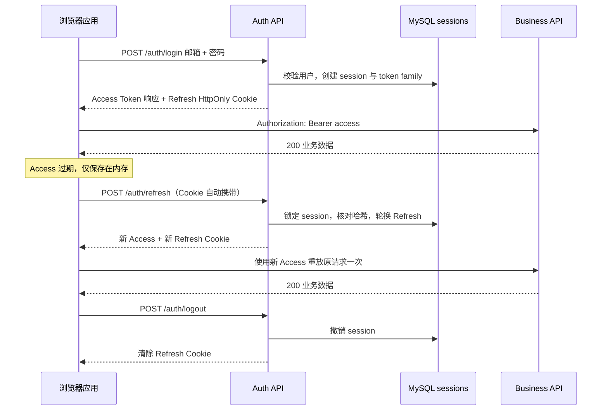

# JWT 登录不是签一个 Token：Access、Refresh、轮换与撤销

某个单页应用登录成功后把 JWT 写进 `localStorage`，有效期设置为 30 天。第三方脚本发生 XSS 后读取 Token，攻击者复制到另一台机器持续调用 API。用户点击退出只清掉自己浏览器里的值，服务端仍然接受被盗 Token。

这套实现确实“用了 JWT”，却没有处理长期凭证存储、撤销、设备会话和泄露响应。**JWT 只是带签名的声明格式，不是一套完整登录系统。**

认证链采用 15 分钟 Access Token 和 30 天随机 Refresh Token：前者放在浏览器内存，后者放在 HttpOnly Cookie；服务端只保存 Refresh Token 哈希和会话族状态；每次刷新都轮换令牌，旧令牌重放会撤销整族会话。

## 登录系统里有四种不同东西

### 密码证明用户掌握一个秘密

注册时服务端使用 Argon2id 等密码哈希算法保存 `password_hash`，不能保存明文或可逆加密密码。登录时对输入密码执行同样的成本验证。密码只用于建立会话，不应在每个业务请求中重复发送。

慢密码哈希故意提高每次猜测成本。Salt 防止相同密码产生相同哈希并抵抗预计算表；服务端还可以使用独立 Pepper，但 Pepper 的管理必须进入 Secret 系统，不能和数据库一起泄露。

### Access Token 携带短期访问声明

Access Token 是 JWT，包含用户 ID、租户 ID、会话 ID、签发时间、过期时间、发行者、受众和唯一 ID。API 校验签名、算法、`iss`、`aud` 与时间声明后，才把载荷转换为当前主体。

JWT 的三段 Base64URL 内容可以被任何拿到令牌的人解码，签名只防止篡改，不提供保密。不要把密码、身份证号或不必要权限详情放进 Payload。

### Refresh Token 证明客户端仍持有长期会话凭证

Refresh Token 不需要是 JWT。使用足够随机的不可预测字符串更容易撤销和轮换。它只发送给刷新接口，不应作为业务 API 的 Bearer Token。

浏览器通过 `HttpOnly; Secure; SameSite=Lax` Cookie 持有它，JavaScript 不能直接读取，降低 XSS 直接窃取的风险。Cookie 会自动随匹配请求发送，因此刷新和退出接口仍要考虑 CSRF、Origin 校验和 SameSite 策略。

### Session 记录让服务端能够撤销和调查

服务端保存会话 ID、用户、令牌族、当前 Refresh Token 哈希、过期时间、撤销时间和使用信息。这样管理员可以撤销单个设备，密码变更可以撤销全部会话，安全团队也能调查异常刷新。

JWT Access Token 可以在短时间内离线验证，但完整系统并非“无状态”。**一旦需求包含退出、设备管理、Refresh 轮换和泄露处理，就需要服务端会话状态。**
## 一次登录到退出的完整时序



登录响应中的 Access Token 进入浏览器应用内存，不写 localStorage。页面刷新后内存丢失，应用启动时调用刷新接口恢复会话。刷新失败则进入未登录状态，不能无限循环重试。
## JWT 签名到底证明什么

一个 JWT 形如 `header.payload.signature`。Header 声明算法与密钥标识，Payload 保存声明，签名对前两段的字节进行保护。API 使用受信任密钥验证签名后，可以确认内容由持有签名密钥的一方签发且未被修改。

```jsonc
{
  // Header 只允许服务端配置白名单中的算法，不能盲信来令牌的 alg。
  "alg": "RS256",
  "typ": "JWT",
  "kid": "auth-2026-08"
}
```

验证端先根据受信任配置选择 `kid` 对应公钥，并确认算法在允许集合中。Header 只帮助定位密钥，不能让请求自行决定使用 `none` 或另一种验证算法；找不到密钥时返回认证失败并记录不含令牌正文的安全事件。

```jsonc
{
  // Payload 是可读声明，不放密码和敏感个人数据。
  "sub": "user-42",
  "tenant_id": "tenant-a",
  "sid": "session-7",
  "iss": "https://auth.example.test",
  "aud": "enterprise-admin-api",
  "iat": 1786492800,
  "exp": 1786493700,
  "jti": "access-unique-id"
}
```

API 验签后还要逐项核对发行者、受众和时间，再把 `sub/tenant_id/sid` 转成内部 Principal。字段缺失、类型错误、已过期或受众不匹配都应停止请求，不能因为签名正确就直接信任全部载荷。

`sub` 表示主体，`sid` 把短期 Token 关联到服务端会话，`exp` 约束最后接受时间，`aud` 防止发给其他服务的令牌被本 API 误用。校验器必须固定允许算法，不能根据不可信 Header 自由选择验证方式。

对多服务系统，非对称签名让认证服务持有私钥，业务 API 只分发公钥。`kid` 用于选择当前验证密钥，密钥轮换期间保留旧公钥直到旧 Access Token 最长有效期结束。
## Refresh Session 表保存可撤销事实

下面是一份简化的 MySQL 结构。服务端不保存 Refresh Token 明文；收到 Cookie 后计算 SHA-256 等密码学哈希，再与记录比较。随机高熵令牌不需要像用户密码那样使用慢哈希，但比较应避免泄露差异。

```sql
-- token_family_id 连接同一次登录轮换出的所有 Refresh Token。
CREATE TABLE auth_sessions (
  id CHAR(36) NOT NULL,
  user_id CHAR(36) NOT NULL,
  token_family_id CHAR(36) NOT NULL,
  refresh_token_hash BINARY(32) NOT NULL,
  expires_at DATETIME(6) NOT NULL,
  rotated_at DATETIME(6) NULL,
  revoked_at DATETIME(6) NULL,
  revoke_reason VARCHAR(80) NULL,
  created_at DATETIME(6) NOT NULL DEFAULT CURRENT_TIMESTAMP(6),
  last_used_at DATETIME(6) NULL,
  PRIMARY KEY (id),
  UNIQUE KEY uk_auth_sessions_refresh_hash (refresh_token_hash),
  KEY idx_auth_sessions_user_active (user_id, revoked_at, expires_at),
  KEY idx_auth_sessions_family (token_family_id)
) ENGINE = InnoDB;
```

会话记录是安全状态，不是缓存。数据库故障时刷新应失败，不能跳过撤销检查签一个新 Token。Access Token 在剩余的短有效期内仍可能被接受，因此高风险系统可以增加权限版本、会话撤销缓存或更短 TTL，但每次请求查数据库会增加可用性和延迟成本。
## 轮换让旧 Refresh Token 只能使用一次

刷新接口收到当前令牌后，在事务中锁定会话、比较哈希、确认未过期未撤销，然后生成新随机令牌并替换哈希。旧 Cookie 即使被复制，也不能再次正常刷新。

```ts
async function rotateRefreshToken(rawToken: string) {
  const presentedHash = sha256(rawToken)

  const result = await prisma.$transaction(async (tx) => {
    // 锁定与条件更新用于防止两个并发刷新都成功。
    const session = await findSessionForUpdate(tx, presentedHash)
    if (!session || session.revokedAt || session.expiresAt <= new Date()) {
      throw new UnauthorizedException('session_invalid')
    }

    if (session.rotatedAt) {
      // 已轮换令牌再次出现，按重放事件撤销同一 token family。
      await tx.authSession.updateMany({
        where: { tokenFamilyId: session.tokenFamilyId, revokedAt: null },
        data: { revokedAt: new Date(), revokeReason: 'refresh_reuse' },
      })
      // 先返回重放标记，让撤销状态提交；在事务内抛错会把撤销一起回滚。
      return { kind: 'reused' as const }
    }

    const nextRawToken = randomToken(32)
    await tx.authSession.update({
      where: { id: session.id },
      data: { rotatedAt: new Date(), lastUsedAt: new Date() },
    })
    await tx.authSession.create({
      data: nextSessionRecord(session, sha256(nextRawToken)),
    })
    return { kind: 'rotated' as const, accessToken: signAccess(session), refreshToken: nextRawToken }
  })
  if (result.kind === 'reused') throw new UnauthorizedException('session_reused')
  return result
}
```

输入是 Cookie 中的随机令牌，事务把旧记录标记为已轮换并创建后继记录，输出才包含新 Access 与新 Refresh。重放分支返回标记而不在事务内抛错，保证整族撤销先提交；事务结束后再映射为 401。代码是机制片段，真实实现还要固定并发锁语义、哈希比较、异常映射、Cookie 配置、审计事件和提交后写响应的顺序。

如果旧令牌再次出现，系统无法仅凭令牌判断是攻击者还是正常客户端重试。保守策略撤销整个 token family，让用户重新登录，并记录不含原始令牌的安全事件。
## 浏览器客户端只允许一次并发刷新

页面同时有五个 Query，Access Token 过期后可能同时收到 401。如果每个请求都单独调用刷新，单次使用的 Refresh Token 会产生竞争：第一个轮换成功，其他请求拿旧 Cookie 刷新，可能触发重放撤销。

客户端需要 Single Flight，把并发 401 合并到同一个刷新 Promise。刷新成功后，每个原请求最多重放一次。

```ts
let accessToken: string | null = null
let refreshFlight: Promise<string> | null = null

async function refreshAccess(): Promise<string> {
  if (!refreshFlight) {
    refreshFlight = fetch('/api/auth/refresh', {
      method: 'POST',
      credentials: 'include', // 浏览器自动携带 HttpOnly Refresh Cookie。
    })
      .then(async (response) => {
        if (!response.ok) throw new Error('session_expired')
        const body = await response.json() as { accessToken: string }
        accessToken = body.accessToken
        return body.accessToken
      })
      .finally(() => {
        // 当前轮刷新完成后才允许创建下一次 flight。
        refreshFlight = null
      })
  }
  return refreshFlight
}

export async function apiFetch(input: RequestInfo, init: RequestInit = {}) {
  const send = (token: string | null) => fetch(input, {
    ...init,
    headers: { ...init.headers, ...(token ? { Authorization: `Bearer ${token}` } : {}) },
    credentials: 'include',
  })

  const first = await send(accessToken)
  if (first.status !== 401) return first

  const nextToken = await refreshAccess()
  return send(nextToken) // 只重放一次，第二个 401 交给登录状态处理。
}
```

这个客户端没有把 Token 写入持久存储。刷新页面后先进入“认证状态恢复中”，调用 Refresh；成功后再渲染受保护路由，失败则跳转登录。跨标签页可以用 `BroadcastChannel` 通知退出和会话变化，但不能通过广播传播原始 Refresh Token。
## 401、403 与退出不是同一状态

401 表示请求没有可接受的认证凭证，可能是 Access 过期、签名错误、受众错误或会话失效。客户端只应对明确的“可刷新过期”尝试一次刷新；密码错误或 Refresh 失败不能进入刷新循环。

403 表示主体已认证，但不允许执行当前动作。刷新 Token 不会增加权限，前端应显示无权限状态。资源级授权为了避免泄露存在性也可能返回 404。

退出由服务端撤销当前 Session 或 token family，清除 Refresh Cookie，再由前端清空内存 Access、TanStack Query 缓存和敏感页面状态。只清 localStorage 或跳登录页不算退出。
## Cookie 安全属性要与部署拓扑一致

| 属性 | 作用 | 常见选择 |
| --- | --- | --- |
| `HttpOnly` | 阻止 JavaScript 读取 Cookie | Refresh Cookie 必须启用 |
| `Secure` | 只通过 HTTPS 发送 | 生产必须启用 |
| `SameSite` | 限制跨站携带 | 同站 SPA 常用 Lax/Strict，跨站需 None + Secure |
| `Path` | 限制发送路径 | 可限制为 `/api/auth` |
| `Domain` | 控制可接收域名 | 能用 Host-only 就不要扩大到整个父域 |
| `Max-Age` | 浏览器持有期限 | 不超过服务端会话到期时间 |

前端与 API 完全跨站时，需要 `SameSite=None; Secure`，同时配置精确 CORS Origin、允许凭证和 CSRF 防护。不能使用 `Access-Control-Allow-Origin: *` 与凭证组合。
## 凭证撤销与并发刷新的边界

**JWT 可以验签，为什么退出后 Access Token 还可能有效？**

业务 API 只做离线验签时，不会自动查询 Session 撤销状态。已经签发的 Access Token 会在 15 分钟 TTL 内继续有效。可通过缩短 TTL、检查高风险操作的会话状态、维护短期撤销缓存或提高会话版本解决，但会增加依赖与延迟。系统需要按风险选择，而不是宣称 JWT 可即时撤销。

**HttpOnly 是否意味着不用担心 XSS？**

不是。HttpOnly 阻止脚本读取 Cookie，但被注入的脚本仍可能以当前页面身份发请求、读取页面数据和窃取内存 Access Token。仍需输出编码、CSP、依赖治理和最小权限。HttpOnly 只是减少长期 Refresh 凭证被直接复制的风险。

**为什么 Refresh Token 使用随机字符串，而 Access 使用 JWT？**

Access Token 被多个业务 API 高频验证，JWT 允许服务在短时内离线校验声明。Refresh 只访问认证服务，最重要的是可撤销、单次使用与重放检测，随机不透明令牌配合服务端 Session 更直接。把 Refresh 也做成 JWT 不会消除状态管理需求。

**多标签页同时恢复登录会不会再次造成并发刷新？**

单个标签页的 Promise 不能合并其他标签页请求。可以让 Refresh 端点使用短宽限窗口与严格令牌族状态，或用 Web Locks/BroadcastChannel 协调同源标签页。无论客户端如何协调，服务端事务仍必须正确处理并发，因为客户端控制不能成为安全前提。

**权限变化后，旧 Access Token 中的角色怎么办？**

如果把完整权限放进 JWT，它会在过期前保持旧值。可以只携带主体与会话身份，在数据库或缓存查询权限；也可以携带权限版本，在关键请求中核对当前版本。权限变化要求即时生效的系统不能只依赖长时自包含 Token。

**Refresh 请求超时后可以直接重试吗？**

结果可能未知：服务端可能已经轮换 Cookie，但响应丢失。浏览器若没有收到新 Cookie，重试旧令牌可能被判定为重放。实现需要为相邻轮换保留受控的幂等恢复信息，或让客户端重新登录；不能简单无限重试，也不能为了方便永久接受旧令牌。

**为什么不把 Access Token 放 localStorage，用户体验不会变差吗？**

页面刷新时多一次会话恢复请求，但换来的是 Access 不长期留在可被脚本读取的持久存储。Refresh Cookie 仍能恢复登录，因此用户不必重新输入密码。应用应显示短暂认证恢复状态，避免受保护页面先闪现再跳转。
