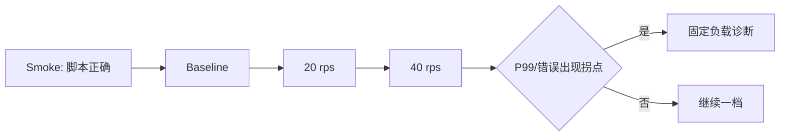

# k6 压测：QPS、TPS、并发与 P99 延迟

k6 是按场景生成请求并收集结果的负载测试工具。QPS/TPS 描述单位时间完成量，并发表示同时在途工作，P99 表示 99% 样本不超过的延迟边界。它们位于压测流量模型与系统容量判断之间，用来比较给定请求形状下的吞吐、等待和错误，而不是产出一个脱离环境的“最大并发”。

平均延迟 80 ms 看起来很好，但 1% 请求超过 3 秒；对于每分钟发 100 次请求的用户，慢请求并不罕见。P50/P95/P99 展示分布边缘，压测还必须说明到达率、并发、数据量、缓存状态和错误率，否则数字无法比较。

## 到达率、并发和吞吐不是一个数

到达率是每秒开始多少请求，吞吐是每秒完成多少请求，并发是在途请求数。稳定时可用 Little's Law 粗略理解 `并发 ≈ 到达率 × 平均响应时间`；延迟升高会让同样到达率占用更多并发。

Closed Model 用固定 VU 循环，服务变慢时 VU 发出的请求也减少，可能产生 coordinated omission；Constant Arrival Rate 更接近固定外部到达率，但需要足够预分配 VU。

| 指标 | 回答 | 误读 |
| --- | --- | --- |
| QPS/RPS | 单位时间请求量 | 不等于业务事务数 |
| TPS | 定义的业务事务完成量 | 必须先定义事务 |
| VU | 脚本并发执行者 | 不等于在线用户 |
| P99 | 99% 样本不超过的延迟 | 不是最慢请求 |
| error rate | 失败比例 | 快失败会让延迟变好看 |
## 场景先固定数据和缓存状态

登录、项目列表、创建项目的负载和依赖不同。列表区分热缓存与冷缓存；写入使用唯一幂等键，避免重试制造重复；测试账号和租户有足够数据量，分页不会总命中空表。

压测前记录 commit、镜像 digest、实例资源、MySQL 数据量/索引、连接池、Redis 状态和网络位置。结果只描述当前环境，不写成生产容量承诺。

下面 k6 场景以固定到达率请求项目列表。阈值只是一次本地基线的失败条件，不是通用 SLA。

```javascript
export const options = {
  scenarios: {
    projectList: {
      executor: "constant-arrival-rate",
      rate: 20,
      timeUnit: "1s",
      duration: "30s",
      preAllocatedVUs: 10,
      maxVUs: 50,
    },
  },
  thresholds: {
    http_req_failed: ["rate<0.01"],
    http_req_duration: ["p(95)<500", "p(99)<1000"],
  },
}
```

若出现 dropped_iterations，说明 k6 没有足够 VU 按计划启动请求，不能把实际较低负载的结果当通过。一起观察服务 CPU、池等待、SQL 和错误码。
## 分阶段升压寻找拐点而不是直接打满

先 smoke 验证脚本，再 baseline 固定低负载，随后逐级提升并保持平台稳定，最后可做短 spike 或较长 soak。每级观察吞吐是否跟上、P99 是否陡升、错误和资源谁先到顶。

拐点后继续加压只会得到排队和超时。先定位 CPU、连接池、锁、下游配额或 k6 发压机瓶颈；改变一个变量后用相同场景重测。



压测环境要有停止条件：错误率、数据库饱和或对共享系统产生影响时立即停止，不为了跑完脚本继续施压。
## 结果解释必须把客户端与服务端时间线对齐

k6 `http_req_waiting` 近似等待首字节，不等于纯数据库时间；DNS、连接、TLS、发送和接收分别有指标。服务端 Trace 再拆网关、池等待、SQL、缓存和序列化。

阈值失败保留 summary、场景参数与服务指标。不要用平均值掩盖尾部，也不要只优化 P99 而忽略错误率或正确性；返回错误缓存的接口可以很快但毫无价值。
## 压测证据的统计边界

**为什么本机 k6 结果不能直接作为线上 QPS？**

网络、CPU、数据量、缓存、依赖和实例数不同，发压机本身也可能成为瓶颈。本机只验证脚本和相对变化，容量结论需在受控近生产环境测量。

**P99 样本很少时可靠吗？**

低请求量下尾部分位数波动大。报告样本数、测试时长和多次运行分布，不能从几十个请求得出稳定 P99。

**登录接口能否用同一账号压测？**

会触发账号级限流、Session 竞争和缓存热点，可能不代表真实用户分布。使用隔离账号池，同时保留专门场景验证单账号保护。

**吞吐不再增长但 CPU 不高说明什么？**

可能卡在数据库连接、锁、外部配额、单线程事件循环、网络或压测 VU。用池等待、Trace、队列和 dropped iterations 收窄，不直接加 CPU。
