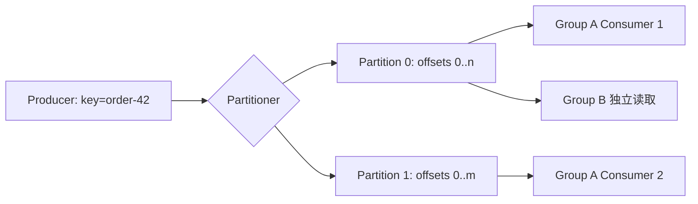

# Kafka 分区、Consumer Group 与 Offset

Kafka 把 Topic 拆成多个有序追加的 Partition；Consumer Group 让一组消费者分担分区；Offset 记录每个分区已经处理到的位置。这三项构成 Kafka 的消费模型，位于事件生产者与可重放消费者之间，用来获得分区内顺序、水平扩展和恢复读取能力。

Topic 有 6 个 Partition，Consumer Group 启动 10 个实例，只有 6 个实例在消费，另外 4 个空闲。这不是调度故障：同一 Group 内，一个 Partition 同一时刻只分配给一个 Consumer，分区数决定该组可用的最大并行度。

## Partition 是有序追加日志

Producer 把 Record 写入 Topic 的某个 Partition，每条记录获得递增 offset。Kafka 只保证单 Partition 内顺序，不保证 Topic 全局顺序。相同业务 key 通常经分区器进入同一 Partition，以保持该 key 的事件顺序。

Broker 根据保留时间或大小保存日志，与消费者是否读取无关。Consumer 保存自己处理到哪个 offset，因此可重放历史；这与 RabbitMQ 消费 ACK 后消息离开 Queue 的典型使用方式不同。



两个不同 Group 各自拥有 offset，可以独立处理同一日志；同一 Group 内则分摊 Partition。

## Offset 提交位置决定丢失还是重复窗口

处理前提交 offset，进程随后崩溃会跳过未完成记录；处理后提交，崩溃会让记录再次投递。后者配合幂等消费者形成常见 at-least-once 处理。

自动提交可能按时间提交已经 poll 但尚未完成的记录，尤其在异步并发处理时危险。需要明确每个 Partition 的完成顺序，只有前序 offset 都完成才推进提交点。

假设 Partition 2 拉到 offset 100、101、102。下面记录处理与提交时间线，观察为何不能只因 102 先完成就提交 103。

```text
poll: 100, 101, 102
100 -> completed
101 -> still processing
102 -> completed
committable offset: 101

101 -> completed
committable offset: 103
```

提交的 offset 表示“下一条要读的位置”。只有 100 完成时可提交 101；101 完成后，连续完成区间扩展到 102，才提交 103。

## Rebalance 会转移 Partition 所有权

Consumer 加入、离开、订阅变化或 poll 超时会触发再均衡。Partition 被撤销前应停止新任务、完成或取消在途处理并提交安全 offset；否则新 Consumer 与旧任务可能同时处理。

单条处理时间超过 `max.poll.interval.ms` 会被认为失联。可缩小 batch、提高合理间隔、暂停 Partition 或把长任务转成独立任务系统，但不能只无限放大超时。

同一 Partition 遇到毒消息时，直接跳过会破坏完整性，原地重试又会阻塞后续记录。可以有限重试后写入带原 Topic、Partition、Offset 的失败流，再推进位点；若业务要求严格按 key 顺序，则暂停该 Partition，修复后从原 offset 恢复。这个选择属于业务语义，不能交给客户端默认参数。

| 指标/现象 | 含义 | 判断 |
| --- | --- | --- |
| consumer lag | 最新 offset - 已提交 offset | 结合到达率与处理率 |
| 频繁 rebalance | 组成员/心跳/处理异常 | 查部署抖动和 poll 时间 |
| 热点 Partition | key 分布不均 | 检查分区键与大客户 |
| Consumer 多于 Partition | 部分实例空闲 | 扩 Partition 或减少实例 |
| offset 重置 | 超出保留或人为操作 | 明确 earliest/latest 与重放影响 |

## 分区扩容会改变 key 到 Partition 的映射

默认 hash 取模在 Partition 数变化后，后续相同 key 可能进入新 Partition，跨扩容点的全历史顺序不再位于单一日志。需要严格长期顺序时，提前规划分区或使用稳定路由策略。

Kafka 的幂等 Producer 和事务能改善 Kafka 内部写入与 consume-transform-produce 流程，但无法自动让 MySQL 副作用 exactly-once。数据库仍用 Inbox/Outbox 和业务幂等。

## 分区、延迟与重放边界

**Lag 为零为什么用户仍看不到结果？**

Consumer 可能先提交 offset 再异步写数据库，或业务写失败却吞掉错误。Lag 只描述读取位置，不证明副作用成功；还要看处理成功、业务状态和 DLQ。

**分区越多吞吐越高吗？**

分区提供并行度，也增加文件、复制、元数据和 rebalance 成本。吞吐还受 Broker 磁盘、网络、消息大小和消费者下游容量限制。

**如何选择分区 key？**

选择需要保持顺序和聚合的业务标识，同时检查分布是否均匀。租户 ID 可能让大租户形成热点；订单 ID 更均匀，但无法保证同用户所有订单全局顺序。

**Consumer 能否回到任意 offset 重放？**

只要记录仍在保留范围内就可调整 Group offset 或使用新 Group。重放会再次执行副作用，因此要先确认幂等、速率和与当前流量的隔离。

## 机制复核：Kafka 分区、Consumer Group 与 Offset
这篇文章讨论的机制需要放回一次完整请求中验证。先记录输入约束、状态变化、外部依赖和失败结果，再确认成功路径是否留下可追踪的事实。配置、缓存、队列或数据库只承担各自职责，不能用一层的日志推断另一层已经完成。

迁移到实际项目时，优先补一条正常用例、一条重复或并发用例和一条依赖不可用用例。每条用例写明观察指标、错误分类、回滚动作与数据清理范围，测试替身的通过不能代替真实协议和权限验证。

当性能、可靠性和安全目标冲突时，先明确服务对象和可接受损失，再选择超时、容量、重试和降级策略。没有测量依据的阈值只作为待验证假设，发布后用同一公式复验。
