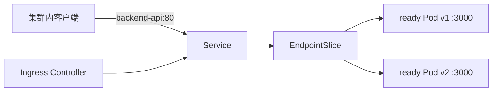

# Kubernetes Pod、Deployment、Service 与 Ingress

Pod 被重新创建后 IP 改变，浏览器仍应通过同一个域名访问服务。Kubernetes 不承诺某个 Pod 永久存在；Deployment 维护副本，Service 提供稳定虚拟地址，Ingress/Gateway 把集群外 HTTP 路由到 Service。

## Pod 是一起调度和共享网络的最小单元

Pod 中容器共享 Network Namespace 和 Volume，可通过 localhost 通信。常见 API Pod 只放业务容器和必要 sidecar，不把 MySQL、Redis 与 API 塞进同一 Pod，否则生命周期和扩缩容绑死。

Pod 名称、IP 和本地可写层都是临时的。业务 Session、任务和文件放外部数据服务；日志写 stdout/stderr 由采集器收集。

| 对象 | 拥有的状态 | 不应依赖 |
| --- | --- | --- |
| Pod | 一次运行实例 | 固定 IP/永久本地数据 |
| Deployment | 副本数与滚动策略 | 稳定访问地址 |
| Service | 标签选择与虚拟地址 | 应用版本发布历史 |
| Ingress | HTTP 主机/路径入口 | Pod 直接地址 |
| ConfigMap/Secret | 运行配置引用 | 业务数据持久化 |

## Deployment Controller 持续收敛期望副本

Deployment 创建 ReplicaSet，ReplicaSet 维持指定 Pod 数。修改 Pod Template 会创建新 ReplicaSet并按 maxSurge/maxUnavailable 滚动；Pod 异常由控制器补充，而不是“修复原 Pod”。

镜像使用不可变 digest，Pod Template 带版本标签。迁移不放在每个 Pod init 中争抢执行，使用单独 Job；应用部署与迁移通过兼容发布顺序协调。

下面是缩短后的 Deployment。资源、探针、SecurityContext 和 Secret 引用在真实清单中都应显式设置。

```yaml
apiVersion: apps/v1
kind: Deployment
metadata: { name: backend-api }
spec:
  replicas: 3
  strategy:
    rollingUpdate: { maxSurge: 1, maxUnavailable: 0 }
  selector:
    matchLabels: { app: backend-api }
  template:
    metadata:
      labels: { app: backend-api, version: v2 }
    spec:
      containers:
        - name: api
          image: registry.example/backend@sha256:...
          ports: [{ name: http, containerPort: 3000 }]
          envFrom:
            - configMapRef: { name: backend-config }
            - secretRef: { name: backend-secret }
```

示例 digest 用省略号，不能直接应用。selector 创建后不应随版本改变；version 作为额外 Pod 标签供观测或金丝雀路由使用。

## Service 通过标签选择就绪 Pod

Service selector 找到 Pod，EndpointSlice 保存可转发地址。Pod readiness 失败时通常从可用端点移除；Service 名称通过集群 DNS 解析，客户端不缓存某个 Pod IP。

selector 写错会得到 Service 存在但无 Endpoint。排查按 Service selector、Pod label、EndpointSlice、readiness、目标端口顺序，不先重启 Deployment。



Service port 与 targetPort 可不同。使用命名端口减少数字漂移，但容器端口、探针和 Service 必须指向同一实际监听。

## Ingress 只在 Controller 存在时生效

Ingress 资源描述 host/path 到 Service 的规则，真正接流量的是 Ingress Controller。TLS Secret、证书续期、代理超时和 SSE 缓冲仍由 Controller 配置决定。

故障时先看 Ingress status 与 Controller 日志，再看 Service Endpoint，最后进入 Pod 日志。DNS/TLS 错误尚未到集群 Service，应用日志不会出现。

集群内 DNS 把 `backend-api.namespace.svc` 解析为 Service 地址。解析成功只证明服务发现记录存在；若 EndpointSlice 为空，连接仍无处转发。可从同 Namespace 的临时调试 Pod 分别执行 DNS 查询、连接 Service port 和连接 Pod port，把“解析、Service 转发、应用监听”三个环节拆开。

NetworkPolicy 还可能允许 DNS 却拒绝到目标 Pod 的流量。策略按 Pod label 和 Namespace 选择，需要同时检查客户端 egress 与服务端 ingress；直接临时放开所有流量只能用于隔离假设，不能作为最终修复。

若 Service 使用 `sessionAffinity` 或应用维持长连接，滚动后旧连接仍可能留在即将退出的 Pod。应用必须先变为 not ready、等待端点传播并排空连接；只看到新 Pod ready 不能证明旧请求已经安全结束。

Pod 进入 Terminating 后，EndpointSlice 与入口代理的更新并非同时完成。preStop 只能给端点传播和 drain 留出窗口，不能用固定长睡眠替代关闭协议。SSE 与 WebSocket 需要主动结束或让客户端重连，并保证所有在途连接能在 terminationGracePeriodSeconds 内收尾。

## Kubernetes 对象继续推演

### Pod 重启次数增加但 Deployment 副本正常，能忽略吗？

不能。Controller 维持数量可能掩盖 CrashLoop、OOM 或探针误杀。按 Pod reason、lastState、events 和前一容器日志定位，观察请求错误是否被重试掩盖。

### 为什么不能把 Service selector 加上 version=v2？

普通滚动期间会让 v1 立即失去流量，破坏渐进替换。稳定 selector 选 app，版本路由用独立 Service/Controller 策略明确管理。

### ConfigMap 更新后 Pod 会自动使用吗？

环境变量不会自动更新，Volume 文件可能延迟更新，但应用未必 reload。用配置版本触发滚动，或实现明确热加载并验证；Secret 轮换同理。

### Deployment 能管理数据库吗？

有状态服务通常需要 StatefulSet、持久卷、备份和专用 Operator，或直接使用托管服务。仅把 MySQL 放进 Deployment 无法获得稳定身份和数据恢复。
