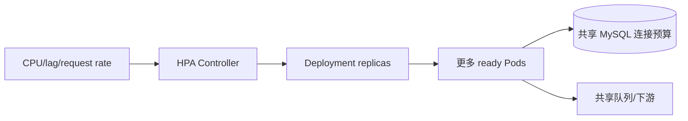

# Kubernetes 探针、资源、HPA 与排障

startup、readiness 和 liveness 是 Kubernetes 对进程启动、接流量资格和存活状态的三种探针；requests/limits 是调度与运行时资源边界，HPA 是根据指标调整副本的控制器。它们位于 Pod 运行状态和平台调度层，分别回答“能否开始”“能否服务”“是否需要重启”“放在哪里”和“要运行几份”。

应用启动迁移需要 40 秒，liveness 第 10 秒开始探测并连续失败，Kubernetes 不断重启容器，服务永远到不了 ready。

## 三类探针不能互相替代

startupProbe 给慢启动进程一个独立窗口，成功后才启用 liveness/readiness；readiness 表示当前能否接新流量，失败会摘除 Endpoint；liveness 表示进程是否需要重启。

数据库短暂不可用通常让 readiness 失败，不应让所有 Pod liveness 失败并同时重启。liveness 只检查事件循环/关键内部状态，避免深度依赖和高成本操作。

| 探针 | 失败动作 | 适合检查 |
| --- | --- | --- |
| startup | 启动期不进入其他探针，持续失败则重启 | 初始化是否在上限内完成 |
| readiness | 停止接收新流量 | 连接池/关键依赖能否服务 |
| liveness | 重启容器 | 死锁、事件循环永久卡死 |
| 业务监控 | 告警/人工/自动处置 | 端到端登录、任务新鲜度 |

## requests 用于调度，limits 用于运行时约束

Scheduler 根据 requests 判断节点是否容纳 Pod；CPU limit 会被节流，内存 limit 不能通过节流回收，超限可能 OOMKilled。requests 过低让节点超卖，过高则浪费容量并阻止调度。

从压测与运行指标设置初值：正常负载 CPU/内存、峰值、启动峰值和单请求上限。Java/Node/Python 运行时还要让堆配置感知容器内存，给原生内存、线程栈和缓冲留余量。

下面把探针和资源放进同一容器。数值只是示意，必须用当前服务启动时间和容量证据调整。

```yaml
startupProbe:
  httpGet: { path: /health/live, port: http }
  periodSeconds: 5
  failureThreshold: 12
readinessProbe:
  httpGet: { path: /health/ready, port: http }
  periodSeconds: 5
  failureThreshold: 2
livenessProbe:
  httpGet: { path: /health/live, port: http }
  periodSeconds: 10
  failureThreshold: 3
resources:
  requests: { cpu: 250m, memory: 256Mi }
  limits: { cpu: "1", memory: 512Mi }
```

startup 最多给约 60 秒。readiness 失败约 10 秒摘流，liveness 连续失败才重启。实际还需 timeoutSeconds 和 terminationGracePeriodSeconds 与应用停机预算对齐。

## HPA 扩的是 Pod，不是数据库容量

HPA 根据 CPU、内存或自定义指标调整 Deployment 副本。CPU 百分比通常相对 request 计算，request 设置错误会让扩缩判断失真。扩容有采集、调度、拉镜像、启动和 ready 延迟，不能瞬间吸收尖峰。

API 副本增加会增加数据库连接池、Redis 连接和 Broker Consumer。最大副本要进入全局连接预算；队列 Worker 更适合按 oldest age/lag 扩容，但仍受下游吞吐上限。



当瓶颈在 MySQL 锁或连接时，扩 Pod 会让竞争更严重。扩容决策要同时看下游饱和度。

## 排障沿期望状态和实际状态比较

`kubectl get` 只给摘要。Pending 查 events、requests、node taint/PVC；CrashLoopBackOff 查 current/previous logs 与退出码；OOMKilled 查 limit 和工作集；ready 0/1 查探针响应与依赖。

ImagePullBackOff 查镜像名称、digest、Registry 身份和网络。修改前保存 describe、events、日志、Deployment revision 与指标时间线；直接删 Pod 可能暂时恢复，却丢失根因证据。

节点内存紧张时，Kubelet 会根据 QoS、优先级和超额用量选择驱逐对象。requests 等于 limits 的 Guaranteed Pod 通常比没有 requests 的 BestEffort 更不容易被驱逐，但这不是免死保证。查看 Pod reason、节点 MemoryPressure 和 eviction 事件，区分应用触碰自身 limit 的 OOMKilled 与节点级驱逐。

滚动发布还会因 maxSurge 短时增加总 requests。平时节点刚好容纳 10 个副本，不代表能再调度第 11 个候选 Pod；这会让发布卡在 Pending。容量规划要预留滚动峰值，或调整 surge/unavailable 并确认可用性目标。

## 探针、资源与调度故障

**readiness 失败时在途请求会怎样？**

它阻止新的 Service 流量，但已经建立的连接/请求可能继续。发布摘流还需 preStop/应用 drain 和足够 termination grace，入口也可能有连接复用。

**CPU limit 为什么会让延迟抖动？**

进程达到配额后被周期性 throttling，即使节点还有空闲 CPU，也可能暂停。观察 throttled_seconds 与 P99，按服务特性决定是否设置/提高 limit，并保留 request。

**HPA 最小副本能设为 0 吗？**

标准 HPA 通常最小至少 1；缩到 0 需要事件驱动扩缩等机制。冷启动会增加首请求延迟，数据库迁移和唯一 Scheduler 也要独立处理。

**Pod Pending 为什么可能与镜像无关？**

可能没有满足 requests 的节点、taint/toleration 不匹配、PVC 未绑定、亲和性无解。先读 Pod events 与 scheduler reason，不先改镜像。

## 机制复核：Kubernetes 探针、资源、HPA 与排障
这篇文章讨论的机制需要放回一次完整请求中验证。先记录输入约束、状态变化、外部依赖和失败结果，再确认成功路径是否留下可追踪的事实。配置、缓存、队列或数据库只承担各自职责，不能用一层的日志推断另一层已经完成。

迁移到实际项目时，优先补一条正常用例、一条重复或并发用例和一条依赖不可用用例。每条用例写明观察指标、错误分类、回滚动作与数据清理范围，测试替身的通过不能代替真实协议和权限验证。

当性能、可靠性和安全目标冲突时，先明确服务对象和可接受损失，再选择超时、容量、重试和降级策略。没有测量依据的阈值只作为待验证假设，发布后用同一公式复验。
