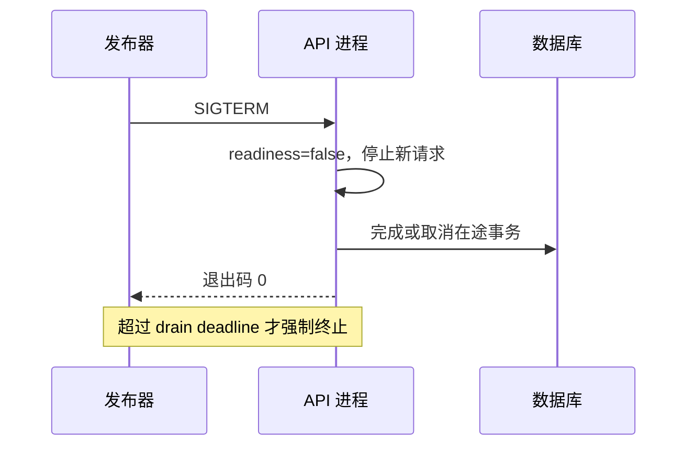

# Linux 进程、端口、资源与排障顺序

进程是操作系统分配 CPU、内存、文件描述符和信号的运行实体，端口是网络栈把连接交给监听进程的地址。它们处在应用代码与操作系统资源之间。排障要先确认进程身份、监听关系和资源事实，再决定重启、扩容或终止，避免误伤仍在接流量的实例。

服务日志最后一行是 `listen tcp :3001: bind: address already in use`。先杀进程不是好习惯，因为占用端口的进程可能是上一版仍在接流量的实例。应先确认 PID、命令行、监听地址和连接状态，再决定是否切换或终止。

## 进程与端口的运行事实

PID 只是身份线索。用 `ps` 看启动命令和父进程，用 `ss` 看监听地址和已建立连接，用 `/proc/<pid>/fd` 看文件描述符。容器环境还要区分宿主 PID、容器 PID 和端口发布。

三条输出要在同一时间点保存。端口占用可能很快变化，只记一个 PID 而没有命令行和监听地址，事后无法判断它是旧版本、候选版本还是系统代理。

```bash
ps -o pid,ppid,user,stat,etime,cmd -p 1234
ss -lntp | rg ":3001"
ls -l /proc/1234/fd | head
```

如果监听者不是预期版本，先检查进程的工作目录、环境来源和容器标签。保留输出再做任何停止操作。

## 资源耗尽的表现不同

CPU 持续 100% 常见于热循环或压缩/加密；内存增长可能是缓存无界、堆泄漏或下游响应积压；文件描述符耗尽会让新连接和日志文件都失败。`free` 的 available、`vmstat` 的 si/so、`ulimit -n` 要结合业务日志读取，单个数字不能直接定因。

| 现象 | 先看 | 不要先做 |
| --- | --- | --- |
| 端口占用 | ss、ps、容器映射 | 直接 kill -9 |
| CPU 高 | top -H、Profile、请求样本 | 盲目加副本 |
| 内存高 | RSS、堆、cgroup、OOM 事件 | 只调大 limit |
| 连接失败 | fd 使用、连接池、端口范围 | 无限提高 max_connections |

## 信号决定停机是否可恢复

`SIGTERM` 给应用机会停止接收新请求、取消后台任务并关闭连接；`SIGKILL` 无法捕获，适合进程已经失控且必须止损的最后一步。容器中 PID 1 是否正确转发信号，决定优雅停机是否真的发生。



## 一条故障时间线怎样建立

| 现象 | 先确认 | 处理顺序 |
| --- | --- | --- |
| 端口占用但没有业务流量 | 确认监听者的版本和连接数，可能是旧实例等待回滚。 | 先旁路验证新实例，再切换入口 |
| CPU 高但 load 不高 | 看线程、单核热点和 Profile，可能只有一个 goroutine/线程忙。 | 不要用平均 CPU 掩盖单核饱和 |
| 进程退出码 137 | 通常与 SIGKILL/OOM 有关，但需查 cgroup 和内核日志。 | 先保存内存和请求证据，再调整容量 |

时间线至少包含进程启动/退出、入口流量变化、CPU/内存/磁盘、应用错误和内核/cgroup 事件。比如延迟先升、连接池等待随后升、内存最后稳定，方向应查下游连接；若 RSS 先持续增长、随后 cgroup OOM、最后出现 502，OOM 才是起点。重启只能暂时清空状态，还会抹掉堆和文件描述符现场。

## 进程退出与资源耗尽

**为什么 `netstat` 看不到服务而 `ss` 能看到？**

`netstat` 在很多发行版已不再默认安装，`ss` 直接读取内核 socket 信息。命令不同不改变排查原则：确认监听地址、协议、PID 和连接状态。

**优雅停机为什么要先把 readiness 设为 false？**

如果仍被负载均衡认为可用，新请求会在进程关闭连接时失败。先摘流，再处理在途请求，能把失败从随机连接错误变成可控的 drain。

## CPU、内存、磁盘和网络要放在同一时间窗口

CPU 高可能是应用计算，也可能是内核在处理大量网络或磁盘中断。内存不足会触发回收和 swap，进一步抬高请求延迟；日志洪峰又可能填满磁盘，让数据库或进程无法写入。把 top、vmstat、iostat、容器指标和应用延迟对齐到同一分钟，才能判断谁先发生。

连接问题还要看监听地址。绑定 127.0.0.1:3001 只允许同一网络命名空间访问；绑定 0.0.0.0 才监听所有 IPv4 地址。它仍不代表防火墙、容器端口或云安全组已开放。

**为什么文件描述符耗尽会表现为数据库连接失败？**

socket、普通文件和管道都占文件描述符。进程达到上限后无法创建新的数据库 socket，日志也可能写不出去。应确认泄漏来源和连接关闭路径，再调整上限；只提高 ulimit 会推迟下一次耗尽。

## 机制复核：Linux 进程、端口、资源与排障顺序
这篇文章讨论的机制需要放回一次完整请求中验证。先记录输入约束、状态变化、外部依赖和失败结果，再确认成功路径是否留下可追踪的事实。配置、缓存、队列或数据库只承担各自职责，不能用一层的日志推断另一层已经完成。

迁移到实际项目时，优先补一条正常用例、一条重复或并发用例和一条依赖不可用用例。每条用例写明观察指标、错误分类、回滚动作与数据清理范围，测试替身的通过不能代替真实协议和权限验证。

当性能、可靠性和安全目标冲突时，先明确服务对象和可接受损失，再选择超时、容量、重试和降级策略。没有测量依据的阈值只作为待验证假设，发布后用同一公式复验。
