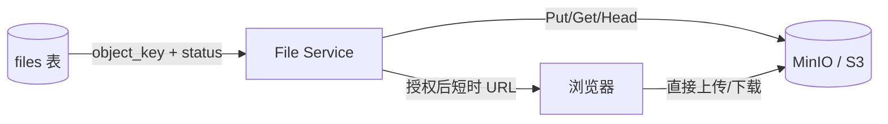

# 本地文件、S3 与 MinIO：对象存储的路径和边界

对象存储是通过 bucket、object key 和 HTTP API 保存文件字节及其元数据的独立数据层；S3 是常见协议，MinIO 是可自托管的兼容实现。它位于应用文件服务与持久化对象之间，数据库记录业务权限和状态，存储服务负责对象本身，浏览器可以通过受限的预签名 URL 直传或下载。

开发机把上传文件写进 `./uploads`，单实例能下载；容器滚动发布后文件消失，换到另一个副本也找不到。容器可写层和进程本地磁盘不适合作为多副本业务文件真相。

## 安装 MinIO 并确认对象端点

MinIO 的下载和部署入口在[官方文档](https://min.io/docs/minio/linux/index.html)。本地学习可以用隔离容器启动一个私有实例；生产环境应改用固定版本或发布摘要，并把数据目录挂载到受控磁盘。

<figure class="doc-shot">
  
  <figcaption>MinIO 官方下载入口。Server、Client 和 SDK 是不同组件，先确认教程需要哪一层，再按目标平台选择安装方式。</figcaption>
</figure>

```bash
docker run --name minio-learning \
  -p 9000:9000 -p 9001:9001 \
  -e MINIO_ROOT_USER=minioadmin \
  -e MINIO_ROOT_PASSWORD=change-me-now \
  -v "$PWD/.minio-data:/data" \
  quay.io/minio/minio:latest server /data --console-address ":9001"

curl -fsS http://127.0.0.1:9000/minio/health/live
```

`curl` 返回成功只证明 S3 API 端口存活；Bucket、访问策略、上传和下载仍要按后面的状态链路验证。不要把示例 root 凭证用于公网，也不要把 `MINIO_ROOT_PASSWORD` 写进仓库。

## 本地文件系统与对象存储的寻址方式不同

本地文件按目录路径打开，支持随机读写、rename 和文件锁；S3/MinIO 通过 bucket + key 操作整个对象，目录通常只是 key 前缀。对象 metadata、版本、ETag 和生命周期由服务管理。

数据库保存对象业务记录：tenant_id、object_key、原始文件名、大小、检测后的媒体类型、checksum、status 和 owner。对象存储保存字节。页面不能只凭一个 key 猜权限，下载前仍查询数据库授权。

| 场景 | 本地持久卷 | S3/MinIO |
| --- | --- | --- |
| 单机临时处理 | 简单、低延迟 | 可能多一次网络 |
| 多副本共享 | 需共享文件系统 | 天然通过 API 共享 |
| 大对象直传 | 应用承担带宽 | 可用预签名上传 |
| 生命周期/版本 | 需自行脚本 | 服务端规则与版本能力 |
| 原子目录操作 | 文件系统语义强 | 需按对象模型重设流程 |

## Object key 是内部标识，不使用用户文件名

用户文件名可能重复、包含路径分隔符、控制字符或敏感信息。服务生成不可猜且带租户前缀的 key，例如 `tenants/{tenant}/files/{file_id}/source`，原名只作为经过清理的显示 metadata。

key 带租户不等于授权，只用于分区、运维和生命周期。Bucket 保持私有，应用角色只获得必要前缀和操作；公共读通过明确发布流程或 CDN，不把整个 Bucket 改公开。



预签名 URL 是临时能力。它在有效期内持有指定 key 和方法的访问权，因此 TTL、大小和内容类型条件要尽量收窄。

## 上传是数据库状态和对象状态的两阶段流程

服务先创建 file 记录 `pending_upload`，生成限定 key、方法和短 TTL 的预签名请求。浏览器直传后调用 complete；服务用 HEAD 校验对象存在、大小和 checksum，再把状态改为 uploaded/processing。

浏览器声称上传成功不可信。complete 必须由服务端核对对象；超时未完成的 pending 记录和孤儿对象由定时清理。对象写成功、数据库更新失败时，重试 complete 应幂等地复核同一个 file_id。

下面是预签名上传状态线，不绑定具体 SDK。观察每一步由谁拥有事实。

```text
POST /files -> 201 { fileId, uploadUrl, expiresAt }
files.status = pending_upload

PUT uploadUrl -> object storage stores bytes

POST /files/{fileId}/complete
  HEAD object_key
  verify size/checksum/content type
  files.status = uploaded
  enqueue scan/parse task
```

上传 URL 不返回长期 Bucket 凭证。complete 失败时文件仍是 pending，不能提前出现在业务列表或被下游解析。

## 生命周期规则与业务删除要协调

临时上传、源文件、缩略图和历史版本有不同保留期。业务先把记录标记 deleting，通过 Outbox 删除对象，确认后改 deleted；直接先删对象再改库会在数据库失败时留下指向不存在对象的记录。

启用版本控制后，普通 DELETE 可能只产生删除标记，旧版本仍占空间。合规删除、保留锁和生命周期规则要由对象存储 owner 与业务 owner 共同验证。

## 对象存储的一致性与兼容边界

**为什么数据库不能直接存所有文件 BLOB？**

小文件和强事务场景可以，但大对象会放大备份、复制、Buffer Pool 和查询负担。对象存储更擅长大字节与分段上传，数据库保存索引和业务状态。

**ETag 是否总等于 MD5？**

不能这样假设。分段上传、加密和不同服务实现会改变 ETag 语义。完整性使用明确 checksum 字段和服务端校验，不把 ETag 当通用 MD5。

**MinIO 与 S3 API 兼容是否代表行为完全相同？**

核心 API 接近，但认证、生命周期、事件、版本和边缘行为可能不同。使用到的能力要通过契约和集成测试在两种目标环境验证。

**删除数据库记录后如何处理对象？**

使用 Outbox 记录删除意图，异步删除对象并更新状态；周期性对账数据库 key 与 Bucket inventory。避免跨系统双写中途失败后永久泄漏。
