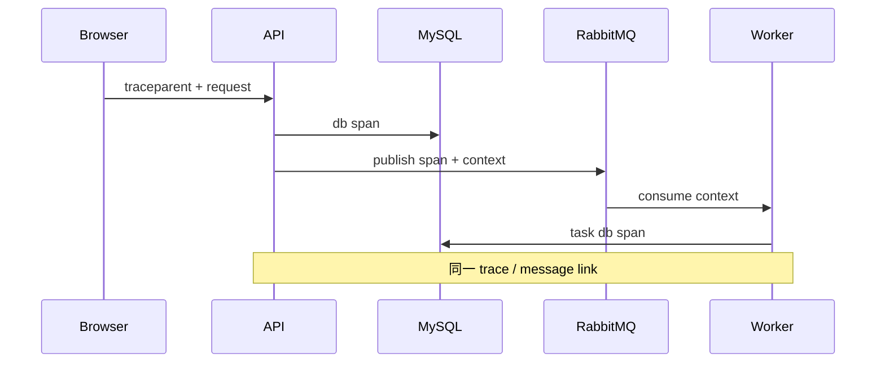

# 日志、指标、Trace 与 OpenTelemetry

用户只说“刚才保存失败”。日志没有 requestId，指标只看到 5xx 上升，数据库慢查询也无法关联到 API。日志回答具体事件，指标回答一段时间的总体变化，Trace 连接跨进程路径；OpenTelemetry 提供共同的采集模型与上下文传播。

## 结构化日志记录可检索事件

日志字段包含 timestamp、level、service、version、event、requestId、traceId、tenantId、resourceId、code 和 duration。字段名稳定，正文不依赖全文搜索解析。

密码、Token、Cookie、Secret、文件正文和不必要个人信息不记录。tenant/user ID 可保留内部随机标识并受访问控制；请求 Body 默认不全量记录。错误保留 cause chain 与堆栈在受控日志，响应只给 requestId。

下面是一条项目版本冲突日志。它能关联请求和 Trace，同时没有 SQL 参数或凭证。

```json
{
  "timestamp": "2026-08-12T08:30:00.123Z",
  "level": "warn",
  "service": "node-api",
  "version": "sha256:...",
  "event": "project.update.conflict",
  "requestId": "req_01J...",
  "traceId": "4bf92f...",
  "tenantId": "ten_01J...",
  "projectId": "prj_01J...",
  "expectedVersion": 2,
  "actualVersion": 3,
  "durationMs": 34
}
```

version 使用实际 commit/digest。高基数字段适合日志和 Trace，不应随意做 Prometheus label。
## 指标用有限标签描述趋势

在线 API 常看 RED：Rate、Errors、Duration；资源看 USE：Utilization、Saturation、Errors。直方图聚合延迟分布，Counter 只增，Gauge 表示当前值。

route、method、status_class、service/version 是可控标签；userId、requestId、URL 原始路径会产生无限时间序列，拖垮指标系统。动态资源 ID 留给日志/Trace。

| 信号 | 示例 | 适合回答 |
| --- | --- | --- |
| Counter | http_requests_total | 请求/错误速率 |
| Histogram | http_server_duration | P95/P99 与 SLO |
| Gauge | db_pool_waiters | 当前饱和 |
| Queue age | oldest_task_seconds | 任务新鲜度 |
| Business | orders_paid_total | 技术成功是否产生业务结果 |
## Trace 用 Span 连接一次跨服务执行

入口创建 server Span，通过 W3C `traceparent` 向下游传播；数据库、Redis、Broker publish/consume 和对象存储创建子 Span。异步消息把 trace context 放 Header，Consumer 可建立链接或子关系。

Span 记录低敏属性和状态，异常事件包含错误类型。不要把完整 SQL 参数、消息正文和文件名当属性。采样应保证错误和慢请求有足够证据，同时控制成本。



请求结束后异步任务可能持续更久。Trace 链接和 event_id 一起使用，避免把超长后台链误当一个永不结束的 HTTP Span。
## OpenTelemetry Collector 解耦采集与后端

SDK 产生 OTLP 信号，Collector 接收、批处理、过滤、采样并导出到 Loki/ELK、Prometheus 兼容指标后端和 Tempo/Jaeger。应用不需要为每个厂商写一套埋点。

Collector 自身也要监控队列、丢弃、导出错误和内存。观测系统故障不能阻塞业务请求；批量异步导出并设上限，进程停机在有限时间 flush。

Resource 属性稳定标识 service.name、service.version、deployment.environment 和实例。若不同语言使用不同 service 命名，跨服务查询会分裂；若把 Pod UID 当全局聚合标签，又会产生大量短命序列。先定义一份观测字段契约，再在 Node、Python、Go 的 SDK 初始化中对齐。

日志丢失时先查应用写出、Agent/Collector 接收、队列和后端导出四段；指标基数暴涨先找新增 label 及 series 数；Trace 断链则检查入口是否提取 traceparent、消息 Header 是否传播、下游是否创建同一 Context 的 Span。不要因为某个 Dashboard 空白就同时重启整条观测链。

跨进程传播使用标准 Trace Context，消息把 traceparent 放在受控 Header。Baggage 会沿链路传播，不能塞 Token、邮箱等敏感或高基数数据。Consumer 为每次处理创建 Span，并记录 event_id 与 attempt，重投时才能区分一次业务事件的多次执行。
## 日志、指标与 Trace 的互补边界

**有 Trace 后还需要 requestId 吗？**

需要。外部客户端容易携带/报告 requestId，内部 Trace 有自己的采样和权限；二者互相映射。不要盲信客户端传入 ID，可规范化或重新生成。

**为什么不能把 tenantId 做 Prometheus 标签？**

租户数量可能很大且变化，产生高基数时间序列。按服务/路由聚合指标，租户级调查用日志、Trace 或受控分析系统。

**采样会不会漏掉故障？**

会，因此错误/慢请求可使用 tail sampling，提高保留率；关键计数由不采样的指标承担。采样策略和预算要可观察，不能假设每次 Trace 都存在。

**日志中的时间为什么仍可能对不上？**

主机时钟、时区、缓冲和异步写入会影响。统一 UTC、同步时钟，同时依赖 trace/span 顺序和单调 duration，不只按显示时间猜因果。
